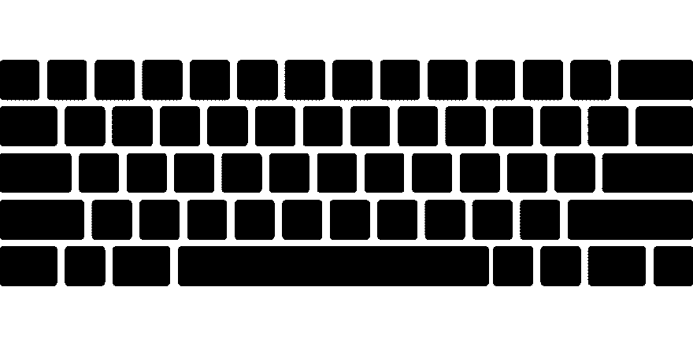
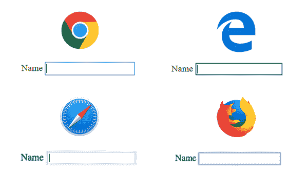

# 为什么应该使用焦点样式

> 原文：<https://dev.to/bnevilleoneill/why-you-should-use-focus-styles-6f5>

[](https://res.cloudinary.com/practicaldev/image/fetch/s--hbM8JtPg--/c_limit%2Cf_auto%2Cfl_progressive%2Cq_auto%2Cw_880/https://cdn-images-1.medium.com/max/1024/1%2AHqrhJCteIYrKACTJHyHavQ.png)

人们会以多种方式使用你的网站。有些使用鼠标，有些使用触摸设备，有些使用屏幕阅读器，有些只使用键盘。在这篇文章中，你将学习所有关于焦点指示器的知识，如何设计它们，以及为什么它们对许多用户来说很重要。

### 什么是专注指标？

聚焦输入元素时见过蓝色轮廓吗？这是浏览器用来指示元素被聚焦的本机焦点样式。

[](https://res.cloudinary.com/practicaldev/image/fetch/s--jsjrIFMD--/c_limit%2Cf_auto%2Cfl_progressive%2Cq_auto%2Cw_880/https://cdn-images-1.medium.com/max/600/0%2A6WY1P39fcvRunlPa)

<figcaption>Chrome、Edge、Safari 和 Firefox 中输入元素的原生焦点样式</figcaption>

所有交互元素都将显示蓝色轮廓。这包括链接(`<a>`)、按钮(`<button>`)和所有表单元素，如输入(`<input>`)和选择元素(`<select>`)。每个浏览器都有一个略微不同的默认轮廓样式，所以您可能想要更改默认样式(稍后将详细介绍)。

[](https://logrocket.com/signup/)

### 为什么焦点样式对可访问性很重要

每个人都使用鼠标或触摸设备来浏览网页，对吗？不，有许多用户依靠键盘来浏览网站。我们可能认为只有一小部分是键盘用户，但实际数字可能会让你吃惊。仅在美国就有大约 2000 万人有举起或抓握的困难，他们中的许多人使用键盘而不是鼠标。

#### 电力用户

许多人整天用电脑工作，为了更快地完成一些任务，他们经常使用键盘而不是鼠标。以我为例，我习惯在终端写代码或者做一些任务的时候只使用键盘。像我一样，许多其他高级用户也更喜欢使用键盘浏览网页。

#### 行动不便的人

有些人不会用鼠标。他们可能会使用类似于嘴棒的东西来操作标准键盘，或者模拟键盘的开关。

#### 视力低下或认知障碍的人

有些人使用屏幕阅读器，它主要是通过键盘控制的。

此外，还有很多人暂时依靠一个键盘。例如，鼠标坏了的人。

### 改变焦点指示器的样式

现在我们知道了什么是焦点指示器以及人们为什么依赖它们，让我们看看如何改变默认的样式。

```
a:focus {
    outline: none;
    background-color: #651787;
    color: #fff;
} 
```

在这里，我们使用 outline: none 删除默认的蓝色轮廓，同时在元素获得焦点时改变元素的背景色和颜色。通过这种方式，人们仍然可以很容易地识别出该元素当前被聚焦，但是现在的样式与您的设计相匹配，而不是枯燥的蓝色轮廓。

这里要注意的一点是，当改变颜色时，你应该总是检查[颜色对比度](https://contrast-ratio.com)是否足够。这对视力低下的[人](https://www.w3.org/TR/low-vision-needs/)来说尤其重要，但是糟糕的色彩对比会影响到每个人。如果你曾经坐在阳光下上网，你就会知道为了能看到屏幕上的内容，有一个好的色彩对比度是多么重要。

### :焦点在内——如何设置可聚焦元素的父元素的样式

您想要设置聚焦元素的父元素的样式吗？很好，有一个 [:focus-within](https://developer.mozilla.org/en-US/docs/Web/CSS/:focus-within) CSS 伪类来做这件事。[浏览器支持](https://caniuse.com/#feat=css-focus-within)相当可靠，这是一个很大的改进。

让我们来看看如何使用它:

```
<form>
  <label for="username">Username:</label>
  <input id="username" type="text">

  <label for="password">Password:</label>
  <input id="password" type="password">

  <input type="submit" value="Login">
</form> 
```

这里我们有一个 HTML 格式的基本登录表单。下一步，我们将使用 CSS 来创建某种效果:

```
form {
  padding: 10px;
  position: relative;
  overflow: hidden;
}
form:before {
  content:"";
  background: #ddd;
  position: absolute;
  left: 0;
  right: 0;
  top: 0;
  bottom: 0;
  z-index: -1;
  transform: translateY(-100%);
  transition: transform 260ms ease-out;
}
form:focus-within:before {
  transform: translateY(0);
} 
```

默认情况下，我们使用:before 为表单创建背景，并使用 transform: translateY(-100%)隐藏它。一旦用户聚焦于其中一个输入元素，背景将从顶部移动。这是通过使用 form:focus-within 选择器并将:before 伪类的 translateY 设置为零来实现的。此外，我们在这里使用过渡，使它成为一个平滑的效果。

[JS Bin 上的完整示例](https://jsbin.com/tumiheg/2/edit?html,css,output)

### 与鼠标/指针交互时不显示焦点样式——focus-visible 伪类

有时使用:焦点样式也会对鼠标/指针用户的用户体验产生副作用。以带有上一个/下一个控件的图像库为例。如果用户点击这些按钮中的一个，他们将获得焦点，因此焦点样式将被显示。虽然这对键盘用户来说很好，但对鼠标/指针用户来说可能太多了。

过去，有些人做出了糟糕的决定，用下面的 CSS 来解决这个问题。

`button:focus { outline: none; }`

不要这样。这当然也将删除键盘用户的焦点指示器，使其几乎不可能使用您的图片库。

这就是[:焦点可见的](https://developer.mozilla.org/en-US/docs/Web/CSS/:focus-visible)伪类发挥作用的地方。通过使用:focus-visible，焦点样式将仅在用户使用键盘聚焦元素时显示。

让我们来看看如何使用这个:

```
/* provide basic focus styles */
button:focus {
    ...
}
/* Remove focus styles for mouse users */
button:focus:not(:focus-visible) {
    outline: none;
} 
```

这里，如果用户使用鼠标或指针来聚焦一个元素，我们使用:not 伪类来显式地移除聚焦样式。这样键盘用户仍然可以看到焦点指示器，而鼠标用户看不到。太好了，问题解决了。

由于[浏览器支持](https://caniuse.com/#feat=css-focus-visible)仍然不是很好，你要么把它作为一个增强，要么你也可以使用一个[多填充](https://github.com/WICG/focus-visible)，直到有更广泛的支持。

### 焦点顺序

随着所有现代浏览器都支持 Grid 和 Flexbox，我们现在可以轻松地对 CSS 中的元素进行重新排序。这非常棒，你可以实现很棒的布局，但是也有一个问题[在视觉上改变顺序而不改变元素本身的顺序。](https://tink.uk/flexbox-the-keyboard-navigation-disconnect/)

默认情况下，[焦点顺序](https://www.w3.org/TR/UNDERSTANDING-WCAG20/navigation-mechanisms-focus-order.html)必须有意义，这可能会对我们产生负面影响。

让我用一个链接列表的例子来解释一下:

```
<ul>
  <li><a href="#">One</a></li>
  <li><a href="#">Two</a></li>
  <li><a href="#">Three</a></li>
  <li><a href="#">Four</a></li>
  <li><a href="#">Five</a></li>
</ul> 
```

默认情况下，这些链接的视觉顺序和 tab 键顺序是匹配的。当使用 tab 键导航时，它会从一个变成两个，以此类推。现在，让我们想象我们想要改变顺序并将第三个元素移动到最后一个位置:

```
ul {
  margin: 0;
  padding: 0;
  list-style: none;
  display: flex;
  flex-direction: column;
}

/* visually move the third element to the last position */
li:nth-child(3) {
  order: 1;
} 
```

[完整示例](https://jsbin.com/tifulec/1/edit?html,css,js,output)

现在，第三个元素在视觉上位于最后一个位置，但 tab 键顺序仍然是一、二、三。视觉顺序和键盘导航顺序不再匹配，这可能会使键盘用户无法使用。当用 CSS 改变顺序时，你应该总是考虑这一点，并且如果它仍然有意义，总是用你的键盘测试。

### 结论

考虑到可访问性来构建网站和应用程序是非常棒的。设计焦点指示器的样式可以大大提高使用键盘的人的易用性。利用它，给你的网站添加一些好看的焦点风格——很多人会非常感激的。

* * *

### Plug: [LogRocket](https://logrocket.com/signup/) ，一款适用于网络应用的 DVR

[](https://logrocket.com/signup/)

<figcaption>[https://logrocket.com/signup/](https://logrocket.com/signup/)</figcaption>

LogRocket 是一个前端日志工具，可以让你回放问题，就像它们发生在你自己的浏览器中一样。LogRocket 不需要猜测错误发生的原因，也不需要向用户询问截图和日志转储，而是让您重放会话以快速了解哪里出错了。它可以与任何应用程序完美配合，不管是什么框架，并且有插件可以记录来自 Redux、Vuex 和@ngrx/store 的额外上下文。

除了记录 Redux 操作和状态，LogRocket 还记录控制台日志、JavaScript 错误、堆栈跟踪、带有头+正文的网络请求/响应、浏览器元数据和自定义日志。它还使用 DOM 来记录页面上的 HTML 和 CSS，甚至为最复杂的单页面应用程序重新创建像素级完美视频。

[免费试用](https://logrocket.com/signup/)。

* * *

帖子[为什么你应该使用聚焦风格](https://blog.logrocket.com/why-you-should-use-focus-styles-193d58672c5c/)首先出现在[博客](https://blog.logrocket.com)上。