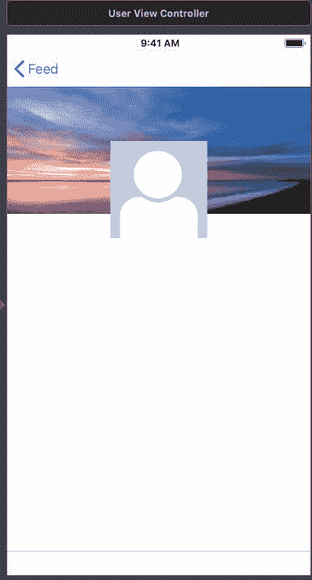
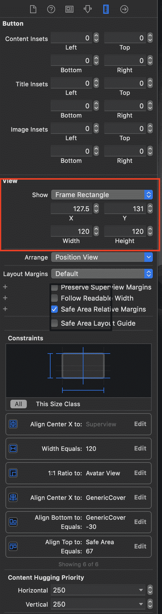
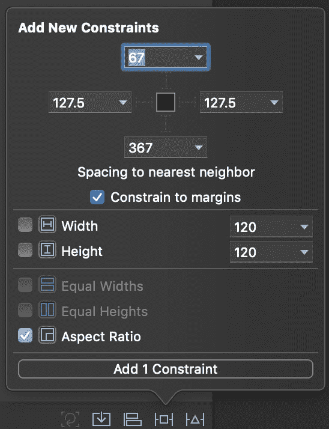
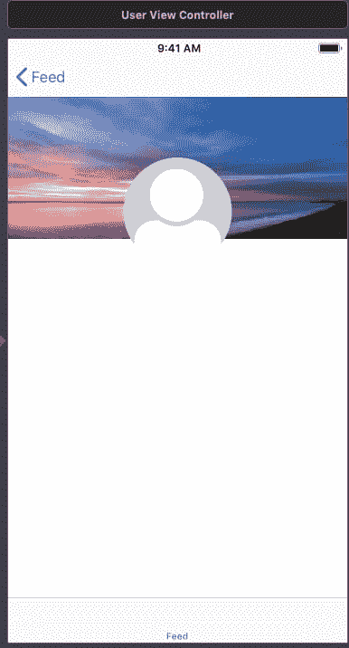

# 在界面构建器中使循环视图循环

> 原文：<https://dev.to/evandeaubl/making-your-circular-views-circular-in-interface-builder-4l5b>

在 iOS 界面中，一个很常见的做法是将界面元素做成圆形或松鼠形(squircular？).例如，当显示用户头像时，这是一件常见的事情。

但是，如果你在故事板中构建你的界面，当你添加代码使你的视图循环时，你会发现一个大问题:**你的故事板看起来不像你的应用程序。**

[](https://res.cloudinary.com/practicaldev/image/fetch/s--Ajy5UZIE--/c_limit%2Cf_auto%2Cfl_progressive%2Cq_auto%2Cw_880/https://www.appsdissected.com/wp-content/uploads/2019/04/Screen-Shot-2019-04-08-at-19.08.21.png)

**丑陋。**这样不行。

幸运的是，有一个非常简单的方法可以让你的故事板控件和你的应用程序控件相匹配。

* * *

第一步，我们将从在应用程序本身中实现循环视图的代码开始。在`layoutSubviews()`中设置`cornerRadius`是很重要的，因为视图的框架会因布局过程而改变，并且拐角半径大小需要是框架大小的一半，以使其呈圆形。

```
class CircleView: UIView {

    // ...

    override func layoutSubviews() {
        super.layoutSubviews()
        if (frame.width != frame.height) {
            NSLog("Ended up with a non-square frame -- so it may not be a circle");
        }
        layer.cornerRadius = frame.width / 2
        layer.masksToBounds = true
    }

    // ... 
```

第二，当您将视图添加到故事板或 XIB 时，通过将帧大小设置为相同的宽度和高度，然后添加约束，将纵横比约束设置为 1:1。这将加强方形框架(只要自动布局不会因为其他原因而破坏该约束)。

[ ](https://res.cloudinary.com/practicaldev/image/fetch/s--KTZwp7kK--/c_limit%2Cf_auto%2Cfl_progressive%2Cq_auto%2Cw_880/https://www.appsdissected.com/wp-content/uploads/2019/04/Screen-Shot-2019-04-08-at-19.06.32.png) [ ](https://res.cloudinary.com/practicaldev/image/fetch/s--fv74S1e_--/c_limit%2Cf_auto%2Cfl_progressive%2Cq_auto%2Cw_880/https://www.appsdissected.com/wp-content/uploads/2019/04/Screen-Shot-2019-04-08-at-19.05.18.png)

现在，为了解决方形视图问题:

[](https://res.cloudinary.com/practicaldev/image/fetch/s--q4dIfOns--/c_limit%2Cf_auto%2Cfl_progressive%2Cq_auto%2Cw_880/https://www.appsdissected.com/wp-content/uploads/2019/04/Screen-Shot-2019-04-08-at-19.08.21-1.png)

您还需要一点:将`@IBDesignable`添加到 UIView 声明中:

```
@IBDesignable class CircleView: UIView { 
```

瞧:

[](https://res.cloudinary.com/practicaldev/image/fetch/s--HCdlyeXh--/c_limit%2Cf_auto%2Cfl_progressive%2Cq_auto%2Cw_880/https://www.appsdissected.com/wp-content/uploads/2019/04/DraggedImage.png)

虽然我们专门讨论了如何在 Interface Builder 中正确创建循环视图，但是这也适用于任何时候创建完全自定义的视图，或者 Interface Builder 的视图可视化不能反映您在代码中实现的所有内容。

它工作是因为`@IBDesignable`告诉界面构建器它应该调用你的视图的编译版本来绘制和布局。有了这个简单的注释，Interface Builder 使用了自定义的`layoutSubviews()`，它应用了适当的圆形图层蒙版，然后 Interface Builder 显示出来。

用它来让你的故事板看起来更接近你真正的应用程序界面。

* * *

你喜欢这个建议吗？关于[将手动应用徽章添加到你的应用](https://www.appsdissected.com/manual-app-badge-tutorial/)的下一个技巧已经在等着你了。

或者[注册，将所有提示直接发送到您的收件箱](https://www.appsdissected.com/newsletter/)，另外还有时事通讯提示和网站文章的深度挖掘以及未来产品发布的折扣。

这篇文章最初发表在 [Apps 剖析。](https://www.appsdissected.com/circular-view-interface-builder-ibdesignable/)