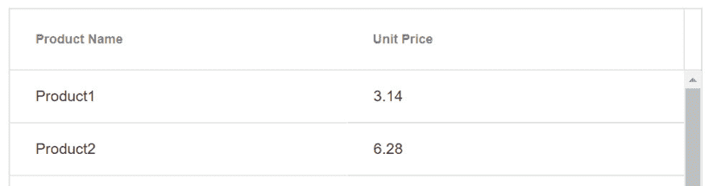
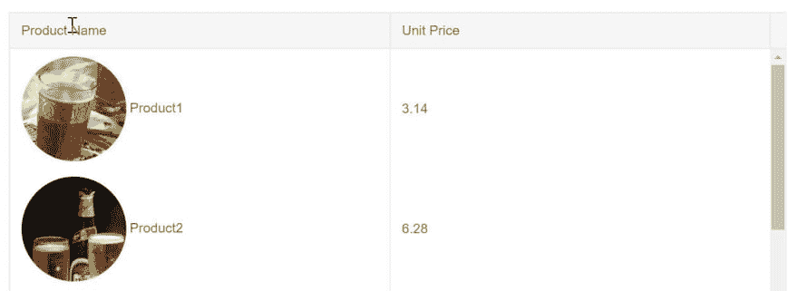
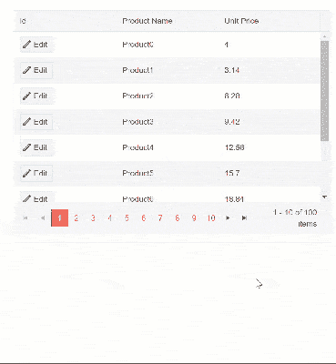

# 为什么 Blazor 网格模板会让你质疑一切

> 原文：<https://dev.to/progresstelerik/why-blazor-grid-templates-will-make-you-question-everything-1057>

通过本机组件，用于 Blazor 网格模板的 Telerik UI 可以充分利用 Blazor 的最佳功能，高度定制用户体验。

在应用程序中使用模板意味着您正在通过利用您正在使用的组件或框架为您的用户创建自定义体验。因为用于 Blazor 的 [Telerik UI 组件是本地的，使用 Blazor 框架从头开始构建，它可以直接利用 Blazor 的最佳特性。网格组件模板可以充分利用 HTML、Razor 和组件来完全定制用户体验。](https://www.telerik.com/blazor-ui)

在本文中，我们将看到可用模板和简单用例的概述。我们将使用这些作为构建模块，来看看当使用模板来实现高级想法(如自定义编辑器和主从视图)时，Blazor 网格可以有多动态。

## 模板类型

目前有三种类型的模板可用于 Blazor 网格:列模板、编辑器模板和行模板。每一种都有非常具体的用途，并且是使网格适应您的具体需求的强大工具。让我们先快速介绍一下每种模板类型。

### 列模板

默认情况下，网格完全按照数据源提供的方式呈现列中字段的值。我们可以通过使用列`Template`来覆盖这种行为，这允许我们控制列中对象的呈现。模板提供了当前绑定到列所在行的整个对象，这个对象是模板的`context`。通过模板，我们可以应用自定义格式，插入额外的 HTML 和图像，并使用来自`context`的任何值显示 Razor 组件。

```
<TelerikGridColumn Field="@(nameof(SampleData.Name))" Title="Employee Name">
    <Template>
       Employee name is: @((context as SampleData).Name)
    </Template>
</TelerikGridColumn> 
```

当前行不处于编辑模式时，列模板可见。为了定制网格的编辑体验，我们将使用`EditorTemplate`。

### 编辑模板

`EditorTemplate`是一个绑定到编辑上下文的模板。`EditorTemplate`定义了当用户编辑字段时将呈现的内联模板或组件。虽然`EditorTemplate`的行为很像列模板，但它只在给定行处于编辑模式时才显示。

```
<TelerikGridColumn Field=@nameof(Employee.VacationDays) Title="Position">
    <EditorTemplate>
        @{
            var employeeToUpdate = context as Employee;
<KendoNumericTextBox Decimals="1" Format="#.0 days" Max="15" Min="0" Step="0.5m" Value="@employeeToUpdate.VacationDays" />
        }
    </EditorTemplate>
</TelerikGridColumn> 
```

列和编辑器模板可以很好地控制网格中的列呈现。为了更好地控制，我们可以选择使用行模板并完全定制网格。

### 行模板

与前面提到的模板不同，`RowTemplate`跨越了所有列的整个网格。row 模板允许您为每个记录的整个`<tr>`元素定义自定义呈现。如果您希望对大多数或所有列使用模板，这可能会很方便，因为与为许多列设置单独的模板相比，它需要的标记更少。

因为模板没有绑定到特定的列，所以它可以使用`RowTemplate`的`Context`属性来设置上下文变量的名称。它的类型是网格绑定到的模型类型。

```
<RowTemplate Context="employee">
    <td>
        <span>@employee.Id</span>
    </td>
    <td>
        Hired on: @(String.Format("{0:dd MMM yyyy}", employee.HireDate))
    </td>
</RowTemplate>
<TelerikGridColumns>
    <TelerikGridColumn Field=@nameof(SampleData.Name) Title="Employee Name" />
    <TelerikGridColumn Field=@nameof(SampleData.HireDate) Title="Hire Date" />
</TelerikGridColumns> 
```

使用这三种模板类型，我们可以处理各种各样的需求。让我们来看看 Blazor Grid 的 [Telerik UI 有多灵活——我们所能完成的可能会让你大吃一惊。](https://docs.telerik.com/blazor/components/grid/overview)

## 图像模板

我们将从一个简单但常见的场景开始，在网格列中嵌入图像。让我们假设我们有一个用户列表，我们需要管理大量的详细信息。把一张脸和一个名字联系起来是很好的，用一个列模板我们就可以做到这一点。使用列模板，我们可以使用当前绑定项的一个或多个属性值来生成图像元素，并直接在列中显示图像。在这个例子中，我们假设我们产品的图像存储在服务器上，相对路径img/`，每个图像文件名对应于`productId`。

让我们从没有模板开始，看看在没有定制的情况下网格是如何构建的。

```
<TelerikGrid Data=@GridData Height="500">
    <TelerikGridColumns>
        <TelerikGridColumn Field=@nameof(Product.ProductName) Title="Product Name"/>
        <TelerikGridColumn Field=@nameof(Product.UnitPrice) Title="Unit Price"/>
    </TelerikGridColumns>
</TelerikGrid> 

@functions {
    public IEnumerable<Product> GridData { get; set; }

    protected override void OnInit() => GridData = ... //fetch data;
} 
```

[](https://res.cloudinary.com/practicaldev/image/fetch/s--RfGWDORG--/c_limit%2Cf_auto%2Cfl_progressive%2Cq_auto%2Cw_880/https://d585tldpucybw.cloudfront.net/sfimages/default-source/default-album/grid-plain.jpg%3Fsfvrsn%3Df9fd1feb_1)

这里我们有一个基本的两列网格，每个产品名称和单价都有一个文本显示。使用模板，我们可以转换产品名称列，在产品名称旁边显示图像。

要访问模板，Product Name 列需要有一个带有匹配开始/结束标签的`TelerikGridColumn`组件。在组件内部，我们将添加一个`Template`组件，它将定义我们的自定义渲染。在模板内部，我们可以访问上下文对象，这是当前`Product`的范围。一个简单的`context as Product`造型将会给我们提供正确的类型。

```
<TelerikGridColumn Field=@nameof(Product.ProductName) Title="Product Name">
    <Template>
        @{
            var product = context as Product;
        }
    </Template>
</TelerikGridColumn> 
```

现在我们已经有了当前的产品，我们可以按照我们认为合适的方式呈现它。让我们添加一个 HTML `
    <TelerikGridColumns>
        <TelerikGridColumn Field=@nameof(Product.ProductName) Title="Product Name">
            <Template>
                @{
                    var product = context as Product;
                    
                    <span>@product.ProductName</span>
                }
            </Template>
        </TelerikGridColumn>
        <TelerikGridColumn Field=@nameof(Product.UnitPrice) Title="Unit Price"/>
    </TelerikGridColumns>
</TelerikGrid> 

@functions ... 
```

[](https://res.cloudinary.com/practicaldev/image/fetch/s--fupPULKO--/c_limit%2Cf_auto%2Cfl_progressive%2Cq_auto%2Cw_880/https://d585tldpucybw.cloudfront.net/sfimages/default-source/default-album/image-template.jpg%3Fsfvrsn%3D19f2bb74_1)

因为底层的 Razor 组件框架支持模板，并且用于 Blazor 网格的 Telerik UI 是使用框架的本地架构构建的，所以网格是许多问题的完全有能力的解决方案。

## 自定义表单

有了模板，我们可以充分利用 Blazor 的框架特性。在模板内部，我们可以添加组件、逻辑，甚至触发事件。此外，模板不仅仅局限于包含它们的组件——我们还可以访问模板外部的事件和值。这为创造定制体验开辟了新的可能性。

让我们假设我们想要创建一个定制的编辑体验，而不是使用内置的网格编辑器。这将使我们完全控制表单的每个方面。挑战在于让表单与网格交互。要创建自定义编辑器，我们需要选择一个项目，将其属性放在表单上，然后保存/取消更改。从表面上看，这似乎是一项复杂的任务，但是该框架具有极其灵活的数据绑定机制。

识别当前选中的`object`将提供我们完成任务所需的大部分内容，因为我们可以将其属性直接绑定到表单元素。网格的模板让我们可以访问绑定到网格行的项目，我们需要的只是一个选择值和创建对象引用的方法。让我们首先使用名为`selectedProduct`的字段为我们的对象引用创建一个占位符。要创建一个选择产品的简单方法，一个带按钮的列模板就足够了。当按钮被点击时，我们将调用一个内嵌函数将`selectedProduct`设置为当前上下文。

```
<TelerikGridColumn Field=@nameof(Product.ProductId) Title="Id">
    <Template>
        <TelerikButton Icon="edit" OnClick="@(_=> selectedProduct = (Product)context)">Edit</TelerikButton>
    </Template>
</TelerikGridColumn> 
```

有了引用的数据，我们现在可以添加一个表单来显示信息，并提供保存和取消操作。表单将存在于网格之外，因为对象引用现在的范围是`page`,我们可以将表单放在网格之外的任何地方。如果使用标准 Razor `@if`块选择了一个项目，可以隐藏或显示该表单。

```
@if (selectedProduct != null) {
...form
} 
```

保存和取消编辑现在也是简单的任务。我们只需要用相应的`OnClick`事件创建按钮。要取消编辑，只需将`selectedProduct`参考重置为`null`。

```
<TelerikGrid Data=@GridData Height=@Height Pageable="true" PageSize=@PageSize>
    <TelerikGridColumns>
        <TelerikGridColumn Field=@nameof(Product.ProductId) Title="Id">
            <Template>
                <TelerikButton Icon="edit" OnClick="@(_=> selectedProduct = (Product)context)">Edit</TelerikButton>
            </Template>
        </TelerikGridColumn>
        <TelerikGridColumn Field=@nameof(Product.ProductName) Title="Product Name" />
        <TelerikGridColumn Field=@nameof(Product.UnitPrice) Title="Unit Price" />
    </TelerikGridColumns>
</TelerikGrid>
<hr />
@if (selectedProduct != null)
{
    <div class="form-group ">
        <label class="control-label" for="productName">
            Product Name
        </label>
        <input class="form-control" bind="@selectedProduct.ProductName" id="name" name="name" type="text" />
    </div>
    <div class="form-group ">
        <label class="control-label" for="unitPrice">
            Unit Price
        </label>
        <input class="form-control" bind="@selectedProduct.UnitPrice" id="unitPrice" name="unitPrice" type="number" />
    </div>
    <div class="form-group">
        <div>
            <TelerikButton Icon="save" Class="k-primary" OnClick="@Save">Save</TelerikButton>
            <TelerikButton Icon="cancel" OnClick="@(_=> selectedProduct = null)">Cancel</TelerikButton>
        </div>
    </div>
}
@functions {
    ...
    Product selectedProduct;

    void Save()
    {
// save logic
        selectedProduct = null;
    }
} 
```

[](https://res.cloudinary.com/practicaldev/image/fetch/s--J3eDDvHR--/c_limit%2Cf_auto%2Cfl_progressive%2Cq_66%2Cw_880/https://d585tldpucybw.cloudfront.net/sfimages/default-source/default-album/customeditor.gif%3Fsfvrsn%3Da416540_1)

由于能够与页面上的其他组件共享状态，模板驱动体验的机会是无限的。

## 主从视图

使用模板，我们可以用定制的 HTML、Razor 甚至组件完全转换整个网格行。在下一个例子中，我们将看看通过在网格中添加一个主-详细视图，我们可以在模板方面取得多大的进步。

对于任何应用程序来说，一个可能的场景是一个数据点具有许多重要性不同的属性。这些属性中的一些应该总是放在前面和中心，而另一些可能有助于触手可及。这就是主从视图非常方便的地方。这种类型的视图有助于在用户请求之前将扩展数据隐藏在视图之外，同时始终将关键数据保持在最前面。

使用`RowTemplate`我们可以为我们的行定义两种不同的状态，这可以通过简单的按钮点击来轻松切换。我们将从默认状态开始，它只显示两列数据。这个视图很好地隐藏在一个名为`ProductMasterTemplate`的定制组件中，并接受一个参数`Product`，以两列格式显示。

```
<ProductMasterTemplate Product="@product" /> 
```

此外，我们将使用更复杂的视图在列表视图中显示给定产品的所有数据。同样，我们将视图封装在名为`ProductDetailTemplate`的定制组件中。

```
<ProductDetailTemplate Product="@product"/> 
```

在每一个定制组件中都有表格数据单元格`<td>`，其中包含显示给定`Product`属性的 Razor 代码。行模板的内容必须是`<td>`元素，它们的数量(或总列数)必须与网格中定义的列数相匹配。在内部，两个模板都包含类似于以下示例的标记。

```
<td>@Product.property</td>
<td colspan="2">
... some view logic
</td> 
```

将这两种状态明确定义为组件后，我们可以专注于在这两种状态之间切换。让我们首先通过创建一个变量来定义选择哪个项目，在这个变量中我们可以保存对所选产品的引用。因此，我们将其命名为`SelectedProduct`。为了使用户能够在视图之间切换，我们需要为用户显示一组按钮。为了显示细节，我们将简单地检查`SelectedProduct`,看看它是否匹配行中的当前项目。因为我们使用的是 Blazor，所以我们可以通过内嵌函数`OnClick="@(_=> SelectedProduct = ...)"`直接在事件处理程序中轻松设置`SelectedProduct`的状态。

```
 <RowTemplate Context="product">
        @if (SelectedProduct != product)
        {
            <td>
                <TelerikButton Icon="@IconName.Window" OnClick="@(_=> SelectedProduct = product)">Details</TelerikButton>
            </td>
            <ProductMasterTemplate Product="@product" />
        }
        else
        {
            <td>
                <TelerikButton Icon="@IconName.Close" OnClick="@(_=> SelectedProduct = null)">Close</TelerikButton>
            </td>
            <ProductDetailTemplate Product="@product"/>
        }
    </RowTemplate> 
```

由于模板和组件架构的结合，下面完成的代码实际上非常简单。

```
<TelerikGrid Data=@GridData Height="@Height">
    <RowTemplate Context="product">
        @if (SelectedProduct != product)
        {
            <td>
                <TelerikButton Icon="@IconName.Window" OnClick="@(_=> SelectedProduct = product)">Details</TelerikButton>
            </td>
            <ProductMasterTemplate Product="@product" />
        }
        else
        {
            <td>
                <TelerikButton Icon="@IconName.Close" OnClick="@(_=> SelectedProduct = null)">Close</TelerikButton>
            </td>
            <ProductDetailTemplate Product="@product"/>
        }
    </RowTemplate>
    <TelerikGridColumns>
        <TelerikGridColumn Width="100" Field=@nameof(Product.ProductName) Title="Product" />
        <TelerikGridColumn Field=@nameof(Product.ProductName) Title="Product Name" />
        <TelerikGridColumn Field=@nameof(Product.UnitsInStock) Title="Unit Price" />
    </TelerikGridColumns>
</TelerikGrid>

@functions {
    Product SelectedProduct;
} 
```

点击`Details`按钮给我们一个光滑的 UI，允许我们钻取网格数据。

[](https://res.cloudinary.com/practicaldev/image/fetch/s--X-wypYAB--/c_limit%2Cf_auto%2Cfl_progressive%2Cq_66%2Cw_880/https://d585tldpucybw.cloudfront.net/sfimages/default-source/default-album/masterdetail.gif%3Fsfvrsn%3Df056b4ab_1)

## 结论

因为用于 Blazor 组件的 Telerik UI 是本机的，使用 Blazor 框架从头开始构建，所以它可以直接利用 Blazor 的最佳特性。网格组件模板可以充分利用 HTML、Razor 和组件来完全定制用户体验。简单的模板对于格式化或显示图像很有用，而更广泛的模板可以完全改变用户界面，为网格添加全新的功能。

在这篇文章中，我们关注的是网格，但是其他组件，如 [DropDownList](https://docs.telerik.com/blazor/components/dropdownlist/overview) 也有模板字段。确保你[下载了最新版本](https://www.telerik.com/download-trial-file/v2-b/ui-for-blazor)，并使用我们在 GitHub 上的[演示库亲自试用模板。](https://github.com/telerik/ui-for-blazor-examples)

[试用 Blazor 的 Telerik UI](https://www.telerik.com/download-trial-file/v2-b/ui-for-blazor)