# WordPress 被制药黑客感染了？如何检测，清理和保护您的网站

> 原文：<https://dev.to/bitofwp/wordpress-infected-with-the-pharma-hack-how-to-detect-clean-and-secure-your-site-from-it-4fja>

## 什么是制药黑客

几年前，我有一个客户想让我从他们的 WordPress 网站上删除一个页面。一个关于药品的网页。我搜索了帖子、页面、自定义帖子类型或任何我能想到的东西，我花了几天时间向客户保证他们的 WordPress 网站上没有这样的页面或帖子。

他们痛苦地坚持，并说他们在谷歌上检查他们网站的搜索结果时找到了一个页面。我亲自检查了结果，令我惊讶的是发现了他们提到的那一页。那个页面链接到了另一个在线销售药物的域名，但是 URL 来自我客户的网站。我想:“这可能是谷歌方面的一个错误，对吗？”。

不对！这是制药公司的黑客攻击。

[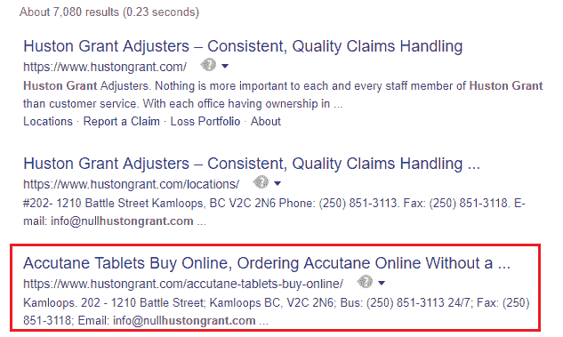](https://res.cloudinary.com/practicaldev/image/fetch/s--dE6CvtsG--/c_limit%2Cf_auto%2Cfl_progressive%2Cq_auto%2Cw_880/https://img.bitofwp.com/wp-content/uploads/2019/04/Pharma-Hack.png) 

那么，到底是什么，是制药黑客？WordPress Pharma Hack 是一种垃圾邮件注入的方法。它的目的是将访问者从一个合法的网站重定向到出售违禁药物(如伟哥、西力士、耐信等)的药店供应商网站。)或一般提供处方药——无需处方。

这是非常微妙的——你可以把它想象成一种寄生虫，它以网站上排名最高的页面为食，目的是获得有价值的链接。你和你的访问者不会看到它，它不会导致任何可见的故障，我还没有听说这样的黑客导致网站崩溃。这听起来几乎无害。

但这是因为它是一种聪明的寄生虫——它需要一个活着的宿主，不想引起任何怀疑和注意。因为它是如此的低调，所以它通常在幕后工作好几个月，然后网站所有者才会注意到它并删除它。如果去除不当，也很有可能复发。它会慢慢降低你的搜索引擎优化和声誉，让你在谷歌上被列入黑名单，并可能让你损失一些(或很多)钱。不是那么无害，是吗？

## 如何判断你的 WordPress 站点是否被制药黑客感染了？

### 1。使用谷歌的高级搜索工具

由于黑客对你来说是看不见的，你必须求助于一个工具来帮助你揭开它的面纱——搜索引擎。你应该做的是打开 Google.com，搜索你的域名(只需输入 domain.com)，或者使用谷歌高级搜索工具，如“site:yourdomain.com”，“inurl:yourdomain.com”等。

如果你使用“ **site:yourdomain.com** ”操作符，谷歌会列出你所有的索引页面。一些搜索结果可能包括类似这样的制药黑客链接:

[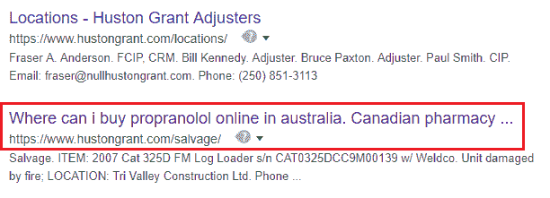](https://res.cloudinary.com/practicaldev/image/fetch/s--HELWPRml--/c_limit%2Cf_auto%2Cfl_progressive%2Cq_auto%2Cw_880/https://img.bitofwp.com/wp-content/uploads/2019/04/pharmaHack2.png)

如果你想更具体一点，你可以使用‘inurl:your domain . com viagra’开始搜索(当然，你应该用你自己的域名替换‘your domain . com’，你也可以搜索不同的药物名称)。

在这一页，你可以找到如何使用谷歌高级搜索操作符的说明。

### 2。作为 Googlebot 获取页面

页面只在搜索引擎上可见的原因是制药黑客只对某些用户代理可见，比如 Googlebot。这意味着，即使你在 Google 上找到了一个重定向到药房供应商网站的页面，即使你正在查看页面源代码，你也无法看到黑客，因为你的浏览器有一个不同的用户代理字符串。

为了浏览谷歌机器人浏览的页面，你需要一个浏览器 [Chome 用户代理切换器](https://chrome.google.com/webstore/detail/user-agent-switcher/dbclpoekepcmadpkeaelmhiheolhjflj?hl=en)或 [Firefox 用户代理切换器](https://addons.mozilla.org/en-US/firefox/addon/user-agent-switcher/)插件。

在你安装了你最喜欢的浏览器用户代理切换器插件后，你应该导航到在谷歌搜索结果中显示为被黑的页面。然后，需要对用户代理字符串进行如下编辑:

[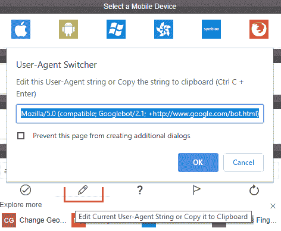](https://res.cloudinary.com/practicaldev/image/fetch/s--1wzgG4c0--/c_limit%2Cf_auto%2Cfl_progressive%2Cq_auto%2Cw_880/https://img.bitofwp.com/wp-content/uploads/2019/04/UserAgentSwitcher.png)

**用户代理字符串需要更改为以下值之一:**

*   Mozilla/5.0(兼容；Google bot/2.1；+[http://www.google.com/bot.html](http://www.google.com/bot.html)
*   Google bot/2.1(+[http://www . Google bot . com/bot . html【t1])](http://www.googlebot.com/bot.html)
*   Google bot/2.1(+[http://www.google.com/bot.html](http://www.google.com/bot.html))

完成后，只需查看页面源代码，您将能够看到重定向到药房供应商网站:

[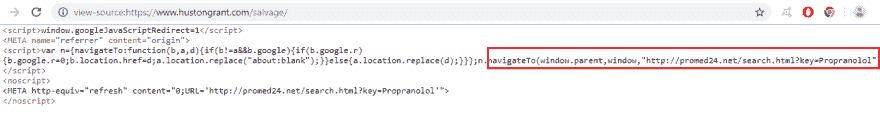](https://res.cloudinary.com/practicaldev/image/fetch/s--U4uAR5KV--/c_limit%2Cf_auto%2Cfl_progressive%2Cq_auto%2Cw_880/https://img.bitofwp.com/wp-content/uploads/2019/04/redirectHack.png)

*重要提示*:不要让用户代理切换器插件处于活动状态。因为你会模仿谷歌机器人，有适当安全性的网站会注意到它，并暂时或永久阻止你。

[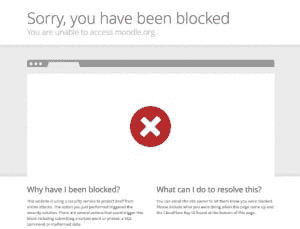](https://res.cloudinary.com/practicaldev/image/fetch/s--VmqDUM8L--/c_limit%2Cf_auto%2Cfl_progressive%2Cq_auto%2Cw_880/https://img.bitofwp.com/wp-content/uploads/2019/04/block-300x229.png)

## 制药黑客是如何工作的？

如前所述，你和你的访问者不会注意到网站的任何变化。制药黑客将覆盖标题标签，并在页面内容中插入垃圾链接。这种修改后的标题标签和垃圾链接只有搜索引擎和搜索引擎爬虫(比如 Googlebot)才看得见。这种方法叫做 ***隐身*** 。

## 制药黑客把代码藏在哪里？

像大多数 WordPress 黑客一样，Pharma hack 使用你的站点核心、插件和主题文件来存储恶意软件。在这种情况下，制药黑客也使用数据库来保持持久性。

### 通过 WordPress 默认目录中的恶意文件(核心、插件、主题)

恶意文件必须放在你的 WordPress 目录中。通常包含[`base64_decode()`](https://en.wikipedia.org/wiki/Base64)[`eval()`](https://en.wikipedia.org/wiki/Eval#PHP)等功能。从这个意义上说，制药公司的黑客攻击与其他任何黑客攻击没有什么不同。

### 通过 WordPress 数据库中的加密代码

不同的是，使用 Pharma Hack，这些函数以字符串形式存储在数据库中，并反向编码，从而使查找和消除变得更加困难。当 hack 文件运行时，它从数据库中提取字符串，对它们进行解码并作为函数运行。

例如，看看这个:

jhboyxjtywhhy2sgpsanvghpcybpcybwagfybwegagfjay 4 now ply 2 hvicrwagfybwfoywnrowo =

看起来像是胡言乱语，但是当[用 base64_decode()函数](https://codebeautify.org/base64-decode)解码后，就变成了:

 `<?php
$pharmahack = 'This is pharma hack.';
echo $pharmahack;
?>` 

当然，我写的代码是无害的，不会做任何事情，但任何恶意软件代码可能看起来都一样，就像一个随机的字母数字字符串，但实际上在您的网站上设置了一个重定向，可能会将您的下一个访问者带到一个提供非处方普萘洛尔的页面。

## 如何清除制药黑客

如前所述，Pharma Hack 由两部分组成，提供后门访问的 Hack 文件和数据库中的加密代码。

为了正确地移除 WordPress Pharma Hack，你必须同时处理这两个问题。**彻底**。如果任何文件留在服务器上，再次感染是不可避免的，你又回到了起点。

在运行你的 WordPress 网站之前，确保你备份了你的 WordPress 文件(核心文件、主题和插件)和数据库，这样你就可以在出现问题时恢复它们。

**提示**:如果你不熟悉使用 FTP 连接到你的服务器(或者至少是 cPanel 上的文件管理器),更重要的是，如果你不熟悉 phpMyAdmin，我强烈建议不要遵循下面的说明。在这种情况下，我建议通过我们的恶意软件清除服务提交一份 [**制药公司被黑的修复请求**](https://bitofwp.com/wordpress-malware-removal/) 。

### 清除 WordPress 被黑的文件

我不会说谎——这是一项无聊的工作，但总得有人去做。你需要做的是检查插件和主题目录中的可疑文件。我希望你不是那种什么都有插件并保留 12 个非活动主题以防万一的网站所有者。如果你是那种人，你有几个小时，不，几天的时间去翻这些文件。

下面我们将展示一个检查和删除被黑文件的例子，你应该为你的 WordPress 站点核心文件、主题和插件重复这个过程。

#### 连接到您的主机服务器

您需要通过 FTP 连接到您的主机服务器或登录 cPanel 并使用文件管理器(我将在下面的例子中使用)。

连接后，您需要确保选中“显示隐藏文件”选项:

[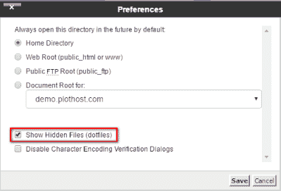](https://res.cloudinary.com/practicaldev/image/fetch/s--Y-Ioew2i--/c_limit%2Cf_auto%2Cfl_progressive%2Cq_auto%2Cw_880/https://img.bitofwp.com/wp-content/uploads/2019/04/showHiddenFiles.png)

让我们导航到 Akismet 插件目录–进入“WP-内容”->“插件”->“akis met”。

[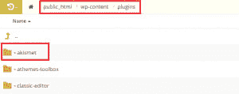](https://res.cloudinary.com/practicaldev/image/fetch/s--_OTgmB0F--/c_limit%2Cf_auto%2Cfl_progressive%2Cq_auto%2Cw_880/https://img.bitofwp.com/wp-content/uploads/2019/04/Akismet-300x119.png)

#### 查找流氓黑客和恶意软件文件

您应该注意的第一件事是命名约定。黑客文件通常会在中间有一个伪扩展名(比如*)。*、*级。缓存*、*。旧的*)试图模仿正版插件文件。

[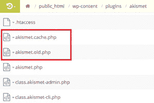](https://res.cloudinary.com/practicaldev/image/fetch/s--mLml8fcH--/c_limit%2Cf_auto%2Cfl_progressive%2Cq_auto%2Cw_880/https://img.bitofwp.com/wp-content/uploads/2019/04/malwareAkismet-300x201.png)

另外，在文件名前面加一个点(比如。htaccess”)将隐藏文件，除非启用了“显示隐藏文件”选项。这总是引起怀疑。

为了确认，这些文件的内容应该如下所示:

 `< ? php $XZKsyG='as';$RqoaUO='e';$ygDOEJ=$XZKsyG.'s'.$RqoaUO.'r'.'t';$joEDdb
='b'.$XZKsyG.$RqoaUO.(64).'_'.'d'.$RqoaUO.'c'.'o'.'d'.$RqoaUO;@$ygDOEJ(@$j
oEDdb('ZXZhbChiYXNlNjRfZGVjb2RlKCJhV1lvYVhOelpY...` 

如果您不确定该文件是否是插件的正版，您可以从 WordPress.org 下载插件的全新版本，并比较您的服务器上的插件目录和全新安装的内容。

#### 这个。htaccess 文件

的。htaccess 文件也是检查的好地方。这是一个不应该出现的代码的例子:

 `RewriteEngine On
RewriteCond %{ENV:REDIRECT_STATUS} 200
RewriteRule ^ - [L]
RewriteCond %{HTTP_USER_AGENT} (google|yahoo|msn|aol|bing) [OR] #checks for Google, Yahoo, msn, aol and bing crawler
RewriteCond %{HTTP_REFERER} (google|yahoo|msn|aol|bing)
RewriteRule ^(.*)$ somehackfile.php?$1 [L] #redirects to a hack file` 

如果你看到这样的代码，最好删除它。当然，您应该保存。以防万一。如果你需要重新创建文件，只需进入你的 WordPress 仪表盘，然后进入“设置”->“永久链接”并点击保存(你不需要改变永久链接的结构)。将重新生成 htaccess 文件。

#### 扫描文件内容差异

对于一些有大量文件的插件(如 JetPack)来说，这可能有点太多了，所以你也可以使用[漏洞扫描器](https://wordpress.org/plugins/exploit-scanner/)或类似的安全插件来检查文件变化。漏洞扫描插件将搜索所有 WordPress 核心文件，第三方主题和插件，这些都是通过 [WordPress 的官方仓库](https://wordpress.org)发布的，并且在你的数据库的帖子和评论表中寻找可疑的条目和不寻常的文件名。缺点是，漏洞扫描插件产生了很多误报，所以你必须检查它输出的每一个结果，而它不会与高级插件或自定义插件一起工作。

在你搞清楚哪些文件被黑了，分发了恶意软件之后，你应该马上删除它们。如果你发现一个有大量文件的被黑插件，删除整个插件并从头重新安装可能更有效。大多数时候插件选项和设置都存储在你的站点数据库中，所以恢复默认插件文件不会伤害你。

一旦你删除了所有被黑的 WordPress 文件，制药黑客的症状应该会消失，几天后你的网站的搜索结果会恢复正常(谷歌需要重新抓取你的网站，以验证它是干净的)。然而，这并没有结束清理过程，因为您仍然需要处理数据库中的剩余代码。

请记住，如果留下任何黑客文件，你的 WordPress 网站迟早会被制药黑客再次感染。也就是说，让我们继续进行数据库清理。

### 从 WordPress 数据库中删除恶意代码

以下所有说明都涉及到数据库操作，因此，创建一个数据库备份(如果你还没有这样做的话)

并严格遵循说明是很重要的，因为任何即兴操作都可能导致你的网站崩溃。

同样，如果你不习惯通过 phpMyAdmin 进行编辑，雇佣专业人员或者尝试我们的恶意软件清除服务是个好主意。

#### 登录 phpMyAdmin

如果你使用 cPanel 托管包，那么这是一个简单的步骤。您只需点击“phpMyAdmin”图标:

否则，你将需要一个 **phpMyAdmin 登录网址**、**用户名**和**密码**。你的主机提供商应该可以帮你解决这个问题。

#### 选择正确的数据库

登录后，您需要选择正确的数据库，以确保在正确的位置进行更改。

如果您有多个数据库，您可以检查您的 wp-config.php 文件并搜索数据库名称。它将出现在下面的代码行中-`define('DB_NAME', 'yourdatabasename');`

[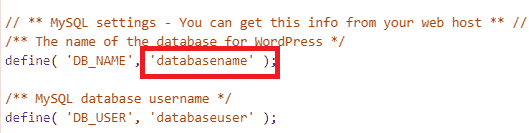](https://res.cloudinary.com/practicaldev/image/fetch/s--xSMAXzmV--/c_limit%2Cf_auto%2Cfl_progressive%2Cq_auto%2Cw_880/https://img.bitofwp.com/wp-content/uploads/2019/04/wpconfigDB.png)

#### 搜索恶意代码

现在你已经选择了正确的数据库，你将需要导航到‘WP _ options’表(表前缀可能是不同的，这取决于你安装 WordPress 网站后第一次设置的方式)。在屏幕的左侧应该有一个 WordPress 表格列表(你可以点击那个条目或者中间列表上的“浏览”按钮):

[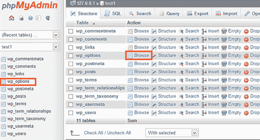](https://res.cloudinary.com/practicaldev/image/fetch/s--nAPjuNnf--/c_limit%2Cf_auto%2Cfl_progressive%2Cq_auto%2Cw_880/https://img.bitofwp.com/wp-content/uploads/2019/04/searchPHPMyAdmin.png)

选择 wp_options 表后，您需要使用页面顶部的搜索选项卡来搜索恶意数据库条目。

[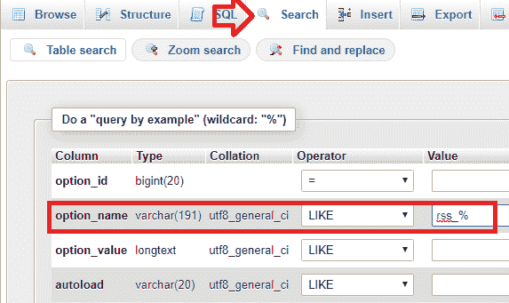](https://res.cloudinary.com/practicaldev/image/fetch/s--lJ6kaNs2--/c_limit%2Cf_auto%2Cfl_progressive%2Cq_auto%2Cw_880/https://img.bitofwp.com/wp-content/uploads/2019/04/phpmaSearch.png)

**您需要通过将条目输入“选项名称”字段来搜索的条目如下:**

*   **wp_check_hash**
*   **class_generic_support**
*   **widget_generic_support**
*   **FTP _ 凭证**
*   **fwp**
*   **rss_%** 注意！在这种情况下，您应该删除除 rss_language、RSS _ use _ extract 和 RSS _ extract _ length 之外的所有匹配项(这些是合法的 WordPress 数据库条目)。

密切注意不要删除 wp_options 表中的重要信息，因为这可能会产生错误，甚至使你的 WordPress 站点崩溃。

## 如何验证自己的 WP 网站是干净的

### 使用相同的搜索操作符重复谷歌搜索

当你从你的网站上移除被 WordPress 黑掉的文件后，谷歌上的搜索结果应该会正常化。然后，您应该重复谷歌搜索，使用高级搜索操作符来检查是否有任何页面仍然显示在结果中。

现在，如果一些制药公司的黑客攻击结果仍然出现，那就不足为奇了。谷歌索引你的网站已经有一段时间了，可能需要几天或几周才能恢复。这也可能意味着一些黑客文件仍然存在于服务器上，所以你应该重复制药黑客清理程序。

### 使用谷歌站长工具

[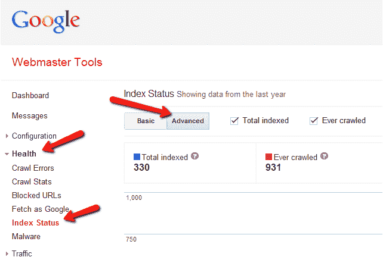](https://res.cloudinary.com/practicaldev/image/fetch/s--QvvgH-TA--/c_limit%2Cf_auto%2Cfl_progressive%2Cq_auto%2Cw_880/https://img.bitofwp.com/wp-content/uploads/2019/04/Webmaster-tools.png) 

在制药黑客完全移除后，应使用谷歌网站管理员工具重新索引网站。索引状态和恶意软件选项可以显示您的网站是否仍然被标记为受谷歌感染。

### 如何扫描你的网站寻找被制药公司入侵的条目

有许多安全插件可以确定你的网站是否有恶意软件感染。如前所述，制药黑客可能非常难以捕捉，因此它完全有可能被安全插件遗漏。

还有网站扫描仪，不同的公司免费提供。

### 如何迫使谷歌重新索引你的制药黑客免费 WordPress 网站

#### 提交新的站点地图

站点地图包含了你的站点的所有页面和文章的列表。提交站点地图可能会加快重新索引的过程。如果你已经有了一个网站地图，试着删除它，然后重新提交。这也将删除所有与制药相关的页面和网址(如果有的话)。

#### 谷歌的清除过时内容工具

以防有些页面仍然被 Pharma Hack 索引，所以需要提交删除。尽管你的 WordPress 网站没有被制药公司黑掉，但是一些被黑掉的网页仍然会出现在谷歌的搜索结果中。Google now 让你通过 **[删除过时内容工具](https://www.google.com/webmasters/tools/removals)** 要求删除那些过时的页面。如果是这种情况，那么复制谷歌搜索结果中显示的网址，然后粘贴到工具中，并要求删除。

## 如何保护网站免受未来的黑客攻击

每一次成功(或不成功)的黑客攻击都是从试图利用网站的弱点开始的。最常见的情况是，恶意软件感染是可能的，因为使用过时或过时的软件，如过时的 WordPress 核心，主题和插件。定期更新是提高网站安全性的重要一步。

删除恶意软件后，您可能需要更改 FTP 凭据，删除未知用户并限制用户权限。实现一个安全插件并监控你的站点也是一个好主意。

我们建议你阅读我们关于如何保护 WordPress 网站免受黑客攻击的详细文章，这是一篇很长的文章，但我们确信它将帮助你保护你的 WordPress 网站免受黑客攻击，如制药公司和恶意软件重定向。

## 为你所有的 WordPress 站点重复医药清理

如果你在同一个黑客账户下托管了不止一个 WordPress 站点，那么你必须清理所有的站点，否则它会一次又一次地被黑客攻击。对于我们来说，收到一个 WordPress 站点被黑的修复请求，却发现在同一个托管账户下有 2 个或更多的站点，这是很常见的。在这种情况下，我们建议我们的客户让我们清理他们，否则我们宁愿放弃请求，因为我们不能保证他们要求清理的网站在不久的将来会保持干净。

## 最后的想法

制药黑客已经存在很长时间了，而且一直在发展。清除它总是困难和费时的，特别是如果再次感染发生的话。本文提供的诊断和修复黑客攻击的步骤应该有助于您有效地解决这个问题，并减少将来再次发生的可能性。然而，如果你不确定你已经成功地消除了制药公司的黑客攻击并保护你的网站免受未来的黑客攻击，你可能想要选择加入我们的 **[WordPress 支持和维护服务](https://bitofwp.com/wordpress-support-services/)** 。现在可能是额外的成本，但从长远来看可以为你省下这笔钱。

如果你的 WordPress 网站已经被日本黑客感染了**，那么我们建议看看我们的[如何识别和修复日本关键词黑客](https://bitofwp.com/security/identify-remove-japanese-keyword-hack/)指南。**

*约书亚·科尔曼在 Unsplash 上拍摄的照片*

WordPress 被制药黑客感染了？如何检测、清理和保护你的网站首先出现在 [WordPress 支持服务上，作者是 BitofWP](https://bitofwp.com) 。