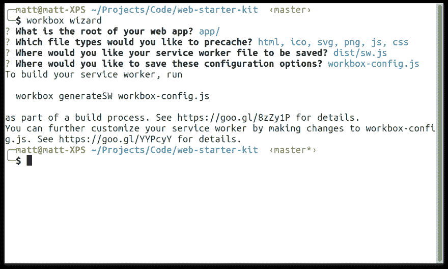

# 茶歇期间的 Vue-在 5 分钟内将任何 Vue 应用程序转换为离线就绪的 PWA。

> 原文：<https://dev.to/vue-storefront/vue-during-coffee-break-transform-any-vue-application-into-offline-ready-pwa-in-5-minutes-31dm>

本系列的目的是发布关于高级 Vue 概念的小技巧，这些概念可以快速应用到每个应用程序中，并为您提供解决问题的新武器。

在这篇短文中，我将解释如何将现有的 Vue 应用程序转换成 PWA，或者如何建立一个新的。

## 什么是渐进式 Web Apps？

简而言之，渐进式网络应用程序(PWA)是一个工作和行为像一个本地的网络应用程序。

PWA 的一些功能包括:

*   离线工作的能力
*   主屏幕安装
*   支持推送通知

如果你想了解更多，我强烈建议你阅读这份文件。现在让我们写一些代码。

## PWA 模块为 Nuxt

如果你正在使用 Nuxt，添加 PWA 功能对新的和现有的应用程序都是一样的。

1.  (可选)如果是新项目，用`create-nuxt-app`设置它

```
npx create-nuxt-app <project-name> 
```

Enter fullscreen mode Exit fullscreen mode

1.  安装@nuxtjs/pwa 模块

```
npm i @nuxtjs/pwa 
```

Enter fullscreen mode Exit fullscreen mode

1.  在`nuxt.config.js`中注册模块

```
{
    modules: [
        '@nuxtjs/pwa',
    ],
} 
```

Enter fullscreen mode Exit fullscreen mode

1.  (可选)创建`static/icon.png`(推荐 512x512px)，它将用作你的应用程序的主屏幕图标。
2.  (可选)将`sw.*`规则添加到`.gitignore`文件，以避免提交由 Nuxt 模块生成的文件。

Nuxt PWA 模块实际上是一组更小的 PWA 子模块。安装完成后，让我们给他们看一看:

*   **Workbox** -在幕后，Nuxt PWA 模块在`generateSW`模式下使用 Workbox(你可以在这里找到配置选项[)，这意味着它将自动为我们生成一个服务工作者文件，该文件将负责缓存我们的静态资产。您的 dist 目录中的每个文件都将被缓存以供脱机使用。该模块开箱即用](https://developers.google.com/web/tools/workbox/modules/workbox-cli#generateSW)
*   **清单**——自动生成 manifest.json 文件。这个模块开箱即用，但是可以通过你的`nuxt.config.js` ( [阅读更多](https://pwa.nuxtjs.org/modules/manifest.html))的`manifest`属性进行配置
*   **Meta** -自动添加 SEO 友好的元数据与清单集成。([阅读更多](https://pwa.nuxtjs.org/modules/meta.html))
*   **图标** -自动生成不同大小的 app 图标。([阅读更多](https://pwa.nuxtjs.org/modules/icon.html))。这个模块开箱即用，但是可以通过`nuxt.config.js`的`icon`属性进行配置
*   **OneSignal** -使用 OneSignal 的免费后台推送通知。OneSignal 是一个平台，允许轻松地向用户发送推送通知。你可以在这里阅读如何配置这个模块

# vista-CLI pwa 插件

如果您使用的是 vue-cli 3.x，安装会更容易。

对于运行后的新项目

```
vue create <project_name> 
```

Enter fullscreen mode Exit fullscreen mode

在第一步选择`Manually select features`，然后用空格键检查`Progressive Web Apps`。

完成安装过程以及 vue-cli 生成的标准文件后，您会发现`registerServiceWorker.js`和`manifest.json`。你可以在你的`vue.config.js`的`pwa`属性下定制插件的行为，在`pwa.workboxOptions`下你可以在`generateSW`模式下定制底层的工具箱插件(和我们在 Nuxt 中看到的一样)。

对于已经存在的项目，在 vue-cli 3 上安装`@vue/pwa`插件会有完全相同的效果。您只需输入
即可为您的应用添加 PWA 功能

```
vue add @vue/pwa 
```

Enter fullscreen mode Exit fullscreen mode

# 其他项目

如果您没有使用 Nuxt 或 vue-cli 3.x，您仍然可以通过使用 [Workbox CLI](https://developers.google.com/web/tools/workbox/modules/workbox-cli) 使用几个命令将您的应用程序转换为离线就绪的 PWA。

首先你需要安装命令行界面:

```
npm install workbox-cli --global 
```

Enter fullscreen mode Exit fullscreen mode

接下来，在你的项目的根目录下，我们应该使用一个向导来为我们生成服务工作者:

```
workbox wizard 
```

Enter fullscreen mode Exit fullscreen mode

回答提示问题后，向导将生成一个`workbox-config.js`文件，该文件将用于生成服务人员！

[](https://res.cloudinary.com/practicaldev/image/fetch/s--d8eTqXlF--/c_limit%2Cf_auto%2Cfl_progressive%2Cq_auto%2Cw_880/https://developers.google.com/web/tools/workbimg/modules/workbox-cli/cli-wizard.png) 
你可以用
生成你的服务人员

```
workbox generateSW workbox-config.js 
```

Enter fullscreen mode Exit fullscreen mode

这些简单的步骤可以显著提高您的应用程序性能，因此它们肯定值得一试；)

请继续关注该系列的下一部分！