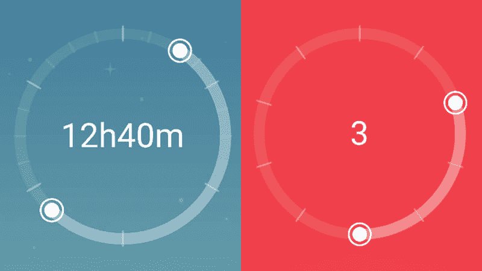
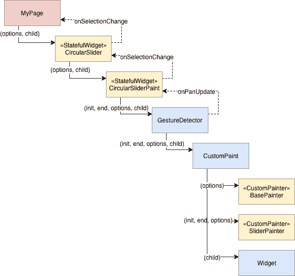

# 如何在 Flutter 中构建一个圆形滑块

> 原文：<https://dev.to/davidanaya/how-to-build-a-circular-slider-in-flutter-1ecc>

[](https://res.cloudinary.com/practicaldev/image/fetch/s--m3vjpMAN--/c_limit%2Cf_auto%2Cfl_progressive%2Cq_auto%2Cw_880/https://thepracticaldev.s3.amazonaws.com/i/5aqm7za6ej06bkz0gyl0.png)

你有没有想过通过提供一个双处理程序或者改变布局来增加通常无聊的滑块的趣味？

在这篇文章中，我将解释如何集成*手势检测器*和*画布*来构建 Flutter 中的圆形滑块。

如果你对如何构建它不感兴趣，只是想得到并使用它，你可以使用我在[https://pub.dartlang.org/packages/flutter_circular_slider](https://pub.dartlang.org/packages/flutter_circular_slider)发布的包。

## 为什么我需要圆形滑块？

在大多数情况下，你不需要，但是想象一下，你希望用户选择一个时间间隔，或者你只是想要一个常规的滑块，但是想要一个比直线更有趣的东西。

## 为了建造它，我们需要什么？

我们需要做的第一件事是创建实际的滑块。为此，我们将绘制一个完整的圆作为基础，在此基础上，另一个圆将是动态的，取决于用户的交互。为了做到这一点，我们将使用一个名为 *CustomPaint* 的特殊小部件，它提供了一个画布，我们可以在上面绘制我们需要的内容。

一旦呈现了滑块，我们需要用户能够与它交互，所以我们将使用一个*手势检测器*来捕获点击和拖动事件。

这一过程将是:

*   绘制滑块
*   通过点击其中一个句柄并拖动来识别用户何时与滑块交互。
*   将附加到事件的信息向下传递到画布，我们将在画布上重新绘制顶部的圆圈。
*   一直向上发送处理程序的新值，以便用户可以对更改做出反应(例如，更新滑块中心的文本)。

[](https://res.cloudinary.com/practicaldev/image/fetch/s--Su7xAWMT--/c_limit%2Cf_auto%2Cfl_progressive%2Cq_auto%2Cw_880/https://thepracticaldev.s3.amazonaws.com/i/sgtpy5yqto5bwwlf5utf.png)

## 让我们画一些圆

我们要做的第一件事是画两个圆。由于其中一个是静态的(不变)，另一个是动态的(随着用户交互而变化)，所以我在两个不同的画师中将它们分开。

我们的两个画师都需要扩展由 Flutter 提供的类 *CustomPainter* ，并实现两个方法: *paint()* 和 *shouldRepaint()* ，第一个是实际绘制我们想要的内容的方法，第二个是当有变化时知道我们是否需要重画的方法。对于 BasePainter，我们从不需要重画，因此它将永远是假的。对于 *SliderPainter* 来说，它总是正确的，因为每一次改变都意味着用户移动了滑块，选择必须更新。

```
import 'package:flutter/material.dart';

class BasePainter extends CustomPainter {
  Color baseColor;

  Offset center;
  double radius;

  BasePainter({@required this.baseColor});

  @override
  void paint(Canvas canvas, Size size) {
    Paint paint = Paint()
        ..color = baseColor
        ..strokeCap = StrokeCap.round
        ..style = PaintingStyle.stroke
        ..strokeWidth = 12.0;

    center = Offset(size.width / 2, size.height / 2);
    radius = min(size.width / 2, size.height / 2);

    canvas.drawCircle(center, radius, paint);
  }

  @override
  bool shouldRepaint(CustomPainter oldDelegate) {
    return false;
  }
} 
```

如您所见， *paint()* 得到一个*画布*和一个*大小*参数。Canvas 提供了一套方法，我们可以用它来画任何东西:圆、线、弧、矩形等等。*大小*是画布的大小，将由适合画布的小部件的大小决定。我们还需要一个 *Paint* ，它允许我们指定样式、颜色和许多其他东西。
现在， *BasePainter* 非常简单明了，但是 *SliderPainter* 有点复杂。现在不仅需要画一个圆弧而不是一个圆，我们还需要画出处理程序。

```
import 'dart:math';

import 'package:flutter/material.dart';
import 'package:flutter_circular_slider/src/utils.dart';

class SliderPainter extends CustomPainter {
  double startAngle;
  double endAngle;
  double sweepAngle;
  Color selectionColor;

  Offset initHandler;
  Offset endHandler;
  Offset center;
  double radius;

  SliderPainter(
      {@required this.startAngle,
      @required this.endAngle,
      @required this.sweepAngle,
      @required this.selectionColor});

  @override
  void paint(Canvas canvas, Size size) {
    if (startAngle == 0.0 && endAngle == 0.0) return;

    Paint progress = _getPaint(color: selectionColor);

    center = Offset(size.width / 2, size.height / 2);
    radius = min(size.width / 2, size.height / 2);

    canvas.drawArc(Rect.fromCircle(center: center, radius: radius),
        -pi / 2 + startAngle, sweepAngle, false, progress);

    Paint handler = _getPaint(color: selectionColor, style: PaintingStyle.fill);
    Paint handlerOutter = _getPaint(color: selectionColor, width: 2.0);

    // draw handlers
    initHandler = radiansToCoordinates(center, -pi / 2 + startAngle, radius);
    canvas.drawCircle(initHandler, 8.0, handler);
    canvas.drawCircle(initHandler, 12.0, handlerOutter);

    endHandler = radiansToCoordinates(center, -pi / 2 + endAngle, radius);
    canvas.drawCircle(endHandler, 8.0, handler);
    canvas.drawCircle(endHandler, 12.0, handlerOutter);
  }

  Paint _getPaint({@required Color color, double width, PaintingStyle style}) =>
      Paint()
        ..color = color
        ..strokeCap = StrokeCap.round
        ..style = style ?? PaintingStyle.stroke
        ..strokeWidth = width ?? 12.0;

  @override
  bool shouldRepaint(CustomPainter oldDelegate) {
    return true;
  }
} 
```

同样，我们得到了圆心和半径，但现在我们画一个弧。我们的 *SliderPainter* 将基于用户交互获取开始、结束和扫描角度作为参数，因此我们可以使用它们来绘制圆弧。这里唯一值得一提的是，我们需要从初始角度减去*-π/2*弧度，因为我们的滑块原点在圆的顶部，而 *drawArc()* 函数使用正 x 轴。

一旦我们有了弧线，我们需要画出处理程序。为此，我们将为每个画两个圆，一个内部填满，一个外部围绕。我正在使用一些效用函数来将弧度转换为圆中的坐标。你可以在 github 的 repo 里查看这些函数。

## 我们如何让它互动？

我们现在拥有的将足以画出我们想要的，我们只需要使用 *CustomPaint* 和我们的两个画师，但它仍然不是交互式的。我们需要用一个*手势检测器*包裹它。这样，我们将能够对画布中的用户事件做出反应。
我们将为我们的处理程序定义初始值，然后，因为我们知道这些处理程序的坐标，我们的策略如下:

*   倾听任何处理程序的向下平移(点击)，并更新该处理程序的状态 *(_xHandlerSelected = true)* 。
*   当选择任何处理程序时，监听平移(拖动)更新事件，然后更新该处理程序的坐标，并将它们向下传递给 SliderPainter，并在我们的回调方法中向上传递。
*   监听向上声相(轻敲)事件，并将处理程序的状态重置为未选择。

因为我们需要计算处理程序的坐标和新的角度来传递给画师，我们的 *CircularSliderPaint* 必须是一个 *StatefulWidget* 。

```
import 'package:flutter/material.dart';
import 'package:flutter_circular_slider/src/base_painter.dart';
import 'package:flutter_circular_slider/src/slider_painter.dart';
import 'package:flutter_circular_slider/src/utils.dart';

class CircularSliderPaint extends StatefulWidget {
  final int init;
  final int end;
  final int intervals;
  final Function onSelectionChange;
  final Color baseColor;
  final Color selectionColor;
  final Widget child;

  CircularSliderPaint(
      {@required this.intervals,
      @required this.init,
      @required this.end,
      this.child,
      @required this.onSelectionChange,
      @required this.baseColor,
      @required this.selectionColor});

  @override
  _CircularSliderState createState() => _CircularSliderState();
}

class _CircularSliderState extends State<CircularSliderPaint> {
  bool _isInitHandlerSelected = false;
  bool _isEndHandlerSelected = false;

  SliderPainter _painter;

  /// start angle in radians where we need to locate the init handler
  double _startAngle;

  /// end angle in radians where we need to locate the end handler
  double _endAngle;

  /// the absolute angle in radians representing the selection
  double _sweepAngle;

  @override
  void initState() {
    super.initState();
    _calculatePaintData();
  }

  // we need to update this widget both with gesture detector but
  // also when the parent widget rebuilds itself
  @override
  void didUpdateWidget(CircularSliderPaint oldWidget) {
    super.didUpdateWidget(oldWidget);
    if (oldWidget.init != widget.init || oldWidget.end != widget.end) {
      _calculatePaintData();
    }
  }

  @override
  Widget build(BuildContext context) {
    return GestureDetector(
      onPanDown: _onPanDown,
      onPanUpdate: _onPanUpdate,
      onPanEnd: _onPanEnd,
      child: CustomPaint(
        painter: BasePainter(
            baseColor: widget.baseColor,
            selectionColor: widget.selectionColor),
        foregroundPainter: _painter,
        child: Padding(
          padding: const EdgeInsets.all(12.0),
          child: widget.child,
        ),
      ),
    );
  }

  void _calculatePaintData() {
    double initPercent = valueToPercentage(widget.init, widget.intervals);
    double endPercent = valueToPercentage(widget.end, widget.intervals);
    double sweep = getSweepAngle(initPercent, endPercent);

    _startAngle = percentageToRadians(initPercent);
    _endAngle = percentageToRadians(endPercent);
    _sweepAngle = percentageToRadians(sweep.abs());

    _painter = SliderPainter(
      startAngle: _startAngle,
      endAngle: _endAngle,
      sweepAngle: _sweepAngle,
      selectionColor: widget.selectionColor,
    );
  }

  _onPanUpdate(DragUpdateDetails details) {
    if (!_isInitHandlerSelected && !_isEndHandlerSelected) {
      return;
    }
    if (_painter.center == null) {
      return;
    }
    RenderBox renderBox = context.findRenderObject();
    var position = renderBox.globalToLocal(details.globalPosition);

    var angle = coordinatesToRadians(_painter.center, position);
    var percentage = radiansToPercentage(angle);
    var newValue = percentageToValue(percentage, widget.intervals);

    if (_isInitHandlerSelected) {
      widget.onSelectionChange(newValue, widget.end);
    } else {
      widget.onSelectionChange(widget.init, newValue);
    }
  }

  _onPanEnd(_) {
    _isInitHandlerSelected = false;
    _isEndHandlerSelected = false;
  }

  _onPanDown(DragDownDetails details) {
    if (_painter == null) {
      return;
    }
    RenderBox renderBox = context.findRenderObject();
    var position = renderBox.globalToLocal(details.globalPosition);
    if (position != null) {
      _isInitHandlerSelected = isPointInsideCircle(
          position, _painter.initHandler, 12.0);
      if (!_isInitHandlerSelected) {
        _isEndHandlerSelected = isPointInsideCircle(
            position, _painter.endHandler, 12.0);
      }
    }
  }
} 
```

这里需要注意一些事情:

*   我们希望在处理程序的位置(以及选择)更新时通知父部件，这就是为什么部件公开了一个回调函数 *onSelectionChange()* 。
*   当用户与滑块交互时，小部件需要重新呈现，但如果初始参数发生变化，这也是我们使用 *didUpdateWidget()* 的原因。
*   CustomPaint 也允许一个子参数，所以我们可以用它来渲染我们的圆圈内的东西。我们将在最终的小部件中公开相同的参数，以便用户可以传递她想要的任何东西。
*   我们使用间隔来设置滑块中可能值的数量。这样，我们可以方便地将选择表示为百分比。
*   同样，我使用不同的效用函数在百分比、弧度和坐标之间进行转换。画布中的坐标系与常规坐标系有点不同，因为它从左上角开始，所以 x 和 y 总是正值。此外，弧度从正 x 轴开始，从 *0* 到*2 *π*弧度顺时针(总是正的)。
*   最后，我们的处理程序的坐标与画布原点相关，但是 *GestureDetector* 中的坐标对于设备是全局的，所以我们需要使用*render box . globaltolocal()*来转换这些坐标，它使用小部件中的上下文作为参考。

这样我们就有了圆形滑块所需要的一切。

## 一些额外的功能

这里涉及的内容很多，所以我没有详细介绍，但是你可以查看该项目的回购协议，我很乐意回答评论中的任何问题。

在最终版本中，我添加了一些额外的功能，如选择和处理程序的自定义颜色或绘制主要和次要选择器的选项，以获得手表的良好外观(小时，分钟)，如果我们需要的话。为了清楚起见，我还将所有内容都包装在一个最终的小部件中。

记住，如果你愿意，你也可以通过从[https://pub.dartlang.org/packages/flutter_circular_slider](https://pub.dartlang.org/packages/flutter_circular_slider)导入库来使用这个小部件。

仅此而已。感谢阅读！