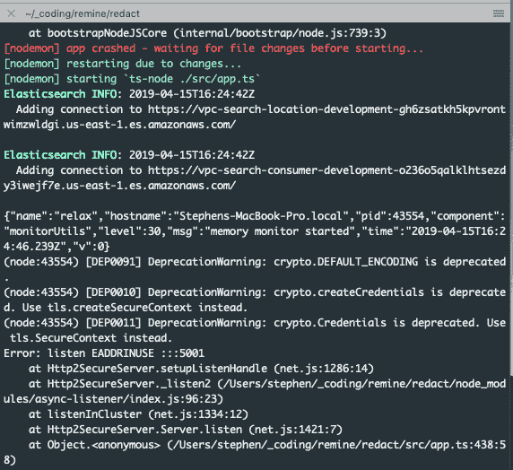
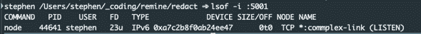
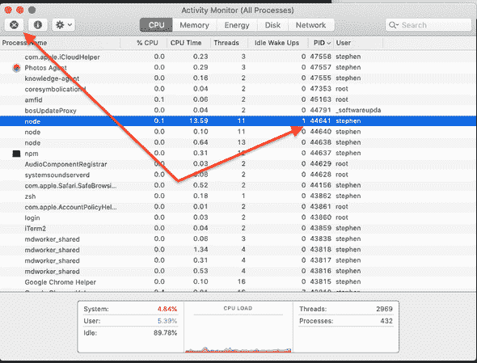

# 错误处理:地址正在使用中

> 原文：<https://dev.to/stephencweiss/error-handling-address-in-use-60k>

运行我的节点服务器时，我得到一个错误，表明我的端口已经在使用中(`Error: listen EADDRINUSE :::5001`)。

我知道*不应该是*的情况，因为我只有一个应用程序在那个端口上运行。

尽管如此，从控制台多次终止该进程并不起作用，所以我搜索进程 ID (PID)来专门终止它。

有多种方法可以做到这一点，但对我来说开箱即用(在 Mac 上)的方法是`lsof`，它是“列出打开的文件”程序。

`-i`标志允许包含特定的端口。

在我的例子中，我对端口`5001`感兴趣，所以命令是`lsof -i :5001`。

这正是我所需要的: 

显然,`node`服务器没有终止，并且还在使用这个端口，但是现在我知道了 PID。这意味着我可以跳到活动监视器，查找并杀死它。 

现在，当我重启服务器时，它工作得非常好。

# 资源

*   [找出哪个进程监听特定端口的 3 种方法](https://www.tecmint.com/find-out-which-process-listening-on-a-particular-port/)