# 在 Swift 中为 MacOS 应用程序创建全球可配置快捷方式

> 原文：<https://dev.to/mitchartemis/creating-a-global-configurable-shortcut-for-macos-apps-in-swift-25e9>

我最近发布了我的第一个 MacOS 应用程序，经过大量的试验和错误，发现 MacOS 的 Swift 教程不够多！就当这是我对这项事业的第一份贡献吧🙂。

*不要脸的插件:这个教程来自我在 [Snipbar](https://itunes.apple.com/gb/app/snipbar/id1457592516?mt=12) 上的工作，这是一个 MacOS 应用程序，我一直在为我的 shell 命令应用程序 [Snipline](https://snipline.io/) 工作。如果你使用 shell 命令和服务器，或者 SQL，我希望你能看看。*

本教程结束时，您将拥有

*   设置带有两个窗口的应用程序:主窗口和偏好设置窗口
*   从主窗口创建了一个链接到首选项窗口的按钮。
*   通过[迦太基](https://github.com/Carthage/Carthage)安装并配置[热键](https://github.com/soffes/HotKey)。
*   设置一个简单的 UI，用于配置打开主窗口的全局键盘快捷键。

这里有一个应用程序如何工作的预览

[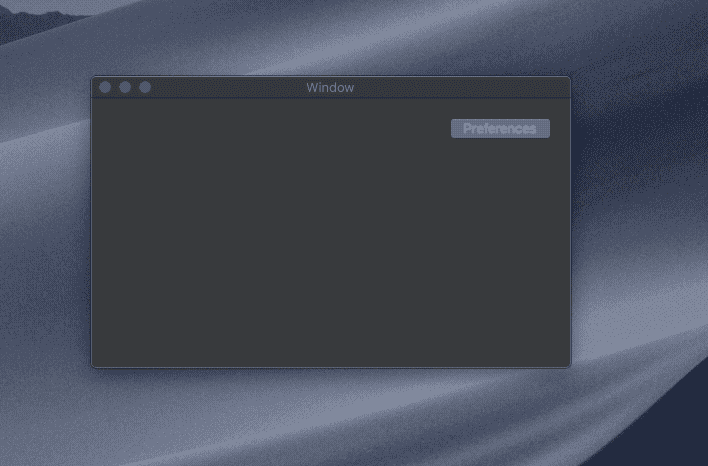](https://res.cloudinary.com/practicaldev/image/fetch/s--ObhEbakt--/c_limit%2Cf_auto%2Cfl_progressive%2Cq_66%2Cw_880/https://thepracticaldev.s3.amazonaws.com/i/v431jp7n0s135l91lhsv.gif)

本教程使用 Xcode 10.2 和 Swift 5。

## 创建应用窗口

首先，让我们在 Xcode 中创建一个新的 Mac 项目，我将它命名为`GlobalConfigKeybind`。我们需要确保“MacOS”和“Cocoa App”被选中。在第二个面板中，确保选择了“使用故事板”。

[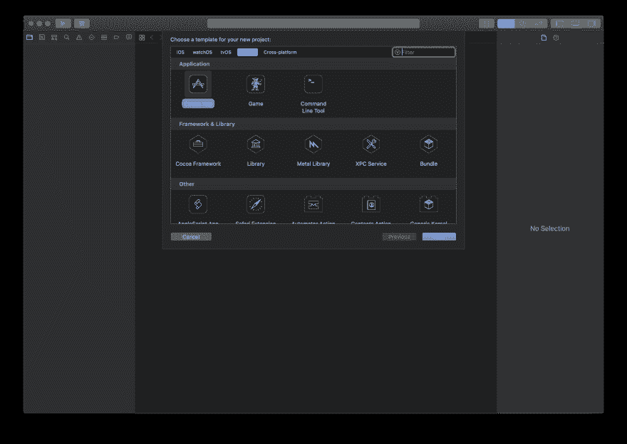](https://res.cloudinary.com/practicaldev/image/fetch/s--Uzo24cFq--/c_limit%2Cf_auto%2Cfl_progressive%2Cq_auto%2Cw_880/https://thepracticaldev.s3.amazonaws.com/i/f82lmoz8ul7y8x55kdg1.png)

随着应用程序的创建，我们需要创建首选项窗口。我们可以通过进入`Main.storyboard`，点击库按钮，搜索`Window View Controller`，然后在我们的主窗口旁边拖动一个新的`Window Controller`来完成。

[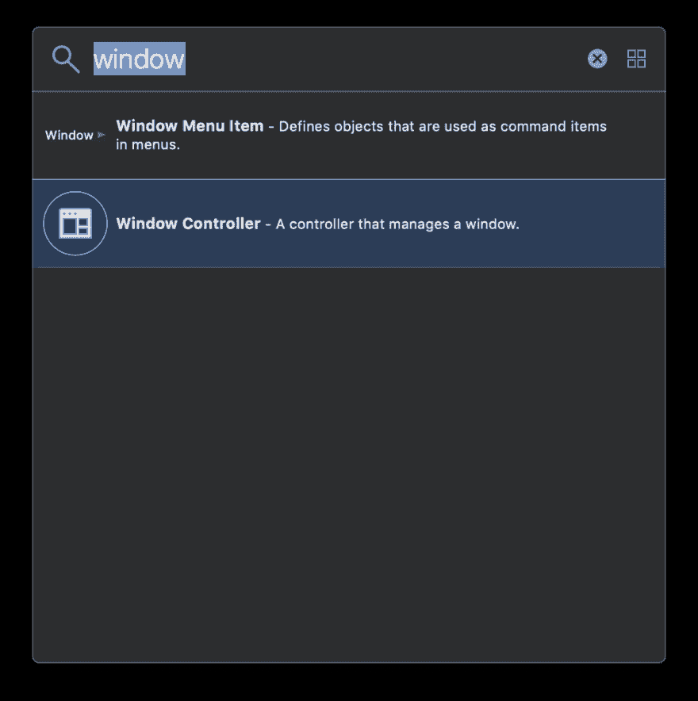](https://res.cloudinary.com/practicaldev/image/fetch/s--omA0Nl7w--/c_limit%2Cf_auto%2Cfl_progressive%2Cq_auto%2Cw_880/https://thepracticaldev.s3.amazonaws.com/i/kij3oliz00soiwu2bcdg.png)

[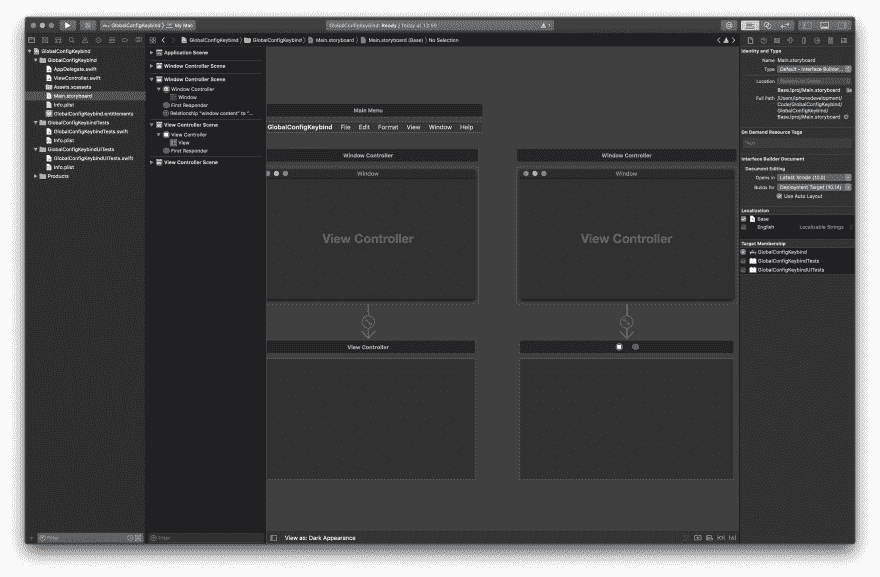](https://res.cloudinary.com/practicaldev/image/fetch/s--paIS2Get--/c_limit%2Cf_auto%2Cfl_progressive%2Cq_auto%2Cw_880/https://thepracticaldev.s3.amazonaws.com/i/79ern54qqe291p8c2k80.jpg)

## 将主应用程序窗口链接到偏好设置窗口

让我们在主视图控制器上创建一个按钮，并设置它，以便当它被按下时显示首选项窗口。

按下库按钮，搜索`Push Button`并将其拖动到主视图控制器中。

选择按钮并转到`Attributes inspector`。改标题说`Preferences`。

[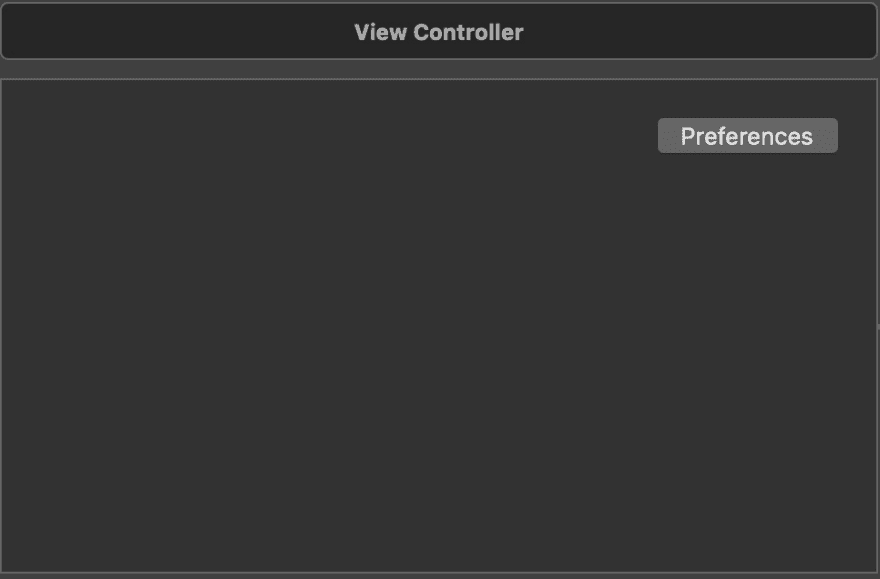](https://res.cloudinary.com/practicaldev/image/fetch/s--n_MRvEE0--/c_limit%2Cf_auto%2Cfl_progressive%2Cq_auto%2Cw_880/https://fullstackstanley.cimg/DraggedImage.65591179fdbe43dda79c621bd521ed39.jpg)

现在我们有了按钮，但我们需要让它做些什么。按住`ctrl`,同时点击并拖动按钮至新的首选项窗口。首选项窗口将高亮显示。松开鼠标，选择`Show`动作序列。

[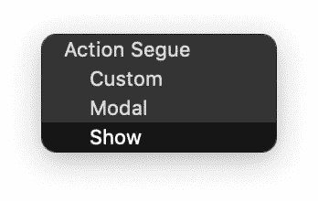](https://res.cloudinary.com/practicaldev/image/fetch/s--hhdcxwJr--/c_limit%2Cf_auto%2Cfl_progressive%2Cq_auto%2Cw_880/https://fullstackstanley.cimg/DraggedImage.7771b07949c24ea8853d23546efb7fd2.jpg)

现在，单击该按钮将打开首选项窗口。在我们测试它之前，让我们确保当按钮被按下不止一次时，它只打开一个窗口。点击窗口，在`Attributes inspector`中将`Presentation`更改为`Single`。

[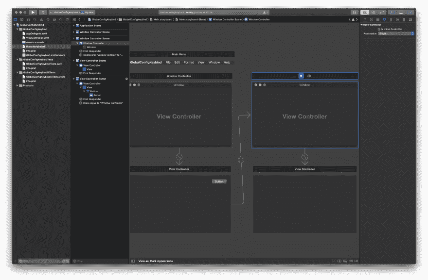](https://res.cloudinary.com/practicaldev/image/fetch/s--pJXuzV0P--/c_limit%2Cf_auto%2Cfl_progressive%2Cq_auto%2Cw_880/https://fullstackstanley.cimg/DraggedImage.8ef1b4607e5b44a281864509befff350.jpg)

此时，如果我们运行应用程序并按下 Preferences 按钮，新窗口将会出现。万岁！

[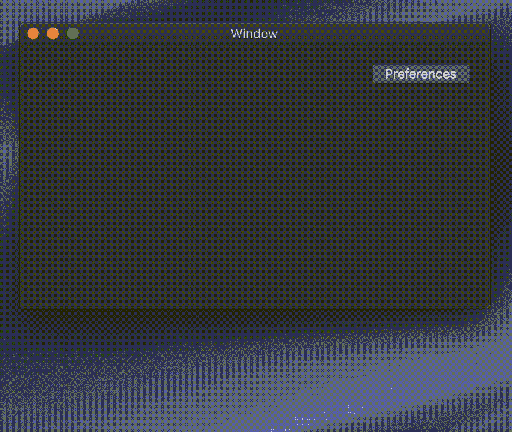](https://res.cloudinary.com/practicaldev/image/fetch/s--h4RpFwWR--/c_limit%2Cf_auto%2Cfl_progressive%2Cq_66%2Cw_880/https://fullstackstanley.cimg/Screen%2520Recording%25202019-04-07%2520at%252013.09.24.27cf15a6a98c4836b6f8cbcb7ff1efee.gif)

## 安装热键

[热键](https://github.com/soffes/HotKey)是一个 Swift 包，包裹了 Carbon API，用于处理全局热键。

我们将使用 Carthage 来安装它，但是如果您喜欢 SPM 或 CocoaPods，请随意使用。

首先，确保你已经安装了[迦太基](https://github.com/Carthage/Carthage)，如果需要的话，遵循他们的安装说明。然后在 Xcode 中，新建一个`Empty`文件，命名为`Cartfile`。确保它在项目的底部，如果你不小心把它保存在错误的地方，确保把它拖到有蓝色页面图标的`GlobalConfigKeybind`区域下面。

在该文件中添加以下内容并保存。

```
github "soffes/HotKey" 
```

[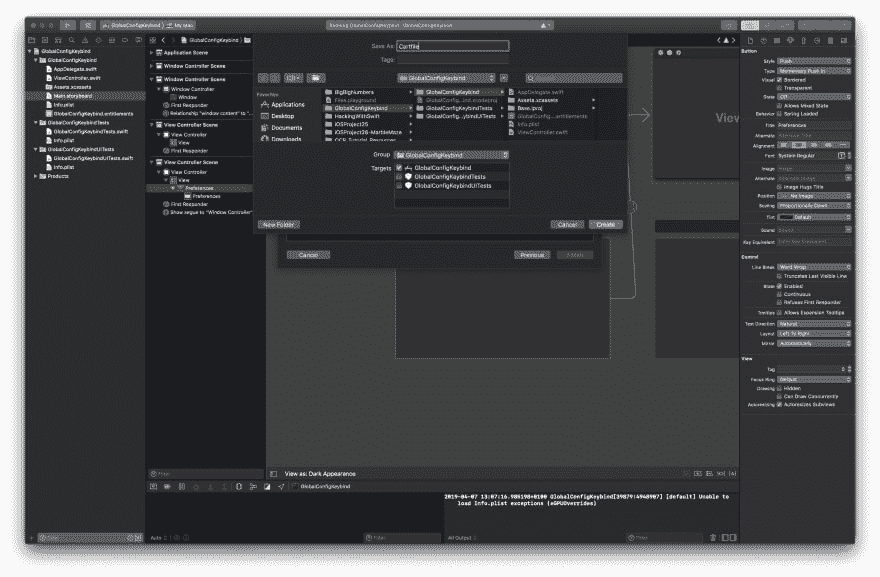](https://res.cloudinary.com/practicaldev/image/fetch/s--V2a4iJiU--/c_limit%2Cf_auto%2Cfl_progressive%2Cq_auto%2Cw_880/https://fullstackstanley.cimg/DraggedImage.87a77cb71fa4464097a239ee363776fc.jpg)

[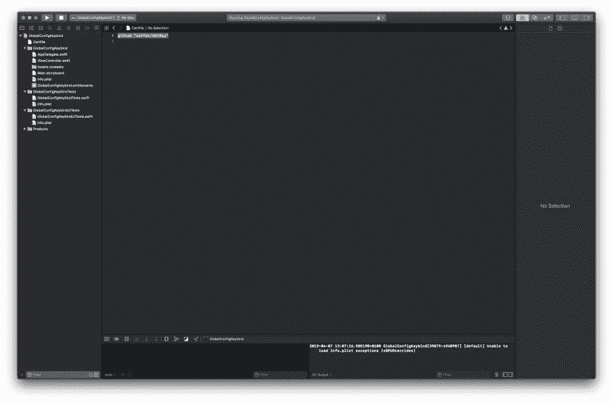](https://res.cloudinary.com/practicaldev/image/fetch/s--esA6gPL6--/c_limit%2Cf_auto%2Cfl_progressive%2Cq_auto%2Cw_880/https://fullstackstanley.cimg/DraggedImage.62dcdf64d69a4ea0b3c45dff11e381cc.jpg)

我们需要从终端安装热键。为此，请转到项目目录并运行`carthage update && carthage build --platform MacOS`。

回到 Xcode，将新的热键二进制链接到我们的应用程序。

点击带有蓝色页面图标的`GlobalConfigKeybind`，选择应用目标，点击`Embedded Binaries`下的`+`图标。点击`Add Other`并导航到您项目的根目录，然后进入`Carthage` > `Build` > `Mac` >高亮显示`HotKey.framework`并点击`Open`。

出现提示时，选择`Copy items if needed`。

[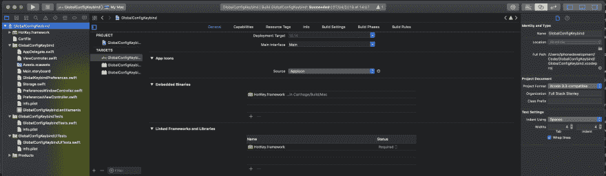](https://res.cloudinary.com/practicaldev/image/fetch/s--dnSvuEsg--/c_limit%2Cf_auto%2Cfl_progressive%2Cq_auto%2Cw_880/https://fullstackstanley.cimg/DraggedImage.b0cd7fa6e2ca464c82adaa6e4c5cfe56.jpg)

## 创建 Keybind 选项界面。

在`Main.storyboard`中，将两个`Push Button`拖到首选项窗口上。将第二个按钮命名为`Clear`，将`State`设置为禁用。对于第一个按钮，在属性检查器中将标题设定为“设定快捷方式”。

[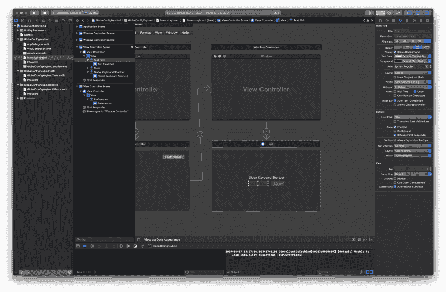](https://res.cloudinary.com/practicaldev/image/fetch/s--diBRwAu6--/c_limit%2Cf_auto%2Cfl_progressive%2Cq_auto%2Cw_880/https://fullstackstanley.cimg/DraggedImage.4bbf18458a2f40c689d4e3a5351d177b.jpg)

## 添加按键绑定配置功能

我们需要创建三个新的 Cocoa 类文件。确保 XIB 没有被创造出来。

*   `PreferencesViewController`需要是`NSViewController`的子类。
*   `PreferencesWindowController`需要是`NSWindowController`的子类。
*   `MainWindow`需要是`NSWindow`的子类。

一旦完成，在`Main.storyboard`中为每个设置类。一个用于*偏好窗口*，一个用于*偏好视图控制器*。
[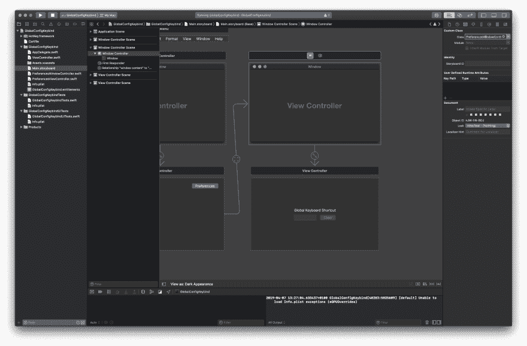T8】](https://res.cloudinary.com/practicaldev/image/fetch/s--IuqQCnod--/c_limit%2Cf_auto%2Cfl_progressive%2Cq_auto%2Cw_880/https://fullstackstanley.cimg/DraggedImage.0f531d5af593430cb5a953df10b102ed.jpg)

需要在第一个应用程序窗口上设置`MainWindow`。这将在稍后我们需要将窗口置于最前面时使用。请注意，在下面的截图中，`Window`被突出显示，而不是`Window Controller`。

[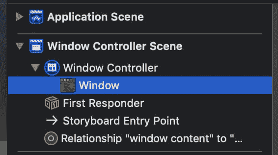](https://res.cloudinary.com/practicaldev/image/fetch/s--asZGZXmX--/c_limit%2Cf_auto%2Cfl_progressive%2Cq_auto%2Cw_880/https://fullstackstanley.cimg/DraggedImage.3196fb02ea1f4310a9fd142dc98d26d3.jpg)

在`PreferencesWindowController`中添加以下代码:

```
//
//  PreferencesWindowController.swift
//  GlobalConfigKeybind
//
//  Created by Mitch Stanley on 27/01/2019.
//

import Cocoa

class PreferencesWindowController: NSWindowController {

    override func windowDidLoad() {
        super.windowDidLoad()
    }

    override func keyDown(with event: NSEvent) {
        super.keyDown(with: event)
        if let vc = self.contentViewController as? PreferencesViewController {
            if vc.listening {
                vc.updateGlobalShortcut(event)
            }
        }
    }
} 
```

此窗口处于活动状态时，只要按下一个键，就会触发`keyDown:with`方法。我们只希望在配置按钮被按下时这样做，所以我们使用一个 if 语句来检查 Preferences 视图控制器中的`listening`状态(我们稍后将对此进行更详细的讨论)。

在`PreferencesViewController`中添加这段代码。

```
//
//  PreferencesWindowController.swift
//  GlobalConfigKeybind
//
//  Created by Mitch Stanley on 27/01/2019.
//

import Cocoa
import HotKey
import Carbon

class PreferencesViewController: NSViewController {

    @IBOutlet weak var clearButton: NSButton!
    @IBOutlet weak var shortcutButton: NSButton!

    // When this boolean is true we will allow the user to set a new keybind.
    // We'll also trigger the button to highlight blue so the user sees feedback and knows the button is now active.
    var listening = false {
        didSet {
            if listening {
                DispatchQueue.main.async { [weak self] in
                    self?.shortcutButton.highlight(true)
                }
            } else {
                DispatchQueue.main.async { [weak self] in
                    self?.shortcutButton.highlight(false)
                }
            }
        }
    }

    override func viewDidLoad() {
        super.viewDidLoad()

        // Check to see if the keybind has been stored previously
        // If it has then update the UI with the below methods.
        if Storage.fileExists("globalKeybind.json", in: .documents) {
            let globalKeybinds = Storage.retrieve("globalKeybind.json", from: .documents, as: GlobalKeybindPreferences.self)
            updateKeybindButton(globalKeybinds)
            updateClearButton(globalKeybinds)
        }

    }

    // When a shortcut has been pressed by the user, turn off listening so the window stops listening for keybinds
    // Put the shortcut into a JSON friendly struct and save it to storage
    // Update the shortcut button to show the new keybind
    // Make the clear button enabled to users can remove the shortcut
    // Finally, tell AppDelegate to start listening for the new keybind
    func updateGlobalShortcut(_ event : NSEvent) {
        self.listening = false

        if let characters = event.charactersIgnoringModifiers {
            let newGlobalKeybind = GlobalKeybindPreferences.init(
                function: event.modifierFlags.contains(.function),
                control: event.modifierFlags.contains(.control),
                command: event.modifierFlags.contains(.command),
                shift: event.modifierFlags.contains(.shift),
                option: event.modifierFlags.contains(.option),
                capsLock: event.modifierFlags.contains(.capsLock),
                carbonFlags: event.modifierFlags.carbonFlags,
                characters: characters,
                keyCode: UInt32(event.keyCode)
            )

            Storage.store(newGlobalKeybind, to: .documents, as: "globalKeybind.json")
            updateKeybindButton(newGlobalKeybind)
            clearButton.isEnabled = true
            let appDelegate = NSApplication.shared.delegate as! AppDelegate
            appDelegate.hotKey = HotKey(keyCombo: KeyCombo(carbonKeyCode: UInt32(event.keyCode), carbonModifiers: event.modifierFlags.carbonFlags))
        }

    }

    // When the set shortcut button is pressed start listening for the new shortcut
    @IBAction func register(_ sender: Any) {
        unregister(nil)
        listening = true
        view.window?.makeFirstResponder(nil)
    }

    // If the shortcut is cleared, clear the UI and tell AppDelegate to stop listening to the previous keybind.
    @IBAction func unregister(_ sender: Any?) {
        let appDelegate = NSApplication.shared.delegate as! AppDelegate
        appDelegate.hotKey = nil
        shortcutButton.title = ""

        Storage.remove("globalKeybind.json", from: .documents)
    }

    // If a keybind is set, allow users to clear it by enabling the clear button.
    func updateClearButton(_ globalKeybindPreference : GlobalKeybindPreferences?) {
        if globalKeybindPreference != nil {
            clearButton.isEnabled = true
        } else {
            clearButton.isEnabled = false
        }
    }

    // Set the shortcut button to show the keys to press
    func updateKeybindButton(_ globalKeybindPreference : GlobalKeybindPreferences) {
        shortcutButton.title = globalKeybindPreference.description
    }

} 
```

这里需要连接两个属性和两个方法。

*   `register:sender`需要用快捷按钮连接。
*   `unregister:sender`需要连接到清除快捷按钮。
*   `clearButton`属性需要连接到清除快捷按钮。
*   `shortcutButton`需要连接到快捷按钮。

这是一个很长的文件，但是每个方法都有注释。总的来说，它让一个按钮监听并更新应用程序快捷方式，另一个按钮将清除该快捷方式。

创建一个新文件，`GlobalKeybindPreferences.swift`。这将是一个保存快捷方式状态的结构。这包括按下的修饰键和按键。它还有一个名为`description`的方便的计算属性，在`PreferencesViewController`中使用该属性将快捷按钮文本设置为类似于`⌃⌘K`。

```
//
//  GlobalKeybindPreferences.swift
//  GlobalConfigKeybind
//
//  Created by Mitch Stanley on 07/04/2019.
//
struct GlobalKeybindPreferences: Codable, CustomStringConvertible {
    let function : Bool
    let control : Bool
    let command : Bool
    let shift : Bool
    let option : Bool
    let capsLock : Bool
    let carbonFlags : UInt32
    let characters : String?
    let keyCode : UInt32

    var description: String {
        var stringBuilder = ""
        if self.function {
            stringBuilder += "Fn"
        }
        if self.control {
            stringBuilder += "⌃"
        }
        if self.option {
            stringBuilder += "⌥"
        }
        if self.command {
            stringBuilder += "⌘"
        }
        if self.shift {
            stringBuilder += "⇧"
        }
        if self.capsLock {
            stringBuilder += "⇪"
        }
        if let characters = self.characters {
            stringBuilder += characters.uppercased()
        }
        return "\(stringBuilder)"
    }
} 
```

在`AppDelegate.swift`中，我们需要监听快捷方式是否存在，并将`MainWindow`拉到前面。

我们可以在`applicationDidFinishLaunching:aNotification`中看到，我们检查 globalKeybind.json 文件是否存在，如果存在，将`HotKey`设置为我们已经存储的内容。

计算的属性`hotKey`检查热键是否不为零，然后添加一个`keyDownHandler`。在这个闭包里，我们遍历所有打开的窗口(有可能首选项窗口也是打开的，否则我们可以使用`first`)。当`MainWindow`被找到时，我们用`makeKeyAndOrderFront`和`makeKey`把它带到前面。

```
//
//  AppDelegate.swift
//  GlobalConfigKeybind
//
//  Created by Mitch Stanley on 07/04/2019.
//

import Cocoa
import HotKey
import Carbon

@NSApplicationMain
class AppDelegate: NSObject, NSApplicationDelegate {

    func applicationDidFinishLaunching(_ aNotification: Notification) {
        // Insert code here to initialize your application
        if Storage.fileExists("globalKeybind.json", in: .documents) {

            let globalKeybinds = Storage.retrieve("globalKeybind.json", from: .documents, as: GlobalKeybindPreferences.self)
            hotKey = HotKey(keyCombo: KeyCombo(carbonKeyCode: globalKeybinds.keyCode, carbonModifiers: globalKeybinds.carbonFlags))
        }
    }

    func applicationWillTerminate(_ aNotification: Notification) {
        // Insert code here to tear down your application
    }

    public var hotKey: HotKey? {
        didSet {
            guard let hotKey = hotKey else {
                return
            }

            hotKey.keyDownHandler = { [weak self] in
                NSApplication.shared.orderedWindows.forEach({ (window) in
                    if let mainWindow = window as? MainWindow {
                        print("woo")
                        NSApplication.shared.activate(ignoringOtherApps: true)
                        mainWindow.makeKeyAndOrderFront(self)
                        mainWindow.makeKey()
                    }
                })

            }
        }
    }
} 
```

最后，拼图的最后一块，创建一个名为`Storage.swift`的新文件。我们将使用 Saoud M. Rizwan 创建的这个令人敬畏的类，可以在这里找到更多细节[。这个类使得使用本地 JSON 存储变得非常简单，我鼓励你阅读这篇博文来理解它是如何工作的。](https://medium.com/@sdrzn/swift-4-codable-lets-make-things-even-easier-c793b6cf29e1)

```
import Foundation

public class Storage {

    fileprivate init() { }

    enum Directory {
        // Only documents and other data that is user-generated, or that cannot otherwise be recreated by your application, should be stored in the <Application_Home>/Documents directory and will be automatically backed up by iCloud.
        case documents

        // Data that can be downloaded again or regenerated should be stored in the <Application_Home>/Library/Caches directory. Examples of files you should put in the Caches directory include database cache files and downloadable content, such as that used by magazine, newspaper, and map applications.
        case caches
    }

    /// Returns URL constructed from specified directory
    static fileprivate func getURL(for directory: Directory) -> URL {
        var searchPathDirectory: FileManager.SearchPathDirectory

        switch directory {
        case .documents:
            searchPathDirectory = .documentDirectory
        case .caches:
            searchPathDirectory = .cachesDirectory
        }

        if let url = FileManager.default.urls(for: searchPathDirectory, in: .userDomainMask).first {
            return url
        } else {
            fatalError("Could not create URL for specified directory!")
        }
    }

    /// Store an encodable struct to the specified directory on disk
    ///
    /// - Parameters:
    ///   - object: the encodable struct to store
    ///   - directory: where to store the struct
    ///   - fileName: what to name the file where the struct data will be stored
    static func store<T: Encodable>(_ object: T, to directory: Directory, as fileName: String) {
        let url = getURL(for: directory).appendingPathComponent(fileName, isDirectory: false)

        let encoder = JSONEncoder()
        do {
            let data = try encoder.encode(object)
            if FileManager.default.fileExists(atPath: url.path) {
                try FileManager.default.removeItem(at: url)
            }
            FileManager.default.createFile(atPath: url.path, contents: data, attributes: nil)
        } catch {
            fatalError(error.localizedDescription)
        }
    }

    /// Retrieve and convert a struct from a file on disk
    ///
    /// - Parameters:
    ///   - fileName: name of the file where struct data is stored
    ///   - directory: directory where struct data is stored
    ///   - type: struct type (i.e. Message.self)
    /// - Returns: decoded struct model(s) of data
    static func retrieve<T: Decodable>(_ fileName: String, from directory: Directory, as type: T.Type) -> T {
        let url = getURL(for: directory).appendingPathComponent(fileName, isDirectory: false)

        if !FileManager.default.fileExists(atPath: url.path) {
            fatalError("File at path \(url.path) does not exist!")
        }

        if let data = FileManager.default.contents(atPath: url.path) {
            let decoder = JSONDecoder()
            do {
                let model = try decoder.decode(type, from: data)
                return model
            } catch {
                fatalError(error.localizedDescription)
            }
        } else {
            fatalError("No data at \(url.path)!")
        }
    }

    /// Remove all files at specified directory
    static func clear(_ directory: Directory) {
        let url = getURL(for: directory)
        do {
            let contents = try FileManager.default.contentsOfDirectory(at: url, includingPropertiesForKeys: nil, options: [])
            for fileUrl in contents {
                try FileManager.default.removeItem(at: fileUrl)
            }
        } catch {
            fatalError(error.localizedDescription)
        }
    }

    /// Remove specified file from specified directory
    static func remove(_ fileName: String, from directory: Directory) {
        let url = getURL(for: directory).appendingPathComponent(fileName, isDirectory: false)
        if FileManager.default.fileExists(atPath: url.path) {
            do {
                try FileManager.default.removeItem(at: url)
            } catch {
                fatalError(error.localizedDescription)
            }
        }
    }

    /// Returns BOOL indicating whether file exists at specified directory with specified file name
    static func fileExists(_ fileName: String, in directory: Directory) -> Bool {
        let url = getURL(for: directory).appendingPathComponent(fileName, isDirectory: false)
        return FileManager.default.fileExists(atPath: url.path)
    }
} 
```

仅此而已。尝试运行应用程序，调出首选项，设置快捷方式，将其他一些应用程序放在前面，然后按快捷方式进行测试。不仅如此，如果你关闭主窗口，然后按下键绑定应用程序应该重新打开。

有一些事情可以改进，比如检查快捷方式是否有效或者是否已经被系统使用，但这是另一天的任务。