# React Hooks 备忘单:解锁常见问题的解决方案

> 原文：<https://dev.to/bnevilleoneill/react-hooks-cheat-sheet-unlock-solutions-to-common-problems-56ci>

[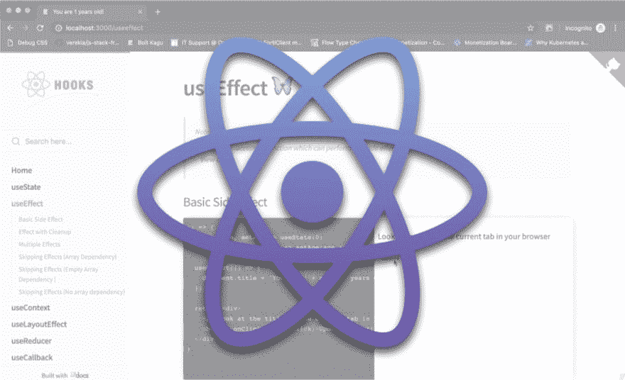](https://res.cloudinary.com/practicaldev/image/fetch/s--foiD78Gn--/c_limit%2Cf_auto%2Cfl_progressive%2Cq_auto%2Cw_880/https://cdn-images-1.medium.com/max/1024/1%2AbJ9worNcj8ST9CQ4RVE_0Q.png)

虽然 Hooks 可能已经成为社区的话题有一段时间了，但除了大惊小怪之外，它们确实有一个非常简单的 API。

这篇文章将突出例子和用例，从简单到高级。我还构建了一个伴随 web 应用程序 的 [**，用于**](https://github.com/ohansemmanuel/react-hooks-cheatsheet)**[与本文示例的实时交互](https://react-hooks-cheatsheet.com/)。**

请注意，这篇文章包括了大量的代码片段，并假设一些钩子流畅。如果你完全不熟悉钩子，你可能想从这里开始。

让我们开始吧。

### 使用状态

useState 允许您在函数组件中使用本地状态。你可以[在这里查看它的文档](https://reactjs.org/docs/hooks-reference.html#usestate)和[在这里查看一个实时的、可编辑的备忘单](https://react-hooks-cheatsheet.com/usestate)。

#### **声明状态变量**

声明一个状态变量就像用某个初始状态值调用 useState 一样简单。

```
useState(initialStateValue) 
```

```
const DeclareStateVar = () => {
  const [count] = useState(100)
  return <div> State variable is {count}</div>
} 
```

*使用状态钩子的简单用法。*

[](https://logrocket.com/signup/)

#### **更新状态变量**

更新状态变量就像调用 useState 调用返回的 updater 函数一样简单。

`const [stateValue, updaterFn] = useState (initialStateValue);`

[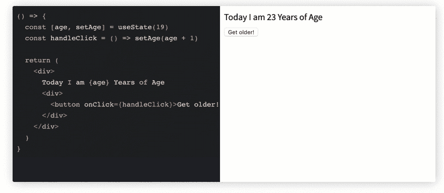](https://res.cloudinary.com/practicaldev/image/fetch/s--pSeShKKz--/c_limit%2Cf_auto%2Cfl_progressive%2Cq_66%2Cw_880/https://cdn-images-1.medium.com/max/882/1%2AxKBiQT_91AU-PlNLGjv0Yg.gif) 

<figcaption>注意年龄状态变量是如何更新的。</figcaption>

```
const UpdateStateVar = () => {
  const [age, setAge] = useState(19)
  const handleClick = () => setAge(age + 1)

  return (
    <div>
      Today I am {age} Years of Age
      <div>
        <button onClick={handleClick}>Get older! </button>
      </div>
    </div>
  )
} 
```

下面是负责上面截屏的代码。

#### **多个状态变量**

可以在一个功能组件中使用和更新多个状态变量，如下所示:

[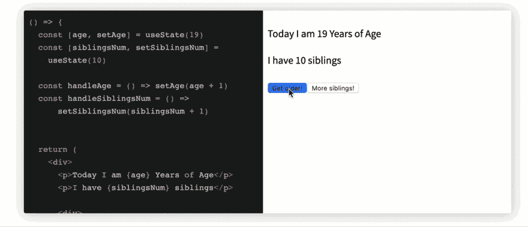](https://res.cloudinary.com/practicaldev/image/fetch/s--njRB983d--/c_limit%2Cf_auto%2Cfl_progressive%2Cq_66%2Cw_880/https://cdn-images-1.medium.com/max/1024/1%2A1MFDgE1LQuAc1_wyBgyVNQ.gif)T3】

```
const MultipleStateVars = () => {
  const [age, setAge] = useState(19)
  const [siblingsNum, setSiblingsNum] = 
    useState(10)

  const handleAge = () => setAge(age + 1)
  const handleSiblingsNum = () => 
      setSiblingsNum(siblingsNum + 1)

  return (
    <div>
      <p>Today I am {age} Years of Age</p>
      <p>I have {siblingsNum} siblings</p>

      <div>
        <button onClick={handleAge}>
          Get older! 
        </button>
        <button onClick={handleSiblingsNum}>
            More siblings! 
        </button>
      </div>
    </div>
  )
} 
```

下面是负责上面截屏的代码。

#### **使用对象状态变量**

与字符串和数字不同，您还可以使用对象作为传递给 useState 的初始值。

注意，您必须将整个对象传递给 useState updater 函数，因为对象是被替换的，而不是被合并的。

```
// 🐢 setState (object merge) vs useState (object replace)
// assume initial state is {name: "Ohans"}

setState({ age: 'unknown' })
// new state object will be
// {name: "Ohans", age: "unknown"}

useStateUpdater({ age: 'unknown' })
// new state object will be
// {age: "unknown"} - initial object is replaced 
```

*setState vs. useState updater 函数。*

[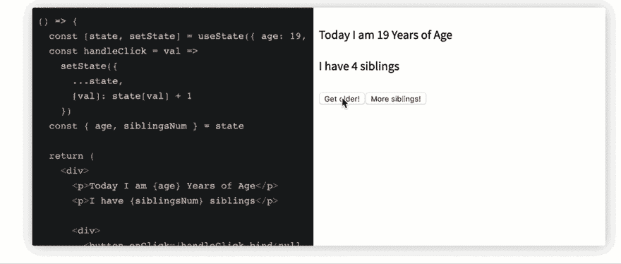](https://res.cloudinary.com/practicaldev/image/fetch/s--EC_LahGq--/c_limit%2Cf_auto%2Cfl_progressive%2Cq_66%2Cw_880/https://cdn-images-1.medium.com/max/1024/1%2AwYJuoTiiarplOkwoG36I2A.gif) 

<figcaption>多个状态对象通过一个状态对象变量进行更新。</figcaption>

```
const StateObject = () => {
  const [state, setState] = useState({ age: 19, siblingsNum: 4 })
  const handleClick = val =>
    setState({
      ...state,
      [val]: state[val] + 1
    })
  const { age, siblingsNum } = state

  return (
    <div>
      <p>Today I am {age} Years of Age</p>
      <p>I have {siblingsNum} siblings</p>

      <div>
        <button onClick={handleClick.bind(null, 'age')}>Get older!</button>
        <button onClick={handleClick.bind(null, 'siblingsNum')}>
          More siblings!
        </button>
      </div>
    </div>
  )
} 
```

这是上面截屏的代码。

#### **从功能**初始化状态

与只传递初始状态值相反，状态也可以从函数中初始化，如下所示:

```
const StateFromFn = () => {
  const [token] = useState(() => {
    let token = window.localStorage.getItem("my-token");
    return token || "default#-token#"
  })

  return <div>Token is {token}</div>
} 
```

#### **功能设置状态**

从调用 useState 返回的 updater 函数也可以采用类似于 good ol' setState:
的函数

```
const [value, updateValue] = useState(0)
// both forms of invoking "updateValue" below are valid 👇
updateValue(1);
updateValue(previousValue => previousValue + 1); 
```

当状态更新依赖于某个先前的状态值时，这是理想的。

[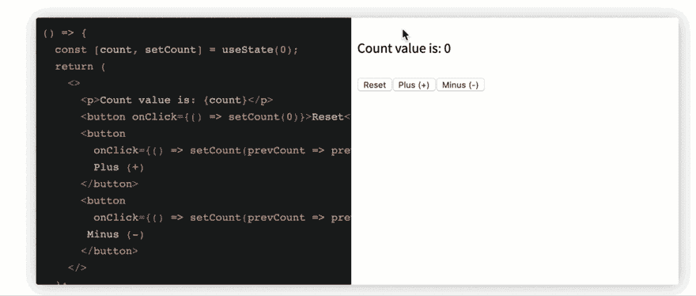](https://res.cloudinary.com/practicaldev/image/fetch/s--guGWR5qE--/c_limit%2Cf_auto%2Cfl_progressive%2Cq_66%2Cw_880/https://cdn-images-1.medium.com/max/1024/1%2AuAEGQN-IESENc82FnkJUfA.gif) 

<figcaption>一个具有 setState 更新功能的计数器。</figcaption>

```
const CounterFnSetState = () => {
  const [count, setCount] = useState(0);
  return (
    <>
      <p>Count value is: {count}</p>
      <button onClick={() => setCount(0)}>Reset</button>
      <button 
        onClick={() => setCount(prevCount => prevCount + 1)}>
        Plus (+)
      </button>
      <button 
        onClick={() => setCount(prevCount => prevCount - 1)}>
       Minus (-)
      </button>
    </>
  );
} 
```

这是上面截屏的代码。

### 使用效果

useEffect 接受一个函数，它可以执行任何副作用。[在这里查看文档](https://reactjs.org/docs/hooks-reference.html#useeffect)，查看[实时可编辑备忘单](https://react-hooks-cheatsheet.com/useeffect)。

#### **基本副作用**

[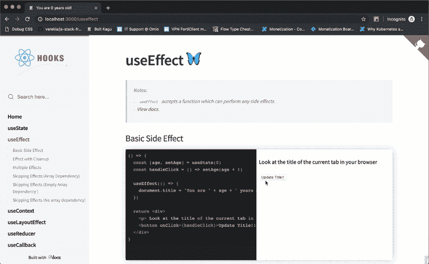](https://res.cloudinary.com/practicaldev/image/fetch/s--mkDQWOQI--/c_limit%2Cf_auto%2Cfl_progressive%2Cq_66%2Cw_880/https://cdn-images-1.medium.com/max/1024/1%2ARdkmsjpFV1_KRxtk1pRFlw.gif) 

<figcaption>观看文档更新的标题。</figcaption>

```
const BasicEffect = () => {
  const [age, setAge] = useState(0)
  const handleClick = () => setAge(age + 1)

  useEffect(() => {
    document.title = 'You are ' + age + ' years old!'
  })

  return <div>
    <p> Look at the title of the current tab in your browser </p>
    <button onClick={handleClick}>Update Title!! </button>
  </div>
} 
```

下面是负责上面截屏的代码。

#### **效果与清理**

一段时间后清理效果是很常见的。这可以通过从传递给 useEffect 的效果函数中返回一个函数来实现。下面是一个使用 addEventListener 的示例。

```
const EffectCleanup = () => {
  useEffect(() => {
    const clicked = () => console.log('window clicked')
    window.addEventListener('click', clicked)

    // return a clean-up function
    return () => {
      window.removeEventListener('click', clicked)
    }
  }, [])

  return <div>
    When you click the window you'll 
    find a message logged to the console
  </div>
} 
```

#### **多重效果**

一个功能组件内可以发生多次 useEffect 调用，如下:

```
const MultipleEffects = () => {
  // 🍟
  useEffect(() => {
    const clicked = () => console.log('window clicked')
    window.addEventListener('click', clicked)

    return () => {
      window.removeEventListener('click', clicked)
    }
  }, [])

  // 🍟 another useEffect hook 
  useEffect(() => {
    console.log("another useEffect call");
  })

  return <div>
    Check your console logs
  </div>
} 
```

请注意，可以跳过 useEffect 调用，即不在每次渲染时调用。这是通过向效果函数传递第二个数组参数来实现的。

#### **跳过效果(数组依赖)**

```
const ArrayDep = () => {
  const [randomNumber, setRandomNumber] = useState(0)
  const [effectLogs, setEffectLogs] = useState([])

  useEffect(
    () => {
      setEffectLogs(prevEffectLogs => [...prevEffectLogs, 'effect fn has been invoked'])
    },
    [randomNumber]
  )

  return (
    <div>
      <h1>{randomNumber}</h1>
      <button
        onClick={() => {
          setRandomNumber(Math.random())
        }}
      >
        Generate random number!
      </button>
      <div>
        {effectLogs.map((effect, index) => (
          <div key={index}>{'🍔'.repeat(index) + effect}</div>
        ))}
      </div>
    </div>
  )
} 
```

在上面的例子中，向 useEffect 传递了一个值为:[randomNumber]的数组。

因此，每当生成新的随机数时，将在 mount *和*上调用效果函数。

下面是被点击的“生成随机数”按钮和在生成新的随机数时重新运行的效果函数:

[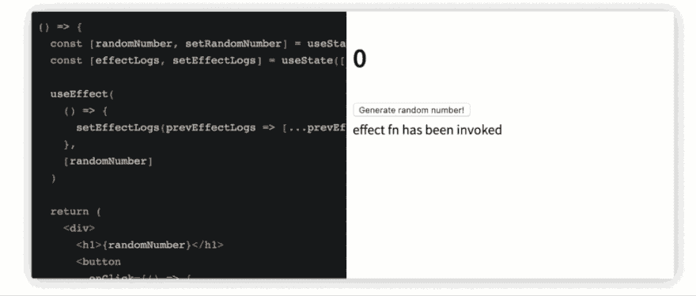](https://res.cloudinary.com/practicaldev/image/fetch/s--o8JHLUl7--/c_limit%2Cf_auto%2Cfl_progressive%2Cq_66%2Cw_880/https://cdn-images-1.medium.com/max/1024/1%2AmSqiFgHeY6k84us2RBnLkg.gif)

#### **【跳过效果(空数组依赖)**

在此示例中，向 useEffect 传递了一个空数组[]。因此，效果函数将只在挂载时被调用。

```
const ArrayDepMount = () => {
  const [randomNumber, setRandomNumber] = useState(0)
  const [effectLogs, setEffectLogs] = useState([])

  useEffect(
    () => {
      setEffectLogs(prevEffectLogs => [...prevEffectLogs, 'effect fn has been invoked'])
    },
    []
  )

  return (
    <div>
      <h1>{randomNumber}</h1>
      <button
        onClick={() => {
          setRandomNumber(Math.random())
        }}
      >
        Generate random number!
      </button>
      <div>
        {effectLogs.map((effect, index) => (
          <div key={index}>{'🍔'.repeat(index) + effect}</div>
        ))}
      </div>
    </div>
  )
} 
```

下面是被点击的按钮和未调用的效果功能:

[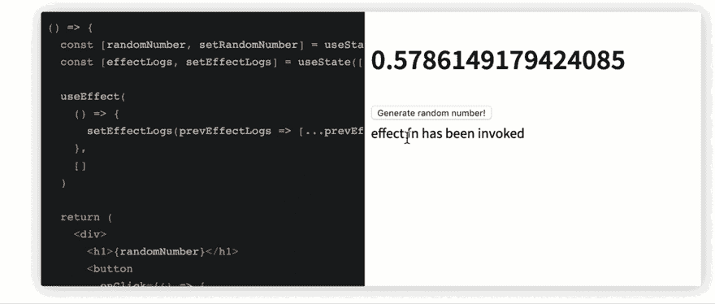](https://res.cloudinary.com/practicaldev/image/fetch/s--FXQEIIIX--/c_limit%2Cf_auto%2Cfl_progressive%2Cq_66%2Cw_880/https://cdn-images-1.medium.com/max/1024/1%2AVVxa13t8u8oobG_1GIM1Qw.gif)

#### **跳过效果(无数组依赖)**

如果没有数组依赖，效果函数将在每次渲染后运行。

```
useEffect(() => {
console.log(“This will be logged after every render!”)
}) 
```

### **使用语境**

useContext 为您节省了依赖上下文消费者的压力。与 MyContext 相比，它有一个更简单的 API。消费者和它公开的渲染道具 API。[在这里查看文档](https://reactjs.org/docs/hooks-reference.html#usecontext)，[查看实时可编辑的备忘单](https://react-hooks-cheatsheet.com/usecontext)。

以下示例强调了通过 usecontext 或 Context 使用上下文对象值之间的区别。消费者:

```
// example Context object
const ThemeContext = React.createContext("dark");

// usage with context Consumer
function Button() {
  return <ThemeContext.Consumer>
        {theme => <button className={theme}> Amazing button </button>}
  </ThemeContext.Consumer>
}

// usage with useContext hook 
import {useContext} from 'react';

function ButtonHooks() {
 const theme = useContext(ThemeContext)
 return <button className={theme}>Amazing button</button>
} 
```

这里有一个使用 useContext 的实例:

[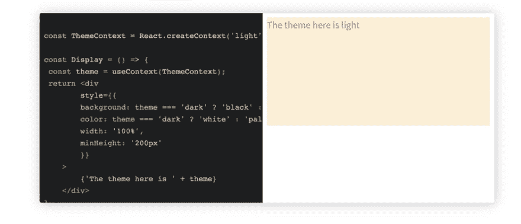](https://res.cloudinary.com/practicaldev/image/fetch/s--a1eLJ7Fn--/c_limit%2Cf_auto%2Cfl_progressive%2Cq_auto%2Cw_880/https://cdn-images-1.medium.com/max/962/1%2AsJEVsJmB2vHc8vqqP4nAJA.png)T3】

```
const ThemeContext = React.createContext('light');

const Display = () => {
 const theme = useContext(ThemeContext);
 return <div
        style={{
        background: theme === 'dark' ? 'black' : 'papayawhip',
        color: theme === 'dark' ? 'white' : 'palevioletred',
        width: '100%',
        minHeight: '200px'
        }}
    >
        {'The theme here is ' + theme}
    </div>
} 
```

下面是上面例子的代码。

### useLayoutEffect

useLayoutEffect 与 useEffect 具有完全相同的签名。我们将在下面讨论 useLayoutEffect 和 useEffect 的区别。同样，[查看文档](https://reactjs.org/docs/hooks-reference.html#uselayouteffect)和[可编辑的实时备忘单](https://react-hooks-cheatsheet.com/uselayoutEffect)。

```
useLayoutEffect(() => {
//do something
}, [arrayDependency]) 
```

#### **类似用法如 useEffect**

下面是用 useLayoutEffect 构建的 useEffect 的相同示例:

[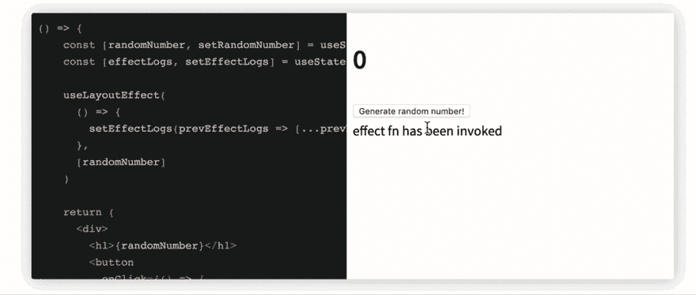](https://res.cloudinary.com/practicaldev/image/fetch/s--48uVo8XR--/c_limit%2Cf_auto%2Cfl_progressive%2Cq_66%2Cw_880/https://cdn-images-1.medium.com/max/1024/1%2Aa7MsYcXko93rq_9KtjiXpg.gif)T3】

```
const ArrayDep = () => {
    const [randomNumber, setRandomNumber] = useState(0)
    const [effectLogs, setEffectLogs] = useState([])

    useLayoutEffect(
      () => {
        setEffectLogs(prevEffectLogs => [...prevEffectLogs, 'effect fn has been invoked'])
      },
      [randomNumber]
    )

    return (
      <div>
        <h1>{randomNumber}</h1>
        <button
          onClick={() => {
            setRandomNumber(Math.random())
          }}
        >
          Generate random number!
        </button>
        <div>
          {effectLogs.map((effect, index) => (
            <div key={index}>{'🍔'.repeat(index) + effect}</div>
          ))}
        </div>
      </div>
    )
  } 
```

下面是负责上面截屏的代码。

#### **useLayoutEffect vs . use effect**

传递给 useEffect 的函数在布局和绘制后触发，即在渲染提交到屏幕后。对于大多数不应该阻止浏览器更新屏幕的副作用来说，这是可以的。

但是，在有些情况下，您可能不想要 useEffect 提供的行为；例如，如果你需要对 DOM 做一个视觉上的改变作为副作用，useEffect 就不是最好的选择。

为了防止用户看到变化的闪烁，可以使用 useLayoutEffect。传递给 useLayoutEffect 的函数将在浏览器更新屏幕之前运行。

### 用户

useReducer 可以用作 useState 的替代。它非常适合复杂的状态逻辑，其中依赖于以前的状态值或许多状态子值。

根据您的用例，您可能会发现 useReducer 非常容易测试。查看[文档](https://reactjs.org/docs/hooks-reference.html#usereducer)和[实时可编辑备忘单](https://react-hooks-cheatsheet.com/usereducer)。

#### **基本用法**

与调用 useState 相反，使用 Reducer 和 initialState 调用 useReducer，如下所示。useReducer 调用返回状态属性和调度函数。

[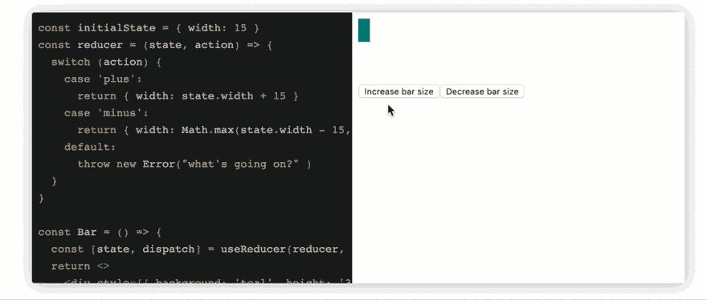](https://res.cloudinary.com/practicaldev/image/fetch/s--SJGomZ4r--/c_limit%2Cf_auto%2Cfl_progressive%2Cq_66%2Cw_880/https://cdn-images-1.medium.com/max/1024/1%2ABSkGtn-NIHGDIwd67NZoYQ.gif) 

<figcaption>通过用户管理状态来增加/减少条形大小</figcaption>

```
const initialState = { width: 15 };

const reducer = (state, action) => {
  switch (action) {
    case 'plus':
      return { width: state.width + 15 }
    case 'minus':
      return { width: Math.max(state.width - 15, 2) }
    default:
      throw new Error("what's going on?" )
  }
}

const Bar = () => {
  const [state, dispatch] = useReducer(reducer, initialState)
  return <>
    <div style={{ background: 'teal', height: '30px', width: state.width }}></div>
    <div style={{marginTop: '3rem'}}>
        <button onClick={() => dispatch('plus')}>Increase bar size</button>
        <button onClick={() => dispatch('minus')}>Decrease bar size</button>
    </div>
    </>
}

ReactDOM.render(<Bar />) 
```

下面是负责上面截屏的代码。

#### **初始化状态**

useReducer 接受第三个函数参数。你可以从这个函数初始化 state，从这个函数返回的任何东西都作为 state 对象返回。将使用 initialState(第二个参数)调用该函数。

[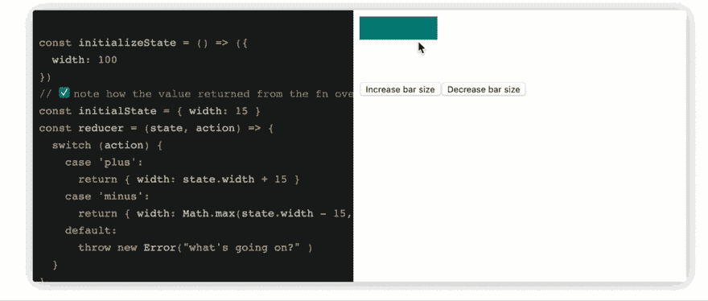](https://res.cloudinary.com/practicaldev/image/fetch/s--R0aS9_jX--/c_limit%2Cf_auto%2Cfl_progressive%2Cq_66%2Cw_880/https://cdn-images-1.medium.com/max/1024/1%2Aa39ldAuvYbSZ8Ney_sXaYg.gif) 

<figcaption>同样增加/减少条形大小——状态初始化迟缓。</figcaption>

```
const initializeState = () => ({
  width: 100
})

// ✅ note how the value returned from the fn above overrides initialState below: 
const initialState = { width: 15 }
const reducer = (state, action) => {
  switch (action) {
    case 'plus':
      return { width: state.width + 15 }
    case 'minus':
      return { width: Math.max(state.width - 15, 2) }
    default:
      throw new Error("what's going on?" )
  }
}

const Bar = () => {
  const [state, dispatch] = useReducer(reducer, initialState, initializeState)
  return <>
    <div style={{ background: 'teal', height: '30px', width: state.width }}></div>
    <div style={{marginTop: '3rem'}}>
        <button onClick={() => dispatch('plus')}>Increase bar size</button>
        <button onClick={() => dispatch('minus')}>Decrease bar size</button>
    </div>
    </>
}

ReactDOM.render(Bar) 
```

下面是负责上面截屏的代码。

#### **模仿 this.setState 的行为**

useReducer 使用的缩减器没有 Redux 的严格。例如，传递给 reducer 的第二个参数 action 不需要有 type 属性。

这允许进行有趣的操作，比如重命名第二个参数并执行以下操作:

```
const initialState = { width: 15 }; 

const reducer = (state, newState) => ({
  ...state,
  width: newState.width
})

const Bar = () => {
  const [state, setState] = useReducer(reducer, initialState)
  return <>
    <div style={{ background: 'teal', height: '30px', width: state.width }}></div>
    <div style={{marginTop: '3rem'}}>
        <button onClick={() => setState({width: 100})}>Increase bar size</button>
        <button onClick={() => setState({width: 3})}>Decrease bar size</button>
    </div>
    </>
}

ReactDOM.render(Bar) 
```

[](https://res.cloudinary.com/practicaldev/image/fetch/s--dmZomQsH--/c_limit%2Cf_auto%2Cfl_progressive%2Cq_66%2Cw_880/https://cdn-images-1.medium.com/max/1024/1%2AWbbJWr-_PGYXndcFEZVQUw.gif) 

<figcaption>使用类似 api 模仿的 setState，结果保持不变。</figcaption>

### 使用回调

useCallback 返回一个[内存化的](https://en.wikipedia.org/wiki/Memoization)回调。查看[文档](https://reactjs.org/docs/hooks-reference.html#usecallback)，点击查看[实时可编辑备忘单。](https://react-hooks-cheatsheet.com/usecallback)

#### **首发示例**

下面的例子将构成后面的解释和代码片段的基础。

[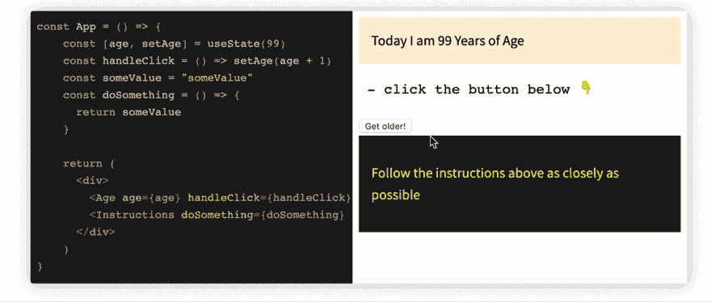](https://res.cloudinary.com/practicaldev/image/fetch/s--wgr2SgN5--/c_limit%2Cf_auto%2Cfl_progressive%2Cq_66%2Cw_880/https://cdn-images-1.medium.com/max/1024/1%2AIy316AxOQNNXEcMHKeGw7w.gif)T3】

```
const App = () => {
    const [age, setAge] = useState(99)
    const handleClick = () => setAge(age + 1)
    const someValue = "someValue"
    const doSomething = () => {
      return someValue
    }

    return (
      <div>
        <Age age={age} handleClick={handleClick}/>
        <Instructions doSomething={doSomething} />
      </div>
    )
}

const Age = ({ age, handleClick }) => {
  return (
    <div>
      <div style={{ border: '2px', background: "papayawhip", padding: "1rem" }}>
        Today I am {age} Years of Age
      </div>
      <pre> - click the button below 👇 </pre>
      <button onClick={handleClick}>Get older! </button>
    </div>
  )
}

const Instructions = React.memo((props) => {
  return (
    <div style={{ background: 'black', color: 'yellow', padding: "1rem" }}>
      <p>Follow the instructions above as closely as possible</p>
    </div>
  )
})

ReactDOM.render (
  <App />
) 
```

在上面的示例中，每当单击“变旧”按钮时，父组件都会更新(并重新呈现)。

因此，子组件也被重新呈现，因为 doSomething 属性被传递了一个带有新引用的新回调。

请注意，尽管 Instructions 子组件使用 React.memo 来优化性能，但它仍然会被重新呈现。

如何解决这个问题以避免不必要的重新渲染？

#### **使用被引用函数的回调**

```
const App = () => {
  const [age, setAge] = useState(99)
  const handleClick = () => setAge(age + 1)
  const someValue = "someValue"
  const doSomething = useCallback(() => {
    return someValue
  }, [someValue])

  return (
    <div>
      <Age age={age} handleClick={handleClick} />
      <Instructions doSomething={doSomething} />
    </div>
  )
}

const Age = ({ age, handleClick }) => {
  return (
    <div>
      <div style={{ border: '2px', background: "papayawhip", padding: "1rem" }}>
        Today I am {age} Years of Age
      </div>
      <pre> - click the button below 👇 </pre>
      <button onClick={handleClick}>Get older! </button>
    </div>
  )
}

const Instructions = React.memo((props) => {
  return (
    <div style={{ background: 'black', color: 'yellow', padding: "1rem" }}>
      <p>Follow the instructions above as closely as possible</p>
    </div>
  )
})

ReactDOM.render(<App />) 
```

#### **用内嵌函数使用回调**

useCallback 也适用于内联函数。下面是内联 useCallback 调用的相同解决方案:

```
const App = () => {
  const [age, setAge] = useState(99)
  const handleClick = () => setAge(age + 1)
  const someValue = "someValue"

  return (
    <div>
      <Age age={age} handleClick={handleClick} />
      <Instructions doSomething={useCallback(() => {
        return someValue
      }, [someValue])} />
    </div>
  )
}

const Age = ({ age, handleClick }) => {
  return (
    <div>
      <div style={{ border: '2px', background: "papayawhip", padding: "1rem" }}>
        Today I am {age} Years of Age
      </div>
      <pre> - click the button below 👇 </pre>
      <button onClick={handleClick}>Get older! </button>
    </div>
  )
}

const Instructions = memo((props) => {
  return (
    <div style={{ background: 'black', color: 'yellow', padding: "1rem" }}>
      <p>Follow the instructions above as closely as possible</p>
    </div>
  )
})

render(<App />) 
```

### 使用备忘录

useMemo 返回一个记忆值。查看[文档](https://reactjs.org/docs/hooks-reference.html#usememo)和实时、可编辑的[备忘单](https://react-hooks-cheatsheet.com/usememo)。

#### **首发示例**

下面的例子将构成后面的解释和代码片段的基础。

[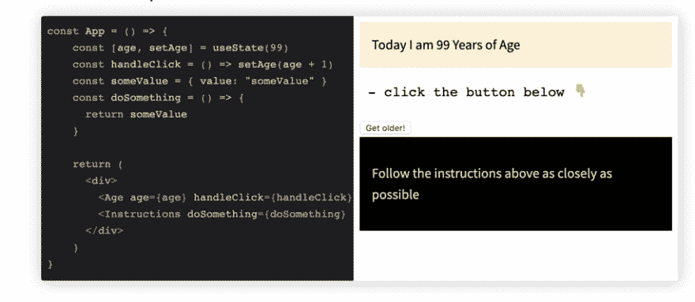](https://res.cloudinary.com/practicaldev/image/fetch/s--7LFpKyta--/c_limit%2Cf_auto%2Cfl_progressive%2Cq_auto%2Cw_880/https://cdn-images-1.medium.com/max/916/1%2AjlGFv-2D2Yu6VoSGx5Fu3w.png)T3】

```
const App = () => {
    const [age, setAge] = useState(99)
    const handleClick = () => setAge(age + 1)
    const someValue = { value: "someValue" }
    const doSomething = () => {
      return someValue
    }

    return (
      <div>
        <Age age={age} handleClick={handleClick}/>
        <Instructions doSomething={doSomething} />
      </div>
    )
}

const Age = ({ age, handleClick }) => {
  return (
    <div>
      <div style={{ border: '2px', background: "papayawhip", padding: "1rem" }}>
        Today I am {age} Years of Age
      </div>
      <pre> - click the button below 👇 </pre>
      <button onClick={handleClick}>Get older! </button>
    </div>
  )
}

const Instructions = React.memo((props) => {
  return (
    <div style={{ background: 'black', color: 'yellow', padding: "1rem" }}>
      <p>Follow the instructions above as closely as possible</p>
    </div>
  )
})

ReactDOM.render (
  <App />
) 
```

下面是负责上面截屏的代码。

上面的例子类似于 foruseCallback。这里唯一的区别是 someValue 是一个对象，*不是*一个字符串。因此，尽管使用了 React.memo，指令组件仍然会重新呈现

为什么？对象通过引用进行比较，并且每当重新呈现时，对 someValue 的引用都会改变。

有什么解决办法吗？

#### **基本用法**

对象 someValue 可以用 useMemo 来记忆。这可以防止不必要的重新渲染。

```
const App = () => {
    const [age, setAge] = useState(99)
    const handleClick = () => setAge(age + 1)
    const someValue = useMemo(() => ({ value: "someValue" }))
    const doSomething = () => {
      return someValue
    }

    return (
      <div>
        <Age age={age} handleClick={handleClick}/>
        <Instructions doSomething={doSomething} />
      </div>
    )
}

const Age = ({ age, handleClick }) => {
  return (
    <div>
      <div style={{ border: '2px', background: "papayawhip", padding: "1rem" }}>
        Today I am {age} Years of Age
      </div>
      <pre> - click the button below 👇 </pre>
      <button onClick={handleClick}>Get older! </button>
    </div>
  )
}

const Instructions = React.memo((props) => {
  return (
    <div style={{ background: 'black', color: 'yellow', padding: "1rem" }}>
      <p>Follow the instructions above as closely as possible</p>
    </div>
  )
})

ReactDOM.render (<App />) 
```

### useRef

useRef 返回一个“Ref”对象。值是从。返回对象的当前属性。的。当前属性可以初始化为初始值，例如 useRef(initialValue)。对象在组件的整个生存期内都是持久的。参考[文档](https://reactjs.org/docs/hooks-reference.html#useref)和实时、可编辑的[备忘单](https://react-hooks-cheatsheet.com/useRef)。

#### **访问 DOM**

考虑下面的示例应用程序:

[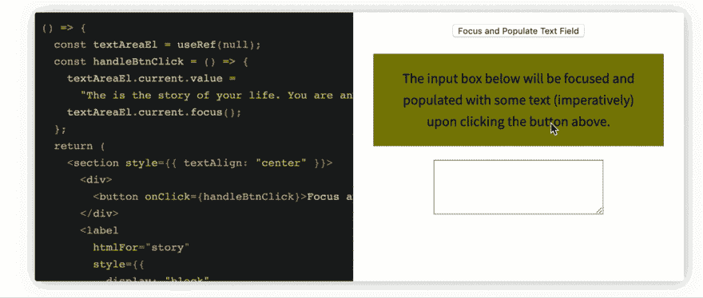](https://res.cloudinary.com/practicaldev/image/fetch/s--WxoWixra--/c_limit%2Cf_auto%2Cfl_progressive%2Cq_66%2Cw_880/https://cdn-images-1.medium.com/max/1024/1%2AHpWEeuuijusQkO9mT5ohXw.gif) 

<figcaption>通过 useRef 访问 DOM。</figcaption>

```
const AccessDOM = () => {
  const textAreaEl = useRef(null);
  const handleBtnClick = () => {
    textAreaEl.current.value =
    "The is the story of your life. You are an human being, and you're on a website about React Hooks";
    textAreaEl.current.focus();
  };
  return (
    <section style={{ textAlign: "center" }}>
      <div>
        <button onClick={handleBtnClick}>Focus and Populate Text Field</button>
      </div>
      <label
        htmlFor="story"
        style={{
          display: "block",
          background: "olive",
          margin: "1em",
          padding: "1em"
        }}
      >
        The input box below will be focused and populated with some text
        (imperatively) upon clicking the button above.
      </label>
      <textarea ref={textAreaEl} id="story" rows="5" cols="33" />
    </section>
  );
}; 
```

下面是负责上面截屏的代码。

#### **【类实例变量(泛型容器)**

除了保存 DOM 引用,“ref”对象还可以保存任何值。考虑下面一个类似的应用程序，其中 ref 对象保存一个字符串值:

[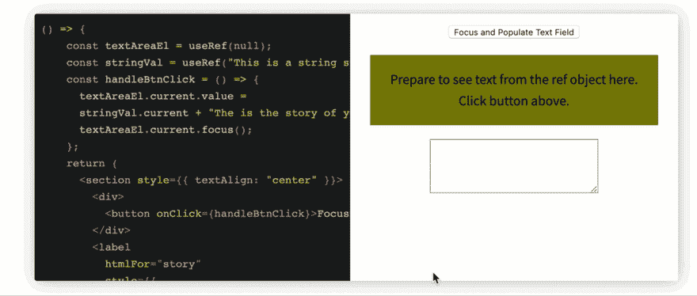](https://res.cloudinary.com/practicaldev/image/fetch/s--o1EcNJ6o--/c_limit%2Cf_auto%2Cfl_progressive%2Cq_66%2Cw_880/https://cdn-images-1.medium.com/max/1024/1%2AjLxqYWFdw0LDl8_axo5hMw.gif)T3】

```
const HoldStringVal = () => {
    const textAreaEl = useRef(null);
    const stringVal = useRef("This is a string saved via the ref object --- ")
    const handleBtnClick = () => {
      textAreaEl.current.value =
      stringVal.current + "The is the story of your life. You are an human being, and you're on a website about React Hooks";
      textAreaEl.current.focus();
    };
    return (
      <section style={{ textAlign: "center" }}>
        <div>
          <button onClick={handleBtnClick}>Focus and Populate Text Field</button>
        </div>
        <label
          htmlFor="story"
          style={{
            display: "block",
            background: "olive",
            margin: "1em",
            padding: "1em"
          }}
        >
          Prepare to see text from the ref object here. Click button above.
        </label>
        <textarea ref={textAreaEl} id="story" rows="5" cols="33" />
      </section>
    );
  }; 
```

下面是负责上面截屏的代码。

您可以像存储 setInterval 的返回值一样进行清理。

```
function TimerWithRefID() {
  const setIntervalRef = useRef();

  useEffect(() => {
    const intervalID = setInterval(() => {
      // something to be done every 100ms
    }, 100);

    // this is where the interval ID is saved in the ref object 
    setIntervalRef.current = intervalID;
    return () => {
      clearInterval(setIntervalRef.current);
    };
  });
} 
```

#### 其他例子

研究一个接近真实世界的例子可以帮助你将钩子的知识运用到生活中。在 React 悬念数据获取发布之前，通过钩子获取数据被证明是一个很好的钩子练习。

下面是一个使用加载指示器获取数据的示例:

[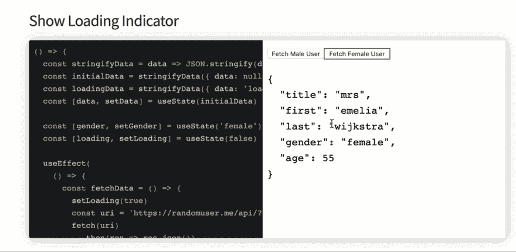](https://res.cloudinary.com/practicaldev/image/fetch/s--_Zp55TTm--/c_limit%2Cf_auto%2Cfl_progressive%2Cq_66%2Cw_880/https://cdn-images-1.medium.com/max/1024/1%2Asr9I9TkSj8GCgSI411rGPA.gif)T3】

```
const fetchData = () => {
  const stringifyData = data => JSON.stringify(data, null, 2)
  const initialData = stringifyData({ data: null })
  const loadingData = stringifyData({ data: 'loading...' })
  const [data, setData] = useState(initialData)

  const [gender, setGender] = useState('female')
  const [loading, setLoading] = useState(false)

  useEffect(
    () => {
      const fetchData = () => {
        setLoading(true)
        const uri = 'https://randomuser.me/api/?gender=' + gender
        fetch(uri)
          .then(res => res.json())
          .then(({ results }) => {
            setLoading(false)
            const { name, gender, dob } = results[0]
            const dataVal = stringifyData({
              ...name,
              gender,
              age: dob.age
            })
            setData(dataVal)
          })
      }

      fetchData()
    },
    [gender]
  )

  return (
    <>
      <button
        onClick={() => setGender('male')}
        style={{ outline: gender === 'male' ? '1px solid' : 0 }}
      >
        Fetch Male User
      </button>
      <button
        onClick={() => setGender('female')}
        style={{ outline: gender === 'female' ? '1px solid' : 0 }}
      >
        Fetch Female User
      </button>

      <section>
        {loading ? <pre>{loadingData}</pre> : <pre>{data}</pre>}
      </section>
    </>
  )
} 
```

下面是负责上面截屏的代码。

### 结论

钩子给了功能组件很大的力量。我希望[这张备忘单](https://react-hooks-cheatsheet.com/)证明对你日常使用钩子有用。干杯！

[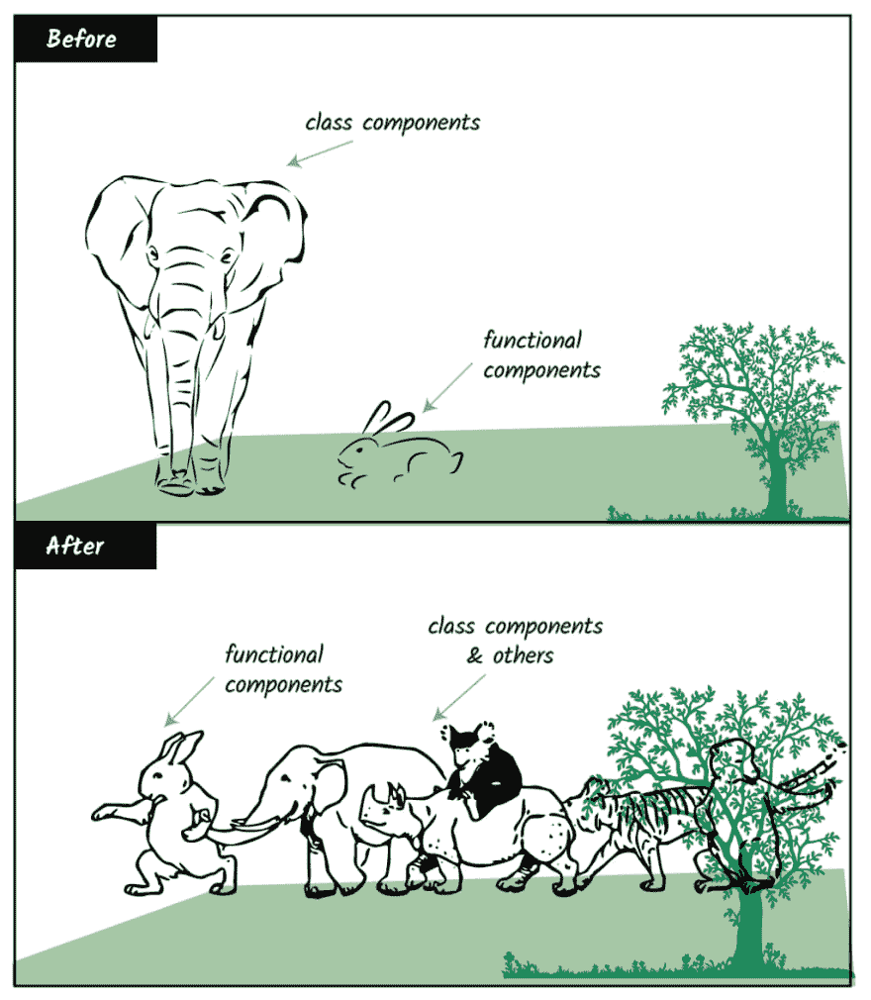](https://res.cloudinary.com/practicaldev/image/fetch/s--rZw_sMN9--/c_limit%2Cf_auto%2Cfl_progressive%2Cq_auto%2Cw_880/https://cdn-images-1.medium.com/max/1024/1%2Aag8EVnHaBiQECo2yXC49Mw.png) 

<figcaption>得益于钩子和其他几个 React 新特性。我插画:)</figcaption>

* * *

### Plug: [LogRocket](https://logrocket.com/signup/) ，一款适用于网络应用的 DVR

[](https://logrocket.com/signup/)

<figcaption>[https://logrocket.com/signup/](https://logrocket.com/signup/)</figcaption>

LogRocket 是一个前端日志工具，可以让你回放问题，就像它们发生在你自己的浏览器中一样。LogRocket 不需要猜测错误发生的原因，也不需要向用户询问截图和日志转储，而是让您重放会话以快速了解哪里出错了。它可以与任何应用程序完美配合，不管是什么框架，并且有插件可以记录来自 Redux、Vuex 和@ngrx/store 的额外上下文。

除了记录 Redux 操作和状态，LogRocket 还记录控制台日志、JavaScript 错误、堆栈跟踪、带有头+正文的网络请求/响应、浏览器元数据和自定义日志。它还使用 DOM 来记录页面上的 HTML 和 CSS，甚至为最复杂的单页面应用程序重新创建像素级完美视频。

[免费试用](https://logrocket.com/signup/)。

* * *

帖子[React Hooks cheat sheet:Unlock solutions to common problems](https://blog.logrocket.com/react-hooks-cheat-sheet-unlock-solutions-to-common-problems-af4caf699e70/)首先出现在 [LogRocket 博客](https://blog.logrocket.com)上。