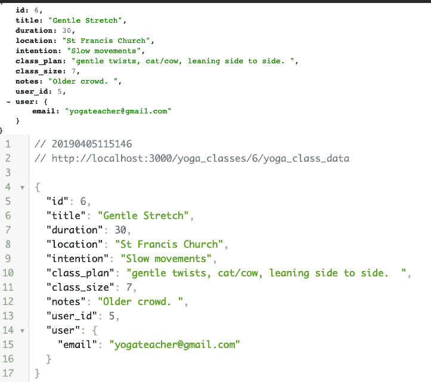

# 什么是 API？

> 原文：<https://dev.to/mccarronmollye/what-s-an-api-d6>

在参加 Flatiron 的在线编码训练营之前，我是一家清洁技术公司的运营分析师。尽管编写 SQL 查询是我最接近实际编码的工作，但我经常被技术术语包围。我记得听过很多关于 API 的事情。它们看起来脆弱、复杂、难以定义。然而，在将 Javascript 添加到现有的 rails 项目中，并启用内部 API 使用之后，我对什么是 API 及其用途有了更清晰的理解。

## 什么是 API？

API 是请求数据的端点。数据通常是 JSON (Javascript Object Notation)格式的，读起来就像一本包含键值对的字典，读起来非常直观。数据通过浏览器从端点进行处理，并可在添加到所需目标或页面之前在控制台中查看。在控制台中查看数据非常有用，因为您可以在浏览器的控制台中用 Javascript 处理数据，测试代码以访问对您的应用程序重要的数据点。

## 内部与外部 API:

我一直认为 API 完全是外部的。我的外部 API 的例子是谷歌地图。例如，我当地的比萨饼店将谷歌地图嵌入到他们网站的用户界面中。Luigi's 连接到谷歌地图的 API，因此披萨爱好者可以在访问该网站时看到餐厅的位置。

然而，在我的项目环境中，我不需要外部 API，我想呈现我的应用程序中可用的数据。该项目的主题是通过 AJAX 呈现数据。例如，用户单击“查看课程计划”后，课程计划将从 API 端点呈现，并且不会刷新页面。

API 端点如下所示:

然后，我编写了下面的代码来呈现数据:[http://localhost:3000/yoga_classes/6/yoga _ class _ data](http://localhost:3000/yoga_classes/6/yoga_class_data)并将其附加到 yoga _ classes 索引页面:[http://localhost:3000/yoga _ classes](http://localhost:3000/yoga_classes)

`$(function() {
$(".js-more").on('click', function(){
let id = $(this).data("id");
$.getJSON("/yoga_classes/" + id + "/yoga_class_data", function(data) {
$("#body-" + id).append("
" + data["class_plan"] + "

 Created
by: " + data["user"]["email"] + "
")
});
});
});`

分解代码:

第 2 行:对于分配给“查看课程计划”按钮的“js-more”类，当用户单击该按钮时，应该发生以下情况…
第 3 行:将变量 id 分配给 yoga_class id，以便第 4 行中的 yoga_class_data URL 可以是动态的。
4 号线:是奇迹发生的地方。JQuery 方法$。getJSON 接受两个参数，即 dynamic /yoga_class_data url 和一个函数……
第 5 行:该函数接受数据(表示 yoga_class 的 JSON 数据)作为参数，并将类计划和用户附加(添加)到类 ID body-[id]中，这里是 body-6，它位于页面[上 yoga 类标题的下面。
注意:我还使用了主动模型序列化器 gem，它赋予后端序列化具有必要属性和关系的数据的能力。。](http://localhost:3000/yoga_classes)

## 学习和应用新事物时，调整自己的节奏:

在 Flatiron 的在线软件工程沉浸式课程的每个模块结束时，我们需要建立一个项目，该项目总结了我们之前学习的 3 个作品的所有内容。我们在 3 周内涵盖了如此多的材料，当项目时间到来时，我最初对这些材料感到不舒服。每个项目周，我都会检查项目的范围，立刻就会发现需求令人望而生畏。Javascript、API 和 AJAX 部分也没有什么不同。我决定中止这个项目，而不是继续抵抗。我们有 5 个需求，所以我的目标是每天完成一个需求，留出两天的额外时间来修复讨厌的 bug，或者留出更多的时间来处理某个特定的需求。这被证明是一个伟大的方法。我设法在 4 天内完成了我的项目。如果我能满足当天的需求，我会继续工作。我发现分散在多个会议上学习效果最好，所以在两天内完成一个需求(每个需求处理一个稍微不同的概念)巩固了我的学习成果。

学习第二语言是艰难的，但我知道了为什么它是必要的。AJAX 请求让用户更快地与我的应用程序交互。它让用户能够请求更多的数据，而不必加载新的页面，这是现代的网络体验。我期待着 AJAX 的概念如何应用于 Redux 和 React，这是编码训练营的最后一个模块！