# 自动化的 Jenkins 构建在 GitHub pull 请求之上

> 原文：<https://dev.to/webhookrelay/automated-jenkins-builds-on-github-pull-request-4lh2>

[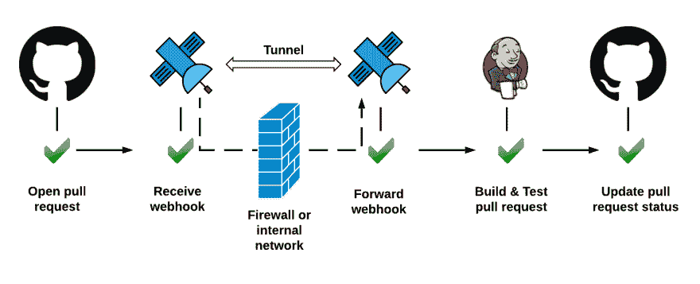](https://res.cloudinary.com/practicaldev/image/fetch/s--FyCoDsB_--/c_limit%2Cf_auto%2Cfl_progressive%2Cq_auto%2Cw_880/https://thepracticaldev.s3.amazonaws.com/i/on761jkqxxxgik7gyubb.png)

在这个简短的指南中，我们将配置 Jenkins 开始构建 GitHub pull 请求。任何新的提交都将触发后续的构建，GitHub pull 请求状态将显示构建是成功还是失败。此设置无需配置路由器、防火墙或公共 IP 即可工作。它也可以在公司防火墙后工作。

## 获得虚拟机

我呢，刚从[https://app.vagrantup.com/ubuntu/boxes/xenial64:](https://app.vagrantup.com/ubuntu/boxes/xenial64:)T2 抢了一个流浪箱

```
Vagrant.configure("2") do |config|
  config.vm.box = "ubuntu/xenial64"
  config.vm.network "private_network", type: "dhcp"
end 
```

Enter fullscreen mode Exit fullscreen mode

然后:

```
vagrant up
vagrant ssh 
```

Enter fullscreen mode Exit fullscreen mode

我们有自己的虚拟机。在终端输入`ifconfig`就可以得到 IP 地址。

## 安装詹金斯

我基本上是按照这个指南[https://linuxize . com/post/how-to-install-Jenkins-on-Ubuntu-18-04/](https://linuxize.com/post/how-to-install-jenkins-on-ubuntu-18-04/)来的。我这次遇到的唯一警告是 [jdk 版本不匹配](https://stackoverflow.com/questions/39621263/jenkins-fails-when-running-service-start-jenkins)。

## 连接到詹金斯

首先，得到你的詹金斯令牌:

```
cat /var/lib/jenkins/secrets/initialAdminPassword
ce04d19270934633a7badcac3cfac316 
```

Enter fullscreen mode Exit fullscreen mode

然后，要么打开您的节点防火墙(或检查无固定端口转发)**或**做简单的事情:连接中继:

#### 获取 CLI

要获取 CLI，请查看此处的[说明。在 64 位 Linux 操作系统上，它是:](https://webhookrelay.com/v1/installation/cli) 

```
curl -sSL https://storage.googleapis.com/webhookrelay/downloads/relay-linux-amd64 > relay \
   && chmod +wx relay && sudo mv relay /usr/local/bin 
```

Enter fullscreen mode Exit fullscreen mode

#### 登录

进入[https://my.webhookrelay.com/tokens](https://my.webhookrelay.com/tokens)，点击**创建令牌**，复制/粘贴登录命令到终端，应该是:

```
relay login -k <your key> -s <your secret> 
```

Enter fullscreen mode Exit fullscreen mode

#### 开始隧道

```
$ relay connect :8080
Connecting: 
http://lsw7eq49jlhsuldvhpiyku.webrelay.io <----> http://127.0.0.1:8080
https://lsw7eq49jlhsuldvhpiyku.webrelay.io <----> http://127.0.0.1:8080 
```

Enter fullscreen mode Exit fullscreen mode

现在，打开浏览器。您应该会看到类似的屏幕:

[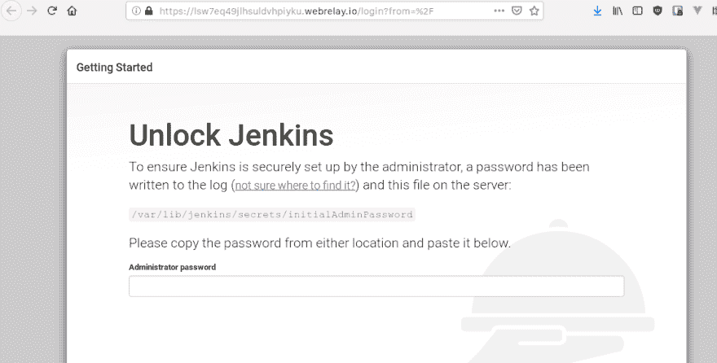](https://res.cloudinary.com/practicaldev/image/fetch/s--88qR9Dtu--/c_limit%2Cf_auto%2Cfl_progressive%2Cq_auto%2Cw_880/https://thepracticaldev.s3.amazonaws.com/i/499xq5kck43ilpbys75q.png)

按照步骤配置您的 Jenkins 初始管理员用户。

## 安装插件

插件安装说明[可以在这里](https://wiki.jenkins.io/display/JENKINS/GitHub+pull+request+builder+plugin)找到。

一旦你有了它，添加 GitHub 凭证——你的用户名和 GitHub 令牌。

## 转发配置

转到您的[铲斗配置](https://my.webhookrelay.com/buckets)并创建一个名为`github-webhooks`的铲斗。将其配置为将所有 webhooks 转发到 [http://localhost:8080/](http://localhost:8080/) 。这将确保 webhooks 到达 Jenkins 服务器。

[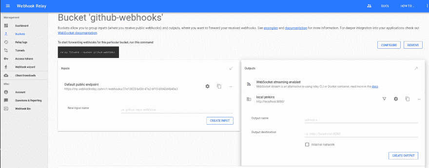](https://res.cloudinary.com/practicaldev/image/fetch/s--S6eAWsCi--/c_limit%2Cf_auto%2Cfl_progressive%2Cq_auto%2Cw_880/https://thepracticaldev.s3.amazonaws.com/i/hjthbwk2tbs84qa2ny91.png)

一旦在运行 Jenkins 的机器上有了`relay` CLI，输入:

```
relay forward --bucket github-webhooks 
```

Enter fullscreen mode Exit fullscreen mode

这将开始转发网页挂钩。运行转发守护程序还有其他选择，比如 [Docker 容器](https://webhookrelay.com/v1/installation/docker.html)。

> 如果你在 GitHub 中手工创建 webhook 配置，使用[http://localhost:8080/ghprbhook](http://localhost:8080/ghprbhook)destination，因为它是插件监听 web hook 的端点。在默认情况下，Jenkins 会自动将[https://my . Webhook Relay . com/v1/web hooks/21e 13033-bd3d-47 a2-bf15-6fd 42 D4 b40 a 3](https://my.webhookrelay.com/v1/webhooks/21e13033-bd3d-47a2-bf15-6fd42d4b40a3)端点转换为[https://my . Webhook Relay . com/v1/web hooks/21e 13033-bd3d-47 a2-bf15-6fd 42 D4 b40 a 3/ghprbhook](https://my.webhookrelay.com/v1/webhooks/21e13033-bd3d-47a2-bf15-6fd42d4b40a3/ghprbhook)和
> Webhook Relay 会保留多余的端点

现在，配置 **GitHub 拉请求生成器**:

[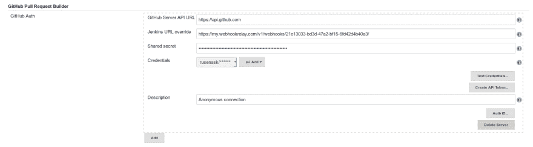](https://res.cloudinary.com/practicaldev/image/fetch/s--MK0Kgrtg--/c_limit%2Cf_auto%2Cfl_progressive%2Cq_auto%2Cw_880/https://thepracticaldev.s3.amazonaws.com/i/zl1wyx34o6qf8nxc0xjt.png)

## 创建工作

要创建新作业，首先选择“自由式项目”，然后:

将项目的 GitHub URL 添加到“GitHub 项目”字段(可以在浏览器中输入的字段)。例如:"[https://github . com/rusenask/Jenkins-test/":](https://github.com/rusenask/jenkins-test/%22):)

[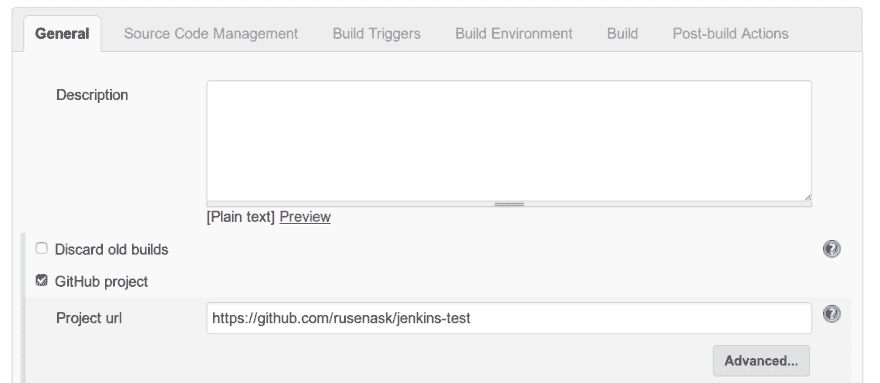](https://res.cloudinary.com/practicaldev/image/fetch/s--dIgkzhKK--/c_limit%2Cf_auto%2Cfl_progressive%2Cq_auto%2Cw_880/https://thepracticaldev.s3.amazonaws.com/i/0yrtzltb49vjwlrgx4o4.png)

配置**源代码管理**部分:

*   选择 Git SCM。
*   添加您的 GitHub“资源库 URL”。
*   在高级下，将“refspec”设置为`+refs/pull/*:refs/remotes/origin/pr/*`
*   在“分支说明符”中，输入`${ghprbActualCommit}`

[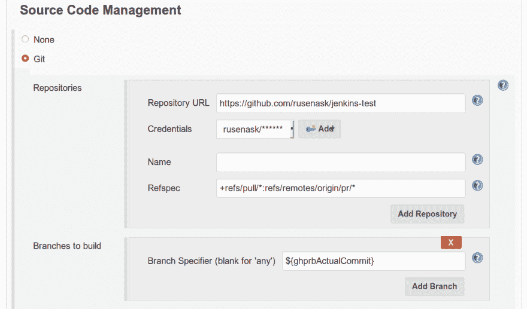](https://res.cloudinary.com/practicaldev/image/fetch/s--TYLHLRm2--/c_limit%2Cf_auto%2Cfl_progressive%2Cq_auto%2Cw_880/https://thepracticaldev.s3.amazonaws.com/i/5m9e7fuby8gywch2kow0.png)

用管理员列表配置**构建触发器**，并勾选`use github hooks for build triggering`:

[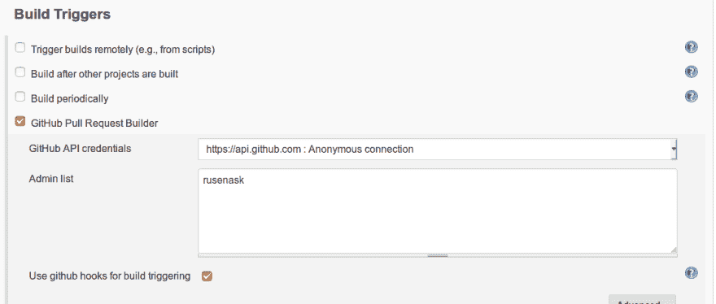](https://res.cloudinary.com/practicaldev/image/fetch/s--Nk779jN---/c_limit%2Cf_auto%2Cfl_progressive%2Cq_auto%2Cw_880/https://thepracticaldev.s3.amazonaws.com/i/d4y0i2toular6se3bq5h.png)

添加您的**构建**步骤配置。这可以是您想要的任何东西，通常人们倾向于使用 bash 脚本、Makefile 目标或特定于您的编程语言的东西，例如`go build`:

[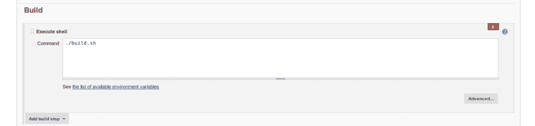](https://res.cloudinary.com/practicaldev/image/fetch/s--6-yura92--/c_limit%2Cf_auto%2Cfl_progressive%2Cq_auto%2Cw_880/https://thepracticaldev.s3.amazonaws.com/i/2m9ytj178j5dkmiyysci.png)

## 打开请购单

现在，每当您在 GitHub 中打开一个新的 pull 请求时，您应该会看到一个构建被触发:

[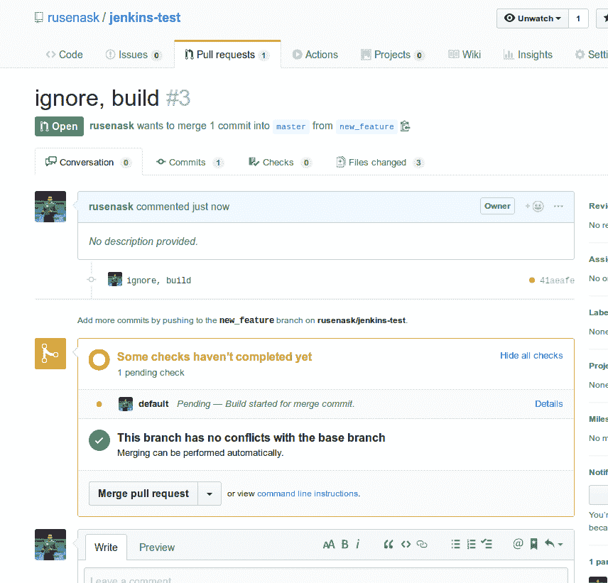](https://res.cloudinary.com/practicaldev/image/fetch/s--4xNiuAQ1--/c_limit%2Cf_auto%2Cfl_progressive%2Cq_auto%2Cw_880/https://thepracticaldev.s3.amazonaws.com/i/ovnf6fxgh2lrfz6hrx6e.png)

您还可以在 Jenkins 实例中查看构建状态。GitHub 中的这个构建指示器会根据构建状态变成红色或绿色。

## 结论

正如我们所看到的，在使用 Jenkins 时，需要几个步骤来确保您的 PRs 得到自动构建和测试。这些可以分为两组:

1.  涉及以下内容的系统配置:
    *   将 Webhook 中继代理设置为转发 web hook
    *   安装和配置 [GitHub 拉请求构建器插件](https://wiki.jenkins.io/display/JENKINS/GitHub+pull+request+builder+plugin)
2.  每当你在 Jenkins 中创建一个新的项目，设置一些设置。我第一次这样做花了我一些时间来浏览配置选项，但第二次和第三次不超过 1 分钟:)

我希望你会发现这个指南很有用！

* * *

**P.S .奖金故障排除如下:**

当我们谈论詹金斯时，事情会有很多出错的地方。多种插件版本、公司代理和不同的操作系统造成了这一切。如果你遇到问题，我为你整理了一份简短的清单供你检查。

### 确保 webhook 配置

确保有一个自动创建的 GitHub 存储库 webhook 配置:

[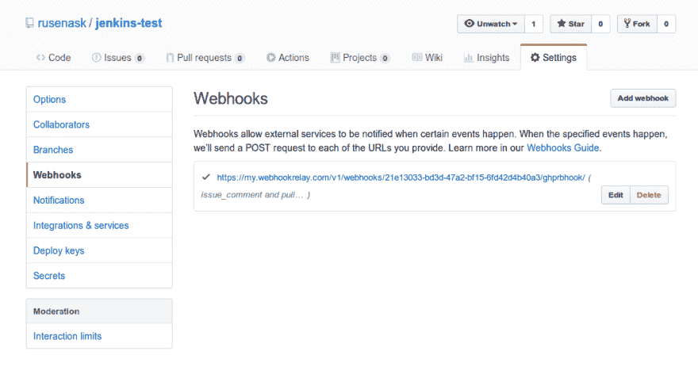](https://res.cloudinary.com/practicaldev/image/fetch/s--nCJc_p0m--/c_limit%2Cf_auto%2Cfl_progressive%2Cq_auto%2Cw_880/https://thepracticaldev.s3.amazonaws.com/i/milczihtojovcmuxxpgf.png)

### 确保 Webhook 中继代理可以连接

正常情况下，连接的代理应该如下所示:

```
relay forward --bucket github-webhooks
Filtering on bucket: github-webhooks
Starting webhook relay agent... 
1.55523552627511e+09    info    using standard transport...
1.5552355264042027e+09  info    webhook relay ready...  {"host": "my.webhookrelay.com:8080"} 
```

Enter fullscreen mode Exit fullscreen mode

如果您使用公司代理，尝试添加`--ws`标志，将默认传输类型从 GRPC 更改为 WebSocket:

```
relay forward --ws --bucket github-webhooks
Filtering on bucket: github-webhooks
Starting webhook relay agent... 
1.5552387754607065e+09  info    using websocket based transport...
1.5552387754607568e+09  info    authenticating to 'wss://my.webhookrelay.com:443/v1/socket'...
1.5552387754608495e+09  info    websocket reader process started...
1.555238775470567e+09   info    subscribing to buckets: [github-webhooks 
```

Enter fullscreen mode Exit fullscreen mode

### 检查日志

您可以查看几个日志来源:

*   詹金斯在`/log/all`下记录:

[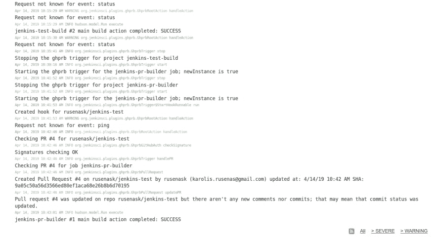](https://res.cloudinary.com/practicaldev/image/fetch/s--l1D-L2vo--/c_limit%2Cf_auto%2Cfl_progressive%2Cq_auto%2Cw_880/https://thepracticaldev.s3.amazonaws.com/i/pjw88m6ij46gt8owlif3.png)

*   Webhook 中继转发日志:

[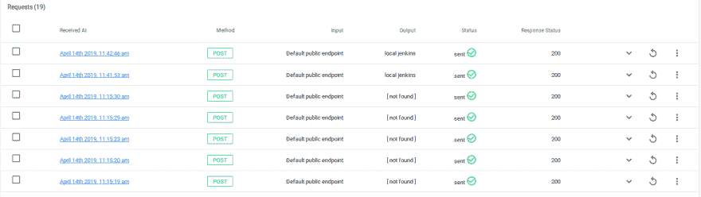](https://res.cloudinary.com/practicaldev/image/fetch/s--skfqVH6x--/c_limit%2Cf_auto%2Cfl_progressive%2Cq_auto%2Cw_880/https://thepracticaldev.s3.amazonaws.com/i/dlf7j543ttvimjq6vqxv.png)

*   CLI 日志:

```
relay forward --bucket github-webhooks
Filtering on bucket: github-webhooks
Starting webhook relay agent... 
1.55523552627511e+09    info    using standard transport...
1.5552355264042027e+09  info    webhook relay ready...  {"host": "my.webhookrelay.com:8080"}
1.555236773074343e+09   info    webhook request relayed {"destination": "http://localhost:8080/ghprbhook/", "method": "POST", "bucket": "github-webhooks", "status": 200, "retries": 0}
1.5552368184301443e+09  info    webhook request relayed {"destination": "http://localhost:8080/ghprbhook/", "method": "POST", "bucket": "github-webhooks", "status": 200, "retries": 0}
1.5552368215106862e+09  info    webhook request relayed {"destination": "http://localhost:8080/ghprbhook/", "method": "POST", "bucket": "github-webhooks", "status": 200, "retries": 0}
1.555236829308788e+09   info    webhook request relayed {"destination": "http://localhost:8080/ghprbhook/", "method": "POST", "bucket": "github-webhooks", "status": 200, "retries": 0}
1.5552368314174337e+09  info    webhook request relayed {"destination": "http://localhost:8080/ghprbhook/", "method": "POST", "bucket": "github-webhooks", "status": 200, "retries": 0}
1.555236920064973e+09   info    webhook request relayed {"destination": "http://localhost:8080/ghprbhook/", "method": "POST", "bucket": "github-webhooks", "status": 200, "retries": 0}
1.5552369202506151e+09  info    webhook request relayed {"destination": "http://localhost:8080/ghprbhook/", "method": "POST", "bucket": "github-webhooks", "status": 200, "retries": 0} 
```

Enter fullscreen mode Exit fullscreen mode

*原载于 Webhook Relay 博客:[https://Webhook Relay . com/blog/2019/04/17/automated-github-pull-request-builds-on-Jenkins/](https://webhookrelay.com/blog/2019/04/17/automated-github-pull-request-builds-on-jenkins/)T3】*