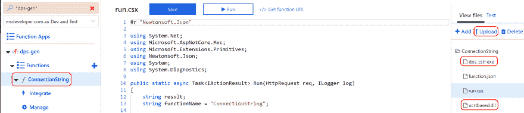
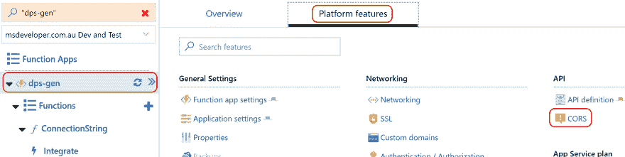
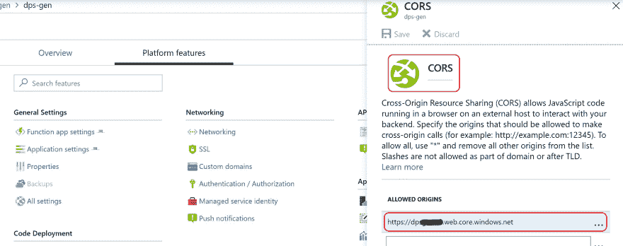

# 将一个命令行工具变成一个带有 Azure 功能的 REST API

> 原文：<https://dev.to/azure/turn-a-command-line-tool-into-a-rest-api-with-azure-functions-37ll>

[](https://res.cloudinary.com/practicaldev/image/fetch/s--x8IAASCN--/c_limit%2Cf_auto%2Cfl_progressive%2Cq_auto%2Cw_880/https://raw.githubusercontent.com/gloveboxes/Turn-a-Command-Line-tool-into-a-REST-API-with-Azure-Functions/master/docs/banner.jpg)

| 作者 | [戴夫·格洛弗](https://developer.microsoft.com/en-us/advocates/dave-glover)，微软云开发者倡导者 |
| --- | --- |
| 证明文件 | [自述](https://gloveboxes.github.io/Turn-a-Command-Line-tool-into-a-REST-API-with-Azure-Functions/) |
| 平台 | [Azure 功能](https://docs.microsoft.com/en-us/azure/azure-functions/?WT.mc_id=devto-blog-dglover) |
| 证明文件 | [创建 Azure HTTP 触发功能](https://docs.microsoft.com/en-us/azure/azure-functions/functions-create-first-azure-function/?WT.mc_id=devto-blog-dglover)、 [Azure IoT Central](https://docs.microsoft.com/en-us/azure/iot-central?WT.mc_id=devto-blog-dglover) 、 [Azure 设备供应服务](https://docs.microsoft.com/azure/iot-dps/about-iot-dps/?WT.mc_id=devto-blog-dglover)、[连接字符串生成器(dps_str)](https://github.com/Azure/dps-keygen) |
| 日期 | 截至 2019 年 4 月 |

## 简介

我想分享一个巧妙的技巧，用 Azure HTTP 函数将命令行工具转换成 REST API。

在高层次上，您创建一个 Azure HTTP 函数，上传命令行工具，添加代码以传入命令行参数，重定向标准输出，启动命令过程，并在 HTTP 响应中从命令行返回标准输出。

我正在运行一个 [Azure IoT Central](https://azure.microsoft.com/en-au/services/iot-central?WT.mc_id=devto-blog-dglover) 研讨会，为了尽量减少设置，我希望研讨会完全基于浏览器。Azure IoT Central 使用 [Azure 设备供应服务](https://docs.microsoft.com/azure/iot-dps/about-iot-dps/?WT.mc_id=devto-blog-dglover)，你需要使用[连接字符串生成器(dps_str)](https://github.com/Azure/dps-keygen) 命令行工具来创建一个真实的设备连接字符串。

## 如何对 REST API 运行命令行工具

1.  从 Azure 门户创建一个 [Azure HTTP 触发函数](https://docs.microsoft.com/en-us/azure/azure-functions/functions-create-first-azure-function/?WT.mc_id=devto-blog-dglover)
2.  上传命令和关联的库。
3.  这是我用来传入命令行参数、重定向标准输出和启动命令的代码。很明显，您需要调整想要运行的命令。

```
#r "Newtonsoft.Json"

using System.Net;
using Microsoft.AspNetCore.Mvc;
using Microsoft.Extensions.Primitives;
using Newtonsoft.Json;
using System;
using System.Diagnostics;

public static async Task<IActionResult> Run(HttpRequest req, ILogger log)
{
    string result;
    string functionName = "ConnectionString";

    string scope = req.Query["scope"];
    string deviceid = req.Query["deviceid"];
    string key = req.Query["key"];

    string requestBody = await new StreamReader(req.Body).ReadToEndAsync();
    dynamic data = JsonConvert.DeserializeObject(requestBody);
    scope = scope ?? data?.scope;
    deviceid = deviceid ?? data?.deviceid;
    key = key ?? data?.key;

    if (String.IsNullOrEmpty(scope) ||
        String.IsNullOrEmpty(deviceid) ||
        String.IsNullOrEmpty(key) )
    {
        return new BadRequestObjectResult("Please pass a IoT Central device Scope, DeviceId and key (url encoded) on the query string or in the request body");
    }

    var workingDirectory = Path.Combine(@"d:\home\site\wwwroot", functionName);
    Directory.SetCurrentDirectory(workingDirectory);

    string arguments = $"\"{scope}\" \"{deviceid}\" \"{key}\"";

    ProcessStartInfo start = new ProcessStartInfo();
    start.FileName = @"dps_cstr.exe";
    start.UseShellExecute = false;
    start.RedirectStandardOutput = true;
    start.Arguments = arguments;

    using (Process process = Process.Start(start))
    {
        using (StreamReader reader = process.StandardOutput)
        {
            result = reader.ReadToEnd();
        }
    }

    return result != null
        ? (ActionResult)new OkObjectResult($"{result}")
        : new BadRequestObjectResult("Please pass a IoT Central device Scope, DeviceId and key (url encoded) on the query string or in the request body");
} 
```

**完成**

## REST API 的浏览器 UI

我想要一个 REST API 的 web 浏览器 UI，所以我写了一个简单的 HTML/JavaScript [App](//dps-cstr.html) 并从 JavaScript 调用 REST API。假设不需要服务器端处理，HTML 页面使用 Azure Storage 中的[静态网站托管。](https://docs.microsoft.com/en-us/azure/storage/blobs/storage-blob-static-website/?WT.mc_id=devto-blog-dglover)

### CORS 规则

当您从 Javascript 调用 Azure HTTP 函数 REST API 时，您需要调整 Azure HTTP 函数的 CORS 规则。

从你创建的 Azure 函数中

1.  从功能应用程序 UI 选择平台功能
2.  指定进行跨原点调用的 JavaScript 应用程序的原点 URL。

## 鸣谢

1.  如何[在 Azure 功能上运行控制台应用](https://azure.microsoft.com/en-au/resources/samples/functions-dotnet-migrating-console-apps?WT.mc_id=devto-blog-dglover)
2.  如何[跑。Azure 函数中的 exe 可执行文件](https://stackoverflow.com/questions/45348498/run-exe-executable-file-in-azure-function)