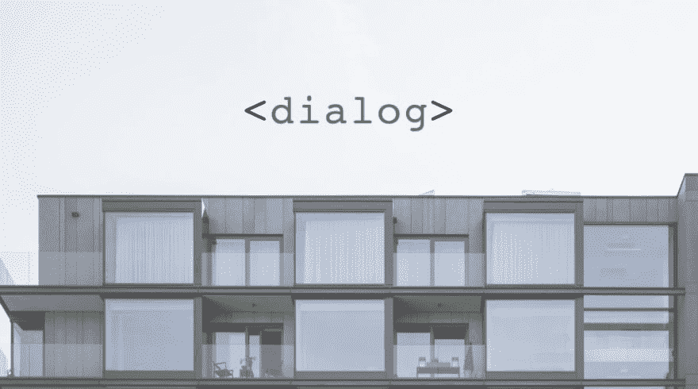
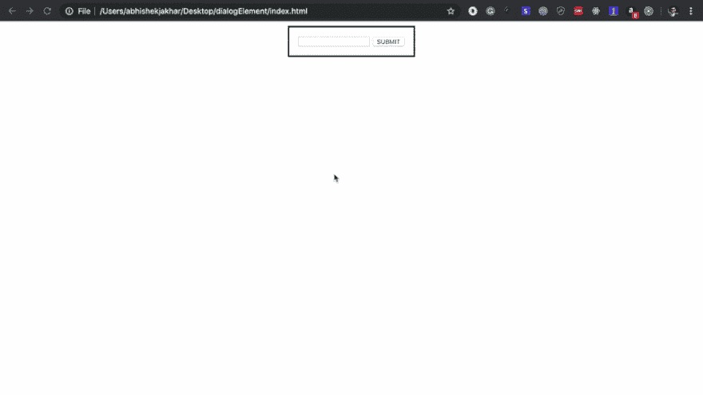
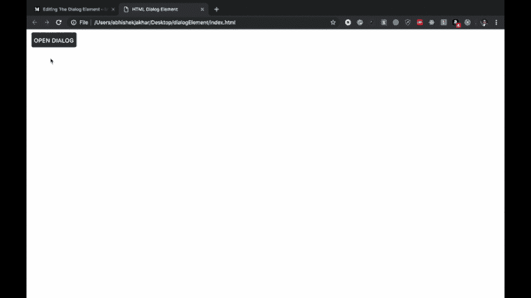
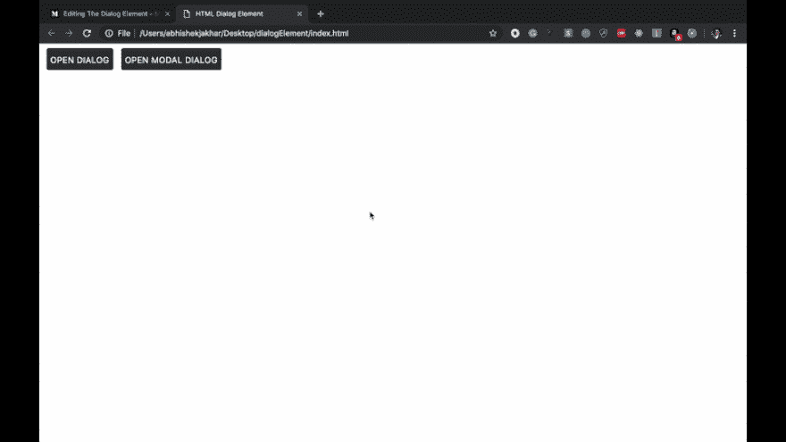
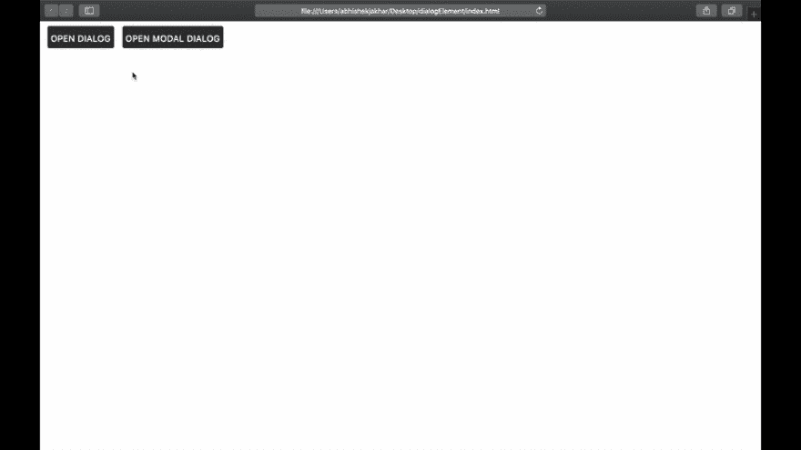

# 对话框元素:创建未来模式窗口的方法

> 原文：<https://dev.to/bnevilleoneill/the-dialog-element-the-way-to-create-tomorrow-s-modal-windows-2k7m>

[](https://res.cloudinary.com/practicaldev/image/fetch/s--DbjsF1J---/c_limit%2Cf_auto%2Cfl_progressive%2Cq_auto%2Cw_880/https://cdn-images-1.medium.com/max/1021/1%2Ant5vUPHSxYY9MhPhf9-gkw.png)

### 概述

对话框是一种常见的用户界面设计模式，在网站上反复出现——如此频繁，以至于 W3C 提出了一些标准化的 HTML 标记来描述对话框窗口。

用其他 HTML 标记和 CSS 创建的传统对话框已经在大多数前端框架中实现了很长一段时间，这可能仍然是一条路要走，因为 HTML 对话框元素仍然具有有限的浏览器支持。

但是如果前端框架仍然是更好的选择，为什么还要创建标准化的对话框元素呢？

有很多原因，但其中最主要的是屏幕阅读器的可访问性，以及使搜索引擎爬虫和机器学习代理能够解释对话窗口。随着浏览器支持的不断改进，这个标准将成为创建模式窗口的明确选择。

首先，我们将关注对话框元素的 HTML 标记，然后我们将在后面添加一些 JavaScript。

文件夹结构可能如下所示:

***项目

/—*** ****/—****app . js*

***/—****main . CSS**

 *[](https://logrocket.com/signup/)

### 我们对话窗口背后的 HTML

在*index.html*文件中，让我们创建带有开始和结束标签的对话框元素:

```
<!doctype html>
<html>
  <head>
    HTML Dialog Element
  </head>
  <body>
    <dialog>
    </dialog>
  </body>
  http://app.js
</html> 
```

*创建一个`<dialog>`元素。*

然而，这还不会在页面上显示任何内容。为了让它出现，我们需要向对话框元素
添加布尔属性 **open**

```
<!doctype html>
<html>
  <head>
    HTML Dialog Element
  </head>
  <body>
    <dialog open>
    </dialog>
  </body>
  http://app.js
</html> 
```

*向`<dialog>`元素添加布尔属性 open，使其出现在页面上。*

在对话框元素中，我们将创建一个简单的表单，包含文本类型的文本输入和提交类型的按钮:

```
<!doctype html>
<html>
  <head>
    HTML Dialog Element
  </head>
  <body>
    <dialog open>
      <form method="dialog">
        <input type="text">
        <button type="submit">SUBMIT</button>
      </form>
    </dialog>
  </body>
  http://app.js
</html> 
```

> **注意:**这里我设置了一个**窗体**到**对话框**的**方法**。这是一个新的表单方法，它与父对话框元素协同工作。当按下提交按钮时，**将提交**表格，**关闭**对话框**。**

 **[](https://res.cloudinary.com/practicaldev/image/fetch/s--Prf50ymL--/c_limit%2Cf_auto%2Cfl_progressive%2Cq_auto%2Cw_880/https://cdn-images-1.medium.com/max/960/0%2AilyONnjoBVqvV9iP) 

<figcaption>对话框窗口按下提交按钮后消失。</figcaption>

现在我们将创建一些按钮，允许我们使对话框窗口重新出现。这些将需要 JavaScript 来工作，我们将在后面添加。

```
<!doctype html>
<html>
  <head>
    HTML Dialog Element
  </head>
  <body>
    <dialog open>
      <form method="dialog">
        <input type="text">
        <button type="submit">OK</button>
      </form>
    </dialog>

    <button id="openDialog">Dialog</button>
    <button id="openModalDialog">Modal Dialog</button>
  </body>
  http://app.js
</html> 
```

*添加两个 id 为“openDialog”和“openModalDialog”的按钮*

因此，这里我们创建了两个按钮:一个 ID 为 openDialog，另一个 ID 为 openModalDialog。一旦我们添加了一些 JavaScript，第一个按钮将打开对话框，就像我们上面看到的一样。但是，第二个按钮将打开一个对话框窗口，阻止其他页面交互。

这是一种常见的设计模式，因为当对话框窗口打开时，您通常需要用户在继续使用应用程序的其余部分之前执行某种交互。

为了编写 JavaScript，我将从对话框元素中移除**打开属性**，然后添加一个 **ID 属性**，这样我们就可以用 JavaScript 选择它，就像按钮一样。

```
<!doctype html>
<html>
  <head>
    HTML Dialog Element
  </head>
  <body>
    <dialog id="dialogWindow">
      <form method="dialog">
        <input type="text">
        <button type="submit">OK</button>
      </form>
    </dialog>

    <button id="openDialog">Open Dialog</button>
    <button id="openModalDialog">Open Modal Dialog</button>
  </body>
  http://app.js
</html> 
```

*用名为“dialogWindow”的 ID 替换了`<dialog>`元素的 open 属性。

### 我们的对话窗口的 JavaScript

在 JavaScript ( *app.js* )文件中，我们将在一个匿名函数中编写基于事件的代码，该代码将在页面加载时执行。

首先，我们将收集页面上的元素，以及变量——**对话窗口**和**两个按钮**。我们将为每个对象创建一个变量，并通过它们的 ID 获取它们。

```
(function() {

  let openDialog = document.getElementById('openDialog');
  let openModalDialog = document.getElementById('openModalDialog');
  let dialogWindow = document.getElementById('dialogWindow');

})(); 
```

通过 id 获取两个按钮和对话框。

接下来，我们将创建两个事件侦听器，每个按钮一个。

#### 1。用于正常打开对话窗口的 EventListener

我们将向 openDialog 按钮添加一个 EventListener，这样当它被单击时，函数 show()将会执行。show()函数在页面上显示对话框元素的方式与我们之前在 HTML 中使用 **open 属性**时相同。

```
(function() {

  let openDialog = document.getElementById('openDialog');
  let openModalDialog = document.getElementById('openModalDialog');
  let dialogWindow = document.getElementById('dialogWindow');

  openDialog.addEventListener('click', () => {
    dialogWindow.show();
  })

})(); 
```

*EventListener 用于正常打开对话窗口。*

[](https://res.cloudinary.com/practicaldev/image/fetch/s--Zd74d-Lo--/c_limit%2Cf_auto%2Cfl_progressive%2Cq_auto%2Cw_880/https://cdn-images-1.medium.com/max/960/0%2AiDxI67SdJFan0KqS) 

<figcaption>EventListener 用于正常打开对话窗口。</figcaption>

> **注意:**我已经设计了按钮的样式，这样它们就可以在上面的 GIF 上看到，但这不会以任何方式影响功能。

#### 2。用于将对话框窗口作为模式窗口打开的 EventListener

我们将为我们的打开模式窗口对话框做与上面相同的事情:向 openModalDialog 按钮添加一个 EventListener，这样当它被单击时，函数 showModal()将会执行。

所以在这里，我们没有使用 show()函数，而是使用 showModal()函数，它仍然会显示对话框窗口。但这一次，页面的其余部分将有一个灰色的透明覆盖层，将阻止任何其他鼠标点击。

```
(function() {

  let openDialog = document.getElementById('openDialog');
  let openModalDialog = document.getElementById('openModalDialog');
  let dialogWindow = document.getElementById('dialogWindow');

  openDialog.addEventListener('click', () => {
    dialogWindow.show();
  })

  openModalDialog.addEventListener('click', () => {
    dialogWindow.showModal();
  })
})(); 
```

*EventListener 用于将对话框窗口作为模态窗口打开。*

[](https://res.cloudinary.com/practicaldev/image/fetch/s--6rjaxPBd--/c_limit%2Cf_auto%2Cfl_progressive%2Cq_auto%2Cw_880/https://cdn-images-1.medium.com/max/960/0%2Afr9OZ6qH79posWYp) 

<figcaption>对话框窗口作为模态窗口。</figcaption>

### 浏览器支持和聚合填充

聚合填充是一段代码，它实现了特定 web 浏览器本身不支持的功能。通常，他们首先检查浏览器是否支持 API，如果可用就使用它；否则，他们实现自己的逻辑，使其在浏览器上工作。

目前，只有 Chrome 和 Opera 完全支持 HTML 对话框元素，为了在 Firefox 中使用它，用户必须**显式启用**该功能。

但是我们仍然可以在其他浏览器(Safari，IE 等)中使用 HTML 对话框元素。)使用由谷歌 Chrome 维护的 dialog-polyfill。polyfill 将增加对不支持的浏览器的支持；还支持 IE9 及以上版本。

有几点需要注意:在我们的 JavaScript ( *app.js* )文件中添加 polyfill 不会以任何方式影响 Chrome 和 Opera 上的 HTML 对话框元素。只会有一个 *app.js* 文件。

此外，如果我们只想在 Chrome 或 Opera 上使用 HTML 对话框元素，我们就不需要 polyfill。但是如果我们想在所有的浏览器上使用它——很可能是这种情况——我们将不得不使用 polyfill，直到其他浏览器完全支持它。

更新后的文件夹结构可能如下所示:

***项目

/—*** ****/—****app . js*

***/—****main . CSS*

***/—****dialog-poly fill . CSS** 

 *#### 使用聚合填充

1.  在文档头中包含 CSS [dialog-polyfill.css](https://github.com/GoogleChrome/dialog-polyfill/blob/master/dist/dialog-polyfill.css) 。

```
<!doctype html>
<html>
  <head>
    HTML Dialog Element
    <link rel="stylesheet" href="dialog-polyfill.css">
    <link rel="stylesheet" href="main.css">
  </head>
  <body>
    <dialog id="dialogWindow">
      <form method="dialog">
        <input type="text">
        <button type="submit">OK</button>
      </form>
    </dialog>

    <button id="openDialog" class="button">Open Dialog</button>
    <button id="openModalDialog" class="button">Open Modal Dialog</button>
  </body>
  http://app.js
</html> 
```

*包含的对话框-poly fill . CSS*

1.  在引用 dialogPolyfill 之前，在任意位置包含 JavaScript[dialog-polyfill . js](https://github.com/GoogleChrome/dialog-polyfill/blob/master/dist/dialog-polyfill.js)。

```
<!doctype html>
<html>
  <head>
    HTML Dialog Element
    <link rel="stylesheet" href="dialog-polyfill.css">
    <link rel="stylesheet" href="main.css">
  </head>
  <body>
    <dialog id="dialogWindow">
      <form method="dialog">
        <input type="text">
        <button type="submit">OK</button>
      </form>
    </dialog>

    <button id="openDialog" class="button">Open Dialog</button>
    <button id="openModalDialog" class="button">Open Modal Dialog</button>
  </body>
  http://dialog-polyfill.js
  http://app.js
</html> 
```

*包含对话框-polyfill.js.*

1.  在 HTML 文档中创建`<dialog>`元素(上面我们已经创建了一个)。

2.  使用 dialogPolyfill.registerDialog()函数注册元素，一次传递一个节点。

```
(function() {

    let openDialog = document.getElementById('openDialog');
    let openModalDialog = document.getElementById('openModalDialog');
    let dialogWindow = document.getElementById('dialogWindow');

    dialogPolyfill.registerDialog(dialogWindow);

    openDialog.addEventListener('click', () => {
      dialogWindow.show();
    })

    openModalDialog.addEventListener('click', () => {
      dialogWindow.showModal();
    })
  })(); 
```

*使用 app.js 中的 dialogPolyfill.registerDialog()函数注册对话框 polyfill】*

1.  使用你的`<dialog>`元素。

[](https://res.cloudinary.com/practicaldev/image/fetch/s--rZ5T0Xdv--/c_limit%2Cf_auto%2Cfl_progressive%2Cq_auto%2Cw_880/https://cdn-images-1.medium.com/max/960/0%2AsRd_XIbZO7hTBfZF)

[](https://res.cloudinary.com/practicaldev/image/fetch/s--GvsjtZde--/c_limit%2Cf_auto%2Cfl_progressive%2Cq_auto%2Cw_880/https://cdn-images-1.medium.com/max/960/0%2AlOJ6AKXKWEnln7nb) 

<figcaption>添加 polyfill 前的 Safari 浏览器**(左)与添加 polyfill 后的**(右)。****</figcaption>

 ****现在我们已经介绍了 HTML 中对话框元素的基本要素。如果你有兴趣了解更多，可以考虑阅读来自 [Mozilla](https://developer.mozilla.org/en-US/docs/Web/HTML/Element/dialog) 和[我可以使用……](https://caniuse.com/#feat=dialog)以及[官方规范](https://html.spec.whatwg.org/multipage/interactive-elements.html#the-dialog-element)的资源。

我希望这篇文章对你有所帮助。我希望听到您的反馈！

**感谢您的阅读！**

* * *

### Plug: [LogRocket](https://logrocket.com/signup/) ，一款适用于网络应用的 DVR

[](https://logrocket.com/signup/)

<figcaption>[https://logrocket.com/signup/](https://logrocket.com/signup/)</figcaption>

LogRocket 是一个前端日志工具，可以让你回放问题，就像它们发生在你自己的浏览器中一样。LogRocket 不需要猜测错误发生的原因，也不需要向用户询问截图和日志转储，而是让您重放会话以快速了解哪里出错了。它可以与任何应用程序完美配合，不管是什么框架，并且有插件可以记录来自 Redux、Vuex 和@ngrx/store 的额外上下文。

除了记录 Redux 操作和状态，LogRocket 还记录控制台日志、JavaScript 错误、堆栈跟踪、带有头+正文的网络请求/响应、浏览器元数据和自定义日志。它还使用 DOM 来记录页面上的 HTML 和 CSS，甚至为最复杂的单页面应用程序重新创建像素级完美视频。

[免费试用](https://logrocket.com/signup/)。

* * *

帖子[The dialog element:The way to create The tomorrow model window](https://blog.logrocket.com/the-dialog-element-the-way-to-create-tomorrows-modal-windows-f1d4ab14380b/)首先出现在[的 LogRocket 博客](https://blog.logrocket.com)上。********