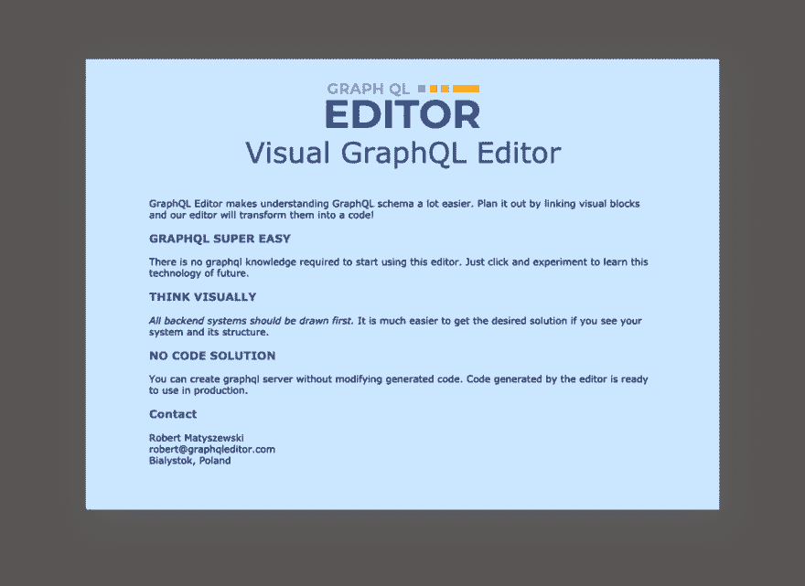
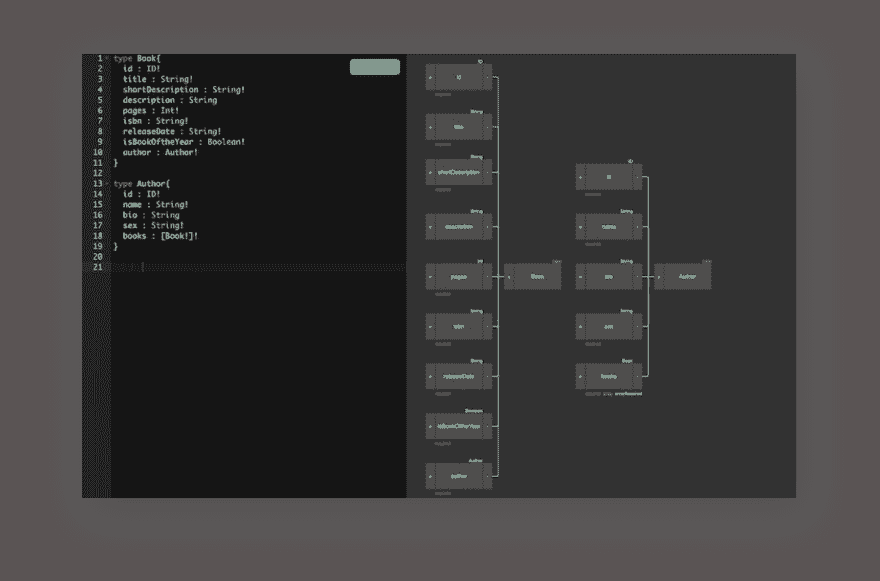
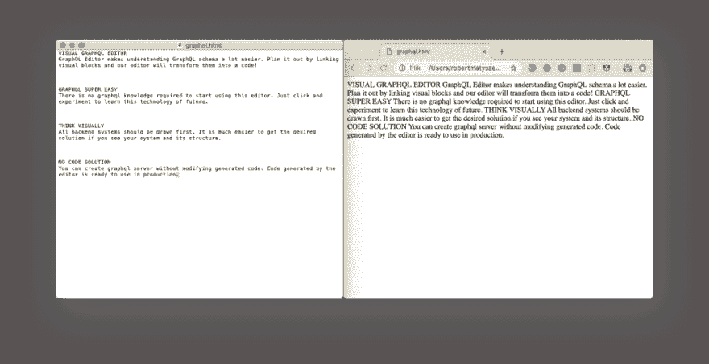
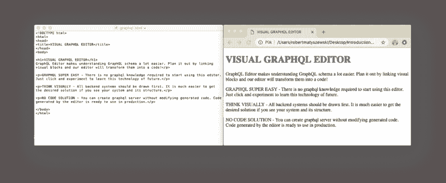

# HTML 简介

> 原文：<https://dev.to/robmatyszewski/introduction-to-html-1fcf>

在本文中，我们将从头开始创建一个网页。通过一起工作，你会有一种做开发人员的感觉。此时不要担心学习文本元素或样式表规则，我将在另一篇文章中介绍。对于这个介绍，我创建了一个简短的议程:

### 议程:

1.  了解标签、标记和元素的工作原理。
2.  学习 HTML 文档的结构。
3.  检查浏览器如何解释 HTML 文档。
4.  亲自看看样式表是如何工作的。

我为你创建了一个网站制作的小路线图，让你了解我们在每个阶段都在做什么。

1.  创建内容。为您的网页编写文本并选择图像。
2.  创建一个 HTML 文档结构，学习为内容和元数据设置区域的语法和元素
3.  使用文本元素识别和描述内容。
4.  向网页添加图像并了解属性。
5.  样式表介绍-改变网页的外观。

我假设你对网络的工作原理有一个基本的了解。我更喜欢用传统的方式教 HTML 用手和文本编辑器。机械打字是学习和记忆的最好方法。通过输入标记，然后在浏览器中检查结果，您将看到标记是如何工作的。专业的 web 开发人员倾向于手动标记内容，以便更好地控制代码，并决定使用什么元素。在整篇文章中，我们将非常频繁地在浏览器中检查我们的工作——在这个阶段看到代码中每个小变化的原因和影响是很有帮助的。

这是我们的最终成果-基本的启动登录页面，带有徽标和文本描述。这是[我的创业登陆页面](https://graphqleditor.com)的基础版本。

[](https://res.cloudinary.com/practicaldev/image/fetch/s--PmF_JdBt--/c_limit%2Cf_auto%2Cfl_progressive%2Cq_auto%2Cw_880/https://thepracticaldev.s3.amazonaws.com/i/jgrcdkrkjhqm6blr1x0o.png)

### 打开文本编辑器

出于本文的目的，我将使用 Mac - TextEdit 或 Windows 记事本上最基本的文本编辑器。其他编辑器只要能编辑纯文本并保存为*.html 也可以。

windows 中的记事本
通常在 Windows 中，你看不到文件扩展名，所以在启动记事本之前，你可以尝试改变它。这不是必须的，但是非常有用。在文件夹设置中，你必须取消选中“隐藏已知文件类型的扩展名”。就这样，现在您可以创建一个名为 mypage.html 的新文档。

通常在这个应用程序中，你会得到丰富的编辑器，有很多选项可以让文本加粗，设置字体大小等等。当“格式”工具栏上有许多控件时，您可以查看编辑器是否处于丰富编辑模式。HTML 文档需要是纯文本，所以我们需要改变文档格式。在新建文档选项卡上，选择纯文本。在“选项”下，取消选择所有自动格式选项。在“打开和保存”选项卡上，选择“将 HTML 文件显示为 HTML 代码”并取消选择“添加”。“纯文本文件的扩展名”。其余的默认应该没问题。现在，您可以创建一个新文档，并将其保存为 HTML 页面。

### 我们网页的内容。

现在我们有了新的文件，是时候写点东西了。将已经准备好的内容键入或复制到文本编辑器中，保留格式，如行间的分隔符。你可以用我贴在下面的文字，或者写你想写的任何东西。这是我之前的创业登陆页面[https://graphqleditor.com](https://graphqleditor.com)的一段文字。

如果您想探索更多 GraphQL，请随时尝试我们的编辑器！

[](https://graphqleditor.com)T3】

```
VISUAL GRAPHQL EDITOR
GraphQL Editor makes understanding GraphQL schema a lot easier. Plan it out by linking visual blocks and our editor will transform them into a code!

GRAPHQL SUPER EASY
There is no graphql knowledge required to start using this editor. Just click and experiment to learn this technology of the future.

THINK VISUALLY
All backend systems should be drawn first. It is much easier to get the desired solution if you see your system and its structure.

NO CODE SOLUTION
You can create graphql server without modifying generated code. The code generated by the editor is ready to use in production. 
```

创建一个新文件夹，并将文本保存为 HTML 文件。命名为“启动”文件夹和文本文件为 index.html。

在 chrome 浏览器中打开您创建的内容。检查你所看到的-你有和我一样的结果吗？我让文本在段落之间留有空格，浏览器对此有不同的解释。明白是怎么回事了吗？如果你的看起来不一样，检查前面提到的文本文档设置。

[](https://res.cloudinary.com/practicaldev/image/fetch/s--kSrePzyD--/c_limit%2Cf_auto%2Cfl_progressive%2Cq_auto%2Cw_880/https://thepracticaldev.s3.amazonaws.com/i/3127gfjtlviixuddtpnc.png)

我们的页面现在看起来不太好。文件中的文本被转换成一大块文本。Web 浏览器会忽略诸如换行符、制表符、多字符空格、无法识别的标记或注释中的文本等内容。稍后会有更多介绍；)

# 标签和标记

让我们从理解一个例子中最基本的 HTML 元素开始。到目前为止，您还没有在本文中看到任何代码或标签。HTML 的一个通用元素是这样的:

```
<element>Text here</element> 
```

下面的第二个例子使用了 heading 标签，这意味着它将是整个页面的标题。

```
<h1>Visual GraphQL Editor</h1> 
```

标签由带尖括号的元素名组成。元素名出现在开始标记(所谓的开始标记)中，并再次出现在以斜杠开头的结束标记中。开始和结束标记的作用类似于关闭开关，其中“/”的作用类似于关闭。注意使用正确的斜杠“/”，不要将其误认为反斜杠“\”。

标签加上内容被称为标记，HTML 用户通过标记来描述网页。基本的 HTML 元素有内容和它的标记。也有没有内容的元素

围绕内容添加的标签被称为标记。需要注意的是，元素由内容和它的标记(开始和结束标记)组成。然而，并不是所有的元素都有内容。有些根据定义是空的，比如用于向页面添加图像的``元素。我们将在本章稍后讨论空元素。

HTML 中的大写并不重要，但是大多数开发人员更喜欢用小写写代码。

### HTML 结构

下面我使用了来自 w3schools.com 的最基本的 HTML 文档。

```
<!DOCTYPE html>
<html>
<head>
Page Title
</head>
<body>

<h1>My First Heading</h1>
<p>My first paragraph.</p>

</body>
</html> 
```

```
The <!DOCTYPE html> declaration defines this document to be HTML5
The <html> element is the root element of an HTML page
The <head> element contains meta information about the document
The  element specifies a title for the document
The <body> element contains the visible page content
The <h1> element defines a large heading
The <p> element defines a paragraph 
```

你准备好开始更新我们的样本网页了吗？

打开我们的**。html** 文档并开始更新。

将整个文档放入`<html></html>`元素，然后创建`<head></head>`并在其中添加``。还有，你要在同一节加上`<meta charset="utf-8">`。通过将内容包装成`<body></body>`来定义文档的主体，并根据需要标记标题和段落。最后，通过替换旧版本来保存文档。看看它在我的例子上看起来怎么样。你有同样的结果吗？

[](https://res.cloudinary.com/practicaldev/image/fetch/s--zCxttyHm--/c_limit%2Cf_auto%2Cfl_progressive%2Cq_auto%2Cw_880/https://thepracticaldev.s3.amazonaws.com/i/clhdu0l3rx6w4zy2yihw.png)

### 文件命名

HTML 文件必须以**结尾。html** 或者**。htm** ，图形必须按其文件格式命名:**。gif** ，**。png** ，**。jpg** 或**。svg** 。

不要在文件名中使用字符空格。使用下划线字符可视地分隔文件名中的单词，如 **my_website.html** 。

避免使用*等特殊字符？, %, #, /, :, ;，，*等。和民族字符(例如，在波兰语中，我们有“啊，啊，啊”)。

在 web 开发人员中，保持文件名简短和小写是很常见的。这是保持 web 开发整洁的行业标准。

### 文本元素

有了上一段的经验，你根据自己的需要标记一篇文章应该没有问题。HTML 的目的是给内容增加意义和结构，而不是让内容看起来像什么。我们将在下一段讨论样式表时介绍这一点。查看以下一些基本的文本元素，并思考如何将它们应用到我们的文档中:

*   `<b>` -粗体文本
*   `<strong>` -重要文本
*   `<i>` -斜体文本
*   `<em>` -强调文本

[](https://res.cloudinary.com/practicaldev/image/fetch/s--y7106fYM--/c_limit%2Cf_auto%2Cfl_progressive%2Cq_auto%2Cw_880/https://thepracticaldev.s3.amazonaws.com/i/3vqnthy9twywn1vsc8ii.png)

你可以按照我的例子，或者标记你自己的文字。对于第一次使用的用户，我建议保持接近这个例子，因此，你将很容易取得小的成功，并保持积极性。

好了，我们走吧。我用过:

*   **h3** -标记段落标题，
*   **h2** -标注主标题，
*   **p**——标注段落和 em 来宣传主要特征。

此外，如果你注意的话，你会发现`<br>`元素，它类似于文本编辑器中的回车符。

```
<!DOCTYPE html>
<head>
VISUAL GRAPHQL EDITOR
</head>
<body>

<h2><br>Visual GraphQL Editor</h2>

<p>GraphQL Editor makes understanding GraphQL schema a lot easier. Plan it out by linking visual blocks and our editor will transform them into a code!</p>

<h3>GRAPHQL SUPER EASY</h3>
<p>There is no graphql knowledge required to start using this editor. Just click and experiment to learn this technology of future.</p>

<h3>THINK VISUALLY</h3>
<p><em>All backend systems should be drawn first. </em> It is much easier to get the desired solution if you see your system and its structure.</p>

<h3>NO CODE SOLUTION</h3>
<p>You can create graphql server without modifying generated code. Code
generated by the editor is ready to use in production.</p>

<h3>Contact</h3>
<p>Robert Matyszewski <br> robert@graphqleditor.com <br> Bialystok, Poland</p>
</body> 
```

### 添加图片

你可能已经注意到我已经在里面插入了一些图片——一个我们登陆页面的标志。没错。我们正接近最终结果。您可以在下面下载代码中使用的徽标并添加到您的网页中。为此，只需将链接下的代码复制到您的 HTML 文件中。请记住将图像放在同一个文件夹中，并根据文件类型正确命名。如果您插入名为。png -浏览器无法正常显示文件

```
https://thepracticaldev.s3.amazonaws.com/i/xvtvgoxn6iqksys6iw53.png

 
```

图像元素``是空元素的一个例子。它告诉浏览器从服务器获取一个图像文件，并将其插入文本流中的那个位置。其他空元素包括换行符`<br>`。到目前为止，我们只使用了有开始和结束的元素，即所谓的内容元素。下面我们有一个`<br>`元素的例子:

```
<h3>Contact</h3>
<p>Robert Matyszewski <br> robert@graphqleditor.com <br> Bialystok, Poland</p> 
```

### 样式表

我们将通过使用一些简单的样式表规则来改变文本元素和背景的表示。现在不要担心去理解它们。我们将在另一篇文章中更详细地讨论 CSS，但我想至少让您体验一下将 CSS 添加到页面意味着什么。

打开您的 HTML 文件，并将样式部分添加到文档的标题部分。

```
<head>
VISUAL GRAPHQL EDITOR
<style>

</style>
</head> 
```

现在，在样式标记的开始和结束之间键入这些样式规则。您已经注意到 h2 和 h3 标题的正文和字体格式中描述了一些分配给整个文档的特定视觉规则。这将影响您的整个页面。

```
<head>
VISUAL GRAPHQL EDITOR
<style>

body {
font: normal 1em Verdana;
width: 80%;
margin: 1em auto;
background-color: #CAE7FF;
}

h2 {
font: normal 3em Verdana;
margin: 1em 0 1em;
text-align: center;
color: #0A45BE
}
h3 {
color: #0A45BE
}

</style>
</head> 
```

现在是时候保存整个 HTML 文档并在 chrome 浏览器中打开它了。恭喜你，你已经用图片、HTML 结构和样式表创建了自己的网页。一切顺利吗？比较你所创造的与我的代码在最后截图。

[](https://res.cloudinary.com/practicaldev/image/fetch/s--PmF_JdBt--/c_limit%2Cf_auto%2Cfl_progressive%2Cq_auto%2Cw_880/https://thepracticaldev.s3.amazonaws.com/i/jgrcdkrkjhqm6blr1x0o.png)T3】

```
<!DOCTYPE html>
<head>
VISUAL GRAPHQL EDITOR
<style>
body {
font: normal 1em Verdana;
width: 80%;
margin: 1em auto;
background-color: #CAE7FF;
}

h2 {
font: normal 3em Verdana;
margin: 1em 0 1em;
text-align: center;
color: #0A45BE
}
h3 {
color: #0A45BE
}
</style>
</head>

<body>

<h2><br>Visual GraphQL Editor</h2>

<p>GraphQL Editor makes understanding GraphQL schema a lot easier. Plan it out by linking visual blocks and our editor will transform them into a code!</p>

<h3>GRAPHQL SUPER EASY</h3>
<p>There is no graphql knowledge required to start using this editor. Just click and experiment to learn this technology of future.</p>

<h3>THINK VISUALLY</h3>
<p><em>All backend systems should be drawn first. </em> It is much easier to get the desired solution if you see your system and its structure.</p>

<h3>NO CODE SOLUTION</h3>
<p>You can create graphql server without modifying generated code. Code generated by the editor is ready to use in production.</p>

<h3>Contact</h3>
<p>Robert Matyszewski <br> robert@graphqleditor.com <br> Bialystok, Poland</p>

</body> 
```