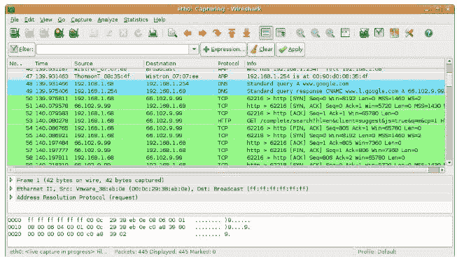
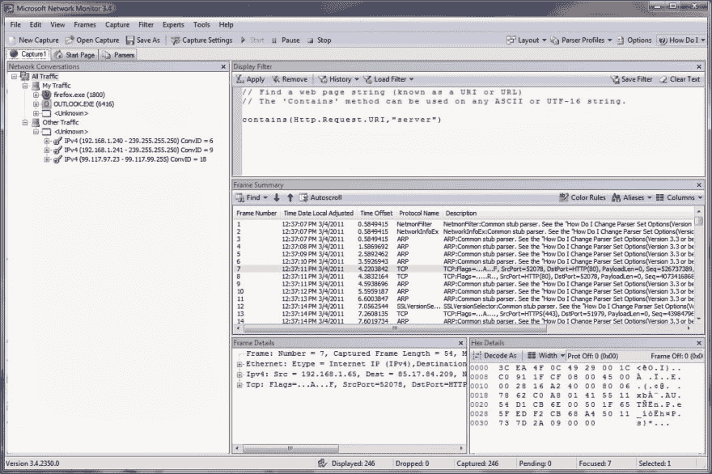
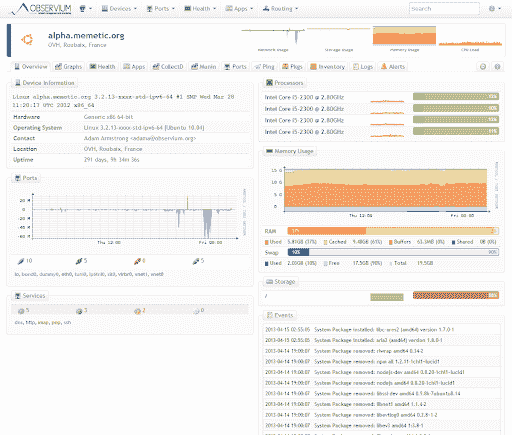

# 使用自动化脚本监控网络流量

> 原文：<https://dev.to/akshaypai/monitoring-network-traffic-with-automation-scripts-4go4>

根据维基百科，“软件测试中的测试脚本是一组将在被测系统上执行的指令，用于测试系统是否按预期运行。”然而，这些测试脚本解决什么目的呢？

这些测试脚本，或者简单地说，一个短程序(使用功能性 GUI 测试工具或者用编程语言编写)集中于测试软件系统的功能。此外，这种测试既可以手动执行，也可以使用自动化模式。此外，由于我们生活在一个机器取代体力劳动的时代，自动化似乎是更好的选择。

## 什么是自动化测试？

开发测试软件的程序的简化过程，自动化测试减少了人力。由开发人员编写的自动化测试程序或脚本使用测试数据。数据被自动输入以生成输出。这进一步创建了对整个数据的分析，测量程序的效率。

但是为什么我们需要自动化测试过程呢？

顾名思义，除了投入时间和金钱之外，自动化特定的任务可以极大地减少所需的工作。流程自动化意味着不再需要长时间的人工交互来验证工作。它削减了人为错误的范围，提高了效率和工作范围。

今天我们将讨论自动化脚本如何帮助您检查网络流量。

## 什么是网络流量？

简单来说，网络流量就是通过网络传输的数据量。准确地说，网络流量包括浏览器和服务器之间的全部数据交换。例如，当打开一个网站时，下载图像、文本和任何其他模板都包含在网络流量中。

### 对一个 web 应用的流量检查

现在我们知道了什么是流量，让我们来理解为什么需要监控流量。对于任何网站来说，应用效率都是最关键的因素。此外，人们希望检查网络使用情况和任何可能的数据流失。分析流量给了我们这样的洞察力，使我们更容易找到解决方案。

检查流量的过程很简单。一旦 web 页面上的所有请求都被触发，就很容易收集响应，从而帮助用户找出缺点(如果有的话)。这将有助于测量所有功能，并创建报告来分析统计数据。

## 应该找什么？

无论何时进行流量监控，都需要特别注意几个参数，以获得最大精度。

*   **HTTP 请求:** HTTP 请求是浏览器和服务器之间通信的信息包。应用程序的数量越多，用户的体验越差。浏览器缓存是一种可以降低这个数字的技术。
*   **HTTP 响应:**需要精确报告响应的分组通信所用的时间。
*   **加载时间:**这包括打开网页所需加载的全部资源。这包括文本、媒体和其他插件。
*   **失败的请求:**应用程序中可能有错误，或者可能有一些网络问题。这会导致请求失败。响应的状态代码将指示请求是失败还是成功。例如，状态代码 400 表示请求不正确，或者状态代码 500 表示应用程序在处理请求时出现问题。大量失败的请求可能表明应用程序中存在一些严重的问题。
*   **IP 地址:**需要监控来自 IP 地址的请求。来自同一个 IP 地址的异常多的请求可能意味着有人可能试图用 DoS(拒绝服务)攻击来攻击您的网站。这还将允许您发现每个会话中每个 IP 地址发出的请求的典型数量。
*   **位置:**虽然不可能确定所有流量的起始位置，但可以监控大部分流量。这将有助于你分析你的网站获得流量的各个地区，你可以应用你的商业智能来确定是否有异常或潜在的市场机会。

## 如何捕获网络流量

捕获网络流量需要专门的工具来监控部署流量的网络。这些工具聚合、隔离、应用用户提供的规则，并可视化与网络流量相关的各个方面。以下是一些最常用的工具。

### 1。Wireshark

Wireshark 是当今使用最广泛的网络监控工具之一。Wireshark 是一个免费的开源工具，它为您提供了一个数据包分析器，可以进行微观级别的网络监控。

它具有一些强大的功能，例如用于监控的功能丰富的 GUI、用于监控新型协议的可插拔接口、到端口的实时数据连接、多协议可伸缩解析器等等。您可以通过 Wireshark 的官方视频指南了解更多关于 Wireshark 的信息。

### 2。Microsoft 网络监视器

如果你在 windows 机器上，你可以使用内置的网络监控工具来捕获和分析你的网络流量。除了捕捉通过适配器甚至子网的流量的更广泛的功能之外，这个工具还可以用于更精细的操作。

通过该工具可以轻松执行帧过滤和帧分析等详细任务，并且它提供了每个帧的摘要，从而简化了用户的工作。Microsoft 关于监控工具的 Technet 指南将帮助您进行设置，并了解有关这一出色工具的功能和限制的更多信息。

### 3。观察者社区

当流量监控的目标是关注网络的健康状况时，监控网络中的每台设备状态和通信就变得势在必行。出于这样的目的，这个多操作系统网络监控工具 Observium 表现得非常好。

Observium 将帮助您提高在网络中的可见性。凭借设备自动发现、现有设备的运行状况检查和报告等功能，它成为最受欢迎的发现和状态检查工具之一。

### 自动化与交通监控的融合

现在您已经有了获取数据和结果所需的参数和资源，流量监控似乎很简单，对吗？嗯，有可能。然而，它会和自动化过程一样好吗？让我们来看看！

借助自动化流量监控模型，自动化脚本能够支持样本数据，从而生成基于情况的结果。

此外，自动化脚本和工具的使用可以减少所涉及的费用以及手工劳动。自动化脚本不仅降低了成本，还减少了人为错误的范围。这包括在需要时模拟带宽和延迟。它的好处是过滤特定的 URL 模式，试图获得最大的数据进行分析。借助自动化脚本进行流量监控也有助于获得实时洞察。

一句非常常见的谚语说，“预防胜于治疗。”同样，这也正是自动化使用户能够做到的。在发货之前，任何潜在的问题都会被报告。对于任何希望拥有高效的工作系统和满意的员工的组织来说，自动化是保持不败的关键。

毫无疑问，自动化监控过程是交付更成功产品的又一步。

**相关帖子**

1.  [专业测试人员如何在 Selenium 自动化脚本中使用 CSS 选择器？](https://www.lambdatest.com/blog/how-pro-testers-use-css-selectors-in-selenium-automation-scripts/?utm_source=dev&utm_medium=Blog&utm_campaign=ak-13-170419eu&utm_term=OrganicPosting)
2.  如何在 Selenium 自动化脚本中使用名称定位器？
3.  [2019 年测试自动化最佳 9 个 PHP 框架](https://www.lambdatest.com/blog/best-9-php-frameworks-in-2019-for-test-automation/?utm_source=dev&utm_medium=Blog&utm_campaign=ak-13-170419eu&utm_term=OrganicPosting)