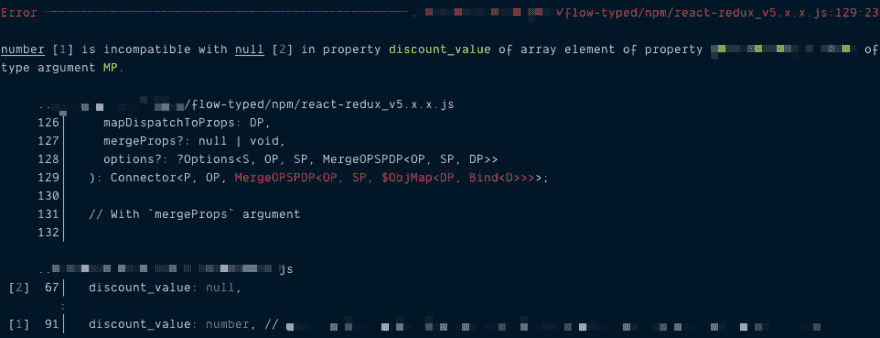

# 0.85 后让流量快乐

> 原文：<https://dev.to/wgao19/making-flow-happy-after-0-85-4ipn>

在过去的几周里，我利用空闲时间将我们代码库对 Flow 的依赖升级到最新版本。我们被困在 0.83，因为显然任何尝试 0.85 的人都立即决定放弃。当我拿起它时，流量为 0.89。我写这篇文章的时候，已经是 0.97 了🤷🏻‍♀️

## 这有什么难的

我假设如果你因为这个标题与你有关而阅读这篇文章，你可能已经知道这个事实:

> 0.85 之后，我所有的连接都断了。

吸引我们代码库的情况是，我们是一个由高阶组件组成的团队。我们的组件通常用一系列嵌套的高阶组件包装，我们甚至盗用 Redux 的`compose`来进行这种包装。我们以为我们很聪明？等到心流开始抱怨它😱。

另一方面，在这个问题上缺乏指导确实是最让我困惑的。对其他人来说太容易了还是每个人都放弃了？在某个时候，我决定自己算算，我意识到没有“快速设置”让我玩。

更不用说我们的代码库是活的💩。每周都有数百个提交合并到 master 中，所以我也在和时间赛跑。

昨天，我终于完成了对三个主要软件包中的第一个的修复。看到数字从 723 减少到 300 左右，然后是两位数、一位数，最后是“没有错误！”安慰信息只是治疗。

所以这里有一些我希望在开始前就知道的经验教训。

## 了解是什么导致了错误

Flow team 在 0.85 更新的同时发布了这篇文章。并非所有更新都需要仔细检查发行说明。但这是你不能错过的。

[询问所需注释](https://medium.com/flow-type/asking-for-required-annotations-64d4f9c1edf8)

从好的方面来说，这篇文章很好地解释了这种情况，如果你正在努力超过 0.85，你应该在旁边阅读。由于这篇文章写得相当好，让我快速浏览一下它的要点。

### 为什么需要改变

一开始，我对心流的话题并不十分精通。在此之前和过程中，我已经多次阅读了那篇文章。我希望我现在正确地理解了情况:

流延迟了类型推断，该推断允许它在跨文件导入链的输入位置捕获类型错误。但是为了做到这一点，它要求我们在每个导入-导出循环中注释输入位置，或者说每个文件的范围。然后，它将能够链接这些周期中的每一个，并意识到以前无法意识到的差异。

请求必要注释的帖子有一个简化的例子。理解这里的情况可能会有帮助。

### 需要标注的“输入位置”明确是什么

这篇文章介绍了它所指的三种“输入位置”:

*   函数参数
*   类的可写字段
*   “隐式实例化”的函数或类实例

第三个可能是导致最多不快乐的原因。特别是，最不开心的可能是与 React Redux 连接的组件。类似形式的不愉快延伸到但不限于，`createReducer`、通用函数调用以及我们编写的大多数高阶组件。

### 你可以在哪里以及如何标注它们

Flow 的帖子建议在两个地方对它们进行注释。它不起眼的外表与其至高无上的重要性完全不相称，我不得不再次把它放在这里:

> 我们可以通过注释函数调用 [Try Flow](https://flow.org/try/#0GYVwdgxgLglg9mABAJwKbADwBUB8AKASgC5EBvRANwEMAbEVErAHzBBpsQF8yAoRFVFBDIk5anQaJW7LgG4enHgFs4AEzaoAdKgAeABzjIoAZ0QBeRHjTBCJMbXoljUZDDABzFmw6cCsoA) 的返回类型或者通过向函数调用 [Try Flow](https://flow.org/try/#0GYVwdgxgLglg9mABAJwKbADwBUB8AKASgC5EBvRANwEMAbEVErAHzBBpsQF8yAoRFVFBDIk5anQaJW7LgG4enHgFs4AEzaoAdKgAeABzjIoAZ0QBeAZmNRkMMAHN8BWUA) 提供显式类型参数来修复这个错误。

两者都是有效的修复。两者都有合法的用例，我将在下一节举例说明。

## 制造心流快乐的实际过程

概述:

*   修复隐式实例化导致的所有错误
*   如果通过在函数返回或模块导出时添加注释来修复这些问题，可能会更容易
*   修复修复后由流捕获的错误
*   修正其他错误

我建议你在这个过程中使用 IDE 的 Flow 插件。正确设置 VSCode 的流扩展后，它会在一个对话框中显示所有流错误，并按字母顺序对文件进行分组和排序。这比 4000 多行命令行输出更容易移动。

### 搜索关键词:`implicitly instantiated`

同样，如果您的 IDE 设置正确，这将使事情变得容易得多。如果没有，管道`grep`也应该工作:

```
$ yarn flow | grep 'implicitly instantiated' -B 4 -A 10 
```

`-B 4`修饰符让您在错误报告前看到 4 行，这可能会告诉您哪个文件不满意。`-A 10`获取后面的 10 行，这应该涵盖了大部分错误信息。

```
Error -------------------------------------------------------------------------------- ../path/to/unhappiness/index.js

Missing type annotation for `SP`. `SP` is a type parameter declared in function type [1] and was implicitly instantiated
at call of `connect` [2].

    ../path/to/unhappiness/index.js:66:10
                v-------
    66| return connect(
    67|   mapState,
    68|   mapDispatch
    69| )(ComponentWithUnhappiness);
        ^ [2] 
```

这里它抱怨导出的连接组件没有注释。我认为这么多新词汇(*隐含*，和*实例化*)以如此大的数量(数百个)出现的心理影响是创伤性的。但这实际上是同一类型的错误:

```
export function add(a, b) {
                    ^ Missing type annotation for `a`.
  return a + b;
} 
```

### 随着您修复隐式实例化投诉，您的错误列表可能会增加

当我开发我们的第一个主包时，这让我困惑了很长时间，因为在我注释了*隐式实例化的*不快之后，错误就消失了。但是，由于在这个版本中增加了“心流”的安全性，它*可能*已经在别处发现了更多的不快乐，埋藏在数百个其他人的不快乐中。如果错误涉及到一个对象的许多字段被不恰当地注释，这个数字可能会以数字的形式跳跃。

很可怕，你知道。在你修复了一行之后，你并没有减少心流的不愉快，但是你实际上让它变得沮丧了😭。

不管怎样，我想让两个月前的我知道:

*   我们在正确的轨道上，新的错误是由于我们现在正确地注释了输入位置
*   稍后，Flow 实际上会给我们更好的错误消息，这一切都是值得的(或者我是这样认为的)。

所以坚持住..

### 你可能想注解`connect`的两个地方，但一个可以比另一个更好

遵循 Flow 的博文建议，并翻译成这种情况，这里有两种方法。

首先，通过**提供一个显式类型参数**。根据您使用的 React Redux 的流类型注释，您的注释可能会有所不同。[有官方的注释方式吗](https://github.com/facebook/flow/issues/7493)？嗯，似乎没有。但似乎[的流式测试文件是一个很好的学习来源](https://github.com/facebook/flow/issues/7493#issuecomment-465842207)。

我们使用的是最新版本的`react-redux_v5.x.x.js`，它需要六个类型参数，其中只有两个是 connect 最常用的。

```
export default connect<
  Props,
  OwnProps, // <- take out props fed in by connect
  _,
  _,
  _,
  _,
>(
  mapState,
  mapDispatch
)(MyHappyComponentNow); 
```

这是一个接近官方的声明，告诉你如何告诉 connect 你的连接组件的属性是什么。所以你得到了基于推理的精确的类型安全。它工作了。除了前面提到的事实，即我们的组件通常由多层 hoc 包裹，我对此没有太多抱怨。

```
export default compose(
  withA,
  withB,
  withC,
  connect(mapState, mapDispatch)
)(FlowIsUnhappyAboutMyComponentAgain); 
```

现在，这是不是一个好的实践是一个问题。即使它是邪恶的，我也不能为每个人重写特性。

顺便说一下，我[在推特上发了](https://twitter.com/wgao19/status/1115969686758248448)一条[尝试流](https://flow.org/try/#0JYWwDg9gTgLgBAKjgQwM5wEoFNkGN4BmUEIcA5FDvmQNwBQdA9I3DMgNZbrJy4mQA7LAPgwAFsngATCFzgCI8CQDcscMMTDlkZOMAF6YdGAE8wagO7BxAQQAKm9AF44AbxQAuOKhhR9AczgAHzhlCGApOABfegIAVwF8YAgDK1sAHjsvVyiAPgAKAHUoZDBzKQBhfhThGC9sPBgAOhsAIx8S-CrwGpFM3IBKLzoG-Bb230buwVr0gBIAEWACAkyAGjg0sXtHXNy4Olc6ODhKGDioA3yNCDBUL0Xl1bsNrZ3b1EG4J33jk7h0sVSuVpr14MgnK4yDoom4mvCbndYYxcvQogxTOZNtYxAAhBwfb5uOCtLwdALBULhSIxOjxRIwZKpHG4zLZPJFEplLCVapCET1KjNNodKZ82Z2QbDUbCiadGCg-kweZLFbrbHifG7X5HE5nC5XRH3OCPNUvDV4gl3L4-A7-AFA7m8npKkmQsitMiw1zwppG5Goujo4xmNQAWRMitqAHkLAIrc43H8AB5k3wBIMMZisMRqPgu2o5yR6dAWLnlC1wGzeMQQOIAG0iKjUeFwXHQMAg2jIIaxEajIkKOPedyJ-fFIlj8cccAAZBaR6h6HwBD44ABVACSQ9sROuji844Lg+HCYG3326SkwGUuVcRqayCi6UY19vdBXa8d5WrLje6SPGYT1sBMCi3HdtgGegmBYVBQGAetkCgesTErXFe3DSMJxgCCtUJFxALBKcEznC08LuZcUjXcCWT3I1Dyw48cJZM8LwBN87wfVpn1fG9cg-Kj4G-HlcSJLZWUIpVcNA-IaM1KCsxYatkAESJ0MxTCB2Y2wbFU8jE0kmM4xI+c3hMsiE0o1d4Dk7ZdKkUSXH3D4GK0iCbHs-Tz1tK8+L+e9HEfdETgCj4mm4-zGAQJAH1wOAsGTcx8HiqBiCgRBGHRF8OKYaL4sSrBkqwVLoFLHE4EM4C7L0kithzNRazilJ6rgessAIeAEEYATrLgYSpHcgAVXMBEcsiAMYoDtMtXZ8n-Srpo8mrZtspaHIGBTPyE8seVw4bhF-BcJrc09ZvE47sPczyZNWzyNqstcw2AVA4IEfxhPSv9h1k7dhzu6CEsgWA4CkdrkAbeBnLuVzsOIxxvMvGUmgAMRKfwQFqfiAEhAR2qRq2TJwACJlgtOt4AADRrOtGxStKibgFE-hOXHgREuBCZJggybiSnqYbSJivpxn+PtVmnSGkbRM50mtnJuAqdQWsBbp6AGaZsX+r2kaCeJ2WcXlxXldpoW1ZFv4sdcKKkEBwr4FN9KAOe173p29KZe5uXeYV-mTZKqB1f2LqssYJHUeQdHMZoIA)关于这样一个事实:为了正确地注释嵌套的高阶组件，*每一层都需要去掉由前一层处理的注入道具*😩。这是超越实际的。

所以我剩下第二种方法，**通过注释返回类型**。

```
export default (connect(
  mapState,
  mapDispatch
)(MyHappyComponentNow): React.AbstractComponent<Props>) // <- component's props 
```

它不关心 hoc 的每一层如何分解道具。它只注释最终导出的组件，该组件应该具有所有的属性。因此，您可以简单地将组件的`Props`放入您在早期版本的 Flow 中已经编写好的组件中。

```
export default (compose(/** ...💩 */)(
  MyComponent
): React.AbstractComponent<Props>) 
```

事实上，在我看来这正是 0.85 所要求的。高阶组件使用函数类型参数来确定它们的返回类型。在这种嵌套的情况下，这些层之间不需要显式的。Flow 要求的唯一东西是最终的组合组件的带注释的道具。

## 做这一切的好处

我们忘记了最初的观点，这可能是一个太大的考验。现在 Flow 获得了沿着文件导入链进行推断的能力，是时候让我们看看实际的好处了。

[](https://res.cloudinary.com/practicaldev/image/fetch/s--ki30knsX--/c_limit%2Cf_auto%2Cfl_progressive%2Cq_auto%2Cw_880/https://i.imgur.com/K3z30Fo.png)

现在，Flow 实际上输出了两个地方的并排比较，在那里它发现了类型上的差异。🎉

事实上，当我们注释隐式实例化时，错误列表会以这种方式非常清楚地列出来，并且很可能很容易修复。

## 何时标注，何时标注`$FlowFixMe`

上周，Flow 团队发布了一篇新文章，教我如何自动添加抑制消息。

[升级流程代码库](https://medium.com/flow-type/upgrading-flow-codebases-40ef8dd3ccd8)

如果我早知道的话，我会做的。但是既然我已经经历了大部分的痛苦，我想说我现在对什么该注释什么该压抑有了一些态度。

*   如果可能，适当地注释高阶组件

当一些逻辑被抽象到一个更高层次的组件时，它意味着被共享。如果可能的话，您应该适当地对它们进行注释，这样它就有能力促进推理，而不会打断它所在的链。

*   抑制由更高级组件包装的组件实例

你知道，他们经常改变。并且它们可以被重构。明天你的队友可能会用钩子重写它们。🤷🏻‍♀️

## 其他问题

还有一些其他的问题阻碍了我。它们与流量没有直接关系，但也可能会减慢流程。我会在这里列出这些问题，如果需要的话，我可能会做进一步的记录。

*   如果你使用 pretty 和/或 eslint，pretty 和 eslint-plugin-pretty 需要接受 Flow 的函数类型参数
*   让 VSCode 的流插件工作

## 包装完毕

所以我接了一个任务，但不知道自己签了什么。有一个非常陡峭的学习曲线，周围没有太多的文献。当我最终意识到我不理解的东西时，它就成了我必须写下来的东西。

总而言之，

*   你*应该*将流升级到 0.85 以上，这是类型安全上的一个重大进步
*   在函数返回时进行注释通常更容易
*   当错误列表增加时，不要惊慌，额外的错误是实际的、有意义的错误，不太抽象，因此更容易修复

## 参考文献

*   [询问所需注释](https://medium.com/flow-type/asking-for-required-annotations-64d4f9c1edf8)
*   [升级流程代码库](https://medium.com/flow-type/upgrading-flow-codebases-40ef8dd3ccd8)
*   【0.85 之后的 type connect(来自 flow-typed/react-redux)官方的方式是什么？问题#7493 facebook/flow
*   [尝试流:在函数调用的返回类型处进行注释](https://flow.org/try/#0GYVwdgxgLglg9mABAJwKbADwBUB8AKASgC5EBvRANwEMAbEVErAHzBBpsQF8yAoRFVFBDIk5anQaJW7LgG4enHgFs4AEzaoAdKgAeABzjIoAZ0QBeRHjTBCJMbXoljUZDDABzFmw6cCsoA)
*   [Try Flow:为函数调用提供显式类型参数](https://flow.org/try/#0GYVwdgxgLglg9mABAJwKbADwBUB8AKASgC5EBvRANwEMAbEVErAHzBBpsQF8yAoRFVFBDIk5anQaJW7LgG4enHgFs4AEzaoAdKgAeABzjIoAZ0QBeAZmNRkMMAHN8BWUA)
*   [尝试流:不要愚蠢地试图注释每一层高阶组件](https://flow.org/try/#0JYWwDg9gTgLgBAKjgQwM5wEoFNkGN4BmUEIcA5FDvmQNwBQdA9I3DMgNZbrJy4mQA7LAPgwAFsngATCFzgCI8CQDcscMMTDlkZOMAF6YdGAE8wagO7BxAQQAKm9AF44AbxQAuOKhhR9AczgAHzhlCGApOABfegIAVwF8YAgDK1sAHjsvVyiAPgAKAHUoZDBzKQBhfhThGC9sPBgAOhsAIx8S-CrwGpFM3IBKLzoG-Bb230buwVr0gBIAEWACAkyAGjg0sXtHXNy4Olc6ODhKGDioA3yNCDBUL0Xl1bsNrZ3b1EG4J33jk7h0sVSuVpr14MgnK4yDoom4mvCbndYYxcvQogxTOZNtYxAAhBwfb5uOCtLwdALBULhSIxOjxRIwZKpHG4zLZPJFEplLCVapCET1KjNNodKZ82Z2QbDUbCiadGCg-kweZLFbrbHifG7X5HE5nC5XRH3OCPNUvDV4gl3L4-A7-AFA7m8npKkmQsitMiw1zwppG5Goujo4xmNQAWRMitqAHkLAIrc43H8AB5k3wBIMMZisMRqPgu2o5yR6dAWLnlC1wGzeMQQOIAG0iKjUeFwXHQMAg2jIIaxEajIkKOPedyJ-fFIlj8cccAAZBaR6h6HwBD44ABVACSQ9sROuji844Lg+HCYG3326SkwGUuVcRqayCi6UY19vdBXa8d5WrLje6SPGYT1sBMCi3HdtgGegmBYVBQGAetkCgesTErXFe3DSMJxgCCtUJFxALBKcEznC08LuZcUjXcCWT3I1Dyw48cJZM8LwBN87wfVpn1fG9cg-Kj4G-HlcSJLZWUIpVcNA-IaM1KCsxYatkAESJ0MxTCB2Y2wbFU8jE0kmM4xI+c3hMsiE0o1d4Dk7ZdKkUSXH3D4GK0iCbHs-Tz1tK8+L+e9HEfdETgCj4mm4-zGAQJAH1wOAsGTcx8HiqBiCgRBGHRF8OKYaL4sSrBkqwVLoFLHE4EM4C7L0kithzNRazilJ6rgessAIeAEEYATrLgYSpHcgAVXMBEcsiAMYoDtMtXZ8n-Srpo8mrZtspaHIGBTPyE8seVw4bhF-BcJrc09ZvE47sPczyZNWzyNqstcw2AVA4IEfxhPSv9h1k7dhzu6CEsgWA4CkdrkAbeBnLuVzsOIxxvMvGUmgAMRKfwQFqfiAEhAR2qRq2TJwACJlgtOt4AADRrOtGxStKibgFE-hOXHgREuBCZJggybiSnqYbSJivpxn+PtVmnSGkbRM50mtnJuAqdQWsBbp6AGaZsX+r2kaCeJ2WcXlxXldpoW1ZFv4sdcKKkEBwr4FN9KAOe173p29KZe5uXeYV-mTZKqB1f2LqssYJHUeQdHMZoIA)