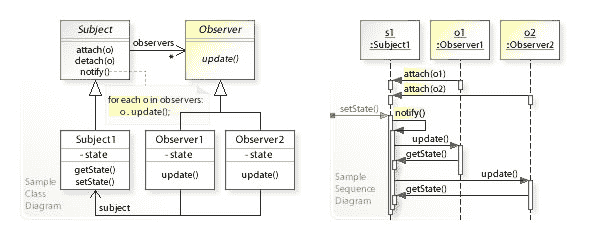

# 你必须知道的 60 个 Java 和 Spring 面试问题

> 原文：<https://dev.to/aershov24/60-java-and-spring-interview-questions-you-must-know-802>

一个优秀的 Java 和 Spring 开发者总是很抢手。据 Indeed 称，目前有 29，694 个 Java 开发人员的职位空缺，16，085 个。网络软件工程师遍布美国。跟随并阅读最新的 Java 和 Spring 面试问题。

> 🔴最初发表于 [FullStack。咖啡馆-杀死你的技术&编码面试](https://www.fullstack.cafe/?utm_source=dev&utm_medium=blog)

### Q1:JDK 和 JRE 有什么不同？

> 题目:**Java**T2】难度:⭐

Java 运行时环境(JRE)基本上是执行 Java 程序的 Java 虚拟机(JVM)。它还包括用于小程序执行的浏览器插件。Java 开发工具包(JDK)是 Java 的全功能软件开发工具包，包括 JRE、编译器和工具(如 JavaDoc 和 Java 调试器)，以便用户开发、编译和执行 Java 应用程序。

🔗**来源:**【github.com/snowdream】T2

### Q2:小应用程序和 Java 应用程序有什么区别？

> 题目:**Java**T2】难度:⭐

小应用程序在支持 java 的浏览器中执行，但是 Java 应用程序是可以在浏览器之外执行的独立 Java 程序。然而，它们都需要 Java 虚拟机(JVM)的存在。此外，Java 应用程序需要具有特定签名的 main 方法，以便开始其执行。Java 小程序不需要这样的方法来开始执行。最后，Java 小程序通常使用限制性的安全策略，而 Java 应用程序通常使用更宽松的安全策略。

🔗**来源:**【github.com/snowdream】T2

### Q3:什么是 JSP 页面？

> 题目:**Java**T2】难度:⭐

Java 服务器页面(JSP)是一个文本文档，包含两种类型的文本:静态数据和 JSP 元素。静态数据可以用任何基于文本的格式表示，比如 HTML 或 XML。JSP 是一种混合静态内容和动态生成内容的技术。

🔗**来源:**【github.com/snowdream】T2

### Q4:什么是 Servlet？

> 题目:**Java**T2】难度:⭐

servlet 是一个 Java 编程语言类，用于处理客户机请求和生成动态 web 内容。Servlets 主要用于处理或存储 HTML 表单提交的数据，提供动态内容和管理无状态 HTTP 协议中不存在的状态信息。

🔗**来源:**【github.com/snowdream】T2

### Q5:什么是按引用传递和按值传递？

> 题目:**Java**T2】难度:⭐⭐

当对象通过值传递时，这意味着传递了对象的副本。因此，即使对该对象进行了更改，也不会影响原始值。当通过引用传递对象时，这意味着实际的对象没有被传递，而是传递了对象的引用。因此，外部方法所作的任何改变，也在所有地方反映出来。

🔗**来源:**【github.com/snowdream】T2

### Q6:Java Collections 框架的基本接口有哪些？

> 题目:**Java**T2】难度:⭐⭐

Java 集合框架提供了一组设计良好的接口和类，支持对对象集合的操作。Java 集合框架中最基本的接口是:

*   [集合](http://docs.oracle.com/javase/7/docs/api/java/util/Collection.html)，表示一组被称为其元素的对象。
*   [Set](http://docs.oracle.com/javase/7/docs/api/java/util/Set.html) ，是不能包含重复元素的集合。
*   [List](http://docs.oracle.com/javase/7/docs/api/java/util/List.html) ，是一个有序集合，可以包含重复元素。
*   [Map](http://docs.oracle.com/javase/7/docs/api/java/util/Map.html) ，是将键映射到值的对象，不能包含重复键。

🔗**来源:**【github.com/snowdream】T2

### Q7:HashMap 和 Hashtable 有什么区别？

> 题目:**Java**T2】难度:⭐⭐

[HashMap](http://docs.oracle.com/javase/7/docs/api/java/util/HashMap.html) 和 [Hashtable](http://docs.oracle.com/javase/7/docs/api/java/util/Hashtable.html) 类都实现了 Map 接口，因此具有非常相似的特征。但是，它们在以下特征上有所不同:

*   一个[散列表](http://docs.oracle.com/javase/7/docs/api/java/util/HashMap.html)允许空键和值的存在，而一个[散列表](http://docs.oracle.com/javase/7/docs/api/java/util/Hashtable.html)既不允许空键，也不允许空值。
*   一个[散列表](http://docs.oracle.com/javase/7/docs/api/java/util/Hashtable.html)是同步的，而一个[散列表](http://docs.oracle.com/javase/7/docs/api/java/util/HashMap.html)不是。因此，[散列表](http://docs.oracle.com/javase/7/docs/api/java/util/HashMap.html)在单线程环境中是首选，而[散列表](http://docs.oracle.com/javase/7/docs/api/java/util/Hashtable.html)适用于多线程环境。
*   一个 [HashMap](http://docs.oracle.com/javase/7/docs/api/java/util/HashMap.html) 提供了它的一组键，Java 应用程序可以遍历它们。因此，一个[散列表](http://docs.oracle.com/javase/7/docs/api/java/util/HashMap.html)是快速失效的。另一方面，[散列表](http://docs.oracle.com/javase/7/docs/api/java/util/Hashtable.html)提供了其键的[枚举](http://docs.oracle.com/javase/7/docs/api/java/util/Enumeration.html)。
*   [哈希表](http://docs.oracle.com/javase/7/docs/api/java/util/Hashtable.html)类被认为是一个遗留类。

🔗**来源:**【github.com/snowdream】T2

### Q8:system . GC()和 Runtime.gc()方法是做什么的？

> 题目:**Java**T2】难度:⭐⭐

这些方法可以用作 JVM 的提示，以便启动垃圾收集。然而，这取决于 Java 虚拟机(JVM)是立即启动垃圾收集还是稍后启动。

🔗**来源:**【github.com/snowdream】T2

### Q9:Java 中异常和错误的区别？

> 题目:**Java**T2】难度:⭐⭐

[异常](http://docs.oracle.com/javase/7/docs/api/java/lang/Exception.html)和[错误](http://docs.oracle.com/javase/7/docs/api/java/lang/Error.html)类都是[可抛出](http://docs.oracle.com/javase/7/docs/api/java/lang/Throwable.html)类的子类。[异常](http://docs.oracle.com/javase/7/docs/api/java/lang/Exception.html)类用于用户程序应该捕捉的异常情况。 [Error](http://docs.oracle.com/javase/7/docs/api/java/lang/Error.html) 类定义了不被用户程序捕获的异常。

🔗**来源:**【github.com/snowdream】T2

### Q10:什么是 Java 小程序？

> 题目:**Java**T2】难度:⭐⭐

java 小应用程序是可以包含在 HTML 页面中并在启用 Java 的客户端浏览器中执行的程序。小程序用于创建动态和交互式的 web 应用程序。

🔗**来源:**【github.com/snowdream】T2

### Q11:什么是 JDBC？

> 题目:**Java**T2】难度:⭐⭐

JDBC 是一个抽象层，允许用户在数据库之间进行选择。JDBC 使开发人员能够用 Java 编写数据库应用程序，而不必关心特定数据库的底层细节。

🔗**来源:**【github.com/snowdream】T2

### Q12:JSP 请求是如何处理的？

> 题目:**Java**T2】难度:⭐⭐

当 jsp 请求到达时，浏览器首先请求一个扩展名为. JSP 的页面。然后，Web 服务器读取请求，并使用 JSP 编译器将 JSP 页面转换成 servlet 类。请注意，JSP 文件仅在页面第一次请求时编译，或者在 JSP 文件发生更改时编译。调用生成的 servlet 类，以便处理浏览器的请求。一旦请求的执行结束，servlet 就向客户机发回一个响应。参见[如何在 JSP](http://examples.javacodegeeks.com/enterprise-java/jsp/get-request-parameter-in-jsp-page/) 中获取请求参数。

🔗**来源:**【github.com/snowdream】T2

### Q13:什么是十诫？

> 题目:**Java**T2】难度:⭐⭐

声明类似于 Java 中的变量声明。声明用于声明变量，以便随后在表达式或 scriptlets 中使用。要添加声明，必须使用序列将声明括起来。

🔗**来源:**【github.com/snowdream】T2

### Q14:使用 Spring 有什么好处？

> 题目:**春天**T2】难度:⭐⭐

下面列出了使用 Spring Framework 的一些好处:

*   **重量轻**—Spring 在尺寸和透明度方面重量轻。spring 框架的基础版在 2MB 左右。
*   **控制反转(IOC)**—松耦合在 spring 中使用控制反转技术实现。对象给出它们的依赖关系，而不是创建或寻找依赖对象。
*   **面向方面(AOP)**Spring 支持面向方面的编程，并通过将应用程序业务逻辑与系统服务分离来实现内聚开发。
*   **容器**—Spring 包含并管理应用对象的生命周期和配置。
*   **MVC 框架**—Spring 的 web 框架是一个设计良好的 web MVC 框架，它为 Struts 等 web 框架或其他过度工程化或不太流行的 web 框架提供了一个很好的替代方案。
*   **事务管理**—Spring 提供了一个一致的事务管理接口，可以向下扩展到本地事务(例如，使用单个数据库)，也可以向上扩展到全局事务(例如，使用 JTA)。
*   **异常处理**—Spring 提供了一个方便的 API 来将特定于技术的异常(例如由 JDBC、Hibernate 或 JDO 抛出的)转换成一致的、未经检查的异常。

🔗**来源:**【tutorialspoint.com】T2

### Q15:春豆是什么？

> 题目:**春天**T2】难度:⭐⭐

构成应用程序主干并由 Spring IoC 容器管理的对象被称为**bean**。bean 是由 Spring IoC 容器实例化、组装和管理的对象。这些 beans 是用您提供给容器的配置元数据创建的，例如，以 XML `<bean/>`定义的形式。

🔗**来源:**【tutorialspoint.com】T2

### Q16:ORM 的弹簧支撑是什么？

> 题目:**春天**T2】难度:⭐⭐

Spring 支持以下 ORM:

*   冬眠
*   伊巴蒂斯
*   Java 持久性 API
*   TopLink
*   JDO (Java 数据对象)
*   OJB

🔗**来源:**【tutorialspoint.com】T2

### Q17:什么是春安？

> 题目:**春天**T2】难度:⭐⭐

**Spring Security** 是 Spring 框架的一个独立模块，专注于在 Java 应用程序中提供认证和授权方法。它还处理了大多数常见的安全漏洞，如 CSRF 攻击。

要在 web 应用程序中使用 Spring Security，可以从一个简单的注释开始: *@EnableWebSecurity* 。

🔗**来源:**【developersbook.com】T2

### Q18:什么是循环队列，为什么要使用循环队列？

> 题目:**数据结构**
> 难度:⭐⭐⭐

**循环队列**是一种*线性数据结构*，根据 FIFO(先进先出)原则进行操作，最后一个位置连接回第一个位置构成一个循环。它也被称为*环形缓冲器*。循环队列避免了使用数组的常规队列实现中的*空间浪费*。

🔗**来源:**【programiz.com】T2

### Q19:“编程是为了接口，而不是实现”是什么意思？

> 主题:**设计模式**
> 难度:⭐⭐⭐

*针对接口*编码意味着，客户代码总是持有一个由*工厂*提供的接口对象。

工厂返回的任何实例都是接口类型，任何工厂候选类都必须实现它。这样，客户程序就不用担心实现问题，接口签名决定了所有的操作可以做什么。

这种方法可以用来在运行时改变程序的行为。从维护的角度来看，这也有助于您编写更好的程序。

🔗**来源:**【tutorialspoint.com】T2

### Q20:什么是观察者模式？

> 主题:**设计模式**
> 难度:⭐⭐⭐

**观察者模式**(也称为*发布-订阅模式*)在对象之间存在一对多关系时使用，例如如果一个对象被修改，它的依赖对象将被自动通知。观察者模式属于*行为*模式类别。

与对其状态感兴趣的其他对象具有一对多关系的对象称为*主体*或*发布者*。每当*主体*的状态发生变化时，*观察者*就会收到通知，并采取相应的行动。*主题*可以通知任意数量的从属*观察者*，任意数量的*观察者*可以订阅*主题*以接收此类通知。

观察者模式使用两个参与者类:

*   Observer (os Subscriber)抽象类提供了一个`update()`方法，主题将调用该方法来通知它主题的状态变化。
*   Subject(或 Publisher)类也是一个抽象类，它定义了四个主要方法:`attach()`、`detach()`、`setState()`和`notify()`

🔗**来源:**【sitepoint.com】T2

### Q21:可以在静态上下文中访问非静态变量吗？

> 题目:**Java**T2】难度:⭐⭐⭐

Java 中的静态变量属于它的类，它的值对于它的所有实例都保持不变。当类被 JVM 加载时，静态变量被初始化。如果你的代码试图在没有任何实例的情况下访问一个非静态变量，编译器将会报错，因为那些变量还没有被创建，它们也没有与任何实例相关联。

🔗**来源:**【github.com/snowdream】T2

### Q22:Java 支持多重继承吗？

> 题目:**Java**T2】难度:⭐⭐⭐

不，Java 不支持多重继承。每个类只能在一个类上扩展，但是可以实现多个接口。

🔗**来源:**【github.com/snowdream】T2

### Q23:解释创建线程的不同方式。你更喜欢哪一个，为什么？

> 题目:**Java**T2】难度:⭐⭐⭐

有三种方法可以用来创建[线程](http://docs.oracle.com/javase/7/docs/api/java/lang/Thread.html):

*   类可以扩展[线程](http://docs.oracle.com/javase/7/docs/api/java/lang/Thread.html)类。
*   一个类可以实现 [Runnable](http://docs.oracle.com/javase/7/docs/api/java/lang/Runnable.html) 接口。
*   一个应用程序可以使用 [Executor](http://docs.oracle.com/javase/7/docs/api/java/util/concurrent/Executor.html) 框架，以便创建一个线程池。

最好使用 [Runnable](http://docs.oracle.com/javase/7/docs/api/java/lang/Runnable.html) 接口，因为它不需要一个对象来继承[线程](http://docs.oracle.com/javase/7/docs/api/java/lang/Thread.html)类。如果您的应用程序设计需要多重继承，只有接口可以帮助您。此外，线程池非常高效，可以非常容易地实现和使用。

🔗**来源:**【github.com/snowdream】T2

### Q24:什么是死锁？

> 题目:**Java**T2】难度:⭐⭐⭐

当[两个进程在继续进行之前都在等待对方完成](http://www.javacodegeeks.com/2013/01/java-deadlock-example-how-to-analyze-deadlock-situation.html)时出现的一种情况。结果是两个进程无休止地等待。

🔗**来源:**【github.com/snowdream】T2

### Q25:故障快速和故障安全有什么区别？

> 题目:**Java**T2】难度:⭐⭐⭐

[迭代器的](http://docs.oracle.com/javase/7/docs/api/java/util/Iterator.html)故障安全属性与底层集合的克隆一起工作，因此，它不受集合中任何修改的影响。java.util 包中的所有集合类都是故障快速的，而 java.util.concurrent 中的集合类是故障安全的。故障快速迭代器抛出一个[并发修改异常](http://examples.javacodegeeks.com/java-basics/exceptions/java-util-concurrentmodificationexception-how-to-handle-concurrent-modification-exception/)，而故障安全迭代器从不抛出这样的异常。

🔗**来源:**【github.com/snowdream】T2

### Q26:什么是 Java 优先级队列？

> 题目:**Java**T2】难度:⭐⭐⭐

[PriorityQueue](http://docs.oracle.com/javase/7/docs/api/java/util/PriorityQueue.html) 是一个无限队列，基于优先级堆，其元素按自然顺序排列。在创建它的时候，我们可以提供一个比较器，负责对[优先级队列](http://docs.oracle.com/javase/7/docs/api/java/util/PriorityQueue.html)的元素进行排序。一个[优先级队列](http://docs.oracle.com/javase/7/docs/api/java/util/PriorityQueue.html)不允许空值，那些不提供自然排序的对象，或者那些没有任何关联比较器的对象。最后，Java [PriorityQueue](http://docs.oracle.com/javase/7/docs/api/java/util/PriorityQueue.html) 不是线程安全的，它的排队和出队操作需要 O(log(n))时间。

🔗**来源:**【github.com/snowdream】T2

### Q27:finalize()什么时候调用？定案的目的是什么？

> 题目:**Java**T2】难度:⭐⭐⭐

finalize 方法由垃圾收集器在释放对象内存之前调用。通常建议释放 finalize 方法中对象持有的资源。

🔗**来源:**【github.com/snowdream】T2

### Q28:Java 堆的结构是什么？

> 题目:**Java**T2】难度:⭐⭐⭐

JVM 有一个堆，它是运行时数据区，所有类实例和数组的内存都是从这个堆中分配的。它是在 JVM 启动时创建的。对象的堆内存由自动内存管理系统回收，该系统称为垃圾收集器。堆内存由活对象和死对象组成。活动对象可由应用程序访问，并且不会成为垃圾收集的对象。死对象是那些应用程序永远无法访问，但垃圾收集器还没有收集的对象。这些对象会占用堆内存空间，直到最终被垃圾收集器收集。

🔗**来源:**【github.com/snowdream】T2

### Q29:Java 小程序有什么限制？

> 题目:**Java**T2】难度:⭐⭐⭐

主要由于安全原因，对 Java 小程序施加了以下限制:

*   applet 不能加载库或定义本机方法。
*   applet 通常不能在执行主机上读写文件。
*   小程序无法读取某些系统属性。
*   applet 不能进行网络连接，除非连接到它所来自的主机。
*   applet 不能在执行它的主机上启动任何程序。

🔗**来源:**【github.com/snowdream】T2

### Q30:什么是 Scriptlets？

> 题目:**Java**T2】难度:⭐⭐⭐

在 Java 服务器页面(JSP)技术中，scriptlet 是嵌入在 JSP 页面中的一段 Java 代码。scriptlet 是标记中的所有内容。在这些标签之间，用户可以添加任何有效的脚本。

🔗**来源:**【github.com/snowdream】T2

### Q31:陈述一个界面的特性。

> 题目:**OOP**T2】难度:⭐⭐⭐

接口是只包含方法签名的模板。方法的签名由参数数量、参数类型(值、引用或输出)和参数顺序组成。接口本身没有实现，因为它只包含方法的定义，没有任何方法体。使用*接口*关键字定义接口。此外，您不能实例化接口。界面的各种功能如下:

*   接口用于在代码中实现多重继承。接口的这个特性与抽象类的特性有很大的不同，因为一个类不能派生出多个类的特性，但是可以很容易地实现多个接口。
*   它定义了一组特定的方法及其参数。
*   接口中的变量必须声明为 *public* 、 *static* 和 *final* ，而方法必须声明为 *public* 和 *abstract* 。
*   实现接口的类必须实现它的所有方法。
*   一个接口可以从多个接口派生。

🔗**来源:**【indiabix.com】T2

### Q32:固体代表什么？它的原理是什么？

> 主题:**软件架构**
> 难度:⭐⭐⭐

S.O.L.I.D 是 Robert C. Martin 提出的前五个面向对象设计(OOD)原则的首字母缩写。

*   **S** - *单一责任原则*。一个类应该有且只有一个改变的理由，这意味着一个类应该只有一个作业。
*   **O** - *开闭原理*。对象或实体应该对扩展开放，但对修改关闭。
*   **L** - *利斯科夫替代原理*。设 q(x)是关于 t 类型的对象 x 的一个可证明的性质，那么 q(y)对于 S 类型的对象 y 应该是可证明的，其中 S 是 t 的子类型。
*   **I** - *界面偏析原理*。永远不要强迫客户端实现它不使用的接口，也不要强迫客户端依赖它们不使用的方法。
*   **D** - *依存倒置原则*。实体必须依赖抽象，而不是具体。它声明高级模块不能依赖于低级模块，但是它们应该依赖于抽象。

🔗**来源:** [scotch.io](https://scotch.io/bar-talk/s-o-l-i-d-the-first-five-principles-of-object-oriented-design)

### Q33:干死原理是什么？

> 主题:**软件架构**
> 难度:⭐⭐⭐

在软件工程中，**不要重复自己(DRY)** 或**重复就是邪恶(DIE)** 是软件开发的一个原则。

🔗**来源:**【stackoverflow.com】T2

### Q34:从返回值不存在的函数/方法返回 NULL 或空值是否更好？

> 主题:**软件架构**
> 难度:⭐⭐⭐

如果您打算指出没有数据可用，返回`null`通常是最好的办法。

空对象意味着数据已经返回，而返回`null`清楚地表明没有返回任何东西。

此外，如果您试图访问对象中的成员，返回一个`null`将导致一个空异常，这对于突出错误代码是有用的——试图访问一个空成员是没有意义的。访问一个空对象的成员不会失败，这意味着错误不会被发现。

🔗**来源:**【stackoverflow.com】T2

### Q35:解释 Spring 框架中 Bean 的生命周期

> 题目:**春天**T2】难度:⭐⭐⭐

以下是 Spring 中 bean 生命周期的序列:

*   首先，spring 容器从 XML 文件中找到 bean 的定义，并实例化 bean..
*   **填充属性**——使用依赖注入，spring 填充 bean 定义中指定的所有属性。
*   **设置 bean 名称**——如果 bean 实现了 BeanNameAware 接口，spring 会将 Bean 的 id 传递给 Set Bean Name()方法。
*   **设置 Bean 工厂**——如果 Bean 实现了 BeanFactoryAware 接口，spring 将 Bean factory 传递给 Set Bean factory()方法。
*   **预初始化**——也称为 bean 的后处理。如果有任何 bean BeanPostProcessors 与 bean 相关联，Spring 将调用 postprocesserbeforeininitial ization()方法。
*   **初始化 bean**—如果 bean 实现了 IntializingBean，则调用其 afterPropertySet()方法。如果 bean 具有 init 方法声明，则调用指定的初始化方法。
*   **后初始化**—如果有任何与 bean 相关联的 BeanPostProcessors，将调用它们的 postProcessAfterInitialization()方法。
*   **准备好使用**—现在应用程序已经准备好使用 bean 了。
*   **Destroy**——如果 bean 实现了 DisposableBean，它将调用 Destroy()方法。

🔗**来源:**【tutorialspoint.com】T2

### Q36:Spring MVC 框架中控制器是什么？

> 题目:**春天**T2】难度:⭐⭐⭐

**控制器**提供对应用程序行为的访问，这些行为通常是通过服务接口定义的。控制器解释用户的输入，并将其转换成由视图呈现给用户的模型。Spring 以非常抽象的方式实现了一个控制器，这使您能够创建各种各样的控制器。

🔗**来源:**【tutorialspoint.com】T2

### Q37:什么是方面？

> 题目:**春天**T2】难度:⭐⭐⭐

一个**方面**是一个模块，它有一组提供*横切*需求的 API。例如，一个日志模块将被称为 AOP 方面。根据需求，应用程序可以有任意数量的方面。在 Spring AOP 中，方面是使用常规类(基于模式的方法)或用@Aspect 注释(`@AspectJ`样式)注释的常规类来实现的。

🔗**来源:**【tutorialspoint.com】T2

### Q38:Spring Bean Factory 容器中典型的 Bean 生命周期是怎样的？

> 题目:**春天**T2】难度:⭐⭐⭐

Spring Bean Factory 容器中的 Bean 生命周期如下:

*   spring 容器从 XML 文件中找到 bean 定义，并实例化 bean。

*   使用依赖注入，spring 填充 bean 定义中指定的所有属性

*   如果 bean 实现了 BeanNameAware 接口，工厂调用`setBeanName()`传递 beans ID。

*   如果 bean 实现了 BeanFactoryAware 接口，那么工厂调用`setBeanFactory()`，传递它自己的一个实例。

*   如果有任何与 bean 相关联的 BeanPostProcessors，将调用它们的 post-to 方法。

*   如果为 bean 指定了 init-method，它将被调用。

*   最后，如果有任何与 bean 相关联的 BeanPostProcessors，它们的`postProcessAfterInitialization()`方法将被调用。

🔗**来源:**【developersbook.com】T2

### Q39:Spring MVC 框架中如何处理异常？

> 题目:**春天**T2】难度:⭐⭐⭐

Spring MVC 框架提供了以下方法来帮助我们实现健壮的异常处理。

1.  **基于控制器的**–我们可以在控制器类中定义异常处理方法。我们只需要用@ExceptionHandler 注释来注释这些方法。
2.  **全局异常处理程序**——异常处理是一个跨领域的问题，Spring 提供了@ControllerAdvice 注释，我们可以用它来定义我们的全局异常处理程序。
3.  **HandlerExceptionResolver 实现**–对于一般的异常，大多数时候我们提供静态页面。Spring 框架提供了`HandlerExceptionResolver`接口，我们可以实现它来创建全局异常处理程序。这种定义全局异常处理程序的额外方法背后的原因是，spring framework 还提供了默认的实现类，我们可以在 spring bean 配置文件中定义这些类，以获得 Spring framework 异常处理的好处。

🔗**来源:**【journaldev.com】T2

### Q40:什么是 Spring IoC 容器？

> 题目:**春天**T2】难度:⭐⭐⭐

**控制反转** (IoC)是实现对象依赖之间松耦合的机制。为了在运行时实现对象的松散耦合和动态绑定，对象定义了由其他汇编器对象注入的依赖关系。Spring IoC container 是一个程序，它将依赖项注入到一个对象中，并使它可供我们使用。

Spring Framework IoC 容器类是`org.springframework.beans`和`org.springframework.context`包的一部分，为我们提供了不同的方法来分离对象依赖。

我们使用的一些有用的 ApplicationContext 实现有:

*   `AnnotationConfigApplicationContext`:用于使用基于注释的配置的独立 java 应用程序。
*   `ClassPathXmlApplicationContext`:用于使用基于 XML 的配置的独立 java 应用程序。
*   `FileSystemXmlApplicationContext`:类似于 ClassPathXmlApplicationContext，除了 xml 配置文件可以从文件系统中的任何地方加载。
*   web 应用程序的`AnnotationConfigWebApplicationContext`和`XmlWebApplicationContext`。

🔗**来源:**【journaldev.com】T2

### Q41:dispatcher servlet 是否通过应用上下文实例化？

> 题目:**春天**T2】难度:⭐⭐⭐

不，`DispatcherServlet`是由 Tomcat 或 Jetty 之类的 Servlet 容器实例化的。您必须将`DispatcherServlet`定义到 web.xml 文件中，如下所示。

您可以看到 load-on-startup 标记为 1，这意味着当您将 Spring MVC 应用程序部署到 Tomcat 或任何其他 Servlet 容器时，`DispatcherServlet`被实例化。在实例化过程中，它查找文件 servlet-name-context.xml，然后初始化该文件中定义的 beans。

🔗**来源:**【dzone.com】T2

### Q42:会话范围的目的是什么？

> 题目:**春天**T2】难度:⭐⭐⭐

**会话范围**的目的是为 HTTP 会话创建一个 bean 实例。这意味着，如果同一个 bean 在会话中限定了作用域，它就可以服务于多个请求。您可以在 Spring MVC 应用程序中使用 scope 属性或`@Scope`注释来定义 Spring bean 的作用域。

🔗**来源:**【dzone.com】T2

### Q43:同步的方法和同步的块有什么区别？

> 题目:**Java**T2】难度:⭐⭐⭐⭐

在 Java 编程中，每个对象都有一个锁。线程可以通过使用 synchronized 关键字来获取对象的锁。synchronized 关键字可以应用于方法级(粗粒度锁)或代码块级(细粒度锁)。

🔗**来源:**【github.com/snowdream】T2

### Q44:如何保证 N 个线程可以无死锁的访问 N 个资源？

> 题目:**Java**T2】难度:⭐⭐⭐⭐

在使用 N 个线程时，避免死锁的一个非常简单的方法是对锁进行排序，并强制每个线程遵循该排序。因此，如果所有线程以相同的顺序锁定和解锁互斥体，就不会出现死锁。

🔗**来源:**【github.com/snowdream】T2

### Q45:堆中 Perm Gen 空间是什么？

> 题目:**Java**T2】难度:⭐⭐⭐⭐

Perm Gen 代表永久世代。它是 Java 堆上保存描述用户类(不属于 Java 语言的类)的元数据的空间。这种元数据的例子是描述类和方法的对象，它们存储在永久生成中。具有大型代码库的应用程序可以快速填满这部分堆，这将导致`java.lang.OutOfMemoryError: PermGen`无论您的`-Xmx`(内存分配池的最大大小)有多高，以及您在机器上有多少内存。

🔗**来源:**【github.com/snowdream】T2

### Q46:什么是 RMI？

> 题目:**Java**T2】难度:⭐⭐⭐⭐

Java 远程方法调用(Java RMI)是一个 Java API，它执行远程过程调用(RPC)的面向对象等效功能，支持序列化 Java 类的直接传输和分布式垃圾收集。远程方法调用(RMI)也可以看作是在远程运行的对象上激活方法的过程。RMI 提供了位置透明性，因为用户感觉一个方法是在本地运行的对象上执行的。

🔗**来源:**【github.com/snowdream】T2

### Q47:解释不同类型的继承。

> 题目:**OOP**T2】难度:⭐⭐⭐⭐

OOP 中的继承有四种类型:

*   **单一继承** -包含一个基类和一个派生类
*   **层次继承** -包含一个基类和同一个基类的多个派生类
*   **多级继承** -包含一个从派生类中派生的类
*   **多重继承** -包含几个基类和一个派生类

全部。NET 语言支持单一、层次和多级继承。它们不支持多重继承，因为在这些语言中，派生类不能有多个基类。但是，您可以通过接口实现多重继承 in.NET。

🔗**来源:**【indiabix.com】T2

### Q48:神级是什么，为什么要避免？

> 主题:**软件架构**
> 难度:⭐⭐⭐⭐

破解应用程序最有效的方法就是创建 **GOD** 类。这些类记录了大量信息，并有多种职责。一个代码更改很可能会影响到类的其他部分，从而间接影响到使用它的所有其他类。这反过来导致了更大的维护混乱，因为除了添加新功能之外，没有人敢做任何改变。

🔗**来源:**【stackoverflow.com】T2

### Q49:Spring 支持哪些 bean 作用域？解释一下。

> 题目:**春天**T2】难度:⭐⭐⭐⭐

Spring 框架支持以下五个范围，其中三个只有在使用 web 感知的 ApplicationContext 时才可用。

*   **singleton**——这将 bean 定义的范围限定为每个 Spring IoC 容器的一个实例。
*   **prototype**——这将单个 bean 定义的范围限定为具有任意数量的对象实例。
*   **请求**——这将 bean 定义的范围限定为 HTTP 请求。仅在 web 感知的 Spring ApplicationContext 的上下文中有效。
*   **会话**—这将 bean 定义的范围限定为 HTTP 会话。仅在 web 感知的 Spring ApplicationContext 的上下文中有效。
*   **全局会话**—这将 bean 定义的范围限定为全局 HTTP 会话。仅在 web 感知的 Spring ApplicationContext 的上下文中有效。

🔗**来源:**【tutorialspoint.com】T2

### Q50:什么是编织？

> 题目:**春天**T2】难度:⭐⭐⭐⭐

编织是将*方面*与其他应用程序类型或对象链接起来以创建一个通知对象的过程。

🔗**来源:**【tutorialspoint.com】T2

### Q51:Spring AOP 中的关注点和横切关注点有什么区别？

> 题目:**春天**T2】难度:⭐⭐⭐⭐

*   **关注点**——关注点是我们希望在应用程序的模块中出现的行为。关注可以被定义为我们想要实现的功能。我们感兴趣的问题定义了我们的关注点。
*   **横切关注点**——这是一个适用于整个应用的关注点，它影响整个应用。例如，日志记录、安全性和数据传输是应用程序的几乎每个模块都需要考虑的问题，因此是跨领域的问题。

🔗**来源:**【tutorialspoint.com】T2

### Q52:使用 Spring 事务有什么好处？

> 题目:**春天**T2】难度:⭐⭐⭐⭐

*   跨不同的事务 API(如 JTA、JDBC、Hibernate、JPA 和 JDO)提供一致的编程模型
*   支持声明式事务管理
*   为程序化事务管理提供了比一些复杂的事务 API(如 JTA)更简单的 API
*   与 Spring 的各种数据访问抽象很好地集成

🔗**来源:**【baeldung.com】T2

### Q53:什么是面向方面编程？

> 题目:**春天**T2】难度:⭐⭐⭐⭐

*Aspects* 通过在不修改受影响的类的情况下向已有代码添加额外的行为，支持跨多种类型和对象的横切关注点的模块化，例如事务管理。

🔗**来源:**【baeldung.com】T2

### Q54:什么是 Spring WebFlux？

> 题目:**春天**T2】难度:⭐⭐⭐⭐

Spring WebFlux 是 Spring 的反应式堆栈 web 框架，是 Spring MVC 的替代方案。为了实现这种反应式模型和高度可伸缩性，整个堆栈是非阻塞的。

🔗**来源:**【baeldung.com】T2

### Q55:比较@ Component(2.5 版)和@ Bean(3.0 版)

> 题目:**春天**T2】难度:⭐⭐⭐⭐

是否有可能重用@Component 注释，而不是引入@Bean 注释？

* * *

`@Component`和`@Bean`做两件截然不同的事情，不应该混淆。

*   `@Component`(以及`@Service`和`@Repository`)用于使用类路径扫描自动检测和自动配置 beans。在带注释的类和 bean 之间有一个隐式的一对一映射(即每个类一个 bean)。这种方法对连接的控制非常有限，因为它完全是声明性的。

*   `@Bean`用于*显式地*声明单个 bean，而不是让 Spring 来做

*回答你的问题* :
肯定，大概；但是他们选择不这样做，因为这两者是完全不同的。春天已经够混乱了，不要再搅浑水了。

🔗**来源:**【stackoverflow.com】T2

### Q56:依赖注入和服务定位器模式有什么区别？

> 主题:**设计模式**
> 难度:⭐⭐⭐⭐⭐

*   有了 **ServiceLocator** ，这个类仍然负责创建它的依赖项。它只是使用服务定位器来做这件事。
*   **服务定位器**隐藏依赖关系——你不能通过查看一个对象来判断它是否命中数据库(例如)当它从定位器获得连接时。
*   使用 **DI** ，类被赋予它的依赖项。它既不知道，也不关心他们从哪里来。

这样做的一个重要结果是 DI 示例更容易进行单元测试——因为您可以向它传递其依赖对象的模拟实现。如果您愿意，您可以将两者结合起来，并注入服务定位器(或工厂)。

🔗**来源:**【stackoverflow.com】T2

### Q57:RMI 架构有几层？

> 题目:**Java**T2】难度:⭐⭐⭐⭐⭐

RMI 体系结构由以下几层组成:

*   存根和框架层:这一层正好位于开发人员的视野之下。这一层负责拦截客户端对接口的方法调用，并将这些调用重定向到远程 RMI 服务。
*   远程引用层:RMI 体系结构的第二层处理从客户机到服务器远程对象的引用的解释。这一层解释和管理客户端对远程服务对象的引用。该连接是一对一(单播)链路。
*   传输层:这一层负责连接参与服务的两个 JVM。这一层基于网络中机器之间的 TCP/IP 连接。它提供基本的连接，以及一些防火墙穿透策略。

🔗**来源:**【github.com/snowdream】T2

### Q58:联想、聚合、组合有什么区别？

> 题目:**OOP**T2】难度:⭐⭐⭐⭐⭐

*   **关联**是所有对象都有自己的生命周期，没有所有者的关系。

我们举个老师和学生的例子。多个学生可以与单个教师关联，单个学生可以与多个教师关联，但是对象之间没有所有权，并且都有自己的生命周期。两者都可以独立创建和删除。

*   **聚合**是一种特殊形式的关联，其中所有对象都有自己的生命周期，但存在所有权，子对象不能属于另一个父对象。

我们举个部门和老师的例子。单个教师不能属于多个部门，但是如果我们删除部门，教师对象将*而不是*被销毁。我们可以把它想成一种“有-有”的关系。

*   **组合**也是聚合的特殊形式，我们可以称之为“死亡”关系。这是一种强类型的聚集。子对象没有生命周期，如果父对象被删除，所有子对象也将被删除。

让我们再举一个房子和房间之间关系的例子。房子可以包含多个房间——没有独立生活的房间，任何房间都不能属于两个不同的房子。如果我们删除房子，房间将自动被删除。

让我们再举一个问题和选项之间关系的例子。单个问题可以有多个选项，并且选项不能属于多个问题。如果我们删除问题，选项将自动删除。

🔗**来源:**【stackoverflow.com】T2

### Q59:Spring 框架的一些最佳实践是什么？

> 题目:**春天**T2】难度:⭐⭐⭐⭐⭐

1.  避免在模式参考中使用版本号，以确保我们拥有最新的配置。
2.  根据关注点划分 spring bean 配置，比如 spring-jdbc.xml、spring-security.xml。
3.  对于在 Spring MVC 的多个上下文中使用的 spring beans，在根上下文中创建它们并用 listener 初始化。
4.  尽可能配置 bean 依赖，尽可能避免自动连接。
5.  对于应用程序级别的属性，最好的方法是创建一个属性文件，并在 spring bean 配置文件中读取它。
6.  对于较小的应用程序，注释是有用的，但是对于较大的应用程序，注释可能会成为一种痛苦。如果我们在 XML 文件中有所有的配置，维护它将会更容易。
7.  为组件使用正确的注释，以便于理解目的。对于服务使用@Service，对于 DAO beans 使用@Repository。
8.  Spring 框架有很多模块，用你需要的。当你通过 Spring 工具套件模板创建项目时，去掉所有额外的依赖项。
9.  如果你使用方面，确保连接点尽可能的窄，以避免不需要的方法的建议。考虑更容易使用和避免任何问题的自定义注释。
10.  当有实际好处时使用依赖注入，只是为了松散耦合不要使用它，因为它更难维护。

🔗**来源:**【journaldev.com】T2

### Q60:春天自动布线是如何工作的？

> 题目:**春天**T2】难度:⭐⭐⭐⭐⭐

首先，也是最重要的——所有的 Spring beans 都是托管的——它们“生活”在一个容器中，称为“应用程序上下文”。

其次，每个应用程序都有一个指向该上下文的入口点。Web 应用程序有 Servlet，JSF 使用 el-resolver，等等。此外，还有一个地方可以引导应用程序上下文并自动连接所有 beans。在 web 应用程序中，这可以是一个启动监听器。

通过将一个 bean 的实例放入另一个 bean 的实例中的所需字段，可以实现自动连接。这两个类都应该是 beans，也就是说，它们应该被定义为存在于应用程序上下文中。

应用语境中的“活”是什么？这意味着*上下文*实例化对象，而不是您。也就是说——你永远不要做`new UserServiceImpl()`——容器找到每个注入点并在那里设置一个实例。

🔗**来源:**【stackoverflow.com】T2

> 谢谢🙌阅读，祝你面试好运！
> *如果你喜欢这篇文章，请分享给你的开发者伙伴！*
> *查看更多全栈面试问题&答案上👉[www . full stack . cafe](https://www.fullstack.cafe)T9】*