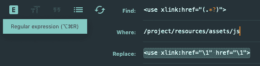

# Sublime 3:使用正则表达式查找和替换的快速技巧

> 原文：<https://dev.to/jamesthomson/sublime-3-a-quick-tip-using-find-and-replace-with-regex-3p1d>

**TL；博士**

*使用`(.*?)`来匹配给定上下文中的任何内容。*
*用`\1`替换为匹配的值。*

*例如*

*找:`<use xlink:href="(.*?)”>`*
换成:`<use xlink:href="\1" href="\1">`

## 长版

最近我发现了一个关于 Chrome 如何引用带有`<use>`标签的外部 SVG 的 bug。不管出于什么原因，Chrome 有一个问题，如果 SVG 文件没有被缓存，它有时不能呈现引用的 SVG。更令人沮丧的是，这个问题似乎时断时续。

在[栈溢出](https://stackoverflow.com/a/47332915/6518644)上的一个用户建议，因为`xlink:href`属性被否决了，所以使用`href`解决了这个问题。所以，我想我应该试试，为什么不呢？唯一的问题是，我在整个项目中使用这个标签，所以手动查找每个标签并替换值将是一项乏味的任务...尤其是不知道这个建议是否真的能解决问题。

输入 Sublime 的查找并用正则表达式替换选项。

假设我有这个标签

```
<use xlink:href="/icons/symbol-defs.svg#icon-refresh"></use> 
```

Enter fullscreen mode Exit fullscreen mode

我需要添加另一个属性，但它必须使用与`xlink:href`属性相同的值。

我所需要做的就是启动 Sublime 的查找和替换对话框(在 Mac 中是 Cmd+Shift+F，在 Windows/Linux 中是 Ctrl+Shift+F)，确保 Regex 图标被打开，然后输入这些值:

找到:`<use xlink:href="(.*?)”>`
替换:`<use xlink:href="\1" href="\1">`

这是在 Sublime 中的样子:

[](https://res.cloudinary.com/practicaldev/image/fetch/s--k9bJlWXq--/c_limit%2Cf_auto%2Cfl_progressive%2Cq_auto%2Cw_880/https://thepracticaldev.s3.amazonaws.com/i/1y0k7bmvkxriesrk04a3.png)

这样做的目的是匹配`xlink:href`属性双引号中的任何内容，并将值复制到替换的标签中。

所以我们以
结束

```
<use xlink:href="/icons/symbol-defs.svg#icon-refresh" href="/icons/symbol-defs.svg#icon-refresh"></use> 
```

Enter fullscreen mode Exit fullscreen mode

太简单了，对吧？就是这样，只是一个让你生活更轻松的小提示。

编码快乐！🤓

另外，如果你想知道的话，补丁没有用，但是至少我学到了一些新东西，对吗？😉