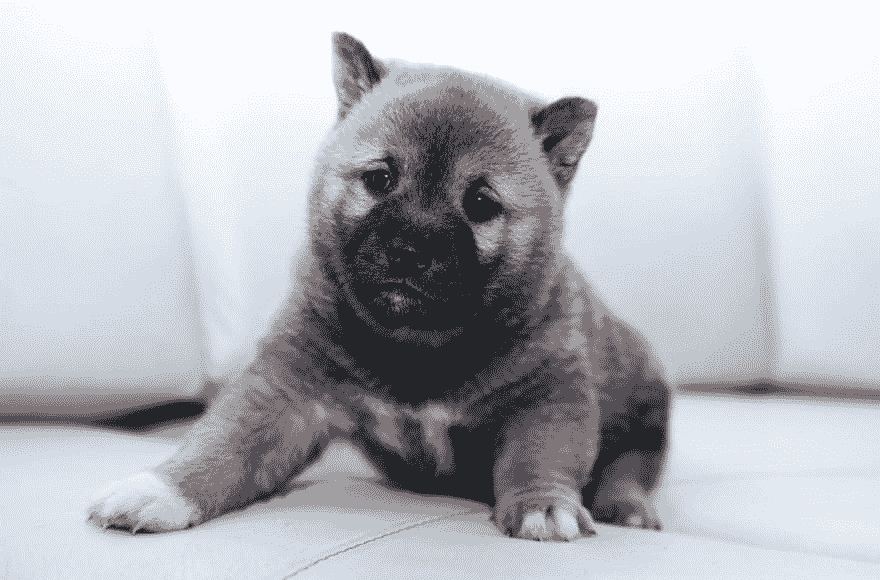

# 用机器学习检测可爱的动物

> 原文：<https://dev.to/vorahsa/detecting-cute-animals-with-machine-learning-df2>

#### 训练并构建自定义图像分类器手机 app

<figure> 

<figcaption>照片由[Á·阿尔瓦罗·尼诺](https://unsplash.com/photos/e9ZJpC8P0UY?utm_source=unsplash&utm_medium=referral&utm_content=creditCopyText)上[下](https://unsplash.com/search/photos/cute?utm_source=unsplash&utm_medium=referral&utm_content=creditCopyText)</figcaption>

</figure>

当我的一位数据科学家同事最近发现我有移动应用开发背景时，他让我向他展示如何在移动应用中使用机器学习模型。我认为一个图像分类应用程序，比如经典的 [Not Hotdog](https://medium.com/@timanglade/how-hbos-silicon-valley-built-not-hotdog-with-mobile-tensorflow-keras-react-native-ef03260747f3) ，将是一个很好的例子，因为它也需要连接到手机的摄像头，而不仅仅是一个运行在手机而不是桌面上的模型。

我花了一段时间来拼凑我需要的所有东西，以制作一个完整的应用程序。这就是为什么我认为写一个帖子会很有用，这样整个旅程都可以在一个地方记录下来。我写的所有代码，获取训练图像，训练模型，以及应用程序本身，都可以在 Github 上获得。代码经过了全面的注释，因为我希望它对数据科学家和移动应用程序开发人员都有用。

### 造什么？

起初我以为我只是建立一个热狗探测器，并发现了一个通过模型建立部分的[帖子。但是我身边没有很多热狗，所以演示这样一个应用程序会很困难。因为我喜欢可爱的动物，所以我决定做一个可爱探测器，作为一个更抽象的概念，它可以在许多日常环境中演示。](https://towardsdatascience.com/building-the-hotdog-not-hotdog-classifier-from-hbos-silicon-valley-c0cb2317711f)

对于训练数据的来源，我挑了 [ImageNet](http://image-net.org/) 。我决定将小狗和小猫的图片作为我的“可爱”训练数据，并有点武断地将爬行动物和有蹄动物作为我的“不可爱”训练数据。在过滤掉不可用的图片后，我剩下了 1718 个可爱的图片和 1962 个不可爱的图片。视觉上验证我有好的数据肯定验证了爬虫的选择是“不可爱”。Brrrrr…

### 用盗梦转移学习

对于自定义图像分类，[迁移学习](https://machinelearningmastery.com/transfer-learning-for-deep-learning/)是必由之路。从头开始训练一个图像分类器需要花费很多时间，我能想到的任何网络架构都不会比当前的技术水平更好。我选择了 InceptionV3，因为我发现了一篇[的好文章，其中有关于如何用它制作自定义图像分类器的示例代码](https://medium.com/abraia/first-steps-with-transfer-learning-for-custom-image-classification-with-keras-b941601fcad5)。

建立模型的关键点是以 InceptionV3 模型为基础，增加一个新的分类层，并将训练限制在新的分类层。由于训练数据来自 ImageNet，因此 InceptionV3 构造函数被告知使用这些权重。另一个参数表示排除顶层，顶层进行实际的分类，因为我将使用我自己的层进行分类。