# 在 Nodejs / MongoDB /Passport /JWT 中构建 REST API

> 原文：<https://dev.to/kris/building-rest-api-in-nodejs-mongodb-passport-jwt-4hbj>

### 用 Nodejs / MongoDB /Passport /JWT 构建 REST API

[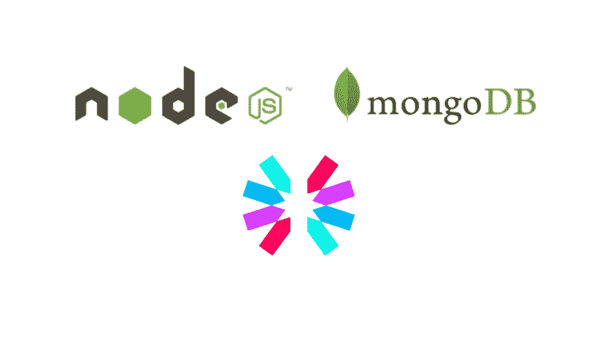](https://res.cloudinary.com/practicaldev/image/fetch/s--2U9I6WFx--/c_limit%2Cf_auto%2Cfl_progressive%2Cq_auto%2Cw_880/https://cdn-images-1.medium.com/max/1024/1%2AYsFDKm7rl77RLGf3m9WytA.png)

如果你在参加这个 **Wes Bos** 课程之前不知道 Node 和 JS，这将帮助你快速起步

[](https://res.cloudinary.com/practicaldev/image/fetch/s--Y4ebZ1_C--/c_limit%2Cf_auto%2Cfl_progressive%2Cq_auto%2Cw_880/https://cdn-images-1.medium.com/proxy/1%2AouK9XR4xuNWtCes-TIUNAw.png)

#### **学习使用 Node.js、Express、MongoDB 和 friends 构建应用程序的高级培训课程。** [**现在开始学习→**](https://LearnNode.com/friend/KRISSANAWAT)

[](https://res.cloudinary.com/practicaldev/image/fetch/s--Y4ebZ1_C--/c_limit%2Cf_auto%2Cfl_progressive%2Cq_auto%2Cw_880/https://cdn-images-1.medium.com/proxy/1%2AouK9XR4xuNWtCes-TIUNAw.png)

在这一课中，我们将用 [NodeJS](https://nodejs.org/en/) 和 [MongoDB](https://www.mongodb.com/) 数据库开始我们的 REST APIs 之旅。如果你以前没有 Nodejs 和 MongoDB 的经验

#### 为什么选这个教程？

当我开始学习编程时，我在寻找解决问题的方法，并且找到了。但问题是我不知道为什么有些东西在工作的时候会工作，为什么会不工作。我不得不复制别人的源代码，并在不知道为什么的情况下使用它。

本教程将帮助你浏览所有你可以使用的样板代码，并理解其中的每一部分。

#### 我们将制造什么？

我们将制作一个非常类似于 REST 标准的中型网站。我们还将使用以下功能:

*   本地认证+ JWT
*   用户可以创建帖子
*   用户可以删除和更新自己的帖子
*   用户可以关注另一个用户的帖子
*   用户收到他所关注的用户发布的帖子的通知
*   用户可以喜欢帖子
*   用户可以看到他喜欢的所有职位的列表

听起来很有趣，对吧？让我们看看我们将使用什么来制作这个精彩的应用程序。

#### 应用的技术堆栈

我们将使用 Javascript，ES6 + ES7，我们将使用 babel 和 Webpack v2 编译我们的源代码。你应该熟悉 JS 承诺和异步工作。

对于数据库，我们将使用 MongoDB。

[**Github 中的所有代码在这里**](https://github.com/krissnawat/nodejs-restapi)

#### 设置工具

从本系列的第 1 部分开始，我们将使用以下工具设置我们的环境:

*   Editorconfig
*   表达
*   埃斯林特
*   巴比伦式的城市
*   网络包 2

一旦我们完成这篇文章，我们将有一个简单的快速服务器启动和运行。我们开始吧！

只需为您的项目创建一个新目录。我把它叫做*’**makenodejsrestapi’*。我将使用[纱](https://yarnpkg.com/)包来安装我的工具。在目录中，我们首先创建一个名为**的新文件。gitignore** 并添加以下内容:

节点 _ 模块/

现在，我们将通过运行以下命令来初始化我们的项目:

```
yarn init 
```

你会被问到各种各样的问题，我只是按下回车键，让 yarntake 默认值。一旦该命令完成其工作，您将在项目目录中看到一个名为 _ package.json _ 的新文件，其内容如下:

```
{ 
 “name”: “makenodejsrestapi”, 
 “version”: “1.0.0”, 
 “main”: “index.js”, 
 “license”: “MIT” 
} 
```

这个文件只包含我们项目的元数据。接下来，我们将开始在我们的项目中添加 express。接下来运行以下命令:

```
yarn add express 
```

如果最初没有找到这个包，那么*线*将需要一些时间来找到它，但它肯定会找到。一旦命令运行完毕，我们的 *package.json* 将会更新为以下内容:

[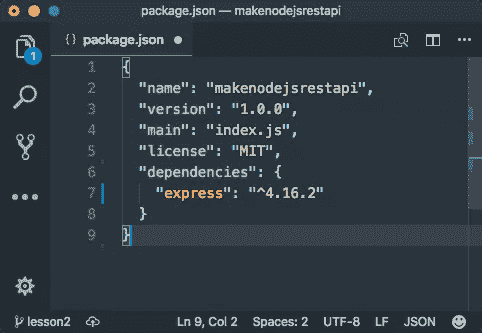](https://res.cloudinary.com/practicaldev/image/fetch/s--2mAXzROw--/c_limit%2Cf_auto%2Cfl_progressive%2Cq_auto%2Cw_880/https://cdn-images-1.medium.com/max/482/0%2As9cJoh4HWlp05UXC)

接下来，我们在项目中创建一个名为 src 的新目录，并在其中创建一个名为 index.js 文件的新文件。把以下内容放进去:

```
import express from 'express';
 const app = express();
 const PORT = process.env.PORT || 3000;
 app.listen(PORT, err => {
     if (err) {
         throw err;
     } else {
         console.log(Server running on port: $ {
             PORT
         }-- - Running on $ {
             process.env.NODE\_ENV
         }-- - Make something great!)
     }
 }); 
```

请注意，如果没有在环境变量中设置端口，我们将使用端口 3000。现在，我们将在 package.json 文件中添加一个“脚本”,这样我们就可以在运行我们的 using babel 时使用 dev profile。以下是修改后的文件:

[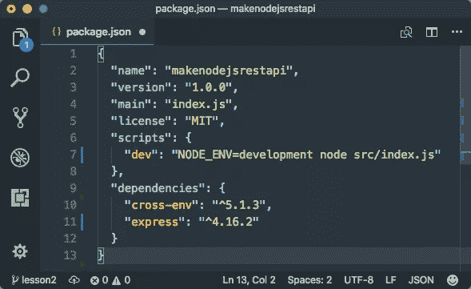](https://res.cloudinary.com/practicaldev/image/fetch/s--03WgYntM--/c_limit%2Cf_auto%2Cfl_progressive%2Cq_auto%2Cw_880/https://cdn-images-1.medium.com/max/589/0%2AQAj0S75VKrJRvdkE)

现在，用这个命令安装交叉包络线:

```
yarn add cross-env 
```

这是更新后的 package.json 文件:

```
{
     "name": "makenodejsrestapi",
     "version": "1.0.0",
     "main": "index.js",
     "license": "MIT",
     "scripts": {
         "dev": "NODE\_ENV=development node src/index.js"
     },
     "dependencies": {
         "cross-env": "^5.1.3",
         "express": "^4.16.2"
     }
 } 
```

现在我们可以用这个命令添加 babel 依赖项:

```
yarn add -D babel-preset-env babel-plugin-transform-object-rest-spread 
```

运行该命令后，您可以创建一个名为。你可以在其中提供应用程序的环境和插件信息。这是我们接下来要做的:

```
{
     "presets": [
         ["env", {
             "targets": {
                 "node": "current"
             }
         }]
     ],
     "plugins": [
         ["transform-object-rest-spread", {
             "useBuiltIns": true
         }]
     ]
 } 
```

transform-object-rest-spread 插件用于为对象析构赋值转换 rest 属性。现在，我们也将使用 web pack 2:

```
yarn add -D webpack babel-core babel-loader webpack-node-externals 
```

最后，我们将配置 webpack，我们已经在上面添加了它的依赖项:

```
const nodeExternals = require('webpack-node-externals');
 const path = require('path');
 module.exports = {
     target: 'node',
     externals: [nodeExternals()],
     entry: {
         'index': './src/index.js'
     },
     output: {
         path: path.join(\_\_dirname, 'dist'),
         filename: '[name].bundle.js',
         libraryTarget: 'commonjs2',
     },
     module: {
         rules: [{
             test: /\.js$/,
             exclude: /node\_modules/,
             use: 'babel-loader'
         }]
     }
 } 
```

现在，我们也运行我们的 package.json 脚本:

```
"scripts": { "dev:build": "webpack -w", "dev": "cross-env NODE\_ENV=development node dist/index.bundle.js" } 
```

最后，我们可以运行我们的应用程序:

从图形上看，下面是我们运行构建时的输出:

[](https://res.cloudinary.com/practicaldev/image/fetch/s--1eARJlHo--/c_limit%2Cf_auto%2Cfl_progressive%2Cq_auto%2Cw_880/https://cdn-images-1.medium.com/max/493/0%2AbG6n-GuaNGmSXW6X)

注意，我们在上面运行了两个命令:

*   第一个命令只是构建了应用程序并准备了 babel build
*   第二个命令实际运行请求，您可以在控制台中看到输出

现在，我们将最终安装 ES Lint:

```
yarn add -D eslint eslint-config-equimper 
```

现在，创建一个名为'的新文件。eslintrc '并添加以下内容:

```
{ “extends” : “equimper” } 
```

一旦这样做了，如果您没有遵循正确的 ES 标准，您将开始收到警告。当您需要为您的项目遵循严格的约定时，这个工具非常有用。

[](https://res.cloudinary.com/practicaldev/image/fetch/s--Y4ebZ1_C--/c_limit%2Cf_auto%2Cfl_progressive%2Cq_auto%2Cw_880/https://cdn-images-1.medium.com/proxy/1%2AouK9XR4xuNWtCes-TIUNAw.png)

#### 学习用 Node.js、Express、MongoDB、friends 构建 app 的高级培训课程。[现在开始学习→](https://LearnNode.com/friend/KRISSANAWAT)

[](https://res.cloudinary.com/practicaldev/image/fetch/s--Y4ebZ1_C--/c_limit%2Cf_auto%2Cfl_progressive%2Cq_auto%2Cw_880/https://cdn-images-1.medium.com/proxy/1%2AouK9XR4xuNWtCes-TIUNAw.png)

### 接下来我们要添加什么？

在本节中，我们将设置该应用程序后端所需的更多工具:

*   添加猫鼬，身体解析器，摩根，压缩，头盔
*   安装配置文件夹
*   设置常数

#### 添加猫鼬

要将 mongoose 和其他提到的模块添加到您的应用程序中，请运行以下命令:

纱线添加猫鼬身体解析压缩头盔&&纱线添加-D 摩根

需要注意的是，我们指定模块的顺序，它们的下载顺序也是一样的。

为了确保我们在同一轨道上，下面是我的 package.json 文件的样子:

[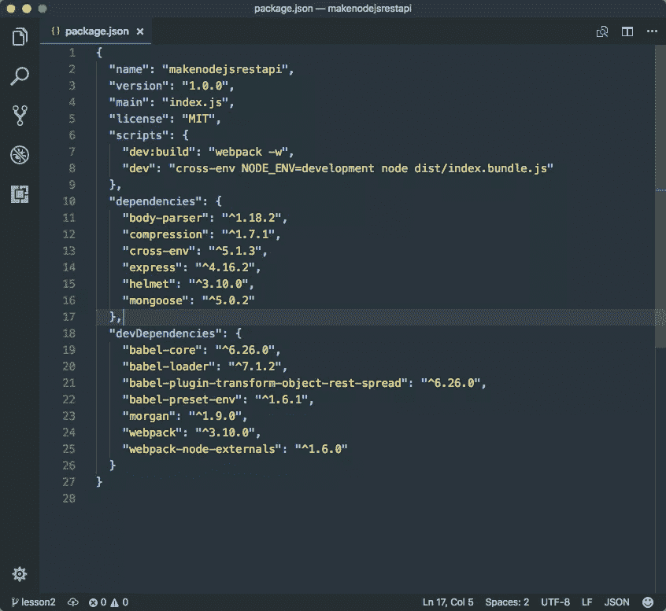](https://res.cloudinary.com/practicaldev/image/fetch/s--BgvQ2Gs---/c_limit%2Cf_auto%2Cfl_progressive%2Cq_auto%2Cw_880/https://cdn-images-1.medium.com/max/846/0%2A2iDhcVve2TdeDEja)

现在，我们将使用这个命令再次编译我们的项目:

```
yarn dev 
```

只要确保项目仍在运行。现在，在 src 文件夹中新建一个 config 文件夹，并创建一个名为 constants.js 的文件，内容如下:

```
const devConfig = {};
const testConfig = {};
const prodConfig = {};
const defaultConfig = {

PORT: process.env.PORT || 3000,
};

function envConfig(env) {
     switch (env) {
         case 'development':
             return devConfig;
         case 'test':
             return testConfig;
         default:
             return prodConfig;
     }
 }

 //Take defaultConfig and make it a single object 
 //So, we have concatenated two objects into one 
 export default { ...defaultConfig,
     ...envConfig(process.env.NODE\_ENV),
 }; 
```

现在，回到 index.js 文件，我们将为这个常量文件添加一个依赖项，并将对 PORT 的引用改为使用这个文件，例如:

```
import express from 'express';
import constants from './config/constants';
const app = express();
app.listen(constants.PORT, err => {
    if (err) {
        throw err;
    } else {
        console.log(`Server running on port: ${constants.PORT} --- Running on ${process.env.NODE_ENV} --- Make something great.!`)
    }
}); 
```

现在，在 config 文件夹中创建一个名为 database.js 的新文件，内容如下:

```
import mongoose from 'mongoose';
 import constants from './constants';

 //Removes the warning with promises 
 mongoose.Promise = global.Promise;

 //Connect the db with the url provided 
 try {
     mongoose.connect(constants.MONGO\_URL)
 } catch (err) {
     mongoose.createConnection(constants.MONGO\_URL)
 }
 mongoose.connection.once('open', () => console.log('MongoDB Running')).on('error', e => {
     throw e;
 }) 
```

我们还将 constants.js 文件中 mongoose 连接的配置修改为:

```
const devConfig = { MONGO\_URL: 'mongodb://localhost/makeanodejsapi-dev', }; 
 const testConfig = { MONGO\_URL: 'mongodb://localhost/makeanodejsapi-test', }; 
 const prodConfig = { MONGO\_URL: 'mongodb://localhost/makeanodejsapi-prod', }; 
```

这将确保当我们用不同的概要文件和环境运行我们的应用程序时，所使用的数据库是不同的。您可以继续运行该应用程序。

当您在上述端口上运行数据库时，您就可以成功地开始使用您的应用程序了。

### 设计中间件

现在，我们将开始制作应用程序的中间件。

在 config 文件夹下，新建一个文件，命名为 *middleware.js* ，内容如下:

```
import morgan from 'morgan';
 import bodyParser from 'body-parser';
 import compression from 'compression';
 import helmet from 'helmet';
 import {
     isPrimitive
 } from 'util';
 const isDev = process.env.NODE\_ENV === 'development';
 const isProd = process.env.NODE\_ENV === 'production';
 export default app => {
     if (isProd) {
         app.use(compression());
         app.use(helmet());
     }
     app.use(bodyParser.json());
     app.use(bodyParser.urlencoded({
         extended: true
     }));
     if (isDev) {
         app.use(morgan('dev'));
     }
 }; 
```

要使用这个配置，还需要将导入添加到索引文件中，比如:

```
import express from 'express';
 import constants from './config/constants';
 import './config/database';
 import middlewareConfig from './config/middleware';
 const app = express(); //passing the app instance to middlewareConfig 

 middlewareConfig(app);
 app.listen(constants.PORT, err => {
     if (err) {
         throw err;
     } else {
         console.log(`Server running on port: ${constants.PORT} --- Running on ${process.env.NODE_ENV} --- Make something great.!`)
     }
 }); 
```

现在，运行您的应用程序，它应该在端口 3000 上服务一个 GET 请求！

[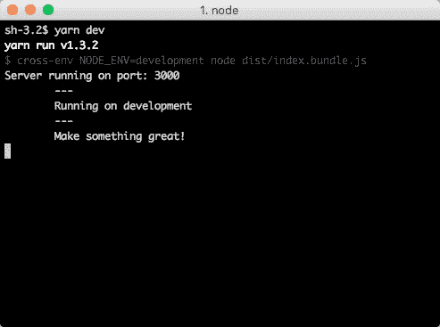](https://res.cloudinary.com/practicaldev/image/fetch/s--YqN9xzPH--/c_limit%2Cf_auto%2Cfl_progressive%2Cq_auto%2Cw_880/https://cdn-images-1.medium.com/max/493/0%2AeRzm2qeKCV6xLmIc)

### 注册用户

在本节中，我们将使用上节课中的 MongoDB 设置，并在此基础上构建一个应用程序，允许用户在我们的应用程序中注册。请不要错过，我们最新的 package.json 文件如下所示:

[](https://res.cloudinary.com/practicaldev/image/fetch/s--f63zzOhY--/c_limit%2Cf_auto%2Cfl_progressive%2Cq_auto%2Cw_880/https://cdn-images-1.medium.com/max/846/0%2AgF1QpFwmxs0b2KFL)

在本节中，我们将进一步开发允许用户在我们的应用程序上注册的功能。我们还将制作用户模型，以便将数据保存在数据库中。

完成本节后，您将至少拥有以下文件结构:

[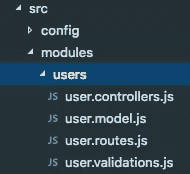](https://res.cloudinary.com/practicaldev/image/fetch/s--l2ALyoSe--/c_limit%2Cf_auto%2Cfl_progressive%2Cq_auto%2Cw_880/https://cdn-images-1.medium.com/max/190/0%2AD3tjs_QLhGbBvgjJ)

只需跟随这一课如何变成这样！

### 定义模型

我们将从制作用户模型开始。为此，在 src > modules > users 中创建一个新文件，并将其命名为 user.model.js，其内容如下:

```
import mongoose, {
     Schema
 } from 'mongoose';
 import validator from 'validator';
 import {
     passwordReg
 } from './user.validations';
 const UserSchema = new Schema({
     email: {
         type: String,
         unique: true,
         required: [true, 'Email is required!'],
         trim: true,
         validate: {
             validator(email) {
                 return validator.isEmail(email);
             },
             message: '{VALUE} is not a valid email!',
         },
     },
     firstName: {
         type: String,
         required: [true, 'FirstName is required!'],
         trim: true,
     },
     lastName: {
         type: String,
         required: [true, 'LastName is required!'],
         trim: true,
     },
     userName: {
         type: String,
         required: [true, 'UserName is required!'],
         trim: true,
         unique: true,
     },
     password: {
         type: String,
         required: [true, 'Password is required!'],
         trim: true,
         minlength: [6, 'Password need to be longer!'],
         validate: {
             validator(password) {
                 return passwordReg.test(password);
             },
             message: '{VALUE} is not a valid password!',
         },
     },
 });
 export default mongoose.model('User', UserSchema); 
```

我们刚刚用各种属性定义了用户模型的模式，例如:

*   为用户定义的属性
*   还提供了关于它们类型的属性、它们的唯一性以及应该如何验证这些数据的元信息
*   请注意，我们也提供了一个验证函数。当我们将数据插入 Mongo 集合时，这使得事情变得非常容易

#### 定义控制器

现在，我们将通过在控制器定义中使用用户模型来使用它。在 src > modules > users 中创建一个新文件，命名为 user.controllers.js，内容如下:

```
import User from './user.model';
 export async function signUp(req, res) {
     try {
         const user = await User.create(req.body);
         return res.status(201).json(user);
     } catch (e) {
         return res.status(500).json(e);
     }
 } 
```

我们刚刚定义了一个带有请求和响应对象作为参数的注册函数，并使用我们刚刚在上面定义的用户模型创建了它。

我们还返回了一个适当的响应以及它们的代码，以便用户可以在交易成功时得到通知。

#### 定义申请路线

我们将为我们的应用程序定义路由，其中我们可以指定用户必须访问的映射，以查看我们制作的应用程序。在 src > modules > users 中创建一个新文件，命名为 user.routes.js，内容如下:

```
import {
     Router
 } from 'express';
 import \* as userController from './user.controllers';
 const routes = new Router();
 routes.post('/signup', userController.signUp);
 export default routes; 
```

注意，这是行不通的。我们必须在模块文件夹中定义模块 index.js，内容如下:

```
import userRoutes from './users/user.routes';
 export default app => {
     app.use('/api/v1/users', userRoutes);
 }; 
```

现在我们可以运行我们的应用程序，这将是我们应用程序的第一个版本。我们现在需要对我们的根 index.js 文件进行最后的修改:

[](https://res.cloudinary.com/practicaldev/image/fetch/s--GCqdU5ds--/c_limit%2Cf_auto%2Cfl_progressive%2Cq_auto%2Cw_880/https://cdn-images-1.medium.com/max/245/0%2Av-K621fKR233TJDt)

以下是更新内容:

```
/\* eslint-disable no-console \*/
 import express from 'express';
 import constants from './config/constants';
 import './config/database';
 import middlewaresConfig from './config/middlewares';
 import apiRoutes from './modules';
 const app = express();
 middlewaresConfig(app);
 app.get('/', (req, res) => {
     res.send('Hello world!');
 });
 apiRoutes(app);
 app.listen(constants.PORT, err => {
     if (err) {
         throw err;
     } else {
         console.log(` Server running on port: ${constants.PORT} --- Running on ${process.env.NODE_ENV} --- Make something great `);
     }
 }); 
```

现在，当我们运行应用程序时，我们仍然可以看到我们的应用程序正在运行:

[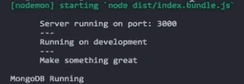](https://res.cloudinary.com/practicaldev/image/fetch/s--Xdgkk1CB--/c_limit%2Cf_auto%2Cfl_progressive%2Cq_auto%2Cw_880/https://cdn-images-1.medium.com/max/306/0%2AFv6ilPWSyzQSlPwB)

Postman 对 API 测试很有用，参加这个课程可以帮助你理解它们的用处

[](https://res.cloudinary.com/practicaldev/image/fetch/s--Y4ebZ1_C--/c_limit%2Cf_auto%2Cfl_progressive%2Cq_auto%2Cw_880/https://cdn-images-1.medium.com/proxy/1%2AouK9XR4xuNWtCes-TIUNAw.png)

#### 学习用 Node.js、Express、MongoDB、friends 构建 app 的高级培训课程。[现在开始学习→](https://LearnNode.com/friend/KRISSANAWAT)

[](https://res.cloudinary.com/practicaldev/image/fetch/s--Y4ebZ1_C--/c_limit%2Cf_auto%2Cfl_progressive%2Cq_auto%2Cw_880/https://cdn-images-1.medium.com/proxy/1%2AouK9XR4xuNWtCes-TIUNAw.png)

### 使用 MongoDB 和 Postman

我们现在将使用两个必要的工具:

1.  Robomongo:在这里下载。这是一个非常棒的工具，可以可视化 Mongo 数据并使用它进行查询。也是免费的！这适用于所有操作系统平台。
2.  邮递员:在这里下载[。它是一个点击 API 并获得响应的工具。它有很好的可视化功能，你也可以保存请求格式，这样可以节省你很多时间。还是那句话，免费！这适用于所有操作系统平台。](https://www.getpostman.com/)

当您打开 Robomongo 并连接到您的本地 MongoDB 实例时，您可以看到已经为我们呈现的 DB:

[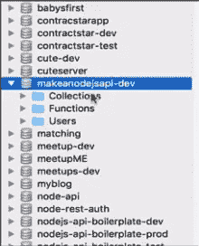](https://res.cloudinary.com/practicaldev/image/fetch/s--J3tYuYyw--/c_limit%2Cf_auto%2Cfl_progressive%2Cq_auto%2Cw_880/https://cdn-images-1.medium.com/max/220/0%2AjVMqG890GBHASaiv)

我们已经准备好了一个由我们的应用程序制作的系列，它看起来像:

[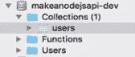](https://res.cloudinary.com/practicaldev/image/fetch/s--Y0NSMpOA--/c_limit%2Cf_auto%2Cfl_progressive%2Cq_auto%2Cw_880/https://cdn-images-1.medium.com/max/168/0%2A8jpnc4XxGzUflHgW)

这将是空的，因为我们现在还没有创建任何数据。我们很快就会这样做！

### 尝试用户注册

让我们现在打开邮差。我们将使用此 URL 访问一个 API:

[http://本地主机:3000/api/v1/users/signup](http://localhost:3000/api/v1/users/signup)

在 postman 中，它看起来像这样:

[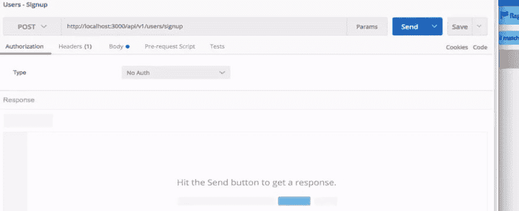](https://res.cloudinary.com/practicaldev/image/fetch/s--9_AGUmB1--/c_limit%2Cf_auto%2Cfl_progressive%2Cq_auto%2Cw_880/https://cdn-images-1.medium.com/max/923/0%2A72Oty7LLTKoCLiA3)

在使用这个 API 之前，我们将尝试一个 Hello World 版本。看看这个 API 中发生了什么:

[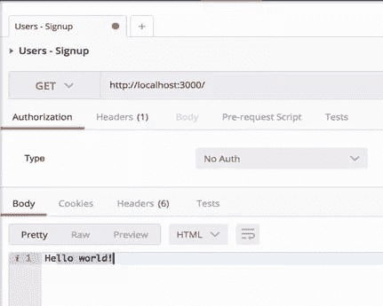](https://res.cloudinary.com/practicaldev/image/fetch/s--wCD4zr4D--/c_limit%2Cf_auto%2Cfl_progressive%2Cq_auto%2Cw_880/https://cdn-images-1.medium.com/max/431/0%2ARVeWGycU5bVJv4vd)

现在，回到注册 API。在成功命中之前，我们将尝试提供无效值，并查看我们面临的错误。如果电子邮件无效，结果如下:

[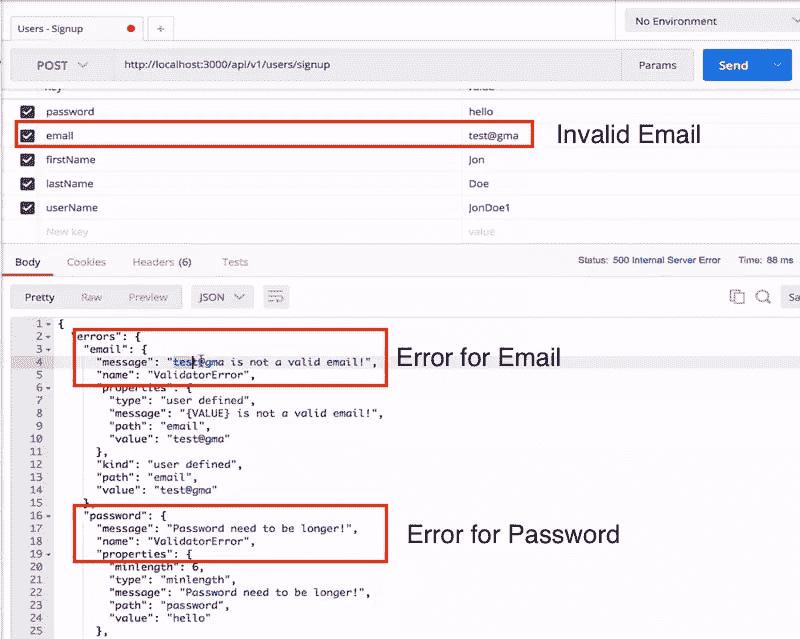](https://res.cloudinary.com/practicaldev/image/fetch/s--yH3m5dYc--/c_limit%2Cf_auto%2Cfl_progressive%2Cq_auto%2Cw_880/https://cdn-images-1.medium.com/max/800/0%2ANW2xUb_IWfyHkfU8)

现在，我们也将尝试使用正确的数据。我们试试吧！

[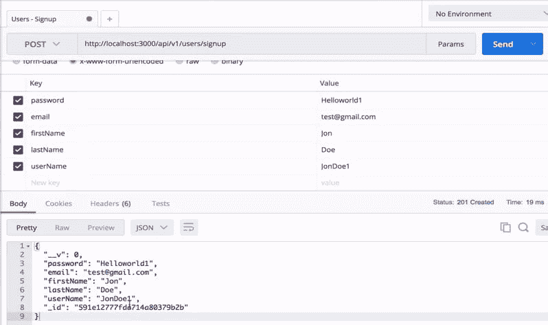](https://res.cloudinary.com/practicaldev/image/fetch/s--DfzaC9X8--/c_limit%2Cf_auto%2Cfl_progressive%2Cq_auto%2Cw_880/https://cdn-images-1.medium.com/max/798/0%2AW4rWrsbMRj8MZRFc)

嗯，故事还没有结束。我们还可以看到数据现在被插入到 MongoDB 数据库中:

[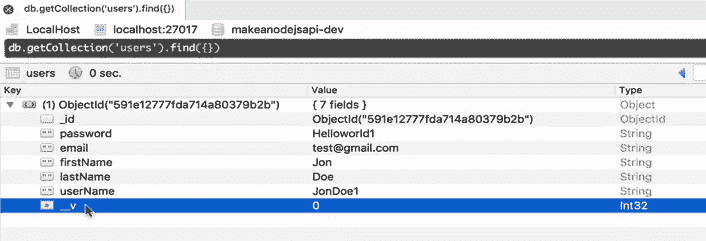](https://res.cloudinary.com/practicaldev/image/fetch/s--Fi6-IVHl--/c_limit%2Cf_auto%2Cfl_progressive%2Cq_auto%2Cw_880/https://cdn-images-1.medium.com/max/706/0%2A112djiMpMauwGezi)

太棒了。

### 添加更多验证

尽管我们已经在用户模型中添加了一些验证，但是如果我们还想保存在另一个文件中呢！为此，在 src > modules > users 中创建一个新文件，并将其命名为 user.validations.js，其内容如下:

```
import Joi from 'joi';
 export const passwordReg = /(?=.\*\d)(?=.\*[a-z])(?=.\*[A-Z]).{6,}/;
 export default {
     signup: {
         email: Joi.string().email().required(),
         password: Joi.string().regex(passwordReg).required(),
         firstName: Joi.string().required(),
         lastName: Joi.string().required(),
         userName: Joi.string().required(),
     },
 }; 
```

接下来，将这个验证也添加到路由器文件中:

```
import {
       Router
   } from 'express';
   import validate from 'express-validation';
   import \* as userController from './user.controllers';
   import userValidation from './user.validations';
   const routes = new Router();
   routes.post('/signup', validate(userValidation.signup), userController.signUp);
   export default routes; 
```

请注意:

*   我们从 express 添加了一个验证导入
*   我们还通过了一个新的注册用户验证功能

现在，当我们尝试让用户使用相同的凭据注册时，我们会收到一个错误:

[](https://res.cloudinary.com/practicaldev/image/fetch/s--4vCMuT_p--/c_limit%2Cf_auto%2Cfl_progressive%2Cq_auto%2Cw_880/https://cdn-images-1.medium.com/max/842/0%2AcesPC1QnIDDbgqIG)

这实际上不是因为验证，而是因为我们试图用相同的电子邮件插入另一个用户。让我们尝试一些不同的东西:

[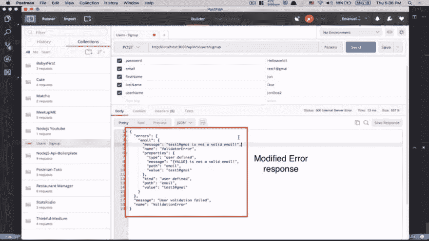](https://res.cloudinary.com/practicaldev/image/fetch/s--t4qqU5bt--/c_limit%2Cf_auto%2Cfl_progressive%2Cq_auto%2Cw_880/https://cdn-images-1.medium.com/max/1024/0%2ABdYL3f1TRSy0jQe4)

现在，我们可以纠正这一点，并查看 MongoDB 数据库中出现的数据:

[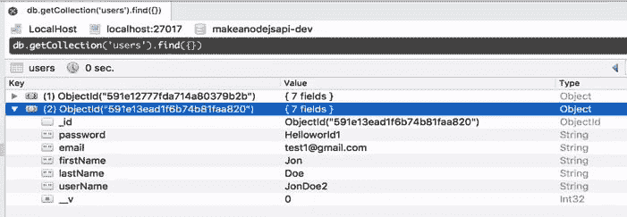](https://res.cloudinary.com/practicaldev/image/fetch/s--eMFfMFPT--/c_limit%2Cf_auto%2Cfl_progressive%2Cq_auto%2Cw_880/https://cdn-images-1.medium.com/max/701/0%2AykPMTNd5EkzFVew8)

太棒了。我们能够向我们的项目添加强大的验证。

### 密码加密和用户登录

我们将更多地与我们的用户合作。在上一课中，我们能够保存一个新用户。这种方法的主要问题是用户的密码以纯文本的形式保存。这将是我们现在将在应用程序中进行的更改之一。

为了让您不要错过，我们最新的 package.jsonfile 如下所示:

[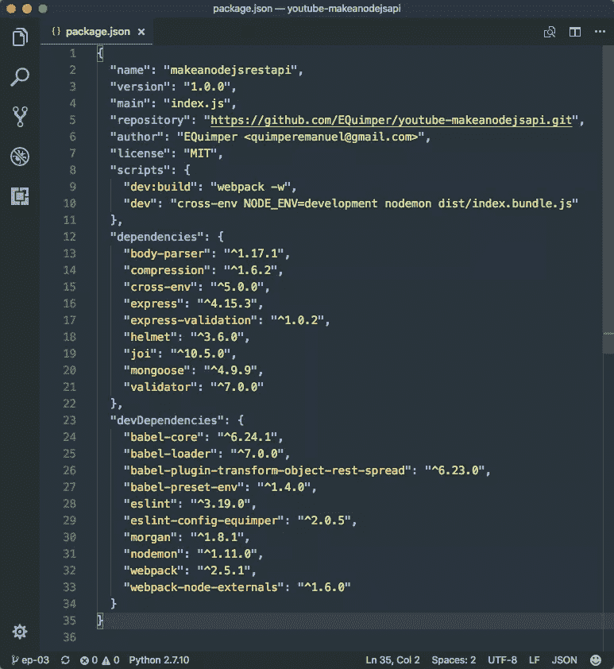](https://res.cloudinary.com/practicaldev/image/fetch/s--4VS7Pl9K--/c_limit%2Cf_auto%2Cfl_progressive%2Cq_auto%2Cw_880/https://cdn-images-1.medium.com/max/773/0%2AaktBPkIZ-KqsNpVr)

在本课中，我们将进一步开发加密用户密码的功能。除此之外，我们还将做出如下改变:

*   在 webpack 构建上添加 ***rimraf*** 和 clean dist
*   加密用户的密码
*   用 passport 创建本地策略
*   允许用户登录

#### 添加 rimraf 依赖项

我们将使用下面的命令开始在我们的项目中添加 *rimraf* 依赖项:

```
yarn add -D rimraf 
```

只需再次构建您的项目，运行以下命令:

```
yarn 
```

现在，让我们将 rimraf 也添加到我们的 package.json 文件中:

```
“scripts”: {
 “clean”: “rimraf dist”,
 “dev:build”: “yarn run clean && webpack -w”,
 “dev”: “cross-env NODE\_ENV=development nodemon dist/index.bundle.js”
} 
```

现在，运行以下命令:

```
yarn dev:build 
```

运行此命令时，dist 文件夹将被刷新，并在构建过程完成后返回:

[](https://res.cloudinary.com/practicaldev/image/fetch/s--fo0W7R4W--/c_limit%2Cf_auto%2Cfl_progressive%2Cq_auto%2Cw_880/https://cdn-images-1.medium.com/max/146/0%2AgrZMe6C6mQWKP_Mi)

### 库加密密码

现在，我们将向我们的项目添加一个库，以便我们可以在将用户密码保存到数据库之前对其进行加密。这样，即使数据库被黑客攻击，我们也能确保它的安全。

运行以下命令:

```
yarn add bcrypt-nodejs 
```

这样，库将被添加到我们的项目中。

#### 修改模型

现在，我们必须修改我们的模型，以便当请求中出现明文密码时，可以在其中设置加密密码。在 user.model.js 中添加以下内容

```
UserSchema.pre('save', function(next) {
     if (this.isModified('password')) {
         this.password = this.\_hashPassword(this.password);
     }
     return next();
 });
 UserSchema.methods = {
     \_hashPassword(password) {
         return hashSync(password);
     },
     authenticateUser(password) {
         return compareSync(password, this.password);
     },
 }; 
```

在上面的代码中，这指的是请求中提到的当前用户。此外，一旦我们尝试登录，authenticateUser 就会被调用，并且用户会传递一个明文形式的密码。我们对这个密码进行哈希运算，只有在此之后，我们才会将其与数据库中的值进行比较。

现在，让我们尝试提出一个新的请求，并检查这是否可行。这是我的要求:

[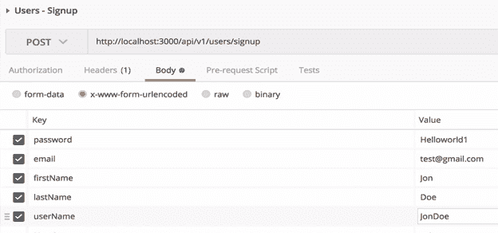](https://res.cloudinary.com/practicaldev/image/fetch/s--j4vgWVMr--/c_limit%2Cf_auto%2Cfl_progressive%2Cq_auto%2Cw_880/https://cdn-images-1.medium.com/max/624/0%2AswUvU197JKTFNF83)

当我运行这个请求时，我们得到的响应是:

[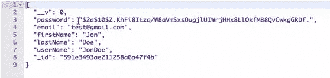](https://res.cloudinary.com/practicaldev/image/fetch/s--B4M2mDL2--/c_limit%2Cf_auto%2Cfl_progressive%2Cq_auto%2Cw_880/https://cdn-images-1.medium.com/max/558/0%2AeqR2nC_zEyarBrrO)

现在让我们来看看数据库，我们也会在那里看到类似的场景:

[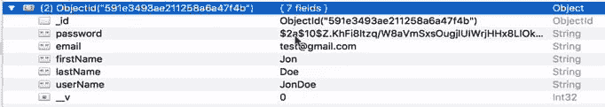](https://res.cloudinary.com/practicaldev/image/fetch/s--f_h9oaO4--/c_limit%2Cf_auto%2Cfl_progressive%2Cq_auto%2Cw_880/https://cdn-images-1.medium.com/max/682/0%2ARNerH49iB20jWIEC)

现在，我们将成为应用程序的登录 API。

#### 使用 Passport 进行登录

我们将使用一个名为 [Passport](http://www.passportjs.org/) 的库。你可以自由使用任何其他认证库，如脸书，谷歌等。

为了继续，我们需要向我们的项目添加两个库。让我们通过运行以下命令来实现这一点:

纱线添加护照护照-本地

完成后，让我们在名为 services 的 *src* 文件夹中创建一个新文件夹。我们将在服务文件夹中创建一个名为 auth.services.js 的新文件，内容如下:

```
import passport from 'passport';
 import LocalStrategy from 'passport-local';
 import User from '../modules/users/user.model';
 const localOpts = {
     usernameField: 'email',
 };
 const localStrategy = new LocalStrategy(localOpts, async (email, password, done) => {
     try {
         const user = await User.findOne({
             email
         });
         if (!user) {
             return done(null, false);
         } else if (!user.authenticateUser(password)) {
             return done(null, false);
         }
         return done(null, user);
     } catch (e) {
         return done(e, false);
     }
 });
 passport.use(localStrategy);
 export const authLocal = passport.authenticate('local', {
     session: false
 }); 
```

这里，我们尝试了一个本地策略，它本质上是异步的，数据作为用户的电子邮件和密码被发送到 passport 库。然后，库将对用户进行身份验证，并返回响应。

我们还将添加 Passport 作为我们的中间件。下面是修改后的文件:

```
import morgan from 'morgan';
 import bodyParser from 'body-parser';
 import compression from 'compression';
 import helmet from 'helmet';
 import passport from 'passport';

 const isDev = process.env.NODE\_ENV === 'development';
 const isProd = process.env.NODE\_ENV === 'production';

 export default app => {
     if (isProd) {
         app.use(compression());
         app.use(helmet());
     }
     app.use(bodyParser.json());

     app.use(bodyParser.urlencoded({
         extended: true
     }));
     app.use(passport.initialize());

     if (isDev) {
         app.use(morgan('dev'));
     }
 }; 
```

这里，我们也用我们的应用程序实例初始化了 Passport 库。

#### 向控制器添加登录

现在是我们将登录功能也添加到控制器层的时候了。向我们的控制器添加以下功能:

```
export function login(req, res, next) {
 res.status(200).json(req.user);
 return next();
} 
```

请注意，这是我们最终的控制器文件的样子:

[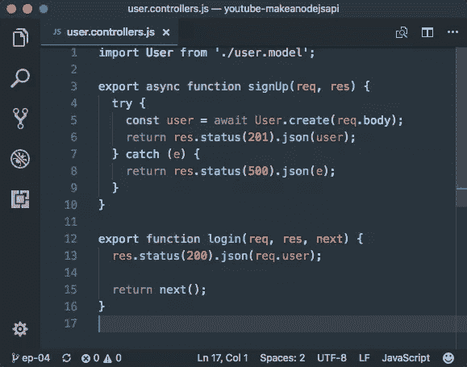](https://res.cloudinary.com/practicaldev/image/fetch/s--4o1LUQoQ--/c_limit%2Cf_auto%2Cfl_progressive%2Cq_auto%2Cw_880/https://cdn-images-1.medium.com/max/579/0%2AJRv1EjaZcaKQaFGI)

提供登录路径

我们还必须提供一个登录 API 的路径。我们将在 user.routes.jsfile 中进行这一更改

```
import {
 authLocal
} from ‘../../services/auth.services’;

routes.post(‘/login’, authLocal, userController.login); 
```

这是我们最终文件的样子:

[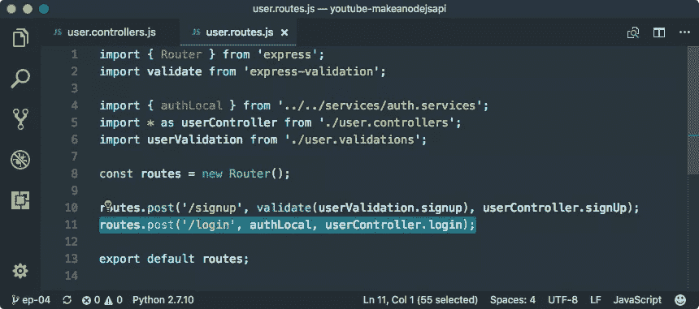](https://res.cloudinary.com/practicaldev/image/fetch/s--1XRv3bCT--/c_limit%2Cf_auto%2Cfl_progressive%2Cq_auto%2Cw_880/https://cdn-images-1.medium.com/max/860/0%2AS4MOiPmAcAJOi6Dw)

尝试登录功能

现在，我们将使用之前创建的凭据尝试以下 POST API:

[http://localhost:3000/API/v1/users/log in](http://localhost:3000/api/v1/users/login)

当凭据正确时，会发生以下情况:

[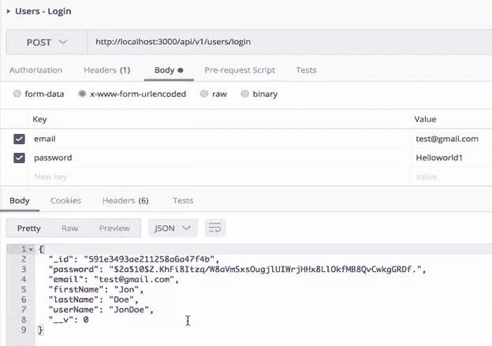](https://res.cloudinary.com/practicaldev/image/fetch/s--SEb9nsT_--/c_limit%2Cf_auto%2Cfl_progressive%2Cq_auto%2Cw_880/https://cdn-images-1.medium.com/max/624/0%2A9LySuMHA7BfFzhY4)

这不是很好吗？我们能够登录到一个现有的用户，我们也能够通过加密来保护他的密码。

### 添加 JWT 认证

到目前为止，我们能够在我们的应用程序中注册一个新用户:

[](https://res.cloudinary.com/practicaldev/image/fetch/s--K_x_X9xD--/c_limit%2Cf_auto%2Cfl_progressive%2Cq_auto%2Cw_880/https://cdn-images-1.medium.com/max/618/0%2A-FjZr1c6ExUan3JF)

我们还能够允许用户登录我们的应用程序:

[](https://res.cloudinary.com/practicaldev/image/fetch/s--qKg64YP5--/c_limit%2Cf_auto%2Cfl_progressive%2Cq_auto%2Cw_880/https://cdn-images-1.medium.com/max/616/0%2A3wTXKzcY4Angmghi)

在知道我们将在这篇文章中做什么之前，让我们最后看看我们的 current _package.json_file 看起来怎么样:

[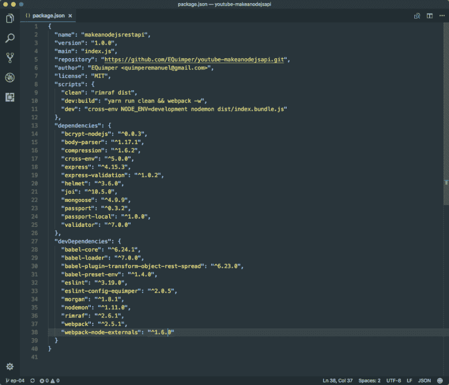](https://res.cloudinary.com/practicaldev/image/fetch/s--j57abvb---/c_limit%2Cf_auto%2Cfl_progressive%2Cq_auto%2Cw_880/https://cdn-images-1.medium.com/max/1024/0%2Ar3f_TS5pHBrH29rg)

在本节中，我们将添加以下功能:

*   我们将实现 JWT 认证并添加一个加密密码
*   添加新的 passport-jwt 库
*   添加 JSON web 令牌库
*   在 JSON 中只发送必填字段作为响应

#### JSON web token 如何存储数据？

当我们提供要加密的数据和加密密码时，它会被加密以形成 JWT 令牌的各个部分，例如:

[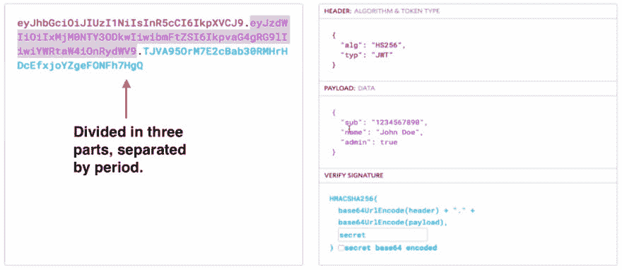](https://res.cloudinary.com/practicaldev/image/fetch/s--cfgy8sUD--/c_limit%2Cf_auto%2Cfl_progressive%2Cq_auto%2Cw_880/https://cdn-images-1.medium.com/max/1018/0%2Au07ctNWmmz_EeXH2)

如上所示，一个令牌可以包含一个用户的身份和其他与他相关的数据。

#### 添加 JWT 的秘密

让我们继续到我们的 _constants.js_file，并在开发配置中添加一个 JWT 秘密

```
const devConfig = {
 MONGO\_URL: ‘mongodb://localhost/makeanodejsapi-dev’,
 JWT\_SECRET: ‘thisisasecret’,
}; 
```

接下来，我们将使用以下命令安装两个库:

```
yarn add jsonwebtoken passport-jwt 
```

现在，移动到授权服务文件和文件中的 JWT 服务，这一行:

```
import { Strategy as JWTStrategy, ExtractJwt } from ‘passport-jwt’;

import User from ‘../modules/users/user.model’;
import constants from ‘../config/constants’; 
```

接下来，让 passport 使用指定的策略:

```
// Jwt strategy
 const jwtOpts = {
   jwtFromRequest: ExtractJwt.fromAuthHeader('authorization'),
   secretOrKey: constants.JWT\_SECRET,
 };

 const jwtStrategy = new JWTStrategy(jwtOpts, async (payload, done) => {
   try {
     //Identify user by ID
     const user = await User.findById(payload.\_id);

     if (!user) {
       return done(null, false);
     }
     return done(null, user);
   } catch (e) {
     return done(e, false);
   }
 });

 passport.use(localStrategy);
 passport.use(jwtStrategy);

 export const authLocal = passport.authenticate('local', { session: false });
 export const authJwt = passport.authenticate('jwt', { session: false }); 
```

为了测试这是否可行，我们现在将在 route JS 文件中使用一个私有路由。最终的文件内容将看起来像:

```
import userRoutes from ‘./users/user.routes’;
import { authJwt } from ‘../services/auth.services’;

export default app => {
 app.use(‘/api/v1/users’, userRoutes);
 app.get(‘/hello’, authJwt, (req, res) => {
 res.send(‘This is a private route!!!!’);
 });
}; 
```

#### 验证 JWT

让我们试试这个，验证 JWT 现在在《邮差》工作:

[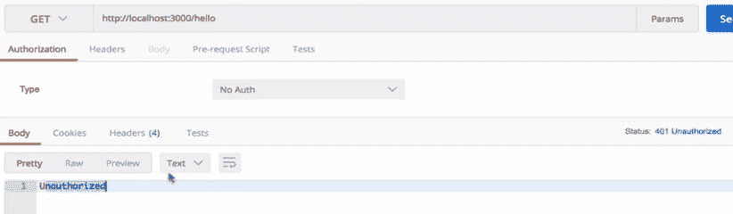](https://res.cloudinary.com/practicaldev/image/fetch/s--1TiFC9JB--/c_limit%2Cf_auto%2Cfl_progressive%2Cq_auto%2Cw_880/https://cdn-images-1.medium.com/max/822/0%2Alg6KgE6p3D283j-S)

我们现在需要在请求中添加一个 JWT 令牌，它只属于一个特定的用户。

我们将向用户模型添加功能，以便当用户登录时，它也包含 JWT 令牌。所以，让我们向用户模型 JS 文件添加更多的库:

```
import jwt from ‘jsonwebtoken’;
import constants from ‘../../config/constants’; 
```

现在，我们可以解密令牌并获取用户信息。

#### 创建 JWT 令牌

我们还必须创建一个为用户创建令牌的方法。现在我们来添加这个方法:

```
UserSchema.methods = {

     createToken() {
       return jwt.sign(
         {
           \_id: this.\_id,
         },
         constants.JWT\_SECRET,
       );
     },
     toJSON() {
       return {
         \_id: this.\_id,
         userName: this.userName,
         token: `JWT ${this.createToken()}`,
       };
     },
   }; 
```

使用 toJSON()方法也很重要。我们在令牌前面附加了 JWT，因为护照库用它来识别 JWT 令牌。

现在，让我们再次尝试登录用户:

[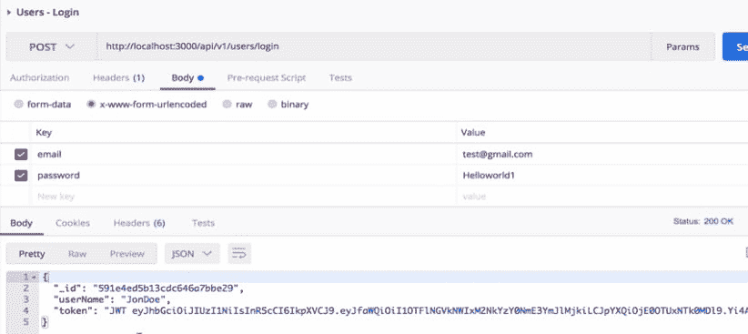](https://res.cloudinary.com/practicaldev/image/fetch/s--wlLdkF4x--/c_limit%2Cf_auto%2Cfl_progressive%2Cq_auto%2Cw_880/https://cdn-images-1.medium.com/max/822/0%2A7Y8OSgPkmoJUEKcD)

这一次，我们甚至得到了一个 JWT 代币作为回应。这个令牌还将包含用户 ID 和用户名。我们现在有了一个 JWT 的工作范例！

现在，让我们复制 JWT 值并尝试私人路线:

[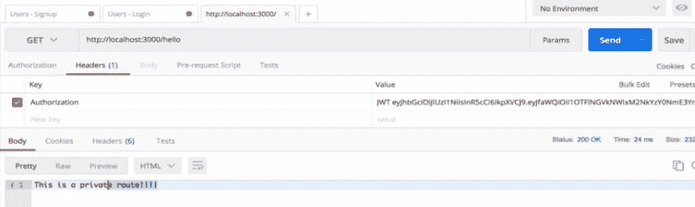](https://res.cloudinary.com/practicaldev/image/fetch/s--YXsZE6Ca--/c_limit%2Cf_auto%2Cfl_progressive%2Cq_auto%2Cw_880/https://cdn-images-1.medium.com/max/938/0%2A7jVsEmWC1DwIg5RK)

### 通过用户和对象关联发帖

接下来，我们能够在我们的应用程序中注册一个新用户:

[](https://res.cloudinary.com/practicaldev/image/fetch/s--PzUB-5ZS--/c_limit%2Cf_auto%2Cfl_progressive%2Cq_auto%2Cw_880/https://cdn-images-1.medium.com/max/618/0%2AWV39oyRO-kozDG5C)

我们还能够允许用户登录我们的应用程序:

[](https://res.cloudinary.com/practicaldev/image/fetch/s--gWqFYI21--/c_limit%2Cf_auto%2Cfl_progressive%2Cq_auto%2Cw_880/https://cdn-images-1.medium.com/max/616/0%2AfHQP3oNRag3uqXoj)

在知道我们将在这篇文章中做什么之前，让我们最后看看我们当前的 *package.json* 文件是什么样子的:

[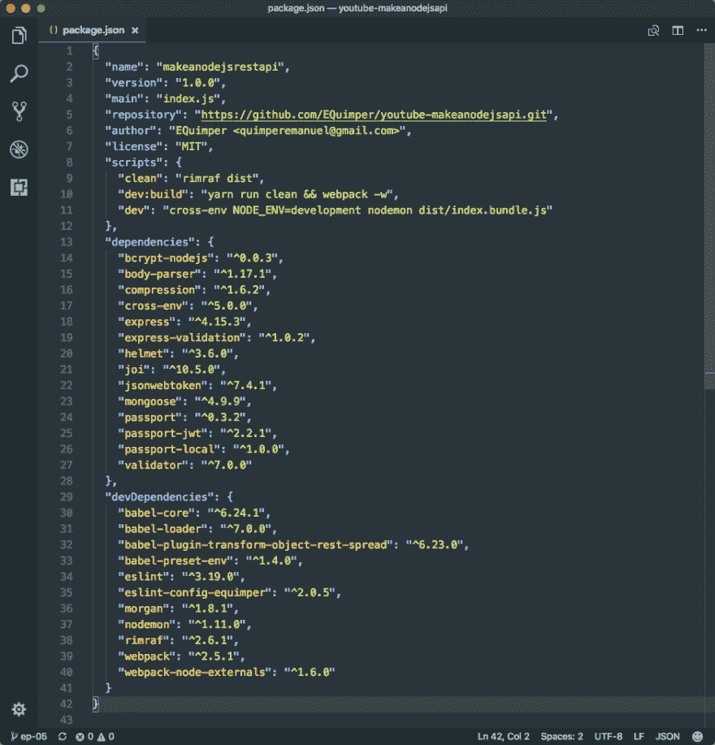](https://res.cloudinary.com/practicaldev/image/fetch/s--eiRC-Iq7--/c_limit%2Cf_auto%2Cfl_progressive%2Cq_auto%2Cw_880/https://cdn-images-1.medium.com/max/942/0%2AjpDWr_x0yPNgJb2k)

在本节中，我们将添加以下功能:

*   我们将为帖子创建一个新的资源。现在，用户也可以创建帖子
*   让用户成为文章的作者
*   处理一些我们在过去的帖子中提出的问题

#### 为帖子创建模型

就像我们为用户模型所做的一样，它也需要为 Post 模型做，就像创建一个新文件夹一样。本课结束时，您将了解项目中的新文件夹和文件:

[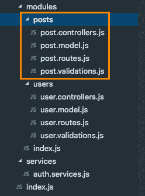](https://res.cloudinary.com/practicaldev/image/fetch/s--q5SJfAIX--/c_limit%2Cf_auto%2Cfl_progressive%2Cq_auto%2Cw_880/https://cdn-images-1.medium.com/max/248/0%2AcFs8SrAViT7v-wXa)

我们将从创建 Post 模型开始。我们还将包括我们需要的验证。让我们为 mongoose 唯一验证添加另一个库:

纱线添加猫鼬-唯一-验证器

我们还将添加一个新的 Slug 库。为此，请使用以下命令安装它:

纱线添加棒

如果你想知道什么是 slugify，一篇文章的 URL 应该看起来像文章的标题。这看起来不错，帖子的一瞥也可以在它的 URL 中看到，这是一个很好的过程。

现在，我们也可以添加这个库。我们的模型将如下所示:

```
import mongoose, { Schema } from 'mongoose';
   import slug from 'slug';
   import uniqueValidator from 'mongoose-unique-validator';

   const PostSchema = new Schema({
     title: {
       type: String,
       trim: true,
       required: [true, 'Title is required!'],
       minlength: [3, 'Title need to be longer!'],
       unique: true,
     },
     text: {
       type: String,
       trim: true,
       required: [true, 'Text is required!'],
       minlength: [10, 'Text need to be longer!'],
     },
     slug: {
       type: String,
       trim: true,
       lowercase: true,
     },
     user: {
       type: Schema.Types.ObjectId,
       ref: 'User',
     },
     favoriteCount: {
       type: Number,
       default: 0,
     },
   }, { timestamps: true });

   PostSchema.plugin(uniqueValidator, {
     message: '{VALUE} already taken!',
   });

   PostSchema.pre('validate', function (next) {
     this.\_slugify();

     next();
   });

   PostSchema.methods = {
     \_slugify() {
       this.slug = slug(this.title);
     },
   };

   PostSchema.statics = {
     createPost(args, user) {
       return this.create({
         ...args,
         user,
       });
     },
   };

   export default mongoose.model('Post', PostSchema); 
```

我们在上面的模型中做了以下工作:

*   为发布模型定义的字段
*   添加了对每个字段的验证
*   添加了对整体发布对象的验证
*   我们根据文章的标题对文章进行分类，同时也保存了这个值

在上面显示的代码中，我们将在控制器中添加 createPost 方法。

#### 创建岗位控制器

我们现在将需要一个控制器，以便用户能够真正地执行与 Post 相关的操作。

基于上图所示的目录结构，在 post 模块本身定义一个新文件 post.controller.js 文件，内容如下:

```
import Post from './post.model';

 export async function createPost(req, res) {
   try {
     const post = await Post.createPost(req.body, req.user.\_id);
     return res.status(201).json(post);
   } catch (e) {
     return res.status(400).json(e);
   }
 } 
```

当我们遇到错误或者我们成功地创建了一个新帖子时，我们会返回一个适当的响应。

#### 创建发布路线

现在，让我们在应用程序的 post 模块下的 post.route.js 文件中创建到 Post 控制器的路由，内容如下:

```
import { Router } from 'express';

 import \* as postController from './post.controllers';
 import { authJwt } from '../../services/auth.services';

 const routes = new Router();

 routes.post(
   '/',
   authJwt,
 );

 export default routes; 
```

让我们为此修改 index . js 文件。最终内容将是:

```
import userRoutes from ‘./users/user.routes’;
import postRoutes from ‘./posts/post.routes’;

export default app => {
 app.use(‘/api/v1/users’, userRoutes);
 app.use(‘/api/v1/posts’, postRoutes);
}; 
```

验证发布 API

我们现在将尝试 POST API 来创建一个新帖子。

首先，尝试登录一个用户，这样您就可以获得一个 JWT 令牌来点击这个 URL 上的 Create Post API:

[http://localhost:3000/API/v1/posts](http://localhost:3000/api/v1/posts)

以下是我们的尝试和回应:

[](https://res.cloudinary.com/practicaldev/image/fetch/s--OlMhEtCJ--/c_limit%2Cf_auto%2Cfl_progressive%2Cq_auto%2Cw_880/https://cdn-images-1.medium.com/max/606/0%2A6wYLdVZvGzFMby8A)

我们还填充了日期和 slug 字段。这还包含用户 ID。让我们也在 MongoDB 上看看这个帖子:

[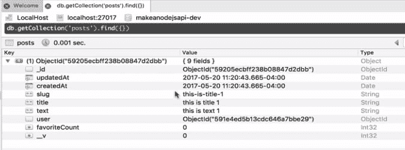](https://res.cloudinary.com/practicaldev/image/fetch/s--Fck8DPCs--/c_limit%2Cf_auto%2Cfl_progressive%2Cq_auto%2Cw_880/https://cdn-images-1.medium.com/max/675/0%2Ac1VRpUIzBJXBUyHV)

如果我们再次点击这个 API 来创建文章，将会失败，因为标题已经被占用:

[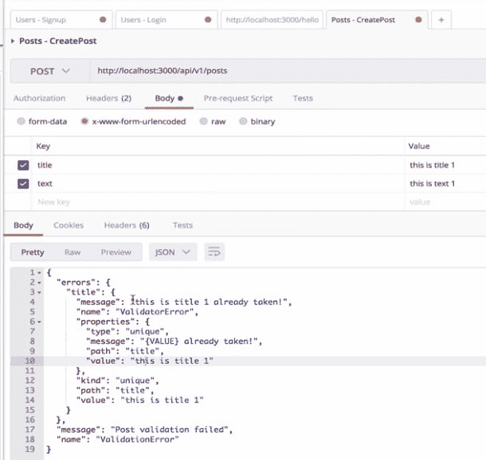](https://res.cloudinary.com/practicaldev/image/fetch/s--ypdFYGIT--/c_limit%2Cf_auto%2Cfl_progressive%2Cq_auto%2Cw_880/https://cdn-images-1.medium.com/max/610/0%2AfKECl9WpElFvwha0)

这意味着我们的验证也运行良好。

### 把题目做为必修

我们可以实现更多的验证，比如让文章的标题成为强制的。

让我们在 posts 模块中创建一个名为 post.validations.js 的新文件，其内容如下:

```
import Joi from 'joi';

   export const passwordReg = /(?=.\*\d)(?=.\*[a-z])(?=.\*[A-Z]).{6,}/;
   export default {
     signup: {
       body: {
         email: Joi.string().email().required(),
         password: Joi.string().regex(passwordReg).required(),
         firstName: Joi.string().required(),
         lastName: Joi.string().required(),
         userName: Joi.string().required(),
       },
     },
   }; 
```

我们还必须修改 routes 文件来包含这个验证。下面是修改后的文件:

```
import { Router } from 'express';
 import validate from 'express-validation';
 import \* as postController from './post.controllers';
 import { authJwt } from '../../services/auth.services';
 import postValidation from './post.validations';

 const routes = new Router();
 routes.post(
   '/',
   authJwt,
   validate(postValidation.createPost),
   postController.createPost,
 );

 export default routes; 
```

我们能够从上面使用的 authJwtobject 中获得用户 ID。我们现在收到的信息是:

[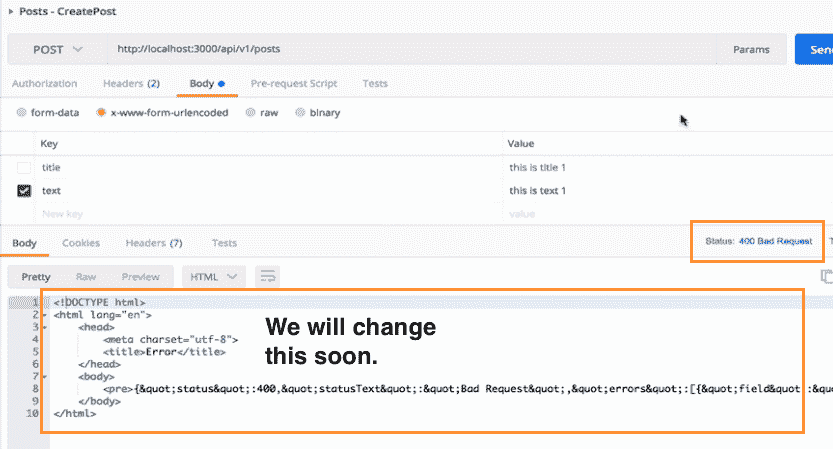](https://res.cloudinary.com/practicaldev/image/fetch/s--62kAiPji--/c_limit%2Cf_auto%2Cfl_progressive%2Cq_auto%2Cw_880/https://cdn-images-1.medium.com/max/833/0%2AiiD8fpWigQPI6zQ2)

我们将很快改变回答，使之更加优雅。

### 通过 ID 获取数据并将一个对象填充到另一个对象中

接下来，我们能够在我们的应用程序中注册一个新用户:

[](https://res.cloudinary.com/practicaldev/image/fetch/s--XoShzmb_--/c_limit%2Cf_auto%2Cfl_progressive%2Cq_auto%2Cw_880/https://cdn-images-1.medium.com/max/618/0%2AZeDkk9MFnk-8158y)

我们还能够允许用户登录我们的应用程序:

[](https://res.cloudinary.com/practicaldev/image/fetch/s--HKEtRvR0--/c_limit%2Cf_auto%2Cfl_progressive%2Cq_auto%2Cw_880/https://cdn-images-1.medium.com/max/616/0%2AAKGhBA-ZMslNsDjl)

我们还能够创建一个与用户相关的帖子:

[](https://res.cloudinary.com/practicaldev/image/fetch/s--EQXinVkW--/c_limit%2Cf_auto%2Cfl_progressive%2Cq_auto%2Cw_880/https://cdn-images-1.medium.com/max/606/0%2AMsgwdrXhOQze8Zod)

在本节中，我们将添加以下功能:

*   我们将通过它的 ID 得到一个帖子
*   我们还将创建控制器和路线
*   我们将向您展示如何在帖子中填充用户信息
*   我们将使用的其他库

[](https://res.cloudinary.com/practicaldev/image/fetch/s--Y4ebZ1_C--/c_limit%2Cf_auto%2Cfl_progressive%2Cq_auto%2Cw_880/https://cdn-images-1.medium.com/proxy/1%2AouK9XR4xuNWtCes-TIUNAw.png)

#### 学习用 Node.js、Express、MongoDB、friends 构建 app 的高级培训课程。[现在开始学习→](https://LearnNode.com/friend/KRISSANAWAT)

[](https://res.cloudinary.com/practicaldev/image/fetch/s--Y4ebZ1_C--/c_limit%2Cf_auto%2Cfl_progressive%2Cq_auto%2Cw_880/https://cdn-images-1.medium.com/proxy/1%2AouK9XR4xuNWtCes-TIUNAw.png)

#### 向控制器添加 HTTP 状态库

要添加此库，请运行以下命令:

纱线添加 http-状态

现在，我们也可以在用户控制器中使用这个库。让我们从导入这个库开始:

从“http-status”导入 HTTPStatus

接下来，不要使用 200 等状态。在我们的控制器中，我们将把这个库提供的状态修改为:

```
export async function signUp(req, res) {
     try {
       const user = await User.create(req.body);
       return res.status(HTTPStatus.CREATED).json(user.toAuthJSON());
     } catch (e) {
       return res.status(HTTPStatus.BAD\_REQUEST).json(e);
     }
   }

   export function login(req, res, next) {
       res.status(HTTPStatus.OK).json(req.user.toAuthJSON());
     return next();
   } 
```

我们将在 Post 控制器中做同样的事情:

```
import HTTPStatus from 'http-status';
   import Post from './post.model';

   export async function createPost(req, res) {
     try {
       const post = await Post.createPost(req.body, req.user.\_id);
         return res.status(HTTPStatus.CREATED).json(post);
     } catch (e) {
       return res.status(HTTPStatus.BAD\_REQUEST).json(e);
     }
   } 
```

#### 按 ID 获取帖子

我们将在 Post 控制器中定义一个新的函数，用于通过 ID:
获取帖子

```
export async function getPostById(req, res) {
   try {
     const post = await Post.findById(req.params.id);
     return res.status(HTTPStatus.OK).json(post);
   } catch (e) {
     return res.status(HTTPStatus.BAD\_REQUEST).json(e);
   }
 } 
```

让我们来定义此功能的路线:

routes.get('/:id '，post controller . getpostbyid)；

因为我们的 Mongo 数据库中有以下帖子:

[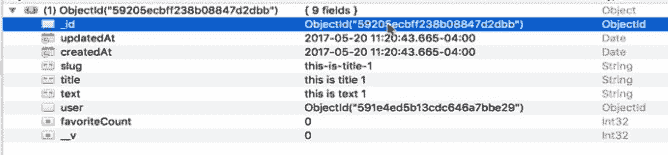](https://res.cloudinary.com/practicaldev/image/fetch/s--lvYE0w4t--/c_limit%2Cf_auto%2Cfl_progressive%2Cq_auto%2Cw_880/https://cdn-images-1.medium.com/max/668/0%2ATU8kZigBK78m1K8G)

我们将通过我们的 API 获得这个帖子:

[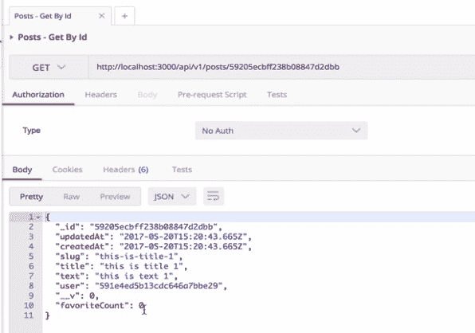](https://res.cloudinary.com/practicaldev/image/fetch/s--ieOKZEd_--/c_limit%2Cf_auto%2Cfl_progressive%2Cq_auto%2Cw_880/https://cdn-images-1.medium.com/max/596/0%2AQBJj46Ity0JEfA8K)

这个响应的问题是，我们也得到了 MongoDB 中的所有字段。我们不想这样。让我们在帖子模型中对此进行更改:

```
PostSchema.methods = {
   \_slugify() {
     this.slug = slug(this.title);
   },
   toJSON() {
     return {
       \_id: this.\_id,
       title: this.title,
       text: this.text,
       createdAt: this.createdAt,
       slug: this.slug,
       user: this.user,
       favoriteCount: this.favoriteCount,
     };
   },
 }; 
```

一旦我们在模型中应用了 toJSON()函数，我们现在得到的响应是:

[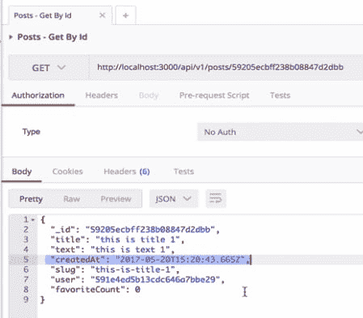](https://res.cloudinary.com/practicaldev/image/fetch/s--YlTYqOav--/c_limit%2Cf_auto%2Cfl_progressive%2Cq_auto%2Cw_880/https://cdn-images-1.medium.com/max/449/0%2A0fUfVfrQySXcpXuR)

#### 获取 Post 响应中的用户数据

如果我们仔细看上面的 JSONclosely，我们实际上有保存其 ID 的用户字段。但是如果我们也希望它的信息在同一个对象中呢？

只需稍微修改 getPostById 函数，并将函数中的 post const 修改为:

const post = await post . find byid(req . params . id)。填充(“用户”)；

我们刚刚添加了一个填充调用，现在响应将是:

[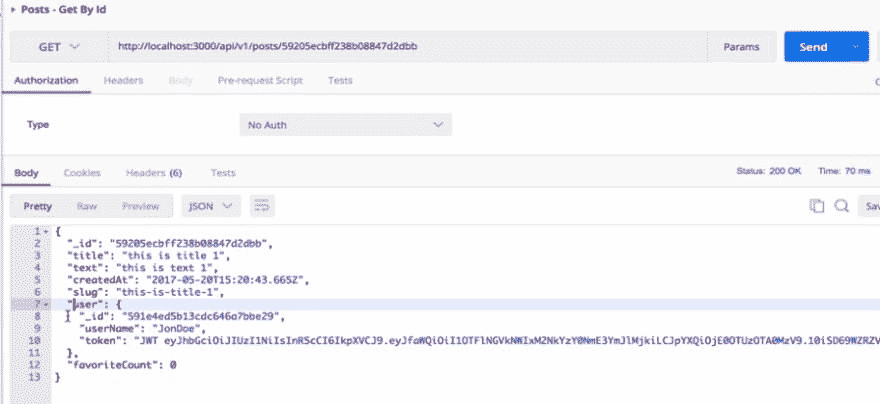](https://res.cloudinary.com/practicaldev/image/fetch/s--cWvBnSoO--/c_limit%2Cf_auto%2Cfl_progressive%2Cq_auto%2Cw_880/https://cdn-images-1.medium.com/max/896/0%2A-8k75lhe7LayBLGY)

当我们填充用户对象时，tojson 也将工作。这是这里的一个问题，因为我们还拿回了上面的令牌字段，这是永远不会发生的！

让我们修改用户模型来改善这一点:

```
UserSchema.methods = {
   \_hashPassword(password) {
     ...
   },
   authenticateUser(password) {
     ...
   },
   createToken() {
     ...
   },
   toAuthJSON() {
     ...
   },
   toJSON() {
     return {
       \_id: this.\_id,
       userName: this.userName,
     };
   }, 
```

我们修改了上面的 token 方法，因此 token 字段不包含在响应本身中。

这个问题实际上仍然存在。让我们看看当我尝试让一个用户登录时会发生什么:

[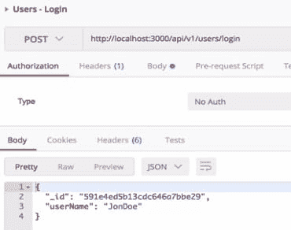](https://res.cloudinary.com/practicaldev/image/fetch/s--6gzoKing--/c_limit%2Cf_auto%2Cfl_progressive%2Cq_auto%2Cw_880/https://cdn-images-1.medium.com/max/370/0%2A3f5Aiy0R8UVuo4tX)

看，这里也没有令牌字段。要解决这个问题，进入用户控制器中的登录功能，修改如下:

```
export function login(req, res, next) {
 res.status(HTTPStatus.OK).json(req.user.toAuthJSON());
 return next();
} 
```

现在，我已经使用了 toAuthJSONfunction 本身。如果您现在尝试，登录将像以前一样工作！

### 从数据库中获取所有数据

接下来，我们能够在我们的应用程序中注册一个新用户:

[](https://res.cloudinary.com/practicaldev/image/fetch/s--QrAUI_rC--/c_limit%2Cf_auto%2Cfl_progressive%2Cq_auto%2Cw_880/https://cdn-images-1.medium.com/max/618/0%2AxIGj9uZAjAg8rxjx)

我们还能够允许用户登录我们的应用程序:

[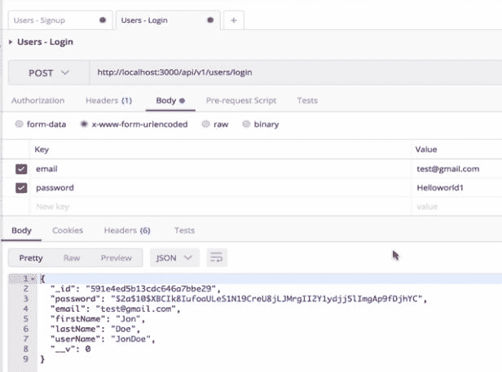](https://res.cloudinary.com/practicaldev/image/fetch/s--7v9uV8ZD--/c_limit%2Cf_auto%2Cfl_progressive%2Cq_auto%2Cw_880/https://cdn-images-1.medium.com/max/616/0%2AoZS5uOTGqZgaKUGk)

我们还能够创建一个与用户相关的帖子:

[](https://res.cloudinary.com/practicaldev/image/fetch/s--8TD7HDOv--/c_limit%2Cf_auto%2Cfl_progressive%2Cq_auto%2Cw_880/https://cdn-images-1.medium.com/max/606/0%2AupUoB-2cM9pKThVw)

在本节中，我们将添加以下功能:

*   在后控制器上工作以添加更多功能

### 扩展控制器

到目前为止，我们的 Post 控制器只有以下功能:

*   创建帖子
*   按 ID 获取帖子

现在，我们还将添加更多的功能，我们将从获取列表中的所有帖子开始。

#### 获取所有帖子

让我们通过添加一个新的方法来获取所有帖子，从而扩展我们的 Post 控制器的功能:

```
export async function getPostsList(req, res) {
     try {
       const posts = await Post.find().populate('user');
       return res.status(HTTPStatus.OK).json(posts);
     } catch (e) {
       return res.status(HTTPStatus.BAD\_REQUEST).json(e);
     }
   } 
```

在这里，我们退回了帖子。让我们修改路由文件以使用我们在上面添加的函数:

routes.get('/'，post controller . getpostslist)；

我们没有在认证中加入这一点，即使是未经认证的用户也可以至少允许他发帖。现在让我们试试这个 API:

[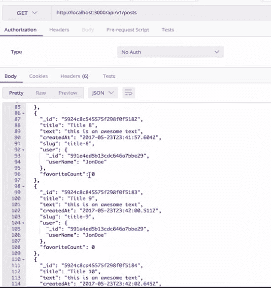](https://res.cloudinary.com/practicaldev/image/fetch/s--aptXIa6d--/c_limit%2Cf_auto%2Cfl_progressive%2Cq_auto%2Cw_880/https://cdn-images-1.medium.com/max/550/0%2AL3af2pnd_Zs3-BoO)

现在，我们有 11 个职位在数据库中，所以，上述 API 显示没有问题。但是五万多的帖子会怎么样呢？在这种情况下，我们会遇到严重的性能问题。

#### 分页拯救

我们可以根据用户的要求返回有限数量的帖子。在 postmodel 中，我们可以提供分页参数，如:

```
PostSchema.statics = {
     createPost(args, user) {
       ...
     },
     list({ skip = 0, limit = 5 } = {}) {
       return this.find()
         .sort({ createdAt: -1 })
         .skip(skip)
         .limit(limit)
         .populate('user');
     },
   }; 
```

list 所做的是，它最初只返回前 5 个帖子。如果 skip 为 5，list 函数将返回 5 篇文章，但在跳过前 5 篇文章之后。让我们也修改一下控制器:

```
export async function getPostsList(req, res) {
   const limit = parseInt(req.query.limit, 0);
   const skip = parseInt(req.query.skip, 0);
   try {
     const posts = await Post.list({ limit, skip });
     return res.status(HTTPStatus.OK).json(posts);
   } catch (e) {
     return res.status(HTTPStatus.BAD\_REQUEST).json(e);
   }
 } 
```

现在，当我们提供这些值时，我们得到这样的响应:

[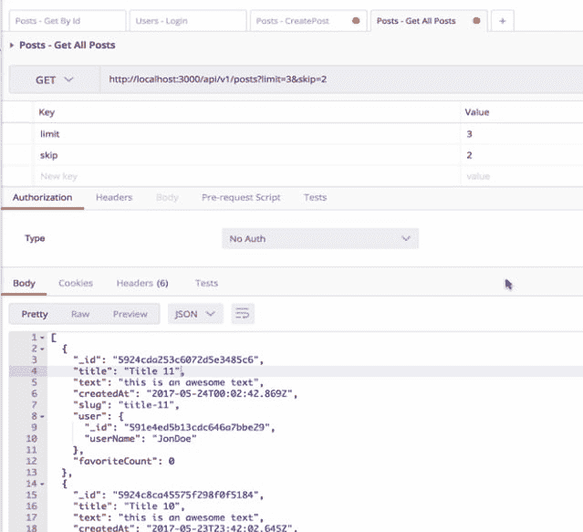](https://res.cloudinary.com/practicaldev/image/fetch/s--pYTF59Z_--/c_limit%2Cf_auto%2Cfl_progressive%2Cq_auto%2Cw_880/https://cdn-images-1.medium.com/max/639/0%2A6T-IPs7jRQ8X6BxG)

#### 更新帖子并添加验证

接下来，我们能够在我们的应用程序中注册一个新用户:

[](https://res.cloudinary.com/practicaldev/image/fetch/s--K7ma_geP--/c_limit%2Cf_auto%2Cfl_progressive%2Cq_auto%2Cw_880/https://cdn-images-1.medium.com/max/618/0%2AE_T64VB2Gof06O82)

我们还能够允许用户登录我们的应用程序:

[](https://res.cloudinary.com/practicaldev/image/fetch/s---NNchxvn--/c_limit%2Cf_auto%2Cfl_progressive%2Cq_auto%2Cw_880/https://cdn-images-1.medium.com/max/616/0%2AQSNjJ1W8nSTTUBPR)

我们还能够创建一个与用户相关的帖子:

[](https://res.cloudinary.com/practicaldev/image/fetch/s--pbg2mxMu--/c_limit%2Cf_auto%2Cfl_progressive%2Cq_auto%2Cw_880/https://cdn-images-1.medium.com/max/606/0%2Awdvakfb45Xl55sc4)

在本课中，我们将添加以下功能:

*   我们将更新帖子，并确保更新帖子的用户是其作者
*   创建验证字段

在接下来的课程中，我们将在帖子上添加更多的操作。

[](https://res.cloudinary.com/practicaldev/image/fetch/s--Y4ebZ1_C--/c_limit%2Cf_auto%2Cfl_progressive%2Cq_auto%2Cw_880/https://cdn-images-1.medium.com/proxy/1%2AouK9XR4xuNWtCes-TIUNAw.png)

#### 学习用 Node.js、Express、MongoDB、friends 构建 app 的高级培训课程。[现在开始学习→](https://LearnNode.com/friend/KRISSANAWAT)

[](https://res.cloudinary.com/practicaldev/image/fetch/s--Y4ebZ1_C--/c_limit%2Cf_auto%2Cfl_progressive%2Cq_auto%2Cw_880/https://cdn-images-1.medium.com/proxy/1%2AouK9XR4xuNWtCes-TIUNAw.png)

#### 扩展控制器

到目前为止，我们的 Post 控制器只有以下功能:

*   创建一个 pos
*   按 ID 获取帖子
*   获取所有帖子的列表

现在，我们还将添加更多的功能，我们将从允许用户更新帖子开始。

#### 更新帖子

让我们通过添加一个新的方法来更新 post，从而扩展 Post 控制器的功能:

```
export async function updatePost(req, res) {
     try {
       const post = await Post.findById(req.params.id);
       if (!post.user.equals(req.user.\_id)) {
         return res.sendStatus(HTTPStatus.UNAUTHORIZED);
       }

       Object.keys(req.body).forEach(key => {
         post[key] = req.body[key];
       });

       return res.status(HTTPStatus.OK).json(await post.save());
     } catch (e) {
       return res.status(HTTPStatus.BAD\_REQUEST).json(e);
     }
   } 
```

这就是我们在上面所做的:

*   从 JWT 令牌确认用户是否与发布对象中的用户相同
*   如果用户不是相同的，我们返回一个未授权的响应
*   如果一个用户是相同的，我们得到请求中传递的每个键，并基于此更新帖子
*   一旦所有更新完成，我们返回 OK 响应

让我们修改验证文件来使用我们在上面添加的函数:

```
import Joi from 'joi';

   export default {
     createPost: {
       body: {
         title: Joi.string().min(3).required(),
         text: Joi.string().min(10).required(),
       },
     },
     updatePost: {
       body: {
         title: Joi.string().min(3),
         text: Joi.string().min(10),
       },
     },
   }; 
```

我们刚刚在 updatePost 函数中为两个字段的最小长度添加了验证。路线文件现在的时间:

```
routes.patch(
   '/:id',
   authJwt,
   validate(postValidation.updatePost),
   postController.updatePost,
 ); 
```

#### 更新帖子

现在工作已经完成了，我们将验证上面所做的工作。让我们向邮递员发出这样的请求:

[](https://res.cloudinary.com/practicaldev/image/fetch/s--StLimycd--/c_limit%2Cf_auto%2Cfl_progressive%2Cq_auto%2Cw_880/https://cdn-images-1.medium.com/max/503/0%2AdhxvpUE58Fsa5GaV)

太好了，成功了！甚至帖子的内容也更新了。只要确保我们在 Post:
的模型中有这个方法

```
PostSchema.pre(‘validate’, function (next) {
 this.\_slugify();
 next();
}); 
```

继续尝试同样的文章。

### 授权用户删除帖子

到目前为止，我们能够在我们的应用程序中注册一个新用户:

[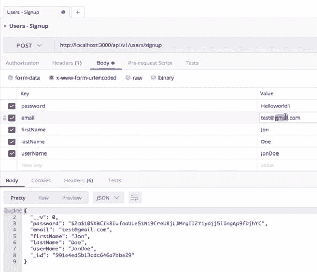](https://res.cloudinary.com/practicaldev/image/fetch/s--GPWdlN-r--/c_limit%2Cf_auto%2Cfl_progressive%2Cq_auto%2Cw_880/https://cdn-images-1.medium.com/max/618/0%2AQM2CQ_cZQ2VjKqKR)

我们还能够允许用户登录我们的应用程序:

[](https://res.cloudinary.com/practicaldev/image/fetch/s--hx-aqhyi--/c_limit%2Cf_auto%2Cfl_progressive%2Cq_auto%2Cw_880/https://cdn-images-1.medium.com/max/616/0%2AcesI4HfbAcBe2Naj)

我们能够创建与用户相关的帖子:

[](https://res.cloudinary.com/practicaldev/image/fetch/s--ZaGi7br5--/c_limit%2Cf_auto%2Cfl_progressive%2Cq_auto%2Cw_880/https://cdn-images-1.medium.com/max/606/0%2AqkX7pkNYdMwnNg6e)

在本课中，我们将添加以下功能:

*   我们将允许作者删除帖子
*   授权功能
*   添加一个名为 prettie 的工具

#### 扩展控制器

到目前为止，我们的 Post 控制器只有以下功能:

*   创建帖子
*   按 ID 获取帖子
*   获取所有帖子的列表
*   更新帖子

现在，我们还将添加更多的功能，我们将从允许用户删除帖子开始。

#### 删除帖子

让我们通过添加一个删除帖子的新方法来扩展 Post 控制器的功能:

```
export async function deletePost(req, res) {
     try {
         const post = await Post.findById(req.params.id);

       if (!post.user.equals(req.user.\_id)) {
         return res.sendStatus(HTTPStatus.UNAUTHORIZED);
       }

       await post.remove();
       return res.sendStatus(HTTPStatus.OK);
     } catch (e) {
       return res.status(HTTPStatus.BAD\_REQUEST).json(e);
     }
   } 
```

这就是我们在上面所做的:

*   从 JWT 令牌确认用户是否与发布对象中的用户相同
*   如果用户不是同一个人，我们会返回一个未经授权的响应
*   如果用户是相同的，我们删除帖子
*   一旦帖子被删除，我们返回 OK 响应

现在发送文件的时间:

routes.delete('/:id '，authJwt，post controller . delete post)；

#### 删除帖子

现在工作已经完成了，我们将验证上面所做的工作。让我们像这样从 Postman 发出一个删除请求:

[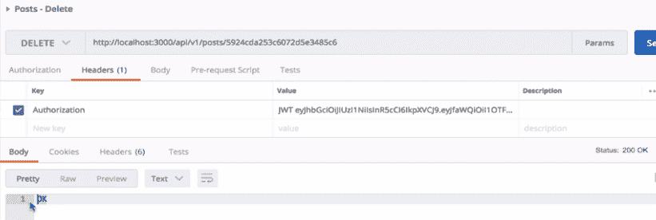](https://res.cloudinary.com/practicaldev/image/fetch/s--t--FJDaC--/c_limit%2Cf_auto%2Cfl_progressive%2Cq_auto%2Cw_880/https://cdn-images-1.medium.com/max/821/0%2ADHMmMd-WUcKH5k5j)

现在，您可以使用以下查询来验证这篇文章是否存在于 Get all Post API 和 MongoDB 中:

[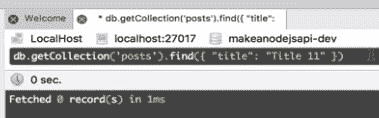](https://res.cloudinary.com/practicaldev/image/fetch/s--jTAclwl2--/c_limit%2Cf_auto%2Cfl_progressive%2Cq_auto%2Cw_880/https://cdn-images-1.medium.com/max/379/0%2A8WvIgaoEhXQmUz98)

### 添加漂亮点的库

我们可以用下面的 yarn 命令添加更漂亮的库:

纱线添加更漂亮

完成后，这是我更新的包

```
{
     "name": "makeanodejsrestapi",
     ...,
     "scripts": {
       ...,
       "prettier": "prettier --single-quote --print-width 80 --trailing-comma all --write 'src/\*\*/\*.js'"
     },
     "dependencies": {
       ...
     },
     "devDependencies": {
       ...,
       "prettier": "^1.3.1",
       ...
     }
   } 
```

我们只显示了所做的更改。我们还将使用以下命令添加一个 ES lint 库:

纱线添加-D eslint-config-prettie

现在，我们将创建一个名为。带有以下注释的 eslintrc:

```
{
 “extends”: [
 “equimper”,
 “prettier”
 ]
} 
```

现在，如果您忘记添加分号或缩进，您只需运行以下命令，它们就会为您添加:

纱线更漂亮

这不是很神奇吗？:)这还显示了哪些文件发生了更改:

[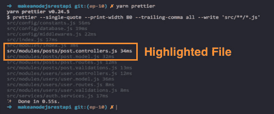](https://res.cloudinary.com/practicaldev/image/fetch/s--dpRBxGiu--/c_limit%2Cf_auto%2Cfl_progressive%2Cq_auto%2Cw_880/https://cdn-images-1.medium.com/max/563/0%2A1Vp0auIKb5EJfrAH)

我们将继续使用这个命令和库，因为这确实简化了我们的工作！

[](https://res.cloudinary.com/practicaldev/image/fetch/s--Y4ebZ1_C--/c_limit%2Cf_auto%2Cfl_progressive%2Cq_auto%2Cw_880/https://cdn-images-1.medium.com/proxy/1%2AouK9XR4xuNWtCes-TIUNAw.png)

#### 学习用 Node.js、Express、MongoDB、friends 构建 app 的高级培训课程。[现在开始学习→](https://LearnNode.com/friend/KRISSANAWAT)

[](https://res.cloudinary.com/practicaldev/image/fetch/s--Y4ebZ1_C--/c_limit%2Cf_auto%2Cfl_progressive%2Cq_auto%2Cw_880/https://cdn-images-1.medium.com/proxy/1%2AouK9XR4xuNWtCes-TIUNAw.png)

### 收藏某个帖子并管理某个帖子的统计

接下来，我们能够在我们的应用程序中注册一个新用户:

[](https://res.cloudinary.com/practicaldev/image/fetch/s--wWaVtoV8--/c_limit%2Cf_auto%2Cfl_progressive%2Cq_auto%2Cw_880/https://cdn-images-1.medium.com/max/618/0%2APYNPZvhRhfLkxnWM)

我们还能够允许用户登录我们的应用程序:

[](https://res.cloudinary.com/practicaldev/image/fetch/s--R4zE8hNM--/c_limit%2Cf_auto%2Cfl_progressive%2Cq_auto%2Cw_880/https://cdn-images-1.medium.com/max/616/0%2AekpL3Idzf0LDhxyB)

我们能够创建与用户相关的帖子:

[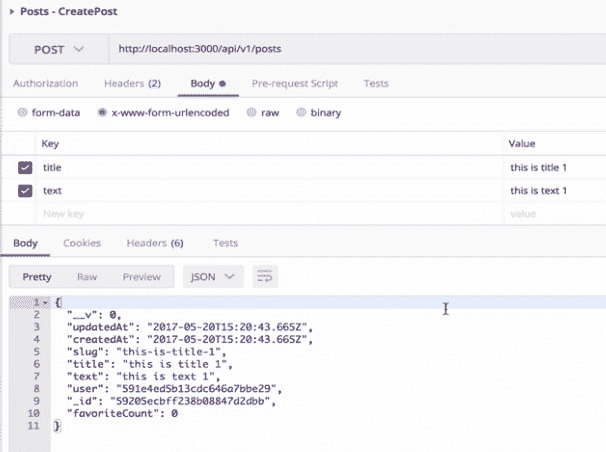](https://res.cloudinary.com/practicaldev/image/fetch/s--IWLc2SNC--/c_limit%2Cf_auto%2Cfl_progressive%2Cq_auto%2Cw_880/https://cdn-images-1.medium.com/max/606/0%2A_IkpuW39shl3bWeL)

在本节中，我们将添加以下功能:

*   用户可以在通过身份验证后收藏帖子，这也将增加 favoriteCount 计数器变量
*   为此修改用户和发布的模型
*   在 Post 上添加增量/减量静态

#### 修改用户模型

我们将添加一个新字段来存储用户喜欢的帖子。让 edit _user.model.js_file 来实现这一点，并在密码字段之后添加一个新字段:

```
favorites: {
         posts: [{
           type: Schema.Types.ObjectId,
           ref: 'Post'
         }]
       } 
```

我们还将添加一个函数来使用这个字段:

```
UserSchema.methods = {
     \_hashPassword(password) {
       ...
     },
     authenticateUser(password) {
       ...
     },
     createToken() {
       ...
     },
     toAuthJSON() {
       ...
     },
     toJSON() {
       ...
     },

     \_favorites: {
       async posts(postId) {
         if (this.favorites.posts.indexOf(postId) >= 0) {
           this.favorites.posts.remove(postId);
         } else {
           this.favorites.posts.push(postId);
         }
         return this.save();
       }
     }
   }; 
```

#### 扩展岗位控制器

让我们在这里添加一个函数来使用我们在模型中定义的功能。首先使用导入 in_post.controller.js_file:

```
import User from ‘../users/user.model’; 
```

接下来，我们调用 Usermodel 函数:

```
export async function favoritePost(req, res) {
     try {
       const user = await User.findById(req.user.\_id);
       await user.\_favorites.posts(req.params.id);
       return res.sendStatus(HTTPStatus.OK);
     } catch (e) {
       return res.status(HTTPStatus.BAD\_REQUEST).json(e);
     }
   } 
```

让我们最后修改 our _post.routes.js_file 来访问这个函数:

```
routes.post(‘/:id/favorite’, authJwt, postController.favoritePost); 
```

现在该测试这条路线了。在 Postman 中，在从数据库或 Get all post API 中选择一个 PostID 后，向 favorite API 发出 GETrequest:

[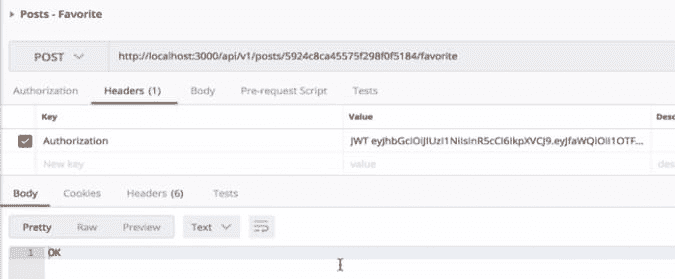](https://res.cloudinary.com/practicaldev/image/fetch/s--YXGDm-UW--/c_limit%2Cf_auto%2Cfl_progressive%2Cq_auto%2Cw_880/https://cdn-images-1.medium.com/max/675/0%2AeAoBsPt_90MFZXQD)

接下来，我们验证这在 MongoDB 上是否有效:

[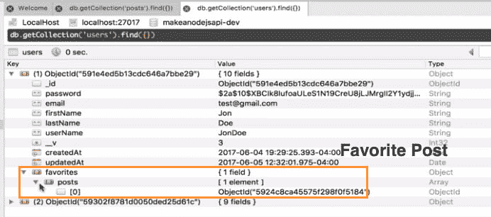](https://res.cloudinary.com/practicaldev/image/fetch/s--B5q8Bv_p--/c_limit%2Cf_auto%2Cfl_progressive%2Cq_auto%2Cw_880/https://cdn-images-1.medium.com/max/692/0%2A0cAp0jrT7a3lLsd1)

我们只保留了对象 ID，因为这样可以避免我们复制数据。如果你再次点击同一个 API，你会看到一些奇怪的东西，文章 ID 现在从用户模型的收藏夹中删除了！

[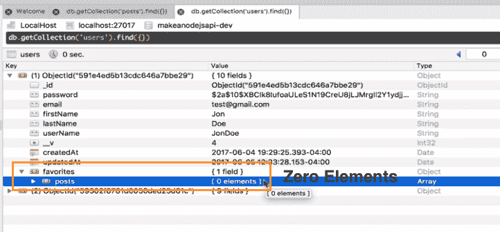](https://res.cloudinary.com/practicaldev/image/fetch/s--xjob_-yu--/c_limit%2Cf_auto%2Cfl_progressive%2Cq_auto%2Cw_880/https://cdn-images-1.medium.com/max/722/0%2ARcBKJGQG5d1VYktj)

我们还在帖子模型中保留了最受欢迎人数。让我们现在就让它发挥作用。我们将在 Postmodel 类中包含这个逻辑:

```
PostSchema.statics = {
   createPost(args, user) {
     ...
   },
   list({ skip = 0, limit = 5 } = {}) {
     ...
   },

   incFavoriteCount(postId) {
     return this.findByIdAndUpdate(postId, { $inc: { favoriteCount: 1 } });
   },

   decFavoriteCount(postId) {
     return this.findByIdAndUpdate(postId, { $inc: { favoriteCount: -1 } });
   }
 }; 
```

incFavoriteCount 和 decFavoriteCount 方法首先使用 Mongo 的 findByIdAndUpdate 方法来查找文章 ID，然后使用$inc 操作符在收藏增加的情况下添加 1，或者在收藏减少的情况下添加-1。

现在让我们也修改一下用户模型。首先添加此导入语句:

'从以下位置导入帖子'../posts/post . model '；

然后，在这里修改 _favoritesmethod 功能:

```
\_favorites: {
       async posts(postId) {
         if (this.favorites.posts.indexOf(postId) >= 0) {
           this.favorites.posts.remove(postId);
           await Post.decFavoriteCount(postId);
         } else {
           this.favorites.posts.push(postId);
           await Post.incFavoriteCount(postId);
         }

         return this.save();
       }
     } 
```

现在，我们上面提到的用户模型问题将会解决，Post 模型中的 favoriteCount 也将工作:

[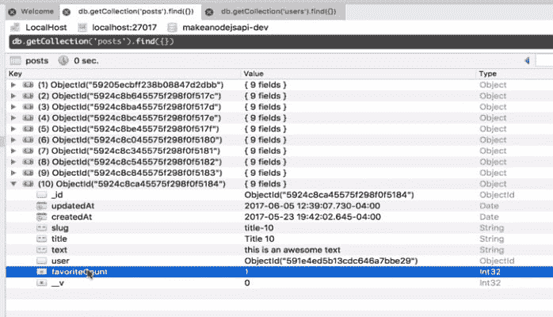](https://res.cloudinary.com/practicaldev/image/fetch/s--9X11Nxvw--/c_limit%2Cf_auto%2Cfl_progressive%2Cq_auto%2Cw_880/https://cdn-images-1.medium.com/max/698/0%2AUeQRcrXmp2twYPWo)

如果你一次又一次地点击同一个 API，结果是不会改变的。太棒了。我们有工作的 API，用户也可以喜欢一个帖子。

[](https://res.cloudinary.com/practicaldev/image/fetch/s--Y4ebZ1_C--/c_limit%2Cf_auto%2Cfl_progressive%2Cq_auto%2Cw_880/https://cdn-images-1.medium.com/proxy/1%2AouK9XR4xuNWtCes-TIUNAw.png)

#### 学习用 Node.js、Express、MongoDB、friends 构建 app 的高级培训课程。[现在开始学习→](https://LearnNode.com/friend/KRISSANAWAT)

[](https://res.cloudinary.com/practicaldev/image/fetch/s--Y4ebZ1_C--/c_limit%2Cf_auto%2Cfl_progressive%2Cq_auto%2Cw_880/https://cdn-images-1.medium.com/proxy/1%2AouK9XR4xuNWtCes-TIUNAw.png)

### 识别帖子是否已经是用户的最爱

最后一部分，我们能够在我们的应用程序中注册一个新用户:

[](https://res.cloudinary.com/practicaldev/image/fetch/s--kZRpMjWU--/c_limit%2Cf_auto%2Cfl_progressive%2Cq_auto%2Cw_880/https://cdn-images-1.medium.com/max/618/0%2AhKB0gglsUcHogEdz)

我们还能够允许用户登录我们的应用程序:

[](https://res.cloudinary.com/practicaldev/image/fetch/s--mGzavHhW--/c_limit%2Cf_auto%2Cfl_progressive%2Cq_auto%2Cw_880/https://cdn-images-1.medium.com/max/616/0%2AH2kd9TMZdua-_Bwj)

我们能够创建与用户相关的帖子:

[](https://res.cloudinary.com/practicaldev/image/fetch/s--FfsEyRlg--/c_limit%2Cf_auto%2Cfl_progressive%2Cq_auto%2Cw_880/https://cdn-images-1.medium.com/max/606/0%2A0TYd1pSo_hhdB2Xo)

更新帖子:

[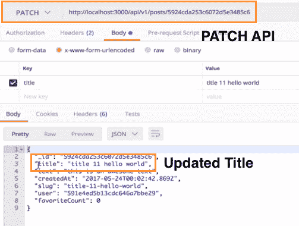](https://res.cloudinary.com/practicaldev/image/fetch/s--kYfSamqq--/c_limit%2Cf_auto%2Cfl_progressive%2Cq_auto%2Cw_880/https://cdn-images-1.medium.com/max/503/0%2A0ew-HEfcORChXZJA)

并删除一个帖子:

[](https://res.cloudinary.com/practicaldev/image/fetch/s--tZONmkhB--/c_limit%2Cf_auto%2Cfl_progressive%2Cq_auto%2Cw_880/https://cdn-images-1.medium.com/max/821/0%2AdMCzJ-h7AhIyZx17)

在本节中，我们将添加以下功能:

*   我们将发送他们，如果当前的职位是最喜爱的用户或没有，使前端可以根据这一事实作出决定
*   我们将对路线进行修改，并对控制器功能进行改进

#### 延伸路线

我们只需要对我们的 _post.route.js_file:
做很少的修改

```
routes.get(‘/:id’, authJwt, postController.getPostById);
routes.get(‘/’, authJwt, postController.getPostsList); 
```

我们只是在这两个现有的行中添加了 authJwt。一旦完成，如果我试图获取没有授权头的 Post 列表，我们将得到一个错误:

[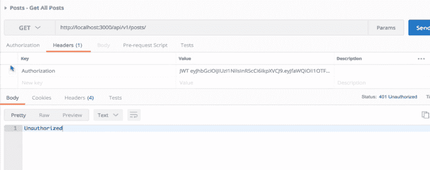](https://res.cloudinary.com/practicaldev/image/fetch/s--pSrwNwpt--/c_limit%2Cf_auto%2Cfl_progressive%2Cq_auto%2Cw_880/https://cdn-images-1.medium.com/max/837/0%2A64wmF3U7lLH7nPg5)

#### 扩展用户模型

现在，如果对当前授权用户有利，我们将在 post JSON 中添加更多信息。

移动到 _user.model.js_file，将此功能添加到 _favorites:

```
isPostIsFavorite(postId) {
     if (this.favorites.posts.indexOf(postId) >= 0) {
       return true;
     }
    return false;
    } 
```

现在移动到 _post.controller.js_file 并修改 getPostByIdfunction:

```
export async function getPostById(req, res) {
     try {
       const promise = await Promise.all([
         User.findById(req.user.\_id),
           Post.findById(req.params.id).populate('user')
       ]);

       const favorite = promise[0].\_favorites.isPostIsFavorite(req.params.id);
       const post = promise[1];

       return res.status(HTTPStatus.OK).json({
         ...post.toJSON(),
         favorite
       });
     } catch (e) {
       return res.status(HTTPStatus.BAD\_REQUEST).json(e);
     }
   } 
```

这里，我们刚刚添加了一个新的字段收藏夹，它将反映在如下的 Post API 中:

[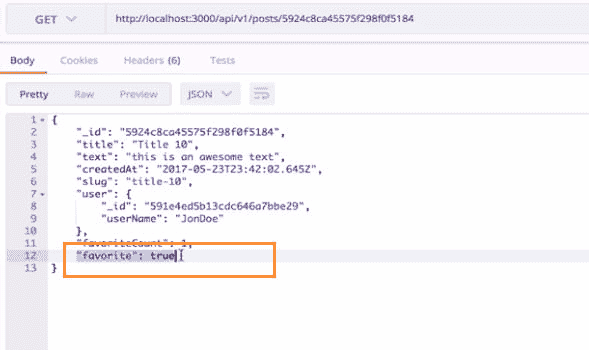](https://res.cloudinary.com/practicaldev/image/fetch/s--UHowtUng--/c_limit%2Cf_auto%2Cfl_progressive%2Cq_auto%2Cw_880/https://cdn-images-1.medium.com/max/589/0%2Avn80tbNVK94N5vaC)

我们还将修改 getPostsListfunction，以包含一个承诺并返回适当的响应:

```
export async function getPostsList(req, res) {
     const limit = parseInt(req.query.limit, 0);
     const skip = parseInt(req.query.skip, 0);
     try {
       const promise = await Promise.all([
         User.findById(req.user.\_id),
         Post.list({ limit, skip })
       ]);

       const posts = promise[1].reduce((arr, post) => {
         const favorite = promise[0].\_favorites.isPostIsFavorite(post.\_id);

         arr.push({
           ...post.toJSON(),
           favorite
         });

         return arr;
       }, []);

       return res.status(HTTPStatus.OK).json(posts);
     } catch (e) {
       return res.status(HTTPStatus.BAD\_REQUEST).json(e);
     }
   } 
```

让我们现在运行并获取所有帖子:

[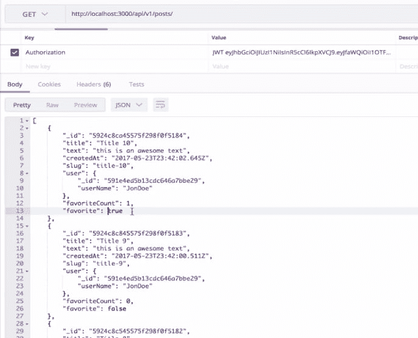](https://res.cloudinary.com/practicaldev/image/fetch/s--Mvt-G_oj--/c_limit%2Cf_auto%2Cfl_progressive%2Cq_auto%2Cw_880/https://cdn-images-1.medium.com/max/687/0%2AqXD8F_L18EcTdES6)

非常好。

#### 结论

你会从这篇文章中学到很多节点和 API 的知识，但也有越来越多的话题我们应该知道，例如安全性，速率限制，最佳实践，我希望你会喜欢。

[](https://res.cloudinary.com/practicaldev/image/fetch/s--Y4ebZ1_C--/c_limit%2Cf_auto%2Cfl_progressive%2Cq_auto%2Cw_880/https://cdn-images-1.medium.com/proxy/1%2AouK9XR4xuNWtCes-TIUNAw.png)

#### 学习用 Node.js、Express、MongoDB、friends 构建 app 的高级培训课程。[现在开始学习→](https://LearnNode.com/friend/KRISSANAWAT)

[](https://res.cloudinary.com/practicaldev/image/fetch/s--Y4ebZ1_C--/c_limit%2Cf_auto%2Cfl_progressive%2Cq_auto%2Cw_880/https://cdn-images-1.medium.com/proxy/1%2AouK9XR4xuNWtCes-TIUNAw.png)

### 免责声明

此帖子包含产品的附属链接。我们可能会收到通过这些链接购买的佣金。

* * *