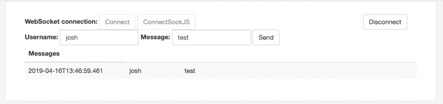

# 带 Spring Boot 的简单 WebSockets

> 原文：<https://dev.to/jmlw/simple-websockets-with-spring-boot-18h9>

[](https://res.cloudinary.com/practicaldev/image/fetch/s--ZhfPNMsK--/c_limit%2Cf_auto%2Cfl_progressive%2Cq_auto%2Cw_880/https://images.unsplash.com/photo-1501696226977-1fbff6555a97%3Fixlib%3Drb-1.2.1%26q%3D80%26fm%3Djpg%26crop%3Dentropy%26cs%3Dtinysrgb%26w%3D1080%26fit%3Dmax%26ixid%3DeyJhcHBfaWQiOjExNzczfQ)

在传统的 web 应用程序中，只能通过请求和等待响应来与服务器交互。对于现代的交互式应用程序，这种方法对于任何用户交互都不理想，因为我们希望从服务器获得更新，而不必不断请求了解服务器上是否发生了任何有趣的事情。解决方案是在客户机和服务器之间提供一种双向的、持久的通信方式。这就是 WebSocket 的用武之地。

WebSocket 是 TCP 连接上的通信协议，提供全双工或双向通信。WebSocket 也是持久的，因此客户端能够打开一个连接，并在客户端会话期间保持与服务器的连接，这与 HTTP 不同，HTTP 只是一个请求、响应，然后关闭连接。WebSocket 的这些属性使它非常适合客户端和服务器之间的实时通信。让我们来看看如何用 Spring 框架建立一个非常基本的 WebSocket 连接。

## 创建和配置项目

首先，我们需要一个新的基于 spring 的项目。你可以使用任何你想要的工具，但是在这里你可以使用 [Spring Initializr](https://start.spring.io/) 。一旦进入页面，选择您喜欢的构建工具，Maven 或 Gradle(我将使用 Maven)，保留默认选择的 Spring 版本，填写组和工件数据(对我来说将是`com.joshmlwood`和`websocket-demo`，我们将使用(当前)默认版本的 Java 8。

现在，我们需要将`WebSocket` starter 添加到依赖项下的项目中，我们可以点击 *Generate* 按钮。我们现在有了一个 zip 文件，它是我们基于 Spring Framework 5.x 和 Spring Boot 2.x 的应用程序的基础。您的 pom 文件应该类似于下面的代码片段。

```
<parent>
        <groupId>org.springframework.boot</groupId>
        <artifactId>spring-boot-starter-parent</artifactId>
        <version>2.1.4.RELEASE</version>
        <relativePath/> <!-- lookup parent from repository -->
    </parent>
    <dependencies>
        <dependency>
            <groupId>org.springframework.boot</groupId>
            <artifactId>spring-boot-starter-websocket</artifactId>
        </dependency>

        <dependency>
            <groupId>org.springframework.boot</groupId>
            <artifactId>spring-boot-starter-test</artifactId>
            <scope>test</scope>
        </dependency>
    </dependencies> 
```

## 应用配置

如果您使用 Spring Initializr 创建您的应用程序，您应该已经有了一个`@SpringBootApplication`带注释的主类。这给了我们一个基本的 Spring 应用程序来使用和构建。

我们现在需要在我们的应用程序中配置并启用一个 WebSocket 代理。为此，我们创建了一个新的配置类，它实现了`WebSocketMessageBrokerConfigurer`，并用`@EnableWebSocketMessageBroker`进行了注释。

```
@Configuration
@EnableWebSocketMessageBroker
public class WebSocketConfig implements WebSocketMessageBrokerConfigurer {
    @Override
    public void configureMessageBroker(MessageBrokerRegistry registry) {
        registry.enableSimpleBroker("/topic");
        registry.setApplicationDestinationPrefixes("/app");
    }

    @Override
    public void registerStompEndpoints(StompEndpointRegistry registry) {
        registry.addEndpoint("/websocket");
        registry.addEndpoint("/sockjs")
                .withSockJS();
    }
} 
```

我们已经覆盖了`WebSocketMessageBrokerConfigurer`中的两个方法，为我们的应用程序提供了一个基本的配置。`configureMessageBroker`方法为我们的应用程序设置了一个简单的(内存中的)消息代理。`/topic`指定任何以`/topic`为前缀的目的地将被路由回客户端。我们还配置了仅`/app`的“应用目的地前缀”。这种配置允许 Spring 理解发送到带有前缀`/app`的 WebSocket 通道名称的任何消息都应该被路由到我们的应用程序中的`@MessageMapping`。

重要的是要记住，使用`simpleMessageBroker`不能与多个应用程序实例一起工作，并且它不支持完整消息代理的所有特性，如 RabbitMQ、ActiveMQ 等...提供。

在这里，我们还注册了一些*stamp*(简单文本消息协议)端点。STOMP 只是 WebSocket 之上的一个很好的抽象，它允许我们发送文本(想想 JSON)作为我们的消息负载。如果没有 STOMP，我们将需要依赖于其他更高级别的消息协议，或者使用 WebSocket TCP 传输层 raw，这对于我们的服务器和客户端来说就不那么方便用户了。端点`/websocket`将允许我们使用默认的 Spring 端口配置连接到`ws://localhost:8080/websocket`。有趣的是，我们也有这个`/sockjs`终点。该端点很特殊，因为它使用 SockJS 回退协议，该协议允许不支持 WebSocket 的客户端通过 HTTP 连接模仿 WebSocket。因此，对于 SockJS 端点，我们的连接器字符串看起来像`http://localhost:8080/sockjs`。这只是作为一个练习来展示，如果您需要支持非常旧的浏览器或者不支持 WebSocket 的客户端，那么配置回退是可能的，但是我们不会在本文的剩余部分使用它。

## 制作有效载荷模型

我们需要一个模型来表示客户端和服务器之间的状态转移。我们可以从非常简单的东西开始，只要一个简单的 POJO 和一个`from`和`message`字段就足够了。

```
public class Message {
    private String from;
    private String message;

    public Message() {
        // required for Jackson
    }

    // constructor and getters
} 
```

这将允许我们使用 Spring 的 Jackson 对象映射器的默认实现将我们的消息与 JSON 字符串相互转换。

## 创建消息控制器

很像在 Spring Web MVC (MVC 和 Rest 端点)中，我们有一个“控制器”的概念，它托管主题端点，通过我们的 WebSocket 发送和接收消息。

```
@Controller
public class MessageController {

    @MessageMapping("/send")
    @SendTo("/topic/messages")
    public Message send(Message message) {
        LocalDateTime timestamp = LocalDateTime.now();
        return new Message(message.getFrom(), message.getMessage(), timestamp);
    }
} 
```

这个控制器看起来很像 rest 控制器，但是我们没有使用`@RequestMapping`，而是使用`@MessageMapping`来添加一个钩子，用于接收关于`/app/send`主题的消息。然而，一个重要的区别是，我们使用`@SendTo`注释来指示 Spring 将我们方法的返回值写到`/topic/messages`主题，我们的客户端将订阅这个主题。在这个方法中，我们将只转发收到的消息内容，但是添加来自服务器的时间戳，以帮助区分来自客户端的消息和来自服务器的消息。

## 创建客户端

现在我们有一个服务器等待在我们的 WebSocket 上发送和接收请求，我们需要一个客户机来实际连接到它。为了简单起见，我们可以用 Query 创建一个基本的静态 HTML 页面来提供一些交互。

首先，创建一个 HTML 页面，在标题中至少添加来自 CDN 的 jQuery 和 StompJS。如果您想尝试向后兼容性，也可以使用 SockJS，但这不是必需的。

```
<script src="https://cdnjs.cloudflare.com/ajax/libs/jquery/3.3.1/jquery.js"></script>
    <script src="https://cdn.jsdelivr.net/npm/@stomp/stompjs@5.0.0/bundles/stomp.umd.js"></script>
    <script src="https://cdn.jsdelivr.net/npm/sockjs-client@1/dist/sockjs.min.js"></script> 
```

为了更好地设计风格，我还添加了 Bootstrap，但这只是为了让它看起来比基本的 HTML 布局更漂亮，并不是必需的。

现在我们已经包含了所需的库，我们可以为我们的控件创建一些 HTML 来连接、断开、发送消息的表单以及保存来自服务器的响应的表格。

```
<div class="container" id="main-content">
    <div class="row">
        <div class="col-md-10">
            <form class="form-inline">
                <div class="form-group">
                    <label for="connect">WebSocket connection:</label>
                    <button class="btn btn-default" id="connect" type="submit">Connect</button>
                    <button class="btn btn-default" id="connectSockJS" type="submit">ConnectSockJS</button>
                </div>
            </form>
        </div>
        <div class="col-md-2">
            <form class="form-inline">
                <div class="form-group">
                    <button class="btn btn-default" disabled="disabled" id="disconnect" type="submit">
                        Disconnect
                    </button>
                </div>
            </form>
        </div>
    </div>
    <div class="row">
        <div class="col-md-12">
            <form class="form-inline">
                <div class="form-group">
                    <label for="from">Username:</label>
                    <input class="form-control" id="from" placeholder="Username..." type="text">
                    <label for="message">Message:</label>
                    <input class="form-control" id="message" placeholder="Your message here..." type="text">
                </div>
                <button class="btn btn-default" id="send" type="submit">Send</button>
            </form>
        </div>
    </div>
    <div class="row">
        <div class="col-md-12">
            <table class="table table-striped" id="responses">
                <thead>
                <tr>
                    <th>Messages</th>
                </tr>
                </thead>
                <tbody id="messages">
                </tbody>
            </table>
        </div>
    </div>
</div> 
```

现在我们已经有了 HTML 的框架，我们可以编写一些函数来处理连接、断开、发送消息和接收消息。

```
var stompClient = null;
function connect() {
    stompClient = new window.StompJs.Client({
        webSocketFactory: function () {
            return new WebSocket("ws://localhost:8080/websocket");
        }
    });
    stompClient.onConnect = function (frame) {
        frameHandler(frame)
    };
    stompClient.onWebsocketClose = function () {
        onSocketClose();
    };

    stompClient.activate();
} 
```

从连接函数开始，我们将创建一个全局变量来保存我们的 Stomp 客户端，然后使用 StompJS 库来创建一个新的实例。我们已经为客户提供了一个配置对象，为 WebSocket 工厂提供匿名功能。这是为了确保我们使用浏览器的内置`WebSocket`对象，并连接到正确的 URL。在 connect 函数中参数化 URL 并将其存储为外部配置是很简单的。在我们想要使用`SockJS`而不是浏览器内置的 WebSocket 实现的实例中，我们可以用`new window.SockJS("http://localhost:8080/sockjs");`来替换匿名函数的返回。请记住，我们使用`window`关键字，因为我们已经在浏览器窗口中将 SockJS 库注册为全局库。在一个带有 Angular 或 React 的现代 web 应用程序中，你可能只需要对使用它的组件使用一个本地导入，然后就可以通过像`new SockJS(...)`这样的新命令来访问它。

我们也给`onConnect`和`onWebsocketClose`钩子分配了一些功能。

```
function onSocketClose() {
    if (stompClient !== null) {
        stompClient.deactivate();
    }
    setConnected(false);
    console.log("Socket was closed. Setting connected to false!")
} 
```

`onSocketClose`函数有助于正确地更新我们的视图，这样当我们失去连接或关闭与套接字的连接时，用户就可以知道发生了什么。这里我们还可以看到`setConnected`函数，它负责处理我们的插座连接或断开时的显示变化:

```
function setConnected(connected) {
    $("#connect").prop("disabled", connected);
    $("#connectSockJS").prop("disabled", connected);
    $("#disconnect").prop("disabled", !connected);
    if (connected) {
        $("#responses").show();
    } else {
        $("#responses").hide();
    }
    $("#messages").html("");
} 
```

现在我们需要编写一个方法来处理从服务器发送的消息。

```
function frameHandler(frame) {
    setConnected(true);
    console.log('Connected: ' + frame);
    stompClient.subscribe('/topic/messages', function (message) {
        showMessage(message.body);
    });
} 
```

这个`frameHandler`函数接收一个名为`frame`的对象。每个帧可以代表 WebSocket 的不同状态或从服务器推送的消息。Mozilla 有很棒的 WebSockets 文档，值得一看。对我们来说重要的是，当我们接收到一个帧时，我们将被连接，我们将希望从我们的服务器订阅一个*主题*。这个主题将是服务器向客户端写入消息的地方。我们还有一个函数回调，负责处理从服务器发送的每条消息。这里的消息只是一个字符串消息(因为我们使用 STOMP 作为 WebSocket 上的协议)。下面的实现只是将最新的消息添加到我们之前创建的 messages 表的顶部。

```
function showMessage(message) {
    var msg = JSON.parse(message);
    $("#responses").prepend("<tr>" +
        "<td class='timeStamp'>" + msg['timeStamp'] + "</td>" +
        "<td class='from'>" + msg['from'] + "</td>" +
        "<td>" + msg['message'] + "</td>" +
        "</tr>");
} 
```

现在我们还需要向服务器发送消息的能力。

```
function sendMessage() {
    stompClient.publish({
        destination:"/app/send",
        body: JSON.stringify({
            'from': $("#from").val(),
            'message': $("#message").val()
        })
    });
} 
```

该函数指示 stopClient 发布一条主题为`/app/send`的消息，消息体包含来自 HTML 表单的输入。一旦 stop 客户端发布到这个主题，服务器将接收消息，将它路由到我们的`@MessageMapping`和配置好的`/send`主题目的地。

我们还应该有一个手动断开方法来关闭到 WebSocket 的连接，这只是为了演示的目的。如果客户端不为空，它只是停用 StompClient(和所有订阅)。

```
function disconnect() {
    if (stompClient !== null) {
        stompClient.deactivate();
    }
    setConnected(false);
    console.log("Disconnected");
} 
```

为了获得功能性客户端，我们需要做的最后一件事是在按钮上设置 jQuery 监听器，并配置一个文档就绪函数。

```
$(function () {
    $("form").on('submit', function (e) {
        e.preventDefault();
    });
    $("#connect").click(function () {
        connect();
    });
    $("#connectSockJS").click(function () {
        connectSockJs();
    });
    $("#disconnect").click(function () {
        disconnect();
    });
    $("#send").click(function () {
        sendMessage();
    });
    $("document").ready(function () {
        disconnect();
    });
}); 
```

如果我们将 HTML 文件放在应用程序的 resources 目录中，名为 demo.html(`src/main/resources/static/demo.html`)，我们将能够在启动应用程序时访问[http://localhost:8080/demo . HTML](http://localhost:8080/demo.html)。

## 截图

这是我的演示页面在引导样式下的样子。

[](https://res.cloudinary.com/practicaldev/image/fetch/s--D6YCw_iv--/c_limit%2Cf_auto%2Cfl_progressive%2Cq_auto%2Cw_880/https://blog.joshmlwood.com/conteimg/2019/04/Screen-Shot-2019-04-16-at-2.14.00-PM.png)

我们可以看到发件人是“josh ”,消息是“test ”,我们还可以看到服务器在消息上附加了一个时间戳，表示消息被接收的时间。

最初配置 WebSocket 似乎是一项令人生畏的任务，但是一旦基础工作就绪，它就是一个相对简单的实现，尤其是在使用 Spring 团队提供的实现时。

### 获取代码

如果你只想得到演示应用程序，请查看我在 GitHub 上的[库(简单的 Spring Websockets 演示)](https://github.com/jmlw/demo-projects/tree/master/simple-websocket-demo)