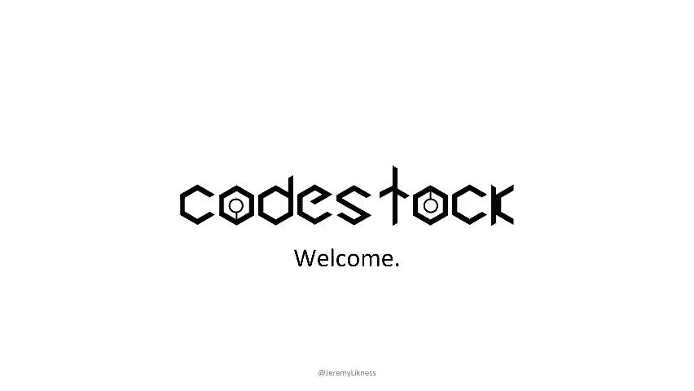
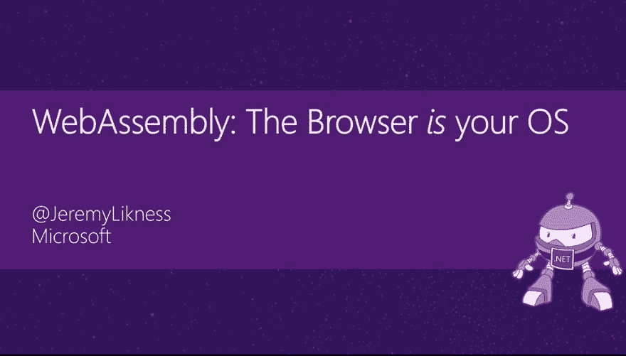

# 演示:CodeStock 2019 上的 WebAssembly、C#和 Blazor

> 原文：<https://dev.to/azure/presentation-webassembly-c-and-blazor-at-codestock-2019-30l8>

#### 浏览器如何成为您新的跨平台操作系统

田纳西州的诺克斯维尔不仅是一个有趣的城市和旅游胜地；它恰好是 [CodeStock](https://codestock.org) 开发者大会的主办城市。

该会议始于 2007 年，12 年来一直帮助向开发人员提供最新内容，主题包括从技术和领导技能领域的女性到数据库设计、云原生应用等。今年，我被邀请以一个主题演讲开始会议。

> <video loop="" controls=""><source src="https://video.twimg.com/amplify_video/1116092985874104321/vid/852x480/rUudA-7GeDWcN5ou.mp4?tag=11" type="video/mp4"></video>jeremylikness⚡️[@ jeremylikness](https://dev.to/jeremylikness)谢谢🙏🏻每个参加周五主题演讲的人今天早上🗝“一个短链接的故事”🔗“
> 
> 欢迎来到大会，祝你人脉丰富👥，学习👩🏻‍🎓，和大量的乐趣🤣接下来的两天。
> 
> 在这里下载幻灯片:[jlikme.blob.core.windows.net/presentations/…](https://t.co/iUjqHkxSuf)2019 年 4 月 12 日下午 14:16012

除了主题演讲，我还做了一个关于 WebAssembly 和 Blazor 的演讲。我对 WebAssembly 不仅仅是有过短暂的兴趣；我相信这是未来。

> Jeremy likness⚡️[@ Jeremy likness](https://dev.to/jeremylikness)[# wasm](https://twitter.com/hashtag/Wasm)🕸来了。
> 
> 👀我对它了解得越多，就越相信 [#WebAssembly](https://twitter.com/hashtag/WebAssembly) 不仅是下一个大事件，而且将在客户机*和服务器*上无处不在。
> 
> 🆗这很有意义，而且在多个方面都有巨大的动力推动它向前发展。2019 年 3 月 29 日下午 15:07322

如果您不熟悉 WebAssembly，请花一分钟时间阅读我写的这篇高级概述(不要担心:阅读只需要几分钟；我会等):

[WebAssembly:为网络带来语言的多样性](https://www.pass.org/Community/PASSBlog/tabid/1476/entryid/912/WebAssembly-Bringing-Diversity-of-Language-to-the-Web.aspx)

WebAssembly，简称 Wasm，非常强大，开发团队能够移植整个。NET 框架来运行它！这意味着许多现有的。NET 库可以与直接加载到浏览器中的 dll 一起“按原样”运行。这也意味着，如果你想为浏览器编写应用程序，JavaScript 和 TypeScript 不再是唯一可用的语言选项。你可以用 C#创建全功能的单页应用程序(SPA )!

所有这一切都有了 Blazor T1 成为可能，这是一个基于。NET over WebAssembly。这个演讲有两个部分。首先，你可以在这里下载的卡牌[。](https://jlik.me/foz)

<figure> 

<figcaption>展示牌</figcaption>

</figure>

其次，我用几个演示构建了一个 GitHub 存储库。它包括一套逐步说明。欢迎您使用这个库，自己走一遍，或者在自己的演示中使用这些演示。

## [JeremyLikness](https://github.com/JeremyLikness)/[blazor-wasm](https://github.com/JeremyLikness/blazor-wasm)

### Blazor 和 WebAssembly 示例(Blazor 演示的一部分)

<article class="markdown-body entry-content container-lg" itemprop="text">

# Blazor 和 WebAssembly

 获得你的[免费 Azure 账户](https://jlik.me/gmi)

这个库包含了关于使用 C#和。NET 在浏览器中使用 WebAssembly 与 Blazor。

<g-emoji class="g-emoji" alias="arrow_forward" fallback-src="https://github.githubassets.cimg/icons/emoji/unicode/25b6.png">[Blazor 入门](https://jlik.me/flj)</g-emoji>

👋🏻[Blazor 简介/概述](https://jlik.me/flk)

<g-emoji class="g-emoji" alias="hocho" fallback-src="https://github.githubassets.cimg/icons/emoji/unicode/1f52a.png">🔪</g-emoji> [剃须刀组件介绍](https://jlik.me/fll)

> 这个库是使用免费的 Azure 管道不断构建和部署的。如果你对它是如何设置和配置为自动构建并部署到低成本 Azure 存储静态网站感兴趣，请阅读[使用 Azure 管道从 GitHub 部署 WebAssembly 到 Azure 存储静态网站](https://jlik.me/fzh)。

## 介绍会；展示会

<g-emoji class="g-emoji" alias="cinema" fallback-src="https://github.githubassets.cimg/icons/emoji/unicode/1f3a6.png">🎦</g-emoji>你可以在这里下载相关的 PowerPoint 演示文稿[。](https://jlik.me/fn3)

要了解 Blazor 与 Angular 等其他 SPA 框架的比较，请阅读: [Angular 与 Blazor](https://blog.jeremylikness.com/blog/2019-01-03_from-angular-to-blazor-the-health-app/) 。

## 民众

本节包含执行每个演示的分步说明。

### 先决条件

要使演示正常工作，应该安装以下组件:

*   [演示文稿](https://emscripten.org/docs/getting_started/downloads.html)用于`asm.js`和 WebAssembly 演示
*   [http-service (node.js)](https://www.npmjs.com/package/http-server) 服务于…

</article>

[View on GitHub](https://github.com/JeremyLikness/blazor-wasm)

这些演示涵盖了从组件、类库、JavaScript 互操作性和代码隐藏到实现 MVVM 模式和调试的所有内容。我接受反馈，当然也接受拉动式请求。

问候，

* * *