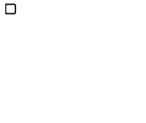
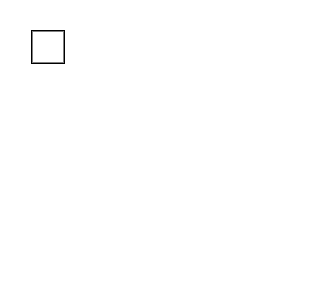
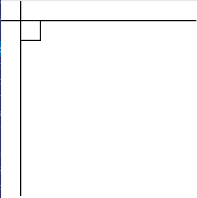
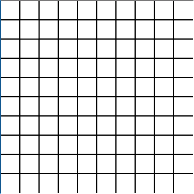
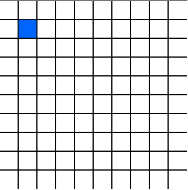
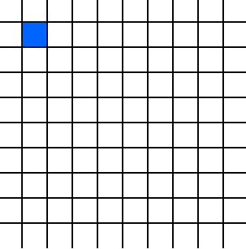
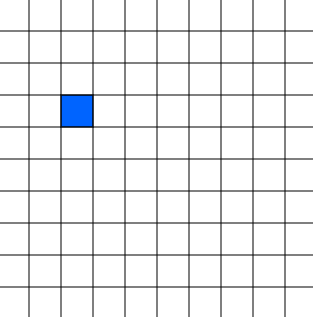

# 如何用 p5.js 制作一个浏览器游戏

> 原文：<https://dev.to/_baruchadi/how-to-make-a-browser-game-with-p5-js-4da6>

了解如何用 p5.js 制作自己的浏览器游戏！这比你想象的要容易得多！

### 工具

[p5.js](https://p5js.org/) 是一个简单的图形库。它很容易上手，文档简明扼要！我是通过[丹尼尔·希夫曼](https://www.youtube.com/user/shiffman)的 YouTube 频道认识 p5.js 的，我强烈推荐你看看他的 YouTube 频道！

### 目标

最终的产品将是一个简单的广场，围绕着一个网格行走(见[这里](https://squares-grid-blog.now.sh/)，这个版本实际上是多人游戏。我们将在另一篇博文中讨论服务器/客户端😛)，但那还远远没有接近你能做的极限！

### 入门

好的，我们马上上车！首先，从下载页面下载 [p5.js 完整库](https://p5js.org/download/)并解压。我们将在`p5/empty-example/sketch.js`工作。好了，现在你所要做的就是打开你最喜欢的编辑器(我将使用 VS 代码)并跟着做！

### 画一个正方形

一旦你打开你的`sketch.js`，你会注意到已经为你设置了两个功能。在`setup`中，我们将初始化我们的环境，在`draw`中，我们将描述每帧应该画什么。

在我们绘制正方形之前，我们需要创建一些东西来绘制它！为此，我们将使用 [`createCanvas`](https://p5js.org/reference/#/p5/createcanvas) ，这将创建一个虚拟的 canvas🖼供我们绘制🎨🖌

```
function setup() {
  createCanvas(100, 50); // 100 -> width, 50 -> height
} 
```

现在，如果你在你选择的浏览器中打开邻近的 index.html 文件，你会看到…嗯，还没有😅。我们已经创建了画布，但是我们还没有在上面画任何东西！

为了绘制我们的正方形，我们将使用 [`rect`](https://p5js.org/reference/#/p5/rect) 函数。我们将给出绘制它的位置(x，y)以及它应该有多大(宽度，高度)。我们将在 draw 函数中完成所有这些工作，因为我们希望为每一帧绘制正方形，而不是只绘制一次。

```
function draw() {
  // x, y, width, height
  rect(10, 10, 10, 10);
} 
```

[](https://res.cloudinary.com/practicaldev/image/fetch/s--YnhGc9PN--/c_limit%2Cf_auto%2Cfl_progressive%2Cq_auto%2Cw_880/http://www.baruchadi.com/assets/2019-04-15/first_square.png)

现在如果你打开你的浏览器，你应该看到一个正方形！

### 定义我们的世界

是时候给我们的游戏世界添加一些结构了！既然是画正方形，那就加个网格吧。为了定义网格，我将定义一个名为`UNIT`的新变量，它将负责世界的规模和一致性。在定义了我们的世界度量单位之后，我们需要修改我们的画布和正方形来使用这个单位。对于这个游戏，我会说我们的世界将是一个 10x10 的网格。为此，我还将定义一个`WIDTH`和`HEIGHT`，它们将根据我们的世界单位来定义我们的世界大小。

最后，我们将修改我们的画布来使用这些变量，并将我们的正方形绘制成一个宽和高的单元。我们还将把我们的正方形重新定位在世界单位中的(1，1)处。

```
const UNIT = 32; // each unit in the world is 32 pixels.
const WIDTH = 10; // width, in world units.
const HEIGHT = 10; // height, in world units.

function setup() {
  // width, height
  createCanvas(WIDTH * UNIT, HEIGHT * UNIT);
}

function draw() {
  // x, y, width, height
  rect(1 * UNIT, 1 * UNIT, UNIT, UNIT);
} 
```

[](https://res.cloudinary.com/practicaldev/image/fetch/s--MYJapVOo--/c_limit%2Cf_auto%2Cfl_progressive%2Cq_auto%2Cw_880/http://www.baruchadi.com/assets/2019-04-15/unit_square.png)

我们的正方形现在是一个单位宽和一个单位高，我们的世界有了更多的一致性，因为所有的东西都将使用一个计量单位！

### 绘制网格

为了画出我们世界的网格，我们只需要在每个单元上画一条水平和垂直的线。为此，我们将使用 [`line`](https://p5js.org/reference/#/p5/line) 功能。直线函数需要一个起始位置(x1，y1)和一个结束位置(x2，y2)。

对于一条水平线，我们保持`y`值不变(y1==y2)，但是`x`值会不同(x1！= x2)。在我们的例子中，x 位置将从画布的起点(`x1=0`)开始，到画布的终点(`x2=WIDTH*UNIT`)结束。我们现在将`y1`和`y2`设置为`1*UNIT`。

我们将做相反的事情，对于一条垂直线，保持 x 相同，y 不同(`x1==x2`，`y1!=y2`)。我们现在也将`x1`和`x2`设置为`1*UNIT`。

恭喜你。现在我们有两条线可以画了，一条垂直的，一条水平的。

```
// ... constants & setup function
function draw() {
  // ... rest of drawing code

  //(x1,y2,x2,y2)
  // Horizontal line
  line(0, UNIT * 1, WIDTH * UNIT, UNIT * 1);

  // Vertical line
  line(UNIT * 1, 0, UNIT * 1, HEIGHT * UNIT);
} 
```

[](https://res.cloudinary.com/practicaldev/image/fetch/s--bHGbyijF--/c_limit%2Cf_auto%2Cfl_progressive%2Cq_auto%2Cw_880/http://www.baruchadi.com/assets/2019-04-15/lines.png)

现在你已经画了一条线，是时候画剩下的格子了！我们将使用一个 [`for`循环](https://mdn.io/for)来做到这一点。我们将有两个 for 循环(尽管因为我们的网格是正方形的，所以这可以用一个循环来实现，因为`WIDTH == HEIGHT`)。我们将需要对我们的原始画线代码做一些最小的改动:简单地用循环负责的值来改变被`UNIT`相乘的`1`的值。我们将循环遍历`y`轴(`HEIGHT`)上的单位数来绘制水平线，并循环遍历`x`轴(`WIDTH`)上的单位数来绘制垂直线。

```
// ... constants & setup function
function draw() {
  // ... rest of drawing code

  // Horizontal lines
  for (y = 0; y < HEIGHT; y++) {
    //(x1,y2,x2,y2)
    line(0, UNIT * y, WIDTH * UNIT, UNIT * y);
  }

  // Vertical lines
  for (x = 0; x < WIDTH; x++) {
    //(x1,y2,x2,y2)
    line(UNIT * x, 0, UNIT * x, HEIGHT * UNIT);
  }
} 
```

[](https://res.cloudinary.com/practicaldev/image/fetch/s--Lo6yS-lN--/c_limit%2Cf_auto%2Cfl_progressive%2Cq_auto%2Cw_880/http://www.baruchadi.com/assets/2019-04-15/grid.png)

你现在应该有一个网格绘制，以及你的广场！…但是，广场在哪里..？让我们改变正方形的颜色，以便更容易将其与网格的其他部分区分开来。我们将需要使用函数 [fill](https://p5js.org/reference/#/p5/fill) 并给它 RGB 值来填充我们的矩形。

```
// ... constants & setup function
function draw() {
  // r, g, b
  fill(0, 100, 255); //fill w/ blue

  // ... rest of drawing code
} 
```

[](https://res.cloudinary.com/practicaldev/image/fetch/s--QfoR1fll--/c_limit%2Cf_auto%2Cfl_progressive%2Cq_auto%2Cw_880/http://www.baruchadi.com/assets/2019-04-15/colored_square.png)

唷，这是我们的广场！是时候让方块移动了😁

### 移动你的方块

是时候让方块移动了！让我们从使用正方形位置的变量(`x,y`)开始，而不仅仅是数字。为此，让我们创建一个名为`pos`的对象来表示我们在外部作用域中的位置。在我们创建这个变量之后，我们将替换正方形的`x`和`y`坐标，以使用位置对象的`x`和`y`组件。

```
// ...constants

const pos = {x:1,y:1}

// ...setup function

function draw(){
  // ... fill function

  rect(pos.x * UNIT, pos.y * UNIT, UNIT, UNIT)

  // ... grid draw loop
} 
```

现在我们需要根据按下的键来更新我们的`pos`的`x`和`y`组件。为此，我们将使用 [`keyIsDown`](https://p5js.org/reference/#/p5/keyIsDown) 函数和提供的箭头[键码](https://p5js.org/reference/#/p5/keyCode)。因为(0，0)是我们的左上角，我们希望当右箭头被按下时增加`x`，当左箭头被按下时减少。至于`y`，我们希望当向下箭头被按下时递增，当向上箭头被按下时递减。

```
// ...constants & setup function
function draw() {
  // ... rest of draw function

  if (keyIsDown(LEFT_ARROW)) {
    pos.x--;
  }

  if (keyIsDown(RIGHT_ARROW)) {
    pos.x++;
  }

  if (keyIsDown(UP_ARROW)) {
    pos.y--;
  }

  if (keyIsDown(DOWN_ARROW)) {
    pos.y++;
  }
} 
```

是时候看看我们想出了什么！现在让我们试着四处走走…嗯，这不是我们现在想要的，是吗？

[](https://res.cloudinary.com/practicaldev/image/fetch/s--8R-gQ2HD--/c_limit%2Cf_auto%2Cfl_progressive%2Cq_66%2Cw_880/http://www.baruchadi.com/assets/2019-04-15/smearing_square.gif)

所以发生这种情况的原因是画布永远不会在帧之间被清除！如果我们每一帧都在画布上画，并且从不清理它，那么前一帧的画就会保留下来！

不用担心，有一个简单的解决方案，函数 [`clear`](https://p5js.org/reference/#/p5/clear) 。我们将在绘制循环中首先运行它，因此它将在每一帧之前清空我们的画布，并为重新绘制做好准备！

```
// ...constants & setup function
function draw() {
  clear();
  // ... rest of draw function
} 
```

[](https://res.cloudinary.com/practicaldev/image/fetch/s--DtERjhSR--/c_limit%2Cf_auto%2Cfl_progressive%2Cq_66%2Cw_880/http://www.baruchadi.com/assets/2019-04-15/moving_square.gif)

这才像话！我们的方块根据我们按下的任何键移动！

# [T1*EOF*](#eof)

从这里有很多方向可以乘坐！这只是冰山一角。就我个人而言，我接受了这个小小的挑战，并把它变成了一个多人游戏，我正在积极地工作，并将记录我的进展😁

这是我第一次在 dev.to 上发表文章！如果你有任何问题，欢迎在评论中或者直接在 Twitter 上联系我🙌