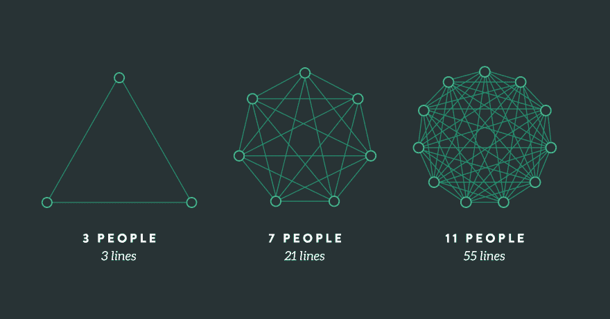

# 布鲁克斯定律适用于只有一个开发者的项目吗？

> 原文：<https://dev.to/tommydreamer57/does-brooks-law-apply-to-a-project-with-only-a-single-developer-7o7>

所以事情是这样的:

我正在做的这个项目非常大，而且非常细致入微(这是一个在建筑设计完成后、施工前自动绘制建筑玻璃的解决方案)。我和另外一个人在一个团队里工作。他是一名设计师，在建筑行业工作了几年，并与企业主合作开发了这款软件。所以，我是理解软件如何工作的人，而他是理解架构如何工作的人。

总之，我是唯一的开发人员，因此承担了大量的责任，包括设计整个解决方案、设计数据库、将工作流组织成三个数据输入应用程序和一个最终用户应用程序、选择要使用的技术、构建这些应用程序的整个前端，等等。

我喜欢独自开发的一些地方——代码库都是我的；我对它了如指掌；等等。

但是我经常希望我有另一个开发人员来承担一些任务并与之合作，而且我觉得如果我们做得好的话，在团队中增加另一个开发人员可以大大提高我们的生产率。

然而，我一直在思考布鲁克斯定律的观点:

> 将人力资源添加到一个后期的软件项目中会使它变得更晚。

我的问题是:

这个规律适用于我这样的小团队吗？

我读到的关于这个主题的一切都与至少比我大几倍的团队有关，与项目经理和高级开发人员等有关，所以很难与这些例子联系起来。文章总是提到这样一个事实，即一个项目的新来者在项目中总是缺乏经验，因此永远无法像那些已经在项目中工作的人那样对项目做出快速或良好的贡献。然而，在我的情况下，增加一个人相当于项目中软件开发人员的数量增加一倍，因此必然会有一个点，即拥有两个开发人员所增加的生产率超过了培训新开发人员的初始成本。

你们有什么技巧或经验可以让我了解如何知道何时以及如何向项目中添加另一个开发人员？

提前感谢！