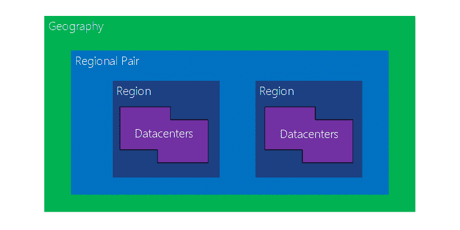

# 配置安全策略来管理数据

> 原文：<https://dev.to/cheahengsoon/configure-security-policies-to-manage-data-1m1o>

**配置数据分类**
数据分类的主要特征:

*   促进存储优化，识别与数据相关的风险，并帮助实现法规遵从性
*   同等适用，无论:
    *   数据状态:静态、处理中和传输中
    *   数据格式:结构化和非结构化

在 Azure SQL 数据库中实现数据分类:

*   作为高级数据安全产品的一部分提供
    *   数据发现和分类(截至 2019 年 3 月的预览版)
    *   可通过 Azure 门户配置
*   提供一组形成 SQL 信息保护的功能:
    *   发现和建议
    *   标记
    *   查询结果集敏感度
    *   能见度

**配置数据保留**

*   数据保留的主要特征:
    *   规定数据恢复和处理规则
    *   与数据分类密切相关
    *   满足法规、合规性和公司法律要求
*   为 Azure Blob 存储实现数据保留:
*   依赖不可变存储:一次写入，多次读取(WORM)
*   支持:
    *   基于时间的保留策略
    *   合法持有政策
    *   所有 blob 层:热层、冷层和归档层
    *   容器级配置
    *   审核日志记录

**配置数据主权**

*   数据主权的主要特征:
    *   便于遵守数据所在国家(或地区)的法律
    *   防止在国外存储数据
    *   通常包括针对数据持久性和弹性的规定
*   基于 Azure 区域实现数据主权:
    *   依赖成对区域:每个区域都与同一地理范围内的另一个区域配对(*)
    *   提供一系列好处:
        *   物理隔离
        *   平台提供的复制
        *   区域恢复顺序
        *   顺序更新
        *   数据驻留
        *   反映了微软对合规性的承诺