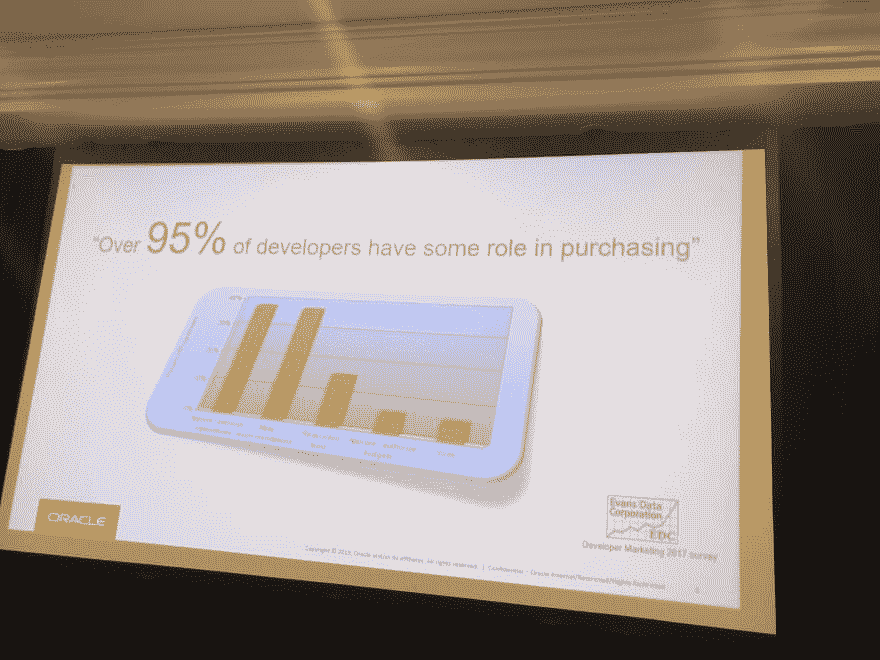

# 开发商关系会议纪要

> 原文：<https://dev.to/maxkatz/notes-from-developer-relations-conference-2296>

三月底，我参加了在圣马特奥举行的埃文斯数据开发者关系会议。总的来说，这是一次伟大的会议🥑。我做了笔记和图片，想在这里和大家分享一下。只是提醒一下，这些是我的笔记，大部分是项目符号列表格式，是我认为我听到的东西，大部分都不是完整的句子🤷🏽‍♂️

[继续阅读> >](https://maxkatz.org/2019/04/12/notes-pictures-and-more-from-developer-relations-conference/)