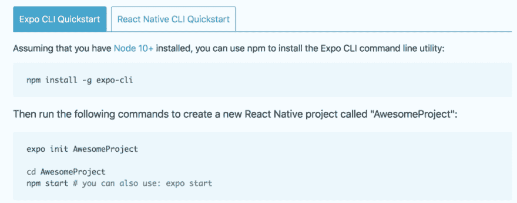

# React Native 初学者入门

> 原文：<https://dev.to/kcarrel/a-beginners-introduction-to-react-native-4bbm>

<figure> 

<figcaption>从 A 点到被上 app store</figcaption>

</figure>

在熨斗学校沉浸式软件工程项目结束时，我的一个个人目标是学习如何让 web 应用程序从 Heroku 这样的云平台托管到 Android 应用程序商店下载。带着这个目标和即将到来的模块 5 期末项目，我决定花些时间深入 React Native。

### **什么是反应原生？**

**原生:**指的是为在特定平台或设备上使用而开发的软件程序

React Native 是一个开源的移动应用 JavaScript 框架，允许开发者为 iOS、Android 和/或 UWP 编写移动应用。与 vanilla React 类似，它是用 JSX 和 JavaScript 的组合编写的。它增强了 vanilla React 的功能，创建了一个 React 本地“桥”,调用渲染 APIs 用 Objective-C，Android 用 Java)。React Native 还访问平台 API 的 JavaScript 接口，允许开发人员在平台上整合功能，如摄像头、视频、位置等。

### **反应出土著的优势**

*   如果你知道反应，你可以使用反应原生
*   灵活的框架，可以合并本机代码并顺利集成
*   更快的开发和上市时间
*   [热重新加载](http://facebook.github.io/react-native/blog/2016/03/24/introducing-hot-reloading) —允许开发人员动态重写应用程序，并重新加载以查看类似于 web 开发的效果
*   允许开发人员构建一个可以在平台间共享的应用程序
*   一个应用程序意味着错误跟踪在平台之间需要更少的努力——要么错误在两个平台都存在，要么已经解决
*   仍然可以利用 Chrome 或 Safari 的开发工具进行调试
*   允许精益开发——当只生产一个应用程序而不是特定平台版本时，需要更少的团队成员

<figure> 

<figcaption>还在进行中</figcaption>

</figure>

### 反应出土著的弊端

*   它是新的(2015 年 3 月发布)，相对年轻
*   社区仍在增长 StackOverflow 上只有 500 个问题
*   谷歌最近发布的 React Native 的替代产品 **Flutter** 正在崛起

### 入门

为了这次探索的目的，我将强调利用 Expo 工具的安装方法，而不是 Xcode 或 Android Studio，因为这最适合我的知识背景。在 [React Native 入门指南上有一个替代教程。](https://facebook.github.io/react-native/docs/getting-started)

<figure> 

<figcaption>快速启动</figcaption>

</figure>

*   使用 npm(如上所述)安装 Expo CLI 命令行工具
*   在您的 iOS 或 Android 手机上安装 [Expo](https://expo.io/) 客户端应用程序，并连接到与您的电脑相同的无线网络。在 Android 上，使用 Expo 应用程序从您的终端扫描二维码，打开您的项目。在 iOS 上，按照屏幕上的说明获取链接。

只需几个步骤，您就可以开始构建 React 本机应用程序了！

### 资源

**什么是 React Native:**【https://www.youtube.com/watch?v=JKCgwL-IfgM】T2&t = 119s

**FreeCodeCamp 用原生代码反应原生 Intro**:【https://www.youtube.com/watch?v=frvXANSaSec T2】

**世博会文件:**【https://docs.expo.io/versions/latest/ T2】

**有用的 React 原生组件库:**[https://blog . bitsrc . io/11-React-Native-Component-Libraries-you-should-know-in-2018-71 D2 A8 e 33312](https://blog.bitsrc.io/11-react-native-component-libraries-you-should-know-in-2018-71d2a8e33312)

**Flutter——一个谷歌的替代品:**[https://code burst . io/Flutter-vs-react-native-detailed-comparison-similarity-and-superiority-3e 92 b 910 fa 6e](https://codeburst.io/flutter-vs-react-native-detailed-comparison-similarities-and-superiority-3e92b910fa6e)

**扑杀会反应原生吗？:**【https://www.youtube.com/watch?v=gWs3UQzrhtE】T2

**打造 https://makeitopen.com/ F8 App:**