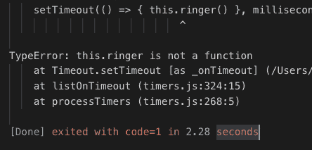

# 如何从回调中访问“this”

> 原文：<https://dev.to/logicmason/how-to-access-this-from-inside-a-callback-2k7a>

JavaScript 的关键字`this`是很多人的痛苦之源。一个常见的问题是这样的:

> 我将调用作为一个 Firebase 函数，在回调函数中，我需要访问 this 来更新我 React 组件

另一个常见的情况是 setTimeout:

> "问题是 setTimeout 需要一个回调，但是我需要访问它，setTimeout 改变它！"

## 基本方针

在正常情况下，`this`指的是在调用时间点**左边的任何东西。有几个例外，它们具体改变了这个的行为— `call`、`apply`和`bind`。如果你还没有使用这些函数中的一个来改变它的行为，那么看看调用时点的左边。**

## 举个例子

```
var alarm = {
  ringer: function () {
    console.log("The " + this.color + " alarm: Ring!!!");
  },
  color: "red"
}

alarm.ringer(); 
```

这很简单。当你调用`alarm.ringer();`时，圆点左边的东西就是`alarm`。所以在响铃功能里面，`this`是警报，颜色是红色。

## setTimeout 回调中的错误

```
var alarm = {
  ringer: function () {
    console.log("The " + this.color + " alarm: Ring!!!");
  },
  set: function (milliseconds) {
    setTimeout(function () { this.ringer() }, milliseconds);
  },
  color: "red"
}

alarm.set(2000); 
```

这里的目标是闹钟会在两秒钟后响起。不幸的是，我们得到了这个错误:

[](https://res.cloudinary.com/practicaldev/image/fetch/s--J9ndZ83D--/c_limit%2Cf_auto%2Cfl_progressive%2Cq_auto%2Cw_880/https://logicmason.com/wp-content/uploads/2019/04/this-setTimeout.png)

原因是 setTimeout 调用传递给它的回调。根据错误，我们可以看到 setTimeout 函数创建了一个`Timeout`对象，并将我们传递给它的回调函数存储为`Timeout._onTimeout`。而**当时叫**，圆点左边的东西是超时，不是闹铃。

## 经典解法

传统上解决“this”问题的方法是将外部作用域中的“this”赋给一个名为“_this”或“that”的新变量。

```
var alarm = {
  ringer: function () {
    console.log("The " + this.color + " alarm: Ring!!!");
  },
  set: function (milliseconds) {
    var that = this;
    setTimeout(function () { that.ringer() }, milliseconds);
  },
  color: "red"
}

alarm.set(2000); 
```

现在成功了。由于`set`函数内“this”的值就是报警，而`that`只是一个常规变量。由于函数可以从其周围的作用域中访问变量，所以回调中的`that.ringer()`是`alarm.ringer()`。

```
The red alarm: Ring!!! 
```

## ES6 箭头功能解

ES6 箭头函数[的工作方式与普通函数表达式](https://developer.mozilla.org/en-US/docs/Web/JavaScript/Reference/Functions/Arrow_functions)不同。它们没有自己到“this”的绑定，所以任何对“this”的引用都使用封闭函数的绑定。

```
let alarm = {
  ringer: function () {
    console.log("The " + this.color + " alarm: Ring!!!");
  },
  set: function (milliseconds) {
    setTimeout(() => { this.ringer() }, milliseconds);
  },
  color: "red"
}

alarm.set(2000); 
```

正如上面的 MDN 链接提到的，箭头函数不适合方法，但是它们是简化回调的一种方便的方式。2019 年，大部分 JS devs 使用箭头函数来解决这个问题，只遇到库和遗留代码中的“this = that”模式。

*订阅更多内容来自[logicmason.com](http://eepurl.com/diFSaf)T3】*