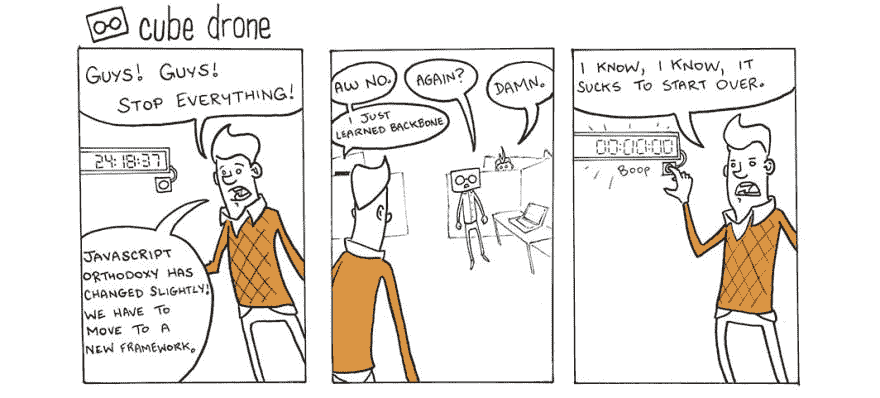

# 投资正确的技术以避免技术债务

> 原文：<https://dev.to/sunnysingh/investing-in-the-right-technologies-to-avoid-technical-debt-2c06>

> 本文原载于[我的简讯](https://sunnysingh.io/news)。

JavaScript 社区中有一个常见的笑话，每天都有新的框架或库发布。不管是真是假，这很有趣，因为看起来确实如此。有这么多新东西要学，你怎么可能跟得上？或者你应该？

## 学会忍耐，不要新的框架⏳

我喜欢跟上最新的技术。事实上，几年前我建立了一个名为 [DevNews](https://devne.ws/) 的网站，现在我还在用它寻找新的技术和软件相关的文章和产品。

然而，了解一个新的框架与实际投入时间学习甚至可能将你当前的代码移植到它上面是有很大区别的。很多时候，这是不值得的，因为该框架在几年后就会过时甚至不存在。

过去我已经被这个问题困扰过很多次了，我能给的最好的建议就是**保持耐心**。

对于任何你期望至少持续 5 年的大项目，你可能想在决定学习和使用它之前观察一个框架的社区足够长的时间。把你投入学习一个特定的框架或工具的时间看作是一种投资。投资回报应该是正的。

## 安古拉杰和⚔️的故事

你还记得安古拉吉斯吗？大约 5 年前，许多开发人员都在使用它，它被认为是制作动态网站或整个 web 应用程序的首选框架。它甚至得到了谷歌的支持，所以还会有什么问题呢？

Angular 2 公布了，它和第一个版本完全不同。事实上，向后兼容在早期是不可行的。因此，来自脸书的竞争产品 React 的使用越来越多。

我个人曾参与 AngularJS 项目，但我从未深入投入其中。我持怀疑态度，并继续以传统方式构建自己的项目(一个带有 jQuery 和 Bootstrap 前端的单片 Laravel 后端)。快进，我现在正在建立多个反应应用程序。

我认为这是正确的做法。使用对你有效的工具和技术，直到你确定有更好的方法。

> 酷酷...但是我怎么知道什么时候有更好的方法呢？
> 
> *— Avid 开发阅读器*

啊，我很高兴你问了。我做了一整集关于这个话题的播客！虽然我专门讨论了 React，但是这些原则(社区、效率和寿命)适用于任何框架或工具。推荐你去看看👇

*   🎧[听播客](http://sunny.link/pod62)
*   📺[观看视频](https://youtu.be/J1FO-2pRGDE)

一般来说，一个大的社区意味着有更多的资源可以用来调试问题和查找附带的库。即使在 Angular 的情况下，仍然有大量的资源继续维护这些项目。

**问题**:你是如何设法控制住技术债务的，或者你过去是如何被技术债务困扰的？