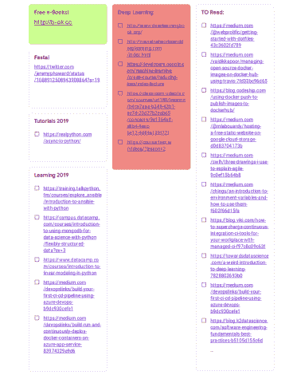

# 我如何轻松地将我的 Python 包发布/部署到 PYPI。

> 原文：<https://dev.to/mmphego/how-i-published-deployed-my-python-package-to-pypi-easily-3hio>

*最初发布于[blog.mphomphego.co.za](https://blog.mphomphego.co.za/blog/2019/04/14/how-i-published-my-python-package-to-pypi-easily.html)2019 年 4 月 16 日。*

* * *

我喜欢一次又一次地阅读《每日邮报》,但总是没有足够的时间在学校、工作和家庭之间周旋。随着时间的推移，阅读《每日邮报》的梦想也就成了泡影。我感兴趣的帖子的链接在我的 Google Keep 上不断堆积。

[](https://res.cloudinary.com/practicaldev/image/fetch/s--x_E_99H4--/c_limit%2Cf_auto%2Cfl_progressive%2Cq_auto%2Cw_880/https://blog.mphomphego.co.za/assets/keep.png)

随着时间的推移，我再也受不了了，所以我决定创建一个 Python 脚本，将博客文章(使用一个 [Docker 图像](https://hub.docker.com/r/mmphego/mediumexporter))导出到`mp3`文件中供我听，而不是忙于无聊的人做的其他无聊的事情。

在这篇文章中，我将向您介绍我是如何在 PyPi 上发布/部署我的包的。

[](https://res.cloudinary.com/practicaldev/image/fetch/s--tc_xobCo--/c_limit%2Cf_auto%2Cfl_progressive%2Cq_auto%2Cw_880/http://img.picturequotes.com/2/131/130430/at-first-i-was-like-but-then-i-was-like-quote-1.jpg)

起初，我一直认为部署/打包您的 Python 包很麻烦，直到现在。现在比以前更容易了，下面我会告诉你一切。

编写第一个 Python 包并将其部署到 PyPi 的一些好处是:

*   被迫进行更加模块化的思考。
*   编写代码时要考虑测试。
*   考虑让 API 足够简单，让其他人可以直观地理解和重用你的工作。
*   学习编写测试时附带的新工具。

在我离题之前，你可能想知道我说的这个 PyPi 是什么！

## PyPi 是什么？

嗯，根据他们的[网站](https://pypi.org/)。

> Python 包索引(PyPI)是 Python 编程语言的软件仓库。PyPI 帮助您找到并安装由 Python 社区开发和共享的软件。了解如何安装软件包。软件包作者使用 PyPI 来分发他们的软件。了解如何为 PyPI 打包 Python 代码。如果你使用`pip`命令，你已经在使用 PyPi 了。

当您最终发布到 PyPi 时，每个人都可以用一个熟悉的简单命令来安装和使用它:

```
pip install {package_name} 
```

Enter fullscreen mode Exit fullscreen mode

如果你还在读，我敢肯定你会说，这很酷。

因此，为了将我们的包发送到 PyPI，我们需要执行以下步骤:

*   创建 Python 代码并使其可以发布，即创建 Python 包，添加 PyPi 所需的文件。
*   如果您还没有，请创建一个 PyPi 帐户。
*   生成发行版档案并上传到 PyPi。
*   使用`pip`安装您自己的软件包

## 第一步:让你的代码准备好发布。

在这篇文章中，我将带你通过我的包`medium-speech`作为一个真实的例子。你可以在 PyPi 上的这里找到[，源代码在 Github 上的](https://pypi.org/project/medium-speech/)这里找到[。](https://github.com/mmphego/medium-to-speech)

部署前需要注意的事项:

*   从代码中移除所有 print 语句。如果你想通知或记录一些事情，使用 Python `logging`模块。
*   移除类或函数之外的所有代码。这样的代码(如果确实需要的话)，把它放在`__main__`函数下:

```
if __name__ == "__main__":
    # code outside of a class or function goes here 
```

Enter fullscreen mode Exit fullscreen mode

### 创建一个 python 包

Reinventing the wheel is a bad idea, don't do it. Thanks to @kennethreitz for making it easier with his "[Human's Ultimate Guide to setup.py](https://github.com/kennethreitz/setup.py)". For us not to reinvent the wheel, let's fork and/or clone the `setup.py` repo from GitHub and create a new repository on GitHub called `{you-package-name}` for simplicity. ```shell git clone https://github.com/kennethreitz/setup.py.git mv setup.py "{you-package-name}" rm -rf "{you-package-name}"/.git git init git remote add origin git@github.com:"{github-username}"/"{you-package-name}".git git fetch -a git checkout master cd && ls ``` Package in Python is simply a folder with name of your package. This folder contains files (modules) and other sub-folders (sub-packages). Rename `mypackage` directory to "{you-package-name}", and inside your directory you'll need to put a file `__init__.py` (two underscores before and after init) assuming it is not there in order to mark this directory as a Python package. `vim` or `nano` inside this `__init__.py` file you can specify which classes you want the user to access through the package interface. Sample of my `__init.py__` file: ```python from .MediumToSpeech import MediumToSpeech ``` Versioning you package is very important, in the same directory you should find `__version__.py` file, create it if it doesn't exist. This file tells PyPi which version your package is under. Sample of my `__version__.py` file: ```python VERSION = (0, 1, 3) __version__ = ".".join(map(str, VERSION)) ``` ### Add files needed for PyPi PyPi needs following file in order to work: * `setup.py` (detail will follow.) * `LICENSE` (the license file, if you choose MIT, get content from [here](https://opensource.org/licenses/MIT).) * `MANIFEST.in` (optional see reasons [here.](https://stackoverflow.com/a/24727824/6165344)) * `README.md` (**Highly recommended,** but optional) Sample project structure: ```bash . ├── LICENSE ├── MANIFEST.in ├── medium_speech │   ├── __init__.py │   ├── MediumToSpeech.py │   └── __version__.py ├── README.md ├── scripts │   └── play_medium_post.py ├── setup.py ├── tests │   ├── __init__.py │   ├── markdown_test.md │   ├── unit_tests.py │   └── utils.py └── tox.ini └── .travis.yml └── .gitignore ``` Let's dive down and explore the files illustrated above, starting with the `setup.py` file. #### The setup.py file. The `setup.py` file contains information about your package that PyPi needs, like its name, a description, installation requirements and etc. We will look directly into a real simple `setup.py` which you can find [here](https://github.com/mmphego/medium-to-speech/blob/master/setup.py): https://github.com/mmphego/medium-to-speech/blob/master/setup.py Most of the options are self-explanatory, you can just copy the content of `setup.py` above and modify it to your needs. Don't forget to list all dependencies of your package in `install_requires` list, so that this requirement can be installed automatically while your package is being installed. #### The scripts directory Many Python packages include command line tools including this one. This is useful for distributing support tools which are associated with a library, or just taking advantage of the `setuptools` / PyPI infrastructure to distribute a command line tool that happens to use Python. For `medium-speech`, I added a `play_medium_post.py` command line tool. There are two mechanisms that `setuptools.setup()` provides to do this: the `scripts` keyword argument, and the `console_scripts` entry point. In my case I used the `scripts` keyword argument, go [here](https://python-packaging.readthedocs.io/en/latest/command-line-scripts.html#the-scripts-keyword-argument) to read more. My approach was to write my script in a separate file called `play_medium_post.py`, under the `scripts` directory. Let's look into the script `play_medium_post.py` which you can find [here](https://github.com/mmphego/medium-to-speech/blob/master/scripts/play_medium_post.py) https://github.com/mmphego/medium-to-speech/blob/master/scripts/play_medium_post.py Then we can declare the script in `setup.py` like this: ```python SCRIPTS = [] ## Assuming you named your scripts directory "scripts" for dirname, dirnames, filenames in os.walk("scripts"): for filename in filenames: SCRIPTS.append(os.path.join(dirname, filename)) setup( ... scripts=SCRIPTS, ... ) ``` When we install the package, `setuptools` will copy the script to our `PATH` and make it available for general use, for example: ```bash play_medium_post.py -ps 1 -u https://medium.com/@mmphego/how-i-managed-to-harness-imposter-syndrome-391fdb754820 ``` This has the advantage of being generalizable to non-python scripts, as well: `play_medium_post.py` could have been a shell script, or something completely different. #### Tests, Tests, Tests, Tests, Tests, Tests!!! Need I say more if you still need convincing read this blog post: [Why Use Test Driven Development: 6 Benefits for Your Project](https://www.codica.com/blog/test-driven-development-benefits/). Any piece of code that you write, you should be writing with tests in mind so that you can better break apart larger functions into base components to hopefully get more reuse out of them. In my case, I wrote my package code first. However, you can also write your tests first, knowing your function can’t fulfill them and only then fill in the code until the test passes. There is a lot of great material out there for [Test Driven Development (TDD)](https://en.wikipedia.org/wiki/Test-driven_development) if you want to explore the philosophy behind it more. This is something that is a major level up in best practice coding that once you force yourself to do, everything else will be so much easier. For my package, I used [`unittest`](https://docs.python.org/3.6/library/unittest.html) framework together with [`nose`](http://nose.readthedocs.io/) you are welcome to use any framework/module - I just prefer `nose`. Within our `tests` directory, we will need an empty `__init__.py` file as with our package. Next, you write some tests!. If you would like to check out and contribute to my tests go [here](https://github.com/mmphego/medium-to-speech/tree/master/tests). #### The tox.ini file Now that we have our code and our tests, let’s expand the functionality of our testing basis a little by introducing [tox](http://tox.readthedocs.io/). **What is Tox?** From their [website](http://tox.readthedocs.io/) > `tox` aims to automate and standardize testing in Python. It is part of a larger vision of easing the packaging, testing and release process of Python software. Tox allows us to run through tests in multiple environments so that you can be sure your code will work with the differences between Python versions. Let's look directly into a simple `tox.ini` file which you can find [here](https://github.com/mmphego/medium-to-speech/blob/master/tox.ini): https://github.com/mmphego/medium-to-speech/blob/master/tox.ini The code above simply tells us we are going to test the package using `python3.6` and `python3.7`, as well as a `flake8` environment layer for checking any [pep8](https://www.python.org/dev/peps/pep-0008/) violations. So when we run `tox` in our shell, it will create `virtualenv` for the individual `envlist` and install all dependencies listed under `deps` when done it will execute any commands listed under `commands` in our case I am running `python setup.py test`. To read more about `setuptools` testing go [here](https://python-packaging.readthedocs.io/en/latest/testing.html). #### The .travis.yml file So at this point, we have our package logic, our tests, multiple environments tests using `tox`. Now, what happens if others start contributing to our repo and someone edits code, but forgets to run `tox` or `nosetests` locally before pushing to our repo? Bugs could be introduced and people who depend on your code now have things that break. This is where Continuous Integration (CI) comes in. For this, I used [Travis CI](http://travis-ci.org). **What is Travis CI?** From [stackoverflow](https://stackoverflow.com/a/22592723): > The simplest way to explain Travis CI is that it runs your program's tests every time you commit to GitHub (this can be configured in many ways, and you can always disable builds on some branches). The point of this is that you can often discover very quickly if your commit broke something, and fix it before it becomes a problem. You can read more about Travis CI [here](http://travis-ci.org). To set up Travis, for the first time I would highly recommend the tutorial [here](https://docs.travis-ci.com/user/tutorial/) which is very detailed and well written. After you have registered you need to connect your `repo`, and we are good to go! #### The README.md file A `README` is a reflection of how a repository is maintained. A good one doesn't necessarily mean an active, bug-free project with perfect tests. But it suggests that the owner cares about you, the user (or future maintainer). A good `README` tells you everything you need to know to use the project and get involved. It sells the project — but concurrently respects a visitor's time by letting them know if they need a different solution. Before you push your project to GitHub, I would recommend you to read up about [Readme Driven Development (RDD)](http://tom.preston-werner.com/2010/08/23/readme-driven-development.html) and why we need a `README` file. I personally prefer to use [stackedit](https://stackedit.io/) which is an online real-time Markdown (md) editor which beautifully renders your markdown texts, you are welcome to use any tool you need. Below is a detailed template which I followed when creating my `README.md` and you can find [here](https://github.com/mmphego/medium-to-speech/blob/master/README.md):