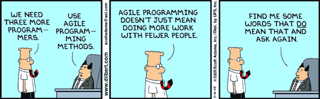
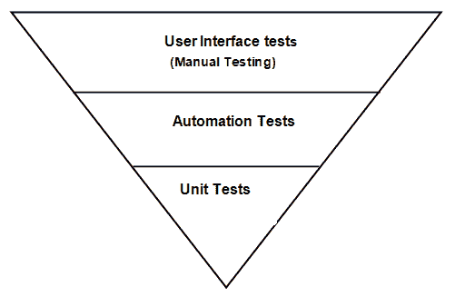
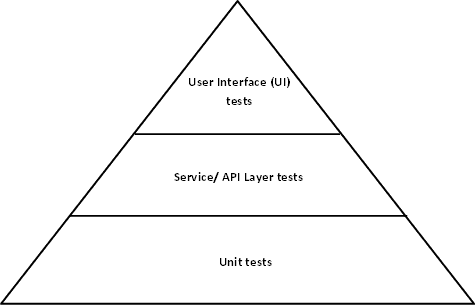
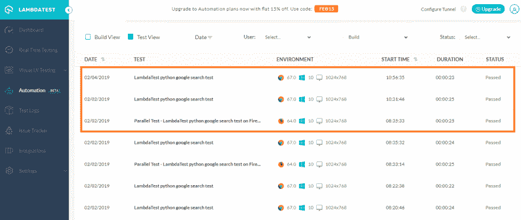

# 敏捷团队如何使用测试自动化金字塔？

> 原文：<https://dev.to/himanshusheth004/how-agile-teams-use-test-automation-pyramid-5bp4>

在产品发布给最终客户之前，产品测试被认为是一个非常重要的步骤。根据项目/产品的性质和复杂性，您需要确保您使用了最好的测试方法(手动测试、冒烟测试、UI 测试、自动化测试等)。)以便在每次发布时发现错误并提高产品质量。

“自动化测试策略”比手工测试有很多好处，因为像 Selenium 这样的自动化测试框架可以节省很多时间。它还有助于降低总成本和提高测试覆盖率。

自动化测试的投资回报(就提出的问题或节省的时间而言)在很大程度上取决于测试的计划和执行。作为测试领导者，您必须根据项目需求并与项目的相关涉众进行讨论，提出一个自动化测试策略。

通过分析项目的范围、规模和期限；项目负责人必须有意识地决定是使用[传统瀑布还是现代敏捷方法](https://www.lambdatest.com/blog/agile-vs-waterfall-methodology/?utm_source=dev&utm_medium=Blog&utm_campaign=hi-05-160419eu&utm_term=OrganicPosting)进行测试。

很多时候，团队领导在开发周期的末尾计划自动化测试任务的执行，因为产品已经处于“成熟状态”,并且基本元素/特性(UI、服务、应用等)已经完成。)或多或少都有所发展。

这种方法可能无法从自动化测试中获得最佳结果。更好的方法是在产品开发的早期阶段将自动化测试和回归测试混合起来。事实上，许多组织现在都采用左移测试的思想，即从客户需求收集阶段的一开始就进行测试。

Mike Cohn 的概念**‘敏捷测试自动化金字塔’**有助于建立实现自动化软件测试的合理策略。“敏捷测试自动化金字塔”是表示传统软件测试和**“迭代开发”**测试之间差异的理想机制之一。

当您的组织转向项目的敏捷方法时，您的项目管理团队应该关注有助于敏捷成功的因素，因为它需要团队(和组织)内所有级别的**‘心态变化’**。

在我们了解敏捷测试自动化金字塔之前，我们应该首先了解一下用于软件测试的传统模型。

## 传统测试模式介绍

这个模型主要用于[发现软件](https://www.lambdatest.com/blog/27-tips-for-finding-bugs-in-your-website/?utm_source=dev&utm_medium=Blog&utm_campaign=hi-05-160419eu&utm_term=OrganicPosting)中的 bug。当团队遵循“瀑布模型”进行开发测试时，测试是通过用户界面(UI)手动执行的。如下图所示，自动化测试是在中间层&下层完成的。中间层由服务组成，这些服务公开了 UI 层可以使用的[应用编程接口](https://www.lambdatest.com/blog/api-and-browser-compatibility/?utm_source=dev&utm_medium=Blog&utm_campaign=hi-05-160419eu&utm_term=OrganicPosting)(API)。单元测试构成了倒金字塔的最底层，这些测试由开发人员编写，目的是验证开发人员编写的**特性**。

这种模型可以用于总体预算较低、需求明确，并且在产品/项目开发的后期阶段预期变化较少的项目中。这种模式的主要缺点是它不能用于预算较高的项目。此外，由于测试仅在“产品开发”完成后开始，因此项目截止日期非常严格。

因为测试活动在较晚的时间点开始；寻找 bugs &让开发人员解决它们可能需要更多的时间和资源。这将对整个周转时间产生负面影响，可能会延迟项目/产品的发货。在这种情况下,“敏捷方法”因其迭代和灵活的方法而被用于当今快速变化的组织中。

由于在用户界面层执行的测试增加了“测试、反馈和修复”周期的持续时间，大多数组织正在转向使用最小化的基于用户界面的测试自动化的测试自动化金字塔。

嘿，你在寻找一个免费的 HTML 字符编码工具吗？它可以将某些字符转换成特殊的字符串，称为 HTML 实体，可以被浏览器读取。你可以通过 [HTML 实体到文本转换器](https://www.lambdatest.com/free-online-tools/html-entities-to-text-converter?utm_source=devto&utm_medium=organic&utm_campaign=jul28_rn&utm_term=rn&utm_content=free_tools)工具来实现。

## 使用传统测试模式的弊端

在传统的测试模型中，测试人员开发测试代码的主要焦点是开发以 UI 为中心的测试用例。甚至是涉及数据库事务、访问核心业务逻辑等的低级功能。是通过 UI 测试用例完成的。

这种方法本质上是脆弱的，因为如果 web 应用程序或网站经历了重大的 UI 更改，自动化测试将需要更改。因此，这涉及到持续的维护成本，这会增加项目的总体预算。这也可能影响“项目交付时间表”,从而给组织(以及客户)造成损失。

这种方法的另一个问题是，自动化测试开发是由测试团队/测试人员完成的，他们在自己的舒适区工作，很少有机会与开发团队互动/讨论他们的问题/建议。因此，在测试团队中建立领域能力的机会很少，因为不同团队(例如，开发、项目规划、项目管理、测试等)之间的参与较少。).

如果您的测试团队采用敏捷测试自动化金字塔来设计他们的自动化测试策略，所有这些问题都可以解决。在接下来的章节中，我们将更仔细地观察敏捷测试自动化金字塔的核心构建模块。

## 详细看敏捷测试自动化金字塔

“敏捷测试自动化金字塔”是由 Mike Cohn 在他的书《敏捷的成功》中首次提出的。下面是“敏捷测试自动化金字塔”的简化视图 

从图中，你可以看出‘敏捷测试自动化金字塔’只不过是传统测试方法中看到的一个倒置的‘冰淇淋蛋卷’。不像那种方法，如果基础较弱，冰淇淋甜筒会融化，在敏捷中，金字塔的基础更强，因为敏捷测试更依赖自动化。由于开发团队对项目的贡献越来越大，团队之间的互动也越来越多。测试活动的核心议程也从“发现错误”(传统测试)转移到“预防错误”(敏捷测试方法)。

适应这种方法还需要在组织内的每个阶段转变心态。在敏捷方法中，复杂的用户需求被分成许多“用户故事”。创建一个用户故事背后的整个想法是站在客户的角度来看待一个需求，然后以一种简单的方式寻找实现它的方法。

用户故事可以包含关于特性、技术/非技术需求、业务需求等的细节。经验丰富且高效的敏捷团队可以通过最小化将用户故事的验收标准转化为自动化测试的时间来加速整个测试过程。

嘿，你正在寻找一个免费的在线工具来将文本转换成 HTML 实体吗？你可以通过[自由文本到 HTML 实体的在线转换器](https://www.lambdatest.com/free-online-tools/text-to-html-entities-convertor?utm_source=devto&utm_medium=organic&utm_campaign=jul28_rn&utm_term=rn&utm_content=free_tools)工具来实现。

## 多层敏捷测试自动化金字塔

#### 单元测试

单元测试构成了金字塔的底层。单元测试通常由开发人员编写，他们编写测试代码来验证他们开发的功能。由于测试集中于测试特定的特性/功能，一个好的开发人员可以在很短的时间内提出大量的单元测试用例

与其他类型的测试不同，单元测试也是为了发现 bug(在单元或块级别)，但是与其他类型的测试相比，开发人员可以从单元测试中获得更多的信息，例如，开发人员可以获得有关他的补丁对其他功能(依赖于该修复)的特定副作用的信息，或者问题的来源或有关“代码中何处”出现故障/问题的详细信息。因此，单元测试的周转时间非常快，因为开发人员自己可以验证“修复/开发的特性”并修复单元测试期间发现的问题

所有其他类型的功能测试，如集成测试、系统测试、健全性测试等。专注于测试整个产品。因此，“验证产品->报告问题->分配给合适的开发人员->修复问题->重新验证修复(以及其他边界测试)”所花费的时间可能会很长。单元测试可能的缺点是测试局限于“特性/需求”，这就是为什么您可能无法定位系统级问题的原因。

通常单元测试是由开发人员自己编码的，但是我们建议您也让一个测试人员(他拥有编码知识和关于正在开发的特性的详细知识)参与到单元测试开发中来，这样就可以给单元测试带来一个新的中立的视角

一些用于单元测试的常用工具是“xUnit 开发语言变体”，例如 [JUnit 用于使用 Selenium automation 的跨浏览器测试](https://www.lambdatest.com/blog/automated-testing-with-junit-and-selenium-for-browser-compatibility/?utm_source=dev&utm_medium=Blog&utm_campaign=hi-05-160419eu&utm_term=OrganicPosting)，xUnit 用于。网等。这一层对‘敏捷测试自动化金字塔’的整体性能有大约 50~60%的贡献。由于单元级自动化的权重如此之高，建议团队花大量的时间开发高质量的单元测试。

#### 服务/API 层测试

我们之前讨论过过分关注用户界面测试的缺点，如果“关注点转移到服务/API 层”，这些缺点中的大部分都可以消除。您也可以将这一层称为“中间件层”。

大多数现代应用程序都支持“第三方开发者”围绕产品或应用程序构建生态系统。这可以通过向外部世界/第三方开发者公开应用编程接口(API 网络服务来实现。这些 API 对 UI 层的依赖性“最小/没有”。测试人员可以利用这些 API 来提出可以用来验证产品底层特性的测试。尽管 [API 测试](https://www.lambdatest.com/blog/everything-you-need-to-know-about-api-testing/?utm_source=dev&utm_medium=Blog&utm_campaign=hi-05-160419eu&utm_term=OrganicPosting)的范围可能会根据项目/应用程序的类型而有所不同，但大多数 API 都关注业务逻辑、与数据库的交互等。

当您在 UI 层执行一些活动时，执行的核心逻辑将发生在该层，例如，在单击“提交”按钮后更新(数据库的)表中的条目。这样的设计使得 UI 层更加独立于产品的核心逻辑，仅限于发送/接收消息

因为您正在与任何 UI 小部件进行交互，所以与以 UI 为中心的测试相比，开发和执行这些测试的速度要快得多。这使得整个测试设计本质上不那么脆弱，因为业务逻辑中的任何变化都可以快速转化为等价的测试代码。如果您正在开发硬件产品，该中间件层用于保持核心特性/功能与硬件无关，即底层硬件的任何变化对产品设计的影响极小或没有影响。

用于“服务层自动化”的一些常用工具有 Cucumber、Robot framework、Fitnesse、Concordion、Behat 等。这一层对‘敏捷测试自动化金字塔’的整体性能有大约 20~40%的贡献。为了在中间层实现自动化测试的最佳结果，需要改变设计理念。由于当今大多数以消费者为中心的产品都是在牢记“第三方开发者生态系统”的基础上开发的，软件架构师和开发者已经使用了“简单的对话框模式”来充分利用这一层。

#### 用户界面测试

在这一层，您将更多地从最终用户的角度测试产品。作为一名测试人员，你的首要任务是确保“UI 设计流程”符合设计要求。您的产品很有可能有一个“服务/中间层”，在这种情况下，您可能已经验证了“从产品角度来看的功能”(不考虑用户界面)。

进行该测试是为了确保通过 UI 小部件的交互在屏幕上提供正确的输出，例如，一旦在“新用户注册”页面上按下“提交”按钮，用户应该在验证其帐户后被提示登录。如前所述，UI 级测试可能会花费大量时间，因为它必须与产品中的多个模块进行交互(以及用户屏幕(即 UI)上的主要/次要更新)。

由于 UI 级别的测试非常脆弱，所以建议将重点放在这些测试上，只验证“UI 流和交互”，而不查看系统功能。我们已经在前面标题为**使用‘传统测试模型’的缺点**的章节中讨论了用户界面测试的缺点。除非&直到你的产品没有中间层或者你没有其他选择来验证业务逻辑，理想的是保持测试的核心焦点在“用户界面”上，因为 UX/用户界面的任何改变都像“从测试的角度重新发明轮子”。

这一层对‘敏捷测试自动化金字塔’的整体性能有大约 0~10%的贡献。工具和框架，如 Selenium、惠普 QTP(快速测试专家)、[Ruby 中的 Web 应用测试(Watir)](https://www.lambdatest.com/blog/cross-browser-automation-testing-using-watir/?utm_source=dev&utm_medium=Blog&utm_campaign=hi-05-160419eu&utm_term=OrganicPosting) 等。可用于执行 UI 测试。

在当今时代，用户界面层不仅仅是一个提供与最终用户交互模式的层。它还可以包含业务逻辑和框架，比如 Test'em 可以用来在浏览器中执行测试(并且模拟服务器调用)。因此，在这种场景中，用户界面测试也可以在[端到端测试](https://www.lambdatest.com/blog/all-you-need-to-know-about-end-to-end-testing/?utm_source=dev&utm_medium=Blog&utm_campaign=hi-05-160419eu&utm_term=OrganicPosting)下看到。

## 敏捷测试自动化金字塔的优势

现在，您已经了解了构成金字塔的各个模块，让我们来看看这种模型的一些高效优势。

*   与传统的测试方法不同，使用这种敏捷方法的测试人员不在孤岛中工作，并且对产品有完整的了解。他们有机会与项目的其他关键利益相关者互动。就这种方法而言，有更多的团队凝聚力。由于自动化测试用例是在开发团队的配合下实现的，提供了[更好的自动化代码质量](https://www.lambdatest.com/blog/8-actionable-insights-to-write-better-automation-code/?utm_source=dev&utm_medium=Blog&utm_campaign=hi-05-160419eu&utm_term=OrganicPosting)，&与传统的测试方法相比，代码覆盖率可以更好。
*   “代码覆盖率”或“自动化覆盖率”对于任何从事测试代码的开发人员来说都是至关重要的关键性能指标(KPI)。当编写测试代码时，更多地强调用户界面层，验证产品的核心业务逻辑或后端功能的可能性更小。随着通过 UI 测试的周转时间(TAT)越来越长，你可以预期更少的“覆盖率，即使是通过自动化”。这与您通过为您的测试活动部署敏捷测试自动化金字塔模型所能实现的完全不同。
*   项目需求可以随时改变，甚至在项目的后期阶段也是可能的。与用于开发的代码一样，测试代码也需要及时维护。与敏捷模型相比，传统模型中代码维护的成本要高得多。在敏捷方法的情况下，用户需求被分解成不同的用户故事，直到所有的[有效测试用例(自动化&手动](https://www.lambdatest.com/blog/17-lessons-i-learned-for-writing-effective-test-cases/?utm_source=dev&utm_medium=Blog&utm_campaign=hi-05-160419eu&utm_term=OrganicPosting)，新的&旧的)都在工作时，用户故事才被认为是“完整的/结束的”。敏捷方法中的整体维护更好，也有更好的投资回报率。

嘿，你在寻找一个免费的工具来减少你的网页和脚本文件的大小吗？你可以通过[免费的 CSS Minify 工具](https://www.lambdatest.com/free-online-tools/css-minify?utm_source=devto&utm_medium=organic&utm_campaign=jul28_rn&utm_term=rn&utm_content=free_tools)工具来完成。

## LambdaTest——实现敏捷测试自动化金字塔的最佳成果

即使您使用敏捷模型进行测试，您也可能想要优化一些工作(与测试相关)，以便您可以充分利用手头的资源。如果你正在构建一个 web 产品，你将会面临这样的问题:你的代码必须在一个“浏览器版本”上进行测试，这个版本不是最新的或者是操作系统的某个版本。建立一个能够满足这些要求的测试基础设施将需要巨大的投资。

在这种情况下，使用基于云的[跨浏览器测试工具](https://www.lambdatest.com/?utm_source=dev&utm_medium=Blog&utm_campaign=hi-05-160419eu&utm_term=OrganicPosting)可以证明是有效的。作为产品负责人或 Scrum 大师，你的工作也是优化完成每个用户故事的时间。通过利用 LambdaTest 的自动化特性，测试团队可以减少运行基于 UI 的测试的整体构建&执行时间。这也可以用来优化在敏捷自动化金字塔的每一层计划的活动上花费的时间，即 UI 测试、服务层测试和单元测试。

一旦你在 LambdaTest 上注册了一个帐户，你就可以利用实时测试、可视化 UI 测试和自动跨浏览器测试功能来加速每个用户场景中的测试活动。

让我们仔细看看可以加速跨浏览器测试活动的一些特性

**自动化跨浏览器测试–**尽管就敏捷测试自动化金字塔而言，用户界面测试的权重较小，但在 LambdaTest 中利用自动化测试可以为其他活动释放资源。您可以使用[Selenium Grid 的功能进行跨浏览器测试](https://www.lambdatest.com/blog/selenium-grid-setup-tutorial-for-cross-browser-testing/?utm_source=dev&utm_medium=Blog&utm_campaign=hi-05-160419eu&utm_term=OrganicPosting)，与 Python/C#/Java/PHP/etc 合作。想出不同的[浏览器兼容性测试](https://www.lambdatest.com/feature?utm_source=dev&utm_medium=Blog&utm_campaign=hi-05-160419eu&utm_term=OrganicPosting)场景。

您使用本地 WebDriver 接口编写的实现可以轻松地移植到远程 WebDriver 接口。您还可以使用 [LambdaTest 功能生成器](https://www.lambdatest.com/capabilities-generator/?utm_source=dev&utm_medium=Blog&utm_campaign=hi-05-160419eu&utm_term=OrganicPosting)生成不同的功能。下面是 [LambdaTest Automation](https://www.lambdatest.com/selenium-automation?utm_source=dev&utm_medium=Blog&utm_campaign=hi-05-160419eu&utm_term=OrganicPosting) 的截图，在这里使用不同的功能(Chrome + Windows 10，Firefox 64.0 + Windows 10 等)进行测试。)已被处决

您可以利用**【自动化日志】**和【分析】来调试自动化测试过程中发现的问题。在计划加速整个测试周期的情况下，应该使用 Selenium 中的并发测试执行/ [并行测试](https://www.lambdatest.com/blog/speed-up-automated-parallel-testing-in-selenium-with-testng/?utm_source=dev&utm_medium=Blog&utm_campaign=hi-05-160419eu&utm_term=OrganicPosting)。

**可视化 UI 测试–**当您想要在不同的设备、浏览器和操作系统组合上执行 UI 测试时，可以使用该功能。如前所述，UI 测试可能很脆弱&需要大量的时间&来计划&的执行。视觉 UI 测试的三种不同变体是截图、响应和智能测试。

*   使用屏幕截图选项，您可以在各种浏览器上捕获自动批量屏幕截图。这将有助于您每天跟踪产品中不同屏幕的 UI 流。由于截图保存在云上，所以很容易比较一段时间内 UI 的变化。更多信息见[此处](https://www.lambdatest.com/automated-screenshot?utm_source=dev&utm_medium=Blog&utm_campaign=hi-05-160419eu&utm_term=OrganicPosting)。
*   响应测试可用于验证不同视窗(屏幕分辨率)和屏幕尺寸的产品功能。由于此时您没有查看 we b-app/网站的“性能”,因此当您想要测试您的产品在不同设备上的响应屏幕测试时，使用响应测试将会非常方便。更多信息见[此处](https://www.lambdatest.com/responsive-test-online?utm_source=dev&utm_medium=Blog&utm_campaign=hi-05-160419eu&utm_term=OrganicPosting)。
*   手动验证 UI 屏幕可能是一项艰巨的任务，并且容易出现人为错误。通过利用 LambdaTest 上的[智能视觉回归测试](https://www.lambdatest.com/smart-visual-ui-testing?utm_source=dev&utm_medium=Blog&utm_campaign=hi-05-160419eu&utm_term=OrganicPosting)功能，使用“智能图像比较”简化了对 UI 变化(以及 UI 渲染问题)的跟踪。使用截图测试和“智能测试”捕获的自动化批量截图是一个强大的组合，可以帮助您加快敏捷测试自动化金字塔下的跨浏览器测试

## 结论

随着业务场景的快速变化，上市时间变得非常重要，项目期限的任何延迟都会给组织带来巨大的损失。代替传统的测试模型，敏捷测试可以用来提高整体生产力，缩短上市时间，并提高最终产品的整体质量。

由于目标是削减成本和提高质量，使用**‘敏捷测试自动化金字塔’**有助于从金字塔的每一层(单元测试、API 测试、UI 测试)获得最佳结果。生产力&周转时间可以通过使用跨浏览器测试平台进一步提高，如 LambdaTest，它可以最大限度地减少视觉 UI 测试、自动化测试等所花费的时间。当您计划实施敏捷测试方法时，建议您仔细地描绘出每个用户故事。

**相关帖子:**

1.  [如何用 Selenium 测量页面加载时间？](https://www.lambdatest.com/blog/how-to-measure-page-load-times-with-selenium/?utm_source=dev&utm_medium=Blog&utm_campaign=hi-05-270319eu&utm_term=OrganicPosting)
2.  [成为 2019 年成功自动化测试人员的 7 项技能](https://www.lambdatest.com/blog/7-skills-to-become-a-successful-automation-tester-in-2019/?utm_source=dev&utm_medium=Blog&utm_campaign=hi-05-270319eu&utm_term=OrganicPosting)
3.  [专业测试人员如何在 Selenium 自动化脚本中使用 CSS 选择器？](https://www.lambdatest.com/blog/how-pro-testers-use-css-selectors-in-selenium-automation-scripts/?utm_source=dev&utm_medium=Blog&utm_campaign=hi-05-270319eu&utm_term=OrganicPosting)