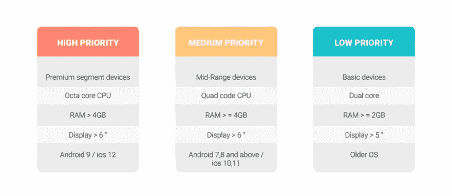

# 移动应用测试策略

> 原文：<https://dev.to/pcloudy/mobile-app-testing-strategies-4gmp>

到 2020 年，将有大约 55 亿移动用户，占世界人口的 70%。更多的移动用户意味着更多的应用和更多的竞争，为了在竞争中领先，我们需要确保我们的应用完美无瑕。如果你的移动应用程序中有将近一半的错误是被用户发现的，那么你的应用程序的收视率就会下降，下载量也会下降。这就是为什么在决策过程中必须选择正确的移动应用测试技术。

**手机应用测试策略**

如今，移动应用市场竞争激烈。为了一天比一天更好并长久生存，QA 团队必须遵循一系列计划，这些计划将负责做出正确的测试决策。测试人员必须制定[测试策略](https://www.pcloudy.com/top-5-tips-for-successful-mobile-application-testing/)以无畏和完美地面对每一种情况。移动应用程序在到达终端用户之前必须是完美的，因此必须对测试计划做出某些决定。为了更好地执行，可以考虑以下移动应用测试计划模型。

在计划阶段，需要做出诸如选择设备矩阵、测试基础设施(内部还是云、模拟器还是真实设备)、测试范围、[测试工具](https://www.pcloudy.com/mobile-app-testing-tools-to-improve-app-quality/)、自动化(框架/工具)等决策。因为这是第一阶段，所以是最重要的一个阶段，因为所有进一步的阶段都将取决于这些决定。在下一个阶段，即执行和评审阶段，需要做出关于测试用例设计、用户故事测试、按照 Sprint 目标的测试类型、渐进自动化、回归测试、评审和过程修正的决定。

我们将更详细地讨论计划阶段的各个方面

**设备矩阵:**

这是一个重要的因素，根据目标受众的行为选择设备对休息决策至关重要。选择[器件矩阵](https://www.pcloudy.com/how-to-analyze-data-to-predict-your-optimum-device-test-coverage/)有不同的方法。

方法 1-根据市场调查选择设备。
通过使用应用购买数据和分析，确定使用目标操作系统的设备集合，这些设备最有可能访问您的应用。例如，如果您同时支持 Android 和 iOS，并且您的应用程序将在数百万台三星、谷歌 Nexus 和 Moto G 设备上使用，但只有数千台 iPhone，则您优先在谷歌 Nexus 和 Moto G 上测试，而不是在 iPhone 设备上测试。因此，该测试计划将包括对您的市场分析优先考虑的设备进行测试。

方法 2:基于关键移动方面对设备进行分类
该方法强调基于特定移动方面对设备进行分类，在制定测试策略时可以考虑这些方面。分类如下:

**测试基础设施**

这是规划阶段的另一个要素。这侧重于基础设施组件的战略制定，如硬件、软件和网络，它们是测试基础设施不可或缺的一部分。它确保以受控的方式管理应用程序。

真实设备、仿真器或移动云——在哪里测试？根据测试需求选择合适的平台进行测试非常重要，也就是说，是在真实设备上测试，还是在模拟器上测试，还是在[云](https://www.pcloudy.com/automated-app-testing-with-bots/)上测试。

**真实设备**

在真实设备上测试比在模拟器上测试更可靠。结果是准确的，因为实时测试是在真实环境中对设备进行的。它有其自身的缺点，因为它是一件昂贵的事情，并且不是所有的组织都能够负担得起他们自己的完整的真实设备实验室。

**优点:**

可靠——在真实设备上测试总是能给出准确的结果

真实环境——在真实设备上测试使您能够在目标受众工作的实际环境中测试您的应用程序。您可以使用不同的网络技术测试您的应用，如 HSPDA、UMTS、LTE、Wi-Fi 等。

用户体验——在真实设备上测试是测试实时用户体验的唯一方法。它不能通过云上可用的仿真器或设备进行测试。

**缺点:**

维护矩阵——你无法在自己的测试实验室中维护如此庞大的移动设备矩阵。维护-维护这些物理设备对组织来说是一个巨大的挑战。
网络提供商-全球有 400 多家网络提供商。覆盖所有这些网络提供商的测试实验室是不可能的。
位置——当你的应用程序在不同的位置使用时，你不能测试它的行为。

**仿真器**

模拟器是测试移动应用的另一个选择。这些都是免费的开源软件，可以很容易地与 IDE 连接进行测试。[模拟器](https://www.pcloudy.com/problems-with-online-android-emulator-and-how-to-solve-it/)模拟真实的设备环境，某些类型的测试可以很容易地在其上运行。但是，我们不能说模拟器的结果和真实设备一样好。它速度较慢，无法测试网络连接、过热、电池性能等问题。

**优点:**

Price- Mobile 模拟器是完全免费的，并作为 SDK 的一部分在每个新的 OS 版本中提供。

快速——因为模拟器在本地机器上可用，所以它们比连接到本地网络的真实设备或云上可用的设备运行得更快，延迟更少。

**缺点:**

错误的印象——即使您已经在模拟器上执行了所有的测试用例，您也不能 100 %确定它将在真实环境中工作。
测试手势——在模拟器上使用鼠标进行挤压、滑动或拖动、长按等手势与在真实设备上使用这些手势是不同的。我们不能在模拟器上测试这些功能。
不能测试网络互操作性——在模拟器的帮助下，你不能用不同的网络技术测试你的应用程序。像 HSPDA，UMTS，LTE，Wi-Fi 等。

**移动云测试**

移动云测试可以克服购买和维护移动设备等成本挑战。它在云中提供了所有不同的设备类型集来测试、部署和管理移动应用程序。通过选择正确类型的设备-操作系统组合，测试可以在虚拟环境中运行。在这种情况下，隐私、安全性和对互联网的依赖性可能是一个挑战，但它有许多好处，可以满足不同的测试场景。

组织可以选择上述平台的正确组合，因为每个平台都有自己的优点和缺点。有时真实和模拟器的组合是首选，有时三者都可以根据测试策略来考虑。

**优点:**

设备可用性——设备和网络提供商的可用性对于云用户来说是一个巨大的收益。
维护——当你使用云服务时。别提维护了。这些提供商负责维护这些设备。
按使用付费-您不需要购买设备。你只需为你使用该设备的时间付费。

并行执行——您可以在多个设备上测试您的完整测试套件。

缺点:
成本——有些供应商有点贵

Android 和 iOS 上移动应用测试的自动化工具
现在，市场上有这么多可用的自动化工具。有些很贵，有些在市场上可以免费买到。每种工具都有其优缺点。选择正确的测试工具将减少 QA 团队的工作量，同时提供无缝的性能。我们将讨论 2018 年 iOS 和 Android 平台的最佳移动应用测试自动化工具。

1.  Appium:它是测试人员首选的 MAT 工具之一。它是 Android 和 iOS 上可用的开源免费工具。它可以跨多种语言和测试框架(如 TestNG)自动化任何移动应用程序。它支持编程语言，如 Java、C#和其他 Webdriver 语言。它提供对完整的后端 API 和测试代码数据库的访问。
    顶级特性:
    -Appium 支持 Ios 上的 Safari 和 Android 上的其他浏览器
    -可以使用 Java、Objective-C、JavaScript 等多种 Webdriver 兼容语言编写测试用例
    -支持 Ruby、Java、PHP、Node、Python 等语言。

2.  Robotium:是一款免费的 Android UI 测试工具。它支持为 Android 应用程序编写强大的黑盒测试用例。支持 Android 及以上版本。测试是用 Java 语言编写的，基本上，Robotium 包含了一个单元测试库。除此之外，Robotium 在准备测试方面要花费更多的精力，人们必须使用程序源代码来自动化测试。Robotium 没有播放录音和截图功能。

**最大特点:**
-可以用最少的项目知识创建测试
-可以同时执行大量的 android 练习。
——与 Ant 或 Maven 轻松同步以运行测试。

**3。葫芦:**它是一个开源的 MAT 工具，允许测试人员为 Android 和 iOS 编写和执行测试。它的库使测试代码能够与本地和混合应用程序进行交互。它支持 cucumber 框架，使非技术人员也能理解。可以针对 Android 和 Ios 设备进行配置。它与 Ruby、Java 等语言配合得很好。NET、Flex 和许多其他软件。它为 Android 和 ios 运行自动化功能测试。这是一个由 Xamarin 和 Calabash 维护的框架。

**4。Espresso:** 是一款面向 Android 的手机 app 测试自动化工具。它允许编写精确可靠的 Android UI 测试。它是一个面向相信自动化测试是 CI CD 过程的重要部分的开发人员的工具。Espresso 框架由 Android X Test 提供，它提供了用于编写 UI 测试的 API，以模拟目标应用程序上的用户交互。Espresso 测试可以在 Android 2.33 及以上运行。提供测试操作与应用程序 UI 的自动同步。

**5。Selendroid:** 一个开源自动化框架，驱动 Android 原生、混合和移动 web 应用的 UI。一个强大的测试工具，可以在模拟器和真实设备上使用。因为它仍然重用现有的 web 基础设施，所以您可以使用 Selenium 2 客户端 API 编写测试。

**6。Frank:** 是唯一一个结合了 cucumber 和 JSON 特性的 iOS 开源自动化测试工具。在这个工具中不需要修改 app 代码。它包括 Symbiote live app inspector 工具，并允许编写结构化验收测试。它很难直接在设备上使用，但对于网络和本地应用程序来说很灵活。它可以在模拟器和设备上运行测试。它通过显示测试运行的视频来展示应用程序的运行。

以上是几个很有前景的，流行的，最常用的，移动 app 测试自动化工具。工具的选择当然可以更快更有效地解决许多测试相关的问题。实现这些工具需要技能和经验，所以一个组织需要有一个合适的测试团队来实现这一切。