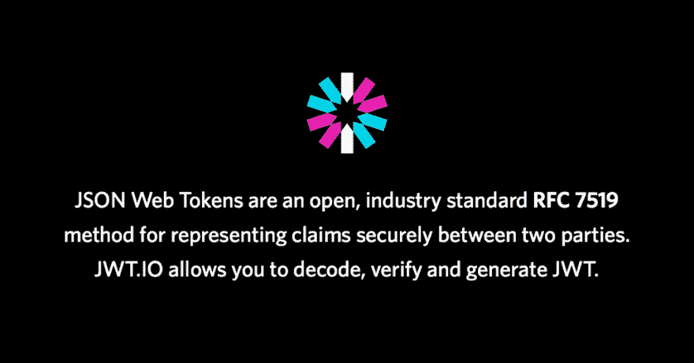

# 用 Golang 进行简单的 JWT 认证(第 2 部分)

> 原文：<https://dev.to/omnisyle/simple-jwt-authentication-with-golang-part-2-263>

这是由三部分组成的系列教程的第二部分，该教程为内部 API 构建了一个小而完整的 JWT 身份验证解决方案(大多数概念也可以应用于为公共 API 构建 JWT 身份验证)。

*   第 1 部分— [公钥/私钥生成和存储](https://dev.to/omnisyle/simple-jwt-authentication-for-golang-part-1-3kfo)
*   第 2 部分—构建 CLI 来创建/检索应用程序对象
*   第 3 部分— [构建 JWT 认证中间件](https://dev.to/omnisyle/simple-jwt-authentication-with-golang-part-3-1ja3)

<figure>[](https://res.cloudinary.com/practicaldev/image/fetch/s--RG2pxQHC--/c_limit%2Cf_auto%2Cfl_progressive%2Cq_auto%2Cw_880/https://cdn-images-1.medium.com/max/1024/1%2AQoUJBQLOv6Vh_pgEYctC_A.png)

<figcaption>[https://jwt . io](https://jwt.io)</figcaption>

</figure>

### 概述

在这一部分中，我们将构建一个迷你 CLI 来帮助我们完成以下任务:

*   通过公钥检索存储在 Postgres 数据库中的 App(一组公钥/私钥对)对象。
*   生成一个随机密钥字符串用作主密钥。
*   创建新的应用程序对象。

### CLI

我们将使用 Cobra(一个 CLI 框架包)来快速生成 CLI 的基础。让我们得到它。

```
go get -u github.com/spf13/cobra/cobra 
```

Enter fullscreen mode Exit fullscreen mode

我们将为我们所有的命令制作一个 cmd 包。好吧，现在只有一个。不管怎样，让我们好好组织一下。这是我们的文件夹结构。

```
├── cmd
│ ├── app.go
│ ├── key.go
│ └── root.go
├── internal
│ └── app
│ ├── app.go
│ ├── create.go
│ └── get.go
└── main.go 
```

Enter fullscreen mode Exit fullscreen mode

在 root.go 中，我们将所有命令合并到一个主命令下。