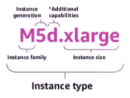
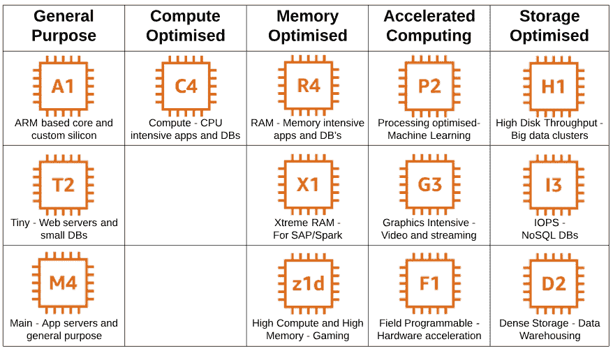

# 哪款 EC2 适合你？

> 原文：<https://dev.to/helenanders26/aws-series-which-ec2-is-right-for-you-3f83>

Amazon EC2 在云中提供虚拟机，您只需为使用的存储量付费。您可以在满足不同用例的几种实例类型中进行选择。

* * *

## 字母和数字是什么意思？

*Source: AWS re:Invent 2018 Slides*

**实例族**——不同用例的不同实例类型和资源。

**实例生成** - AWS 逐步淘汰旧技术，引入拥有更多资源的新技术，使用这些数字来显示哪个是哪个。

**实例大小**——资源以线性方式增长，价格也随之增长。

* * *

## 我如何挑选一个实例类型？

EC2 有多种实例类型，专门用于不同的角色:

*   通用-计算、内存和网络资源的平衡。
*   计算优化-非常适合受益于高性能处理器的计算密集型应用。
*   内存优化-为在内存中处理大量数据集的工作负载提供快速性能。
*   加速优化硬件加速器，或协处理器。
*   存储优化——对本地存储上非常大的数据集进行高效的顺序读写访问。

* * *

## 用例

### 托管

对于网站和应用程序。你可能需要一个在网络资源、计算和内存之间达到良好平衡的实例类型，比如通用的 M 系列或 T 系列，它们可以在你需要的时候 T2 爆发。

### 大数据处理

适用于需要纵向扩展的 CPU 密集型任务，然后在数据处理完成后关闭。根据数据处理工作量的大小，R 或 X 系列可能是一个选项。

### 视频创作

对于视频创作服务、3D 可视化和流式图形密集型应用，请考虑 G 系列。

使用 AWS 文档中的[实例类型](https://aws.amazon.com/ec2/instance-types/#instance-type-matrix)表了解更多信息。

* * *

## 有哪些存储选项？

**实例存储** -连接到实例的硬盘。当实例终止时，它会删除。

**[【EBS】](https://aws.amazon.com/ebs/)**-类似于独立于 EC2 的网络硬盘，用于数据库、应用托管和存储。

**[物体储存](https://dev.to/helenanders26/aws-series-whats-in-the-bucket-1k3)** - S3 和冰川

**[【EFS】](https://aws.amazon.com/efs/)**——一个托管的网络文件系统，可以跨多个 Amazon EC2 实例共享，并且可以根据工作负载进行扩展。默认情况下，每个地区的每个帐户最多可以有 10 个文件系统。

 [## AWS 中 EBS 卷容量规划的重要性

### ashan Fernando 2 月 1 日 184 分钟阅读

#aws #storage #ebsvolumes #cloud](/ashanfernando/the-importance-of-capacity-planning-for-ebs-volumes-in-aws-3pd0)

* * *

## 安全是如何工作的？

*   为了安全起见，应该生成一个公钥/私钥对，并在连接时使用。

*   特定区域的安全组可以设置为虚拟防火墙，允许访问不同的端口。

*   规则只能允许-您不能明确拒绝安全组的流量

 [## AWS 安全组的 5 个不容忽视的最佳实践

### total cloud . io Oct 20 ' 185 分钟读取

#awssecurity #firewalls #securitygroups #nacls](/totalcloudio/5-not-to-ignore-best-practices-for-aws-security-groups-2e14)

* * *

## 我如何支付这一切？

有四种支付 Amazon EC2 实例的方式:

### 按需

*   按每小时或每秒支付容量费用。
*   没有承诺。
*   适用于正在开发的应用程序或不可预测的使用高峰。

### 保留实例

*   以点播价格的 75%提供预订，
*   让您能够在需要时启动实例。
*   降低价格，因为您需要承诺一年或三年的期限，并决定是否支付“全部预付”、“部分预付”或“不预付”。

### 光斑实例

*   请求备用 AWS EC2 计算能力，价格比按需价格低 90%。
*   灵活的开始和结束时间。
*   如果你出价高于实例被终止，你不支付小时。
*   如果你停止实例，你将支付小时。
*   适合那些不重要的后台工作。

### 专用主机

*   在专用物理服务器上提供容量。
*   适用于由于法规原因或许可要求而无法共享容量的情况。

### 储蓄计划

*   提供保留实例的好处，但更灵活。
*   您需要承诺一年或三年的期限，但可以在同一系列内更改实例类型，同时利用节省的成本。

* * *

## 我如何管理成本？

AWS 提供了一个包含详细数据集的[成本和使用报告](https://aws.amazon.com/aws-cost-management/aws-cost-and-usage-reporting/)，该数据集包括关于 AWS 服务、定价和预订的元数据。

这可以交付到一个 S3 桶中，可以与 AWS Athena 结合使用，也可以简单地下载为 csv 格式进行“切片”

 [## 如何降低您的 AWS EC2 账单

### 克里斯·多兹 4 月 8 日 185 分钟阅读

#devops #aws #business](/liquid_chickens/how-to-lower-your-aws-ec2-bill-5l4)

* * *

## 入门

要开始使用 EC2，免费层提供 750 小时的 t2 micro of EC2 计算服务。如果超出限额，标准费率适用。

要了解更多信息，请查看 AWS 的 [10 分钟教程](https://aws.amazon.com/getting-started/tutorials/)。

* * *

这篇文章最初出现在[helenanderson.co.nz](http://www.helenanderson.co.nz/which-ec2-right-for-you/)