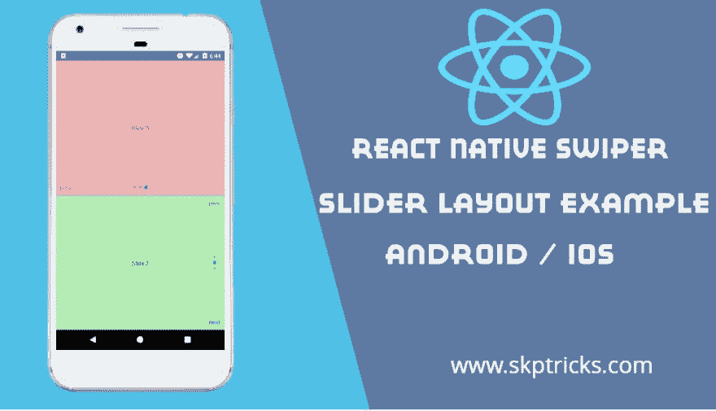

# React 本机 Swiper 滑块布局示例

> 原文：<https://dev.to/skptricks/react-native-swiper-slider-layout-example-3gg5>

来源: [React 原生 Swiper 滑块布局示例](https://www.skptricks.com/2019/04/react-native-swiper-slider-layout-example.html)

本教程解释了如何在 react 本地应用程序中创建简单的 swiper 滑块布局。现在这种滚动条布局设计被大多数 android 或 ios 移动应用程序所使用。如果你有一部智能手机，你已经知道什么是手势。手势是那些触发触摸屏和用户之间交互的细微动作。一般来说，它会持续从第一次触摸屏幕到手指离开屏幕之间的时间。使用这个 Swiper 布局设计，我们可以在移动应用程序的上一页和下一页之间来回切换。

[React 原生 Swiper 滑块布局示例](https://www.skptricks.com/2019/04/react-native-swiper-slider-layout-example.html)

[继续阅读...](https://www.skptricks.com/2019/04/react-native-swiper-slider-layout-example.html)