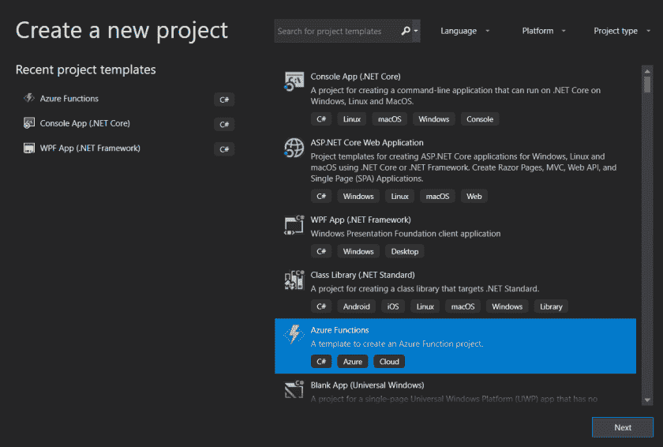
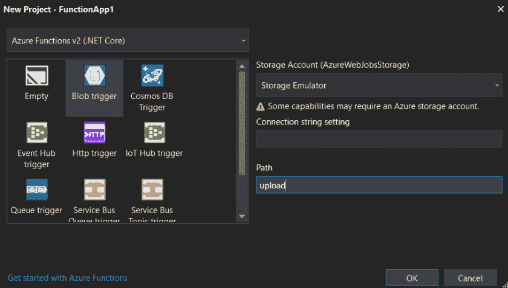

# 使用 Azure 函数和 Docker 扫描 Blob 存储中的病毒

> 原文：<https://dev.to/sogeti/scanning-blob-storage-for-viruses-with-azure-functions-and-docker-1ph9>

在做兼职项目时，有人问我如何在云原生和无服务器环境中扫描病毒。这让我想起了几年前我做的一个项目。在那个项目中，我们使用了安装在虚拟机上的 ClamAV。我们扫描了最终用户在 ASP.NET 应用程序中上传的文件，所有内容都托管在荷兰某处的数据中心虚拟机上。

> ClamAV 是一个开源反病毒引擎，用于检测特洛伊木马、病毒、恶意软件和其他恶意威胁。

在这篇博文中，我将展示一个概念验证，使用 Docker 镜像和 Azure 函数为 Azure Blob 存储创建一个简单的自动化病毒扫描程序。

## 设置 Docker 图像

首先是一些先决条件。在这个演示中，我在我的桌面上运行 Docker for Windows，并在 Visual Studio 2019 中使用本地 Azure 函数进行编码。我已经设置了一个 Azure 存储帐户，可以在我的函数中用作触发器。

首先，我们来找一个安装了 [ClamAV](https://www.clamav.net/) 的 Docker 镜像。

有几个可以在 DockerHub 上找到，我已经拉了 [mkodockx/docker-clamav](https://hub.docker.com/r/mkodockx/docker-clamav/) ，它在我的演示中无缝地工作。要运行它，只需执行下面的命令:

```
docker run -d -p 127.0.0.1:3310:3310 mk0x/docker-clamav:alpine 
```

它应该在本地主机的默认端口上运行和侦听。

## 创建 Azure 功能

第二步是为我们的 Azure 函数创建一个项目:

[](https://res.cloudinary.com/practicaldev/image/fetch/s--MK5H6BV8--/c_limit%2Cf_auto%2Cfl_progressive%2Cq_auto%2Cw_880/https://peterrombouts.files.wordpress.com/2019/04/createproject.png%3Fw%3D840)

我们使用 blob 触发函数，因为我们想扫描位置“上传”中的所有新 blob。

[](https://res.cloudinary.com/practicaldev/image/fetch/s--JJV5IfXj--/c_limit%2Cf_auto%2Cfl_progressive%2Cq_auto%2Cw_880/https://peterrombouts.files.wordpress.com/2019/04/blobtrigger.png%3Fw%3D840)

现在，为了进行扫描，应该安装下面的用于 nClam 的 [NuGet 包:](https://www.nuget.org/packages/nClam) 

```
Install-Package nClam -Version 4.0.1 
```

扫描的实际代码非常简单。下面显示的是获取文件、将其上传到 Docker 容器并检索扫描状态的代码:

```
using System.IO; using System.Linq; using Microsoft.Azure.WebJobs; using Microsoft.Extensions.Logging; using nClam; namespace VirusScanFunction { public static class ScanBlobs { static readonly string serverName = "localhost"; static readonly int serverPort = 3310; [FunctionName("ScanBlobs")] public static void Run([BlobTrigger("upload/{name}", Connection = "AzureWebJobsStorage")]Stream myBlob, string name, ILogger log) { // Create client var clam = new ClamClient(serverName, serverPort); // Scanning for viruses... var scanResult = clam.SendAndScanFileAsync(myBlob).Result; switch (scanResult.Result) { case ClamScanResults.Clean: log.LogInformation("The file is clean!"); break; case ClamScanResults.VirusDetected: log.LogInformation("Virus Found!"); log.LogInformation("Virus name: {0}", scanResult.InfectedFiles.First().VirusName); break; case ClamScanResults.Error: log.LogInformation("Error scanning file: {0}", scanResult.RawResult); break; } } } } 
```

基本上就是这样！您刚刚为 blob 存储创建了自己的本地病毒扫描程序！

## 回顾和注意事项

很明显，这是一个 PoC，并且在我的~~机器~~容器上运行良好。对于企业环境，您应该关心使用什么容器映像，如何处理发现的病毒，以及如何减轻问题。很明显，你想警告并阻止最初上传病毒的人。

## 结论

无服务器和容器允许你建立真正酷的概念，让你跳出框框思考。几年前，我们必须在虚拟机上安装 ClamAV，现在我们可以使用容器，旋转它们，扩展它们，并在完成后进行处理。想想可能性吧！