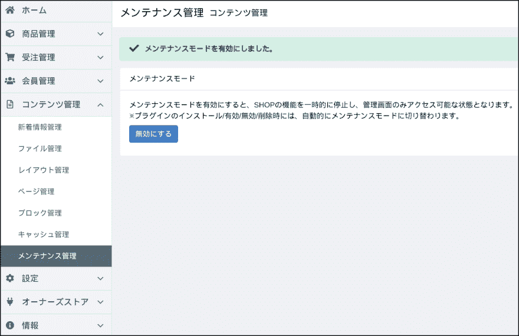
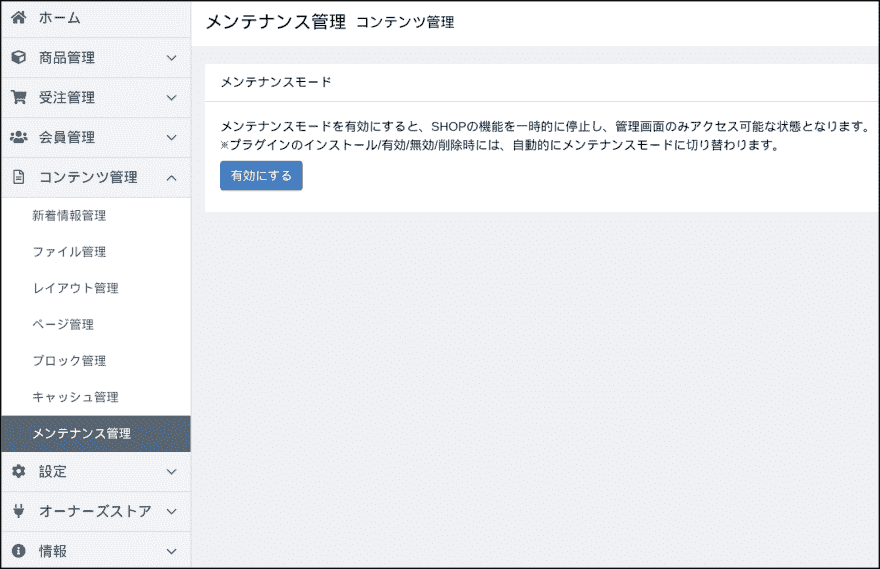

# 更新到 EC-CUBE 4.0.1 - >4.0.2@ openbsd

> 原文：<https://dev.to/nabbisen/ec-cube-4-0-1-4-0-2-openbsd-2a9g>

# Summary

前几天，在[OpenBSD](http://openbsd.org) 6.4 上安装了[EC-CUBE](https://www.ec-cube.net/) 4.0.0。
然后，之后更新到了 4.0.1。
每个细节都写在系列报道中。

这次又进行了从 4.0.1 到现在的最新版 4.0.2 的更新。
根据更新，针对[管理画面进行文件管理功能的扩展和 CSS / JavaScript 的管理功能的追加等](https://github.com/EC-CUBE/ec-cube/compare/4.0.1...4.0.2?w=1#files_bucket)。

步骤按照[官方文档](https://doc4.ec-cube.net/)的[“EC-CUBE 主机的版本升级”](https://doc4.ec-cube.net/update)进行。

在 EC-CUBE 的更新中，OpenBSD 特有的有以下两点。

1.  执行 PHP 命令时，用`php-7.2`代替`php`。
2.  虽然在封装中存在多个[`.htaccess`](https://httpd.apache.org/docs/current/ja/howto/htaccess.html)，但是如果在某个地方有更新，则根据需要通过[`httpd.conf`](https://man.openbsd.org/httpd.conf.5)/ [`php.ini`](http://php.net/manual/en/configuration.file.php)(`php-72.ini`)来吸收差值。

但是后者在这次 4.0.2 的更新中没有关系。

### environment

*   操作系统:OpenBSD 6.4 amd64
*   网页サーバー: OpenBSD [httpd](https://man.openbsd.org/httpd.8)
*   小车系统: EC-CUBE 4.0.1 - >4.0.2
*   DB: [马里亚 DB](https://mariadb.com/) 10.0

### Pay attention

如果正在进行 EC-CUBE 定制，则需要小心。
如果按照更新步骤进行文件复盖，则定制内容可能会消失。

[官方文件“注意事项”](https://doc4.ec-cube.net/update#%E3%81%94%E6%B3%A8%E6%84%8F):

> 如果自定义 EC-CUBE 主体的代码( app/config/eccube、app/DoctrineMigrations、bin、src 和 html 目录)，则会复盖文件
> [请确认各版本的变更差分](http://doc4.ec-cube.net/quickstart_update#%E5%90%84%E3%83%90%E3%83%BC%E3%82%B8%E3%83%A7%E3%83%B3%E3%81%A7%E3%81%AE%E5%A4%89%E6%9B%B4%E5%B7%AE%E5%88%86)并导入必要的差分。

另外，从 4.0.0 更新到 4.0.2 时，需要分 4.0.0 ->4.0.1 + 4.0.1 - >4.0.2 两个阶段进行。
4.0.0 - >4.0.1 的更新流程，在以下文章中有记载:

[](/nabbisen) [## 更新到 EC-CUBE 4.0.0 - >4.0.1@ openbsd

### nabbisen Dec 26 ' 184min read

#eccube #ecommerce #openbsd #migration](/nabbisen/ec-cube-400---401---openbsd-5g8m)

<center>✿ ✿ ✿</center>

# 更新的步骤

### premise

将更新对象的根目录的名称设为`eccube`。

首先获取现状的备份。
接下来下载最新软件包&解压缩。
以最新软件包的文件为基础，进行更新。
整体上有以下层次关系:

```
.
|
+-- eccube          * アップデート対象
|   +-- app
|   +-- bin
|   +-- ...
+-- eccube-4.0.2    * 最新パッケージ
|   +-- app
|   +-- bin
|   +-- ...
+-- %backup-dir%    * バックアップ
    +-- database-backup.sql
    +-- eccube-4.0.1 
```

Enter fullscreen mode Exit fullscreen mode

* * *

### 步骤 1: [启用维护模式](http://doc4.ec-cube.net/quickstart_update#2%E3%83%A1%E3%83%B3%E3%83%86%E3%83%8A%E3%83%B3%E3%82%B9%E3%83%A2%E3%83%BC%E3%83%89%E3%82%92%E6%9C%89%E5%8A%B9%E3%81%AB%E3%81%99%E3%82%8B%E3%83%90%E3%83%BC%E3%82%B8%E3%83%A7%E3%83%B3401%E4%BB%A5%E9%99%8D)

可以从管理界面的“内容管理”-“维护管理”菜单中进行:

[](https://res.cloudinary.com/practicaldev/image/fetch/s--_3D5gRzn--/c_limit%2Cf_auto%2Cfl_progressive%2Cq_auto%2Cw_880/https://thepracticaldev.s3.amazonaws.com/i/gkc0d1ig8a6dc6ltytiq.jpg)

**备注:通过在根目录`eccube`中暂时创建空文件`.maintenance`，也可启用维护模式。*

另外，在官方网站上，以下的“获取备份”是先进行的步骤。
这次，因为想在完全防止用户操作的情况下进行数据保存，所以先将维护模式设为有效。
(我认为错误地决定网站运营方针比较好。 ）

### 步骤 2: [获取备份](http://doc4.ec-cube.net/quickstart_update#1-%E3%82%B5%E3%82%A4%E3%83%88%E3%81%AE%E3%83%90%E3%83%83%E3%82%AF%E3%82%A2%E3%83%83%E3%83%97)

##### #1.创建备份目录

```
$  mkdir %backup-dir% 
```

Enter fullscreen mode Exit fullscreen mode

%backup-dir%实际上命名为:

`eccube4.0.1-`date '+%Y%m%d'``

##### #2.数据库备份

可以通过 MariaDB 的[`mysqldump`](https://mariadb.com/kb/en/library/mysqldump/)命令获取[备份](https://dev.to/nabbisen/mariadb-backing-uprestoring-databases-on-the-command-line-351j):

```
$  mysqldump -u %user% -p %database% > %backup-dir%/database-backup.sql 
```

Enter fullscreen mode Exit fullscreen mode

##### #3.源文件的备份

从软件包的根目录复制所有文件。

```
$  cp -rp eccube %backup-dir%/eccube-4.0.1 
```

Enter fullscreen mode Exit fullscreen mode

##### #4.备份完成

至此，备份完成。
为了防止人为错误，作为最终确认，我认为最好先检查一下制作好的东西。

```
$  ls -l %backup-dir% 
```

Enter fullscreen mode Exit fullscreen mode

* * *

### 步骤 3 :进行更新

##### #1\. [从官方网站下载页面](https://www.ec-cube.net/download/)获取最新的 EC-CUBE 包

```
$  wget http://downloads.ec-cube.net/src/eccube-4.0.2.zip
$  unzip eccube-4.0.2.zip 
```

Enter fullscreen mode Exit fullscreen mode

##### #2\. [更新公共文件](http://doc4.ec-cube.net/quickstart_update#3-%E5%85%B1%E9%80%9A%E3%83%95%E3%82%A1%E3%82%A4%E3%83%AB%E5%B7%AE%E3%81%97%E6%9B%BF%E3%81%88)

无论更新版本如何，始终作为更新对象的文件组。

```
$  cp -r eccube-4.0.2/app/config/eccube      eccube/app/config
$  cp -r eccube-4.0.2/app/DoctrineMigrations eccube/app
$  cp -r eccube-4.0.2/bin                    eccube/
$  cp -r eccube-4.0.2/src                    eccube/
$  cp -r eccube-4.0.2/html                   eccube/
$  cp -r eccube-4.0.2/vendor                 eccube/ 
```

Enter fullscreen mode Exit fullscreen mode

##### #3\. [更新个别文件](http://doc4.ec-cube.net/quickstart_update#4-%E5%80%8B%E5%88%A5%E3%83%95%E3%82%A1%E3%82%A4%E3%83%AB%E5%B7%AE%E3%81%97%E6%9B%BF%E3%81%88)

每个更新版本可能都有需要额外更新的文件。
4.0.1 - >更新为 4.0.2 时:

```
$  cp eccube-4.0.2/composer.json             eccube/
$  cp eccube-4.0.2/composer.lock             eccube/ 
```

Enter fullscreen mode Exit fullscreen mode

文件复盖后，清除 APP 应用程序的缓存:

```
$  cd eccube
  $  php-7.2 bin/console cache:clear --no-warmup
  $  cd ../ 
```

Enter fullscreen mode Exit fullscreen mode

请注意，如果要跨越多个 EC-CUBE 版本，请注意:

> 如 4.0.0 → 4.0.2 那样进行跨多个版本的版本升级时，请按照 4.0.0 → 4.0.1→4.0.1 → 4.0.2 那样进行阶段性的版本升级。

##### #4\. [`composer.json`/ `composer.lock`的更新](http://doc4.ec-cube.net/quickstart_update#5-composerjsoncomposerlock%E3%81%AE%E6%9B%B4%E6%96%B0)

如果满足以下所有条件，则需要执行此步骤(如果不需要，请跳过此步骤) :

*   个别文件替换的替换对象中包含`composer.json`/ `composer.lock`
*   正在安装插件

[更新 Composer](https://getcomposer.org/) 的[`composer.json`/ `composer.lock`](https://getcomposer.org/doc/01-basic-usage.md):

```
$  cd eccube
  $  php-7.2 bin/console eccube:composer:require-already-installed
  $  cd ../ 
```

Enter fullscreen mode Exit fullscreen mode

##### #5\. [模式更新/迁移](http://doc4.ec-cube.net/quickstart_update#6-%E3%82%B9%E3%82%AD%E3%83%BC%E3%83%9E%E6%9B%B4%E6%96%B0%E3%83%9E%E3%82%A4%E3%82%B0%E3%83%AC%E3%83%BC%E3%82%B7%E3%83%A7%E3%83%B3)

这次，本项是不需要的:

> 4.0.1 → 4.0.2 的更新不需要架构更新。

##### #6\. [模板文件的更新](http://doc4.ec-cube.net/quickstart_update#7-%E3%83%86%E3%83%B3%E3%83%97%E3%83%AC%E3%83%BC%E3%83%88%E3%83%95%E3%82%A1%E3%82%A4%E3%83%AB%E3%81%AE%E6%9B%B4%E6%96%B0)

进行文件的复盖或者[差分](http://doc4.ec-cube.net/quickstart_update#%E5%90%84%E3%83%90%E3%83%BC%E3%82%B8%E3%83%A7%E3%83%B3%E3%81%A7%E3%81%AE%E5%A4%89%E6%9B%B4%E5%B7%AE%E5%88%86)的读取。

4.0.1 ->4.0.2 的更新对象如下。

| 页面名称 | 文件名 |
| --- | --- |
| 我的页面/购买历史详细信息 | [T2`Mypage/history.twig`](https://github.com/EC-CUBE/ec-cube/pull/4008/files) |
| 订单受理邮件 | [T2`Mail/order.twig`](https://github.com/EC-CUBE/ec-cube/pull/4060/files) |
| 订单接收邮件( HTML ) | [T2`Mail/order.html.twig`](https://github.com/EC-CUBE/ec-cube/pull/4060/files) |

##### #8\. `.htaccess`的变更内容的取入( OpenBSD 特有)

这次没有变更，所以不需要本项。

##### #9.更新完成

[重新启动 PHP-FPM](https://php-fpm.org/) / httpd :

```
#  rcctl restart {php72_fpm,httpd} 
```

Enter fullscreen mode Exit fullscreen mode

### 步骤 4: [使维护模式无效](http://doc4.ec-cube.net/quickstart_update#1-%E3%82%B5%E3%82%A4%E3%83%88%E3%81%AE%E3%83%90%E3%83%83%E3%82%AF%E3%82%A2%E3%83%83%E3%83%97)

从管理界面的“内容管理”-“维护管理”菜单进行操作:

[](https://res.cloudinary.com/practicaldev/image/fetch/s--hArqCr_V--/c_limit%2Cf_auto%2Cfl_progressive%2Cq_auto%2Cw_880/https://thepracticaldev.s3.amazonaws.com/i/pvttou2a3mqsjupiv8hm.jpg)

**备注:也可通过删除 EC-CUBE 根目录的`.maintenance`文件来解除维护模式。*

<center>✿ ✿ ✿</center>

到此为止。
谢谢您的阅读。