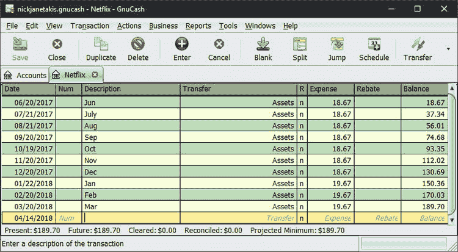

# 使用 GnuCash 作为自由职业者来跟踪财务和准备税收

> 原文：<https://dev.to/nickjj/using-gnucash-as-a-freelancer-to-track-finances-and-prepare-taxes-pen>

**本文最初发布于 2018 年 4 月 17 日:[https://nickjanetakis . com/blog/using-gnucash-as-a-a-a-freelancer-track-finances-and-prepare-taxes](https://nickjanetakis.com/blog/using-gnucash-as-a-freelancer-to-track-finances-and-prepare-taxes)**

* * *

我没有信用卡(这是我的选择)，所以密切关注我的财务状况非常重要，但我认为不管你有没有信用卡，跟踪你所有的财务交易都是一个好主意。

这是你知道什么进来什么出去的唯一方法。即使你在保持正平衡方面没有任何问题，这也是一个很好的习惯——我想说，如果你在债务中挣扎，这是必不可少的。

幸运的是，我没有债务，但我看到许多人通过记录他们所有的交易来扭转他们的财务状况。

## GnuCash 是什么，有什么值得使用的地方？

GnuCash 是这样描述他们自己的:

> GnuCash 是一款个人和小型企业财务会计软件，在 GNU GPL 下免费授权，可用于 GNU/Linux、BSD、Solaris、Mac OS
> X 和 Microsoft Windows。

**TL；DR 是一款面向所有主流操作系统的开源记账工具。**

不像 mint.com 和其他在线服务，你不会被要求把你的银行账户连接到它上面。你也不必担心公司会窃取你的财务信息，因为 GnuCash 可以在你选择的操作系统上运行，并且可以离线工作。

我很擅长使用 Excel，但是我发现使用 GnuCash 来创建有意义的报告和保持事情有条理更容易。如果你只想跟踪交易和创建报告，这是一个非常好的工具。

如果你使用像 Drop Box 这样的工具，你甚至可以让它跨设备很好地工作。我不这样做，但我听说过其他人这样做没有问题。这是因为 GnuCash 创建了一个单一的数据库文件，可以很容易地跨设备进行备份和同步。

## GnuCash 有哪些优点适合自由职业者？

老实说，这对每个人都有好处，但对经营自己小生意的人来说尤其如此。我属于这一类，因为我是一名自由职业者，也创建在线培训课程。

我碰巧有来自很多地方的收入。有课程销售、来自亚马逊的附属佣金、一群拥有[各种支付方式](https://nickjanetakis.com/blog/how-to-accept-email-based-payments-for-free-as-a-freelancer)的[自由客户](https://nickjanetakis.com/blog/how-to-start-a-successful-freelance-business-as-a-software-developer)和一些投资。

此外，虽然我偶尔会为合同工作和各种服务付费，但我的工资单上没有任何员工。我只是一个住在地球上税收制度最复杂的国家(美国)的独资经营者。

追踪每一分钱，并找出影响应税收入的因素，这很重要。

#### 轻松分解你的支出和收入

添加、编辑或删除一个帐户大约需要 5 秒钟。帐户是 GnuCash 术语中的一个类别。例如，在费用项下，我有一堆账户。很容易就能看到我这个月在食物上花了多少钱，或者任何我想知道的东西。

还值得指出的是，你可以有子账户(见上面截图中的三角形)。这意味着您可以根据需要向下钻取尽可能多或尽可能少的细节，并且可以自动获得每个父帐户的总数。

## 会计为什么喜欢 GnuCash？

你所要做的就是转到报告，创建费用/收入报告，选择你想要创建报告的日期范围，GnuCash 将打印出一张纸，为你分解所有的内容。

一眼就能看出你的业务费用、医疗费用、一般费用以及一年来你的收入是如何分解的。

我不知道你的税务情况如何，但是我的会计师需要的只是一些与投资相关的文件来帮助我报税。我还带着我可信赖的 Linux 操作系统 Chromebook，以防他需要窥探某个账户的细节。

#### 刺探特定账户的详细情况

您将在这里输入每笔交易的详细信息。它为你保留了一个运行总数，而且也很容易按日期过滤。

这个想法是，你有“资产”,你的支出和收入账户与它相关联。在上面的例子中，网飞是一项支出(具体来说是一项娱乐支出，因为你可以嵌套账户)，这就是为什么我把金额记在支出项下。

#### 尽职调查让报税变得简单

当然，如上所述，这意味着您将负责手动输入所有交易的详细信息。它只和你一样准确。

说实话，没看上去那么糟。例如，如果我买了一些牛奶，我回家后不久就把 1.99 美元存入食物账户。我已经在我的工作站上工作了，GnuCash 只需点击一下鼠标。

这是一个非常可爱的设置。以前做税务对我来说压力真的很大，现在感觉也不算太差。我的意思是，当然，把支票交给政府是很糟糕的，但至少现在这个过程是相当无痛的。

我的看法是，即使税收不在考虑范围内，我仍然会跟踪我的财务状况，所以这不是“额外”的繁忙工作。只是好习惯而已。

你用什么软件来帮助理财？下面让我知道！