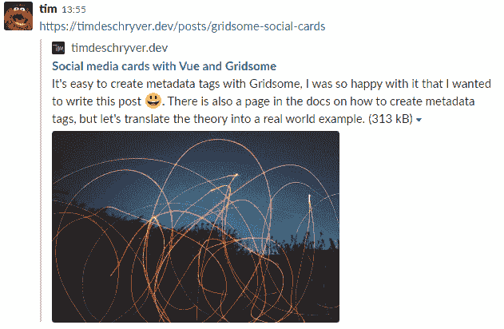

# 带有 Vue 和 Gridsome 的社交媒体卡

> 原文：<https://dev.to/timdeschryver/social-media-cards-with-vue-and-gridsome-3kg8>

### 社交媒体卡

有了社交媒体卡，当你在 Twitter 或 Slack 等不同平台上分享时，可以将一个简单(也很无聊)的链接转化为引人注目的信息。该消息包含标题、描述和图像(如果提供的话)。要为网站创建社交媒体卡，我们必须在页面的`header`标签中添加几个元数据标签。当我们推广我们的网站时，以博客为例，我们可以提供元数据标签。我们甚至可以更进一步，为特定页面创建这些元数据标签。如果我们想把一篇文章和我们的博客以及博客中的其他文章区分开来，我们必须为这篇文章准备一张定制的卡片。因此，我们必须用特定帖子的元数据标签覆盖全局元数据标签。

下面的代码片段展示了一个例子，正如你所看到的，我们必须提供两组不同的元数据。以`og:`为前缀的第一组标签是开放图标准，由脸书使用，第二组标签以`twitter:`为前缀，这些是 Twitter 使用的标签。

```
<head>
  <!-- Open Graph -->
  <meta name="og:title" content="Social media cards with Vue and Gridsome" />
  <meta
    name="og:url"
    content="https://timdeschryver.dev/posts/gridsome-social-cards"
  />
  <meta
    name="og:description"
    content="It's easy to create metadata tags with Gridsome, I was so happy with it that I wanted to write this post 😃. There is also a page in the docs on how to create metadata tags, but let's translate the theory into a real world example."
  />
  <meta name="og:type" content="article" />
  <meta
    name="og:image"
    content="https://timdeschryver.dev/assets/static/gridsome-social-cards-banner.jpg"
  />

  <!-- Twitter -->
  <meta name="twitter:card" content="summary_large_image" />
  <meta name="twitter:creator" content="@tim_deschryver" />
  <meta
    name="twitter:title"
    content="Social media cards with Vue and Gridsome"
  />
  <meta
    name="twitter:description"
    content="It's easy to create metadata tags with Gridsome, I was so happy with it that I wanted to write this post 😃. There is also a page in the docs on how to create metadata tags, but let's translate the theory into a real world example."
  />
  <meta
    name="twitter:image"
    content="https://timdeschryver.dev/assets/static/gridsome-social-cards-banner.jpg"
  />
</head> 
```

Enter fullscreen mode Exit fullscreen mode

你可以在 [Open Graph protocol](http://ogp.me/) 页面和 [Twitter docs](https://developer.twitter.com/en/docs/tweets/optimize-with-cards/guides/getting-started.html) 中阅读更多关于上述标签的用法。也可以在[脸书](https://developers.facebook.com/tools/debug/sharing/)和[推特](https://cards-dev.twitter.com/validator)上验证卡片。

### 带 Gridsome 的元数据标签

#### 全局标签

要定义添加到每个页面上的全局元数据标签，请使用`src/main`中的默认函数。要添加一个标签，我们必须提供标签的`name`和`content`，`key`是可选的，但是如果我们想要在其他页面上覆盖标签的话，就需要这个选项。如果我们不添加`key`属性，并且稍后提供相同的标签，那么每次添加相同的标签时，标签都会被再次添加。为了保持下面的代码片段简短，我将只添加一个标签，而不是全部。

```
export default function(Vue, { router, head, isClient }) {
  head.meta.push({
    key: 'og:description',
    name: 'og:description',
    content: `Tim Deschryver's experiences and thoughts on programming`,
  })

  head.meta.push({
    key: 'twitter:description',
    name: 'twitter:description',
    content: `Tim Deschryver's experiences and thoughts on programming`,
  })
} 
```

Enter fullscreen mode Exit fullscreen mode

这里提供的标签都是静态内容，在大多数情况下，它们会使用`key`属性。此时，我们也可以使用 Vue 路由器来创建`og:url`标签，因为我们希望这个标签指向当前的 URL，并且因为我们很懒，不想为每个页面手动添加它。

```
router.beforeEach((to, _from, next) => {
  head.meta.push({
    key: 'og:url',
    name: 'og:url',
    content: process.env.GRIDSOME_BASE_PATH + to.path,
  })
  next()
}) 
```

Enter fullscreen mode Exit fullscreen mode

#### 页面特定标签

Gridsome 使用页面，docs 将页面定义为具有静态 URL 的静态页面。例如,`/posts`有资格作为一个页面。

> Pages 用于普通页面和列表&分页 GraphQL 集合。例如博客页面。页面的 URL 路径总是静态的。

要添加或覆盖元数据标签，请使用`metaInfo`上的`meta`属性。这里，我们在定义元数据标签时再次提供了一个`key`,因为我们想要覆盖在全局级别定义的标签。

```
export default {
  metaInfo: {
    title: 'Posts',
    meta: [
      {
        key: 'og:title',
        name: 'og:title',
        content: 'timdeschryver.dev - posts',
      },
      {
        key: 'twitter:title',
        name: 'twitter:title',
        content: 'timdeschryver.dev - posts',
      },
    ]
  } 
```

Enter fullscreen mode Exit fullscreen mode

#### 模板中的动态标签

Gridsome 中的模板与页面相同，但与页面不同，它是动态的。例如,`/posts/slug`可以作为一个模板。

> 模板用于 GraphQL 集合的单个帖子视图。

元数据标签和动态模板的使用可以是一个强大的组合。在我看来，这就是 Gridsome 使工作变得容易和愉快的地方。

```
export default {
  metaInfo() {
    return {
      title: this.$page.post.title,
      meta: [
        {
          name: 'og:description',
          name: 'og:description',
          content: this.$page.post.description,
        },

        {
          key: 'twitter:description',
          name: 'twitter:description',
          content: this.$page.post.description,
        },
      ],
    }
  },
} 
```

Enter fullscreen mode Exit fullscreen mode

帖子的数据来自 GraphQL 查询，每个帖子的数据都不同。

```
query  Post($path:  String!)  {  post:  post(path:  $path)  {  title  banner  description  }  } 
```

Enter fullscreen mode Exit fullscreen mode

> 更多信息请参见 [Gridsome 博客](https://gridsome.org/docs/head)

### 最终结果

这是你在推特 [](https://res.cloudinary.com/practicaldev/image/fetch/s--Uyb-jjEn--/c_limit%2Cf_auto%2Cfl_progressive%2Cq_auto%2Cw_880/https://timdeschryver.dev/assets/static/tweet.82a2fbd.8b5c795.png) 上发布这篇文章的样子

如果你在空闲时间分享它，这看起来就像 [](https://res.cloudinary.com/practicaldev/image/fetch/s--fOHBgGnJ--/c_limit%2Cf_auto%2Cfl_progressive%2Cq_auto%2Cw_880/https://timdeschryver.dev/assets/static/slack.1d0800a.ca8154b.png)