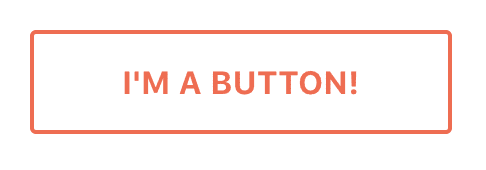

# 使用 Vue 动态组件创建可重用的按钮

> 原文：<https://dev.to/codegram/create-a-reusable-button-with-vue-dynamic-components-gj>

*最初发表于 [Codegram 的博客](https://www.codegram.com/blog/create-a-reusable-button-with-vue-dynamic-components)T3】*

如果您正在构建任何类型的应用程序，很可能您有一个`Button`组件。你知道，一个可以点击的按钮可以发生多种事情:转到不同的页面，打开一个新标签，提交一个表单…但是，即使它可以做这么多不同的事情，一个按钮应该总是看起来像一个按钮，对不对？

[](https://res.cloudinary.com/practicaldev/image/fetch/s--2bqBb-en--/c_limit%2Cf_auto%2Cfl_progressive%2Cq_auto%2Cw_880/https://thepracticaldev.s3.amazonaws.com/i/3md2h5authzmfge6jbb2.png)

在美好的过去，我们曾经使用类来设计事物的样式。我们会有一个可以在应用程序中任何地方使用的`.button`类，就是这样。很简单，对吧？现在，有些人认为全球课不再酷了。因为 JavaScript 中的全局内容是邪恶的，所以我们假设 CSS 中的全局内容也是邪恶的。我今天不打算谈论这个，为了这篇文章，让我们假设这是 100%正确的，这就是我们想要的工作方式。

我们使用 Vue，因为 Vue 很酷，我们创建了一个`Btn`组件。大概是这样:

```
<template>
  <button class="button">
    <slot/>
  </button>
</template>

<script>
  export default {}
</script>

<style scoped>
  .button {
    display: inline-block;
    margin: 0.5em 0;
    padding: 1em 2em;
    background: #fff;
    border: 2px solid tomato;
    border-radius: 3px;
    color: tomato;
    font-family: "Quicksand", sans-serif;
    font-size: 1em;
    font-weight: 700;
    letter-spacing: 0.02em;
    line-height: 1;
    text-decoration: none;
    text-transform: uppercase;
    cursor: pointer;
    transition: 0.3s;
  }

  .button:hover {
    background: tomato;
    color: #fff;
  }
</style> 
```

所以现在它可以像这样在任何地方使用:

```
<btn>I'm a Button!</btn> 
```

*(我们使用`Btn`而不是`Button`来避免使用与 HTML 标签相同的名称)*

### 条件渲染

但现在它只是一个按钮，我们想用它来链接到其他页面。当然，我们可以捕获点击事件并更改`window.location`，但是我们希望以正确的方式做事情并使用正确的链接。因此，如果我们收到一个`href`道具:
，我们可以修改我们的组件来呈现一个`a`

```
<template>
  <div>
    <a v-if="href" :href="href" class="button">
      <slot/>
    </a>
    <button v-else class="button">
      <slot/>
    </button>
  </div>
</template>

<script>
  export default {
    props: {
      href: {
        type: String,
        default: null
      }
    }
  }
</script> 
```

这很有效！但是，如你所见，一个野生的`div`出现了。这是因为 Vue 组件需要有一个[单根元素](https://vuejs.org/v2/guide/components.html#A-Single-Root-Element)。我们可以接受这一点，我已经看到并参与了大量使用这种模式的项目，而且对他们来说效果很好。但是有更好的办法！

### 动力组件来救援了！

一个相对不太流行的 Vue 特性是动态组件。Vue 提供了一个`<component>`元素，它有一个特殊的`is`属性，我们可以用它来动态地呈现不同的组件或元素。所以我们可以重构前面的代码，去掉烦人的`div`根元素:

```
<template>
  <component :is="type" :href="href">
    <slot></slot>
  </component>
</template>

<script>
  export default {
    props: {
      href: {
        type: String,
        default: null
      },
      to: {
        type: String,
        default: null
      }
    },
    computed: {
      type() {
        if (this.href) {
          return 'a'
        } else {
          return 'button'
        }
      }
    }
  }
</script> 
```

漂亮！此外，我们避免了重复使用`class`属性，我们将逻辑转移到一个计算属性中…总体来说更加简洁。不要担心将`href`添加到`button`中，因为如果值为 falsy，属性[将不会被呈现](https://vuejs.org/v2/guide/syntax.html#Attributes)

(如果你来自 React，你可能会觉得使用[渲染函数](https://vuejs.org/v2/guide/render-function.html)更自然，这也是一个非常有效的解决方案，但我认为动态组件是一个更为*的解决方案)*

这样，我们可以很容易地扩展我们的组件来呈现一个`router-link`(或者`nuxt-link`，如果你使用 Nuxt 的话)。你可以在这里查看全部代码:

当然，动态组件非常强大，您也可以使用它们来呈现自己的组件。这么多可能性！

### 进一步阅读

*   [动态组件基础知识](https://vuejs.org/v2/guide/components.html#Dynamic-Components)
*   [动态&异步组件](https://vuejs.org/v2/guide/components-dynamic-async.html)
*   [vue . js 中的可切换动态组件](https://alligator.io/vuejs/dynamic-components/)