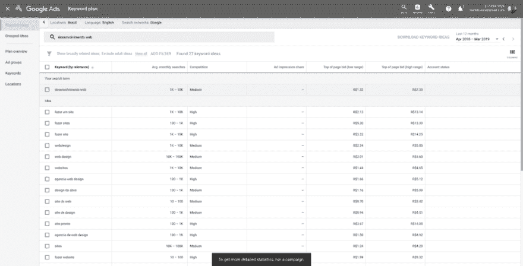
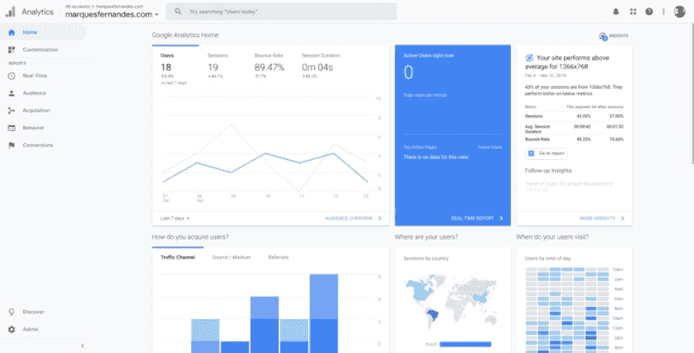
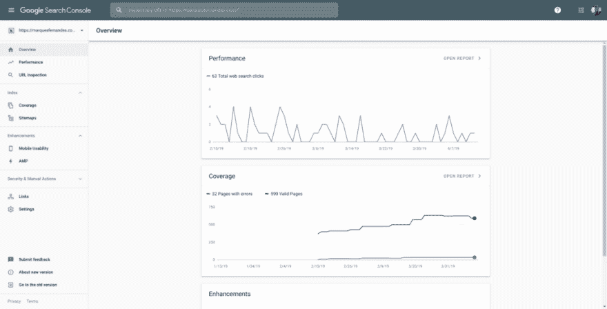
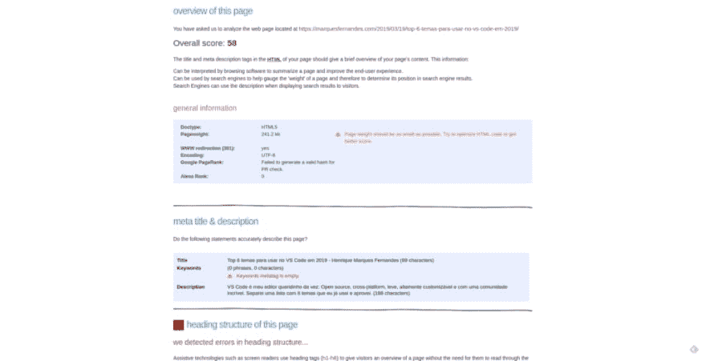
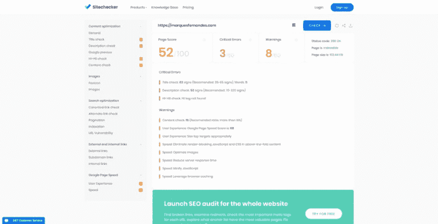
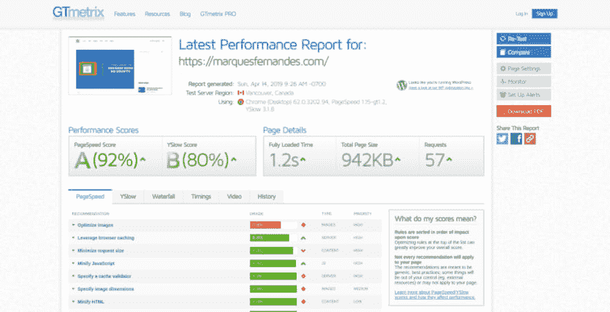
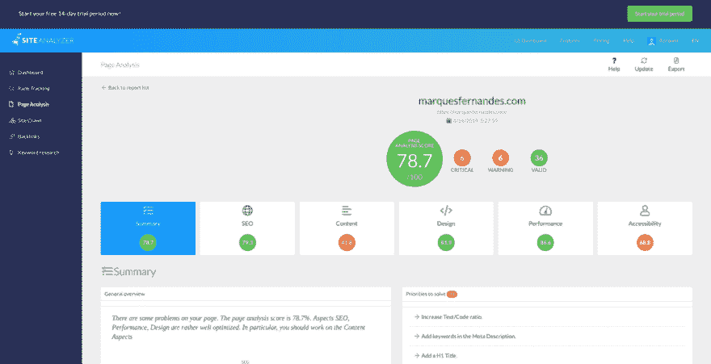
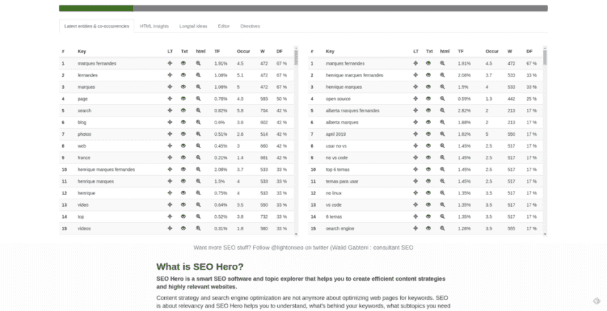
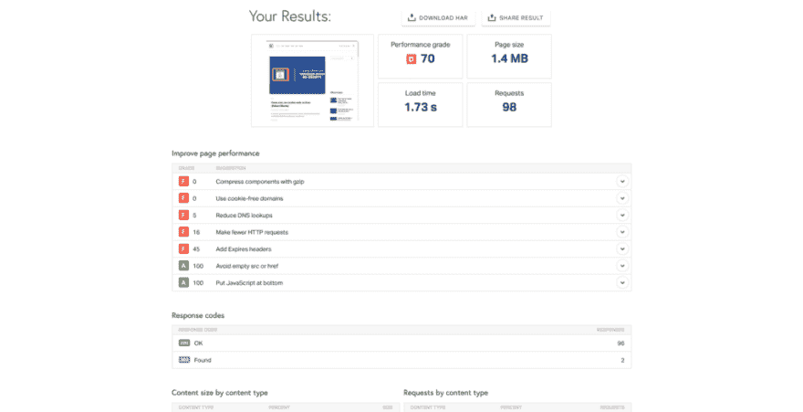
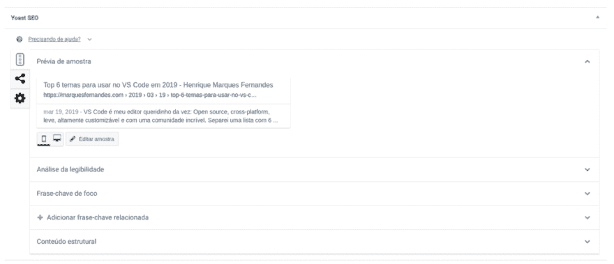

# 8 个免费 SEO 工具

> [https://dev . to/shadow lik/8-工具-SEO-免费-egc](https://dev.to/shadowlik/8-ferramentas-seo-gratuitas-egc)

## [谷歌关键词策划](https://ads.google.com/home/tools/keyword-planner/)，[分析](https://analytics.google.com/analytics/web/) e [搜索控制台](https://search.google.com/search-console/about)

## [SEO 网页分析器](http://www.seowebpageanalyzer.com/)

<figure> 

<figcaption>
</figcaption>

</figure>

## [站点检查器](https://sitechecker.pro/)

## [GTMetrix](https://gtmetrix.com/)

## [现场分析仪](https://www.site-analyzer.com/en/dashboard)

## [SEO 英雄](http://www.seo-hero.tech/)

## [工具 Pingdom](https://tools.pingdom.com)

## [Yoast SEO](https://yoast.com/)

帖子 [8 个免费 SEO 工具](https://marquesfernandes.com/2019/04/15/8-ferramentas-seo-gratuitas/)首先出现在 [Henrique Marques Fernandes](https://marquesfernandes.com) 。