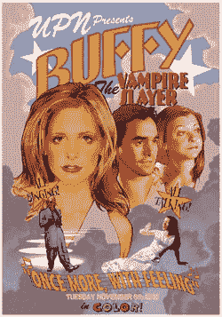

# 响应式设计和移动优先

> 原文：<https://dev.to/laurieontech/responsive-design-and-mobile-first-1a6o>

不久前，有一次代码新手聊天讨论了移动优先的概念。

液体错误:内部

许多人回应说，移动优先开发只是一种时尚，或者说是一个时髦词。然而，我不同意。你看，mobile first 的开发是基于这样一个假设，即任何在你手机上运行的东西也能在你的电脑上运行。反过来？

液体错误:内部

响应式设计的概念就是基于这种观察。当你实现一个网站的设计并支持不同的屏幕尺寸时，首先要考虑它在最小的屏幕上会是什么样子。将其设为默认设置！然后，随着您获得更多的空间，调整更大的屏幕。这样，你就为 *always* 的情况设计了样式，并为那些小屏幕进行了积极的优化。

# 为手机造型

以我的站点为例。我有一个导航栏，里面有一个`h1`标签。我已经设计了页面上的其他`h1`元素，在底部留有空白，但是在这种情况下，这会在我的垂直导航中留下我不想要的空间！

我还希望我的导航中的这个特定的`h1`有更粗的字体粗细。所以还是把那些东西加上吧。

```
#header h1 {
  font-weight: 900;
  margin-bottom: 0;
} 
```

Enter fullscreen mode Exit fullscreen mode

我不需要做任何其他事情来让我的手机看起来更有吸引力。而且它还能在其他尺寸的设备上工作，太棒了！

# 药片为标准尺寸

嗯，转念一想，`h1`看起来不错，但是在我的平板电脑上有一个垂直的导航条，却没有利用我可以使用的水平空间，这有点奇怪。所以我想在屏幕尺寸变大一点的时候改变页面的外观。

这就是媒体提问的地方。媒体查询可以将样式的任何部分扩展到特定的屏幕大小，这是非常强大的。但是，因为我们将所有内容都默认为最小的屏幕，所以我们实际上希望这个媒体查询仅对大于特定尺寸的屏幕有效。

```
@media (min-width: 600px) {
  #header nav ul li {
    display: block;
  }
} 
```

Enter fullscreen mode Exit fullscreen mode

请记住，我们使用的特定像素尺寸是普通的平板电脑尺寸。这些东西有多个“推荐”断点。

# 再一次用 JavaScript！

[](https://res.cloudinary.com/practicaldev/image/fetch/s--C_RDvJ5I--/c_limit%2Cf_auto%2Cfl_progressive%2Cq_auto%2Cw_880/https://upload.wikimedia.org/wikipedia/en/a/ad/OnceMoreWithFeelingPoster.jpg) 
*为那些没有得到这个笑话的人难过。*

这样看起来更好。我们现在有了典型的水平导航。然而，这不是唯一的方法。响应式设计也可以使用 JavaScript 实现。

```
skel.init({
    reset: 'full',
    breakpoints: {
        global: { range: '*', href: '/css/style.css'},
        narrow: { range: '-980', href: '/css/style-narrow.css'}
    }
}) 
```

Enter fullscreen mode Exit fullscreen mode

请注意，全局样式总是存在的。

我们仍然使用 CSS 来推广不同的样式，但是我们有基于屏幕大小触发并使用适当样式表的 JavaScript 代码，而不是媒体查询。

# 哇！我的桌面屏幕很大！

好的，你已经到达了广阔的绿色田野和无限可能的土地！谁知道笔记本电脑屏幕会感觉这么豪华。此时，您可能会开始考虑在网格的一行中显示更多的项目。或者你可能想水平显示以前垂直的东西。更多的框架？看你的了！世界是你的！

```
@media (min-width: 775px) {
  #header h1 {
    margin-left: 5em;
    margin-bottom: 1em;
  }
} 
```

Enter fullscreen mode Exit fullscreen mode

我们可以疯狂地把利润加回来。我们现在有房间了！

我们一次展示一个元素的网格？嘘，那是过去的事了。一次三个，宝贝！

```
@media (min-width: 775px) {
 #speakwrap {
    display: grid;
    grid-template-columns: 4fr 4fr 4fr;
    grid-template-areas: 'conference';
    grid-gap: 10px;
    padding: 1em;
  }
} 
```

Enter fullscreen mode Exit fullscreen mode

我开玩笑的。但是当你达到这一点时，拥有如此大的灵活性真的很好。事实上，从最大的极限点扩大规模比试图缩小规模更容易。

如果你正在寻找更多这样的内容，请查看:
[JS 的层...风格混搭](https://dev.to/laurieontech/the-layers-of-js-styles-remix-3178)
[多层 CSS](https://dev.to/laurieontech/the-layers-of-css-3ae5)
[多层 Javascript](https://dev.to/laurieontech/the-layers-of-javascript-15op)