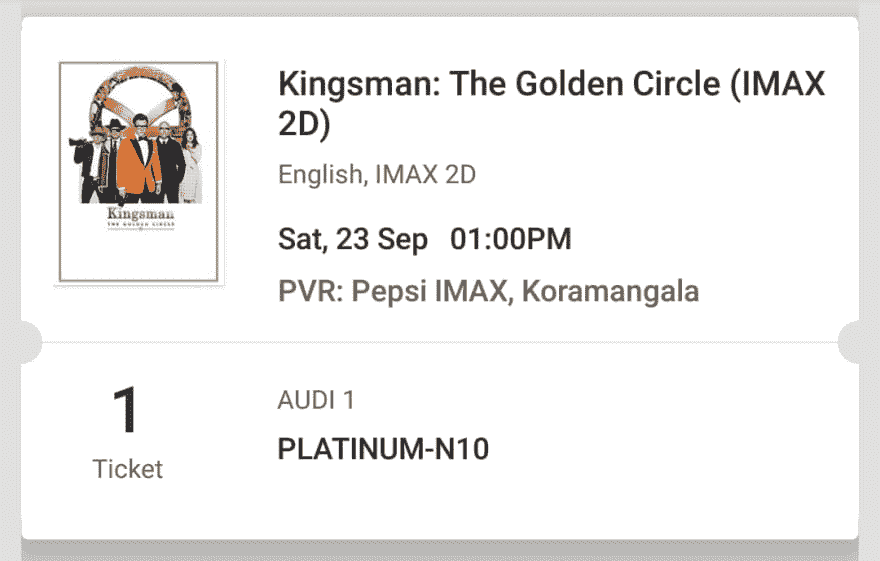
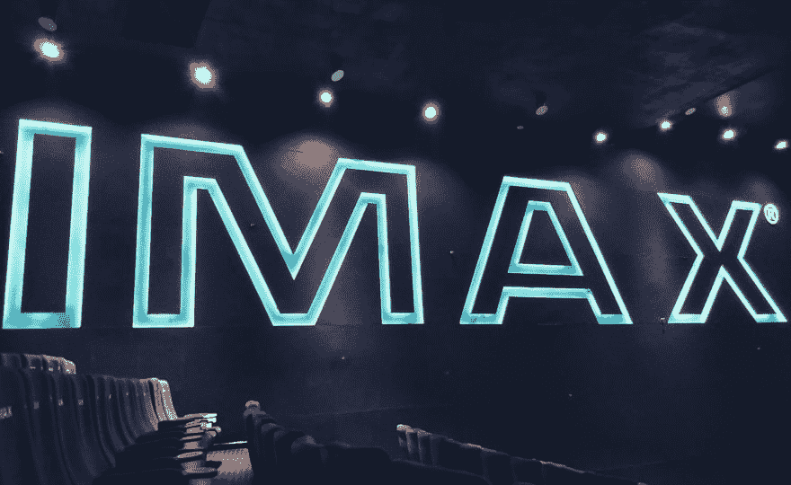
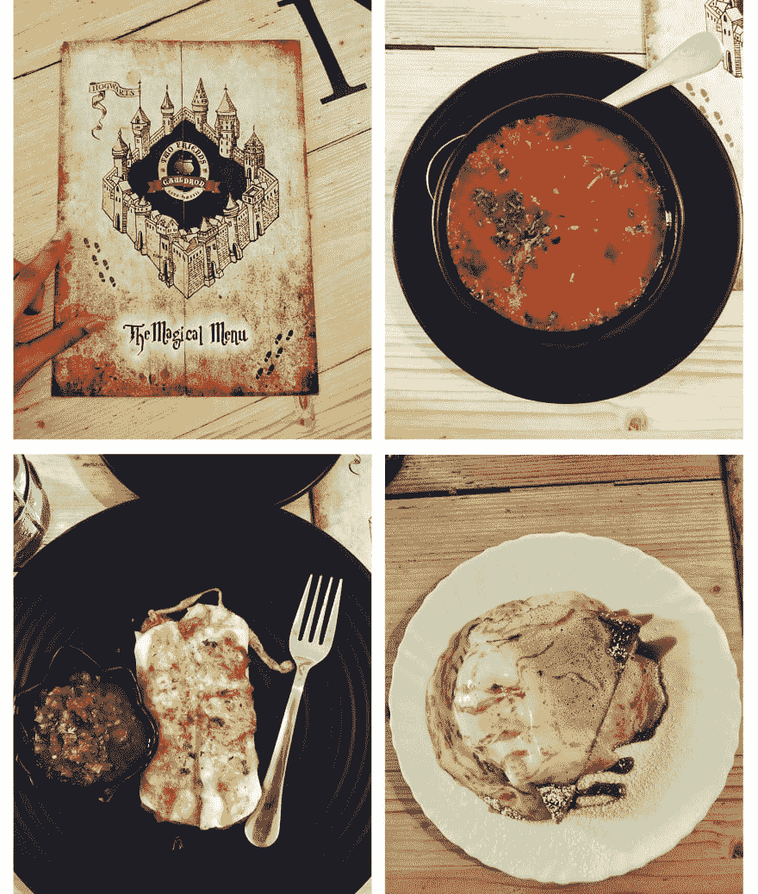
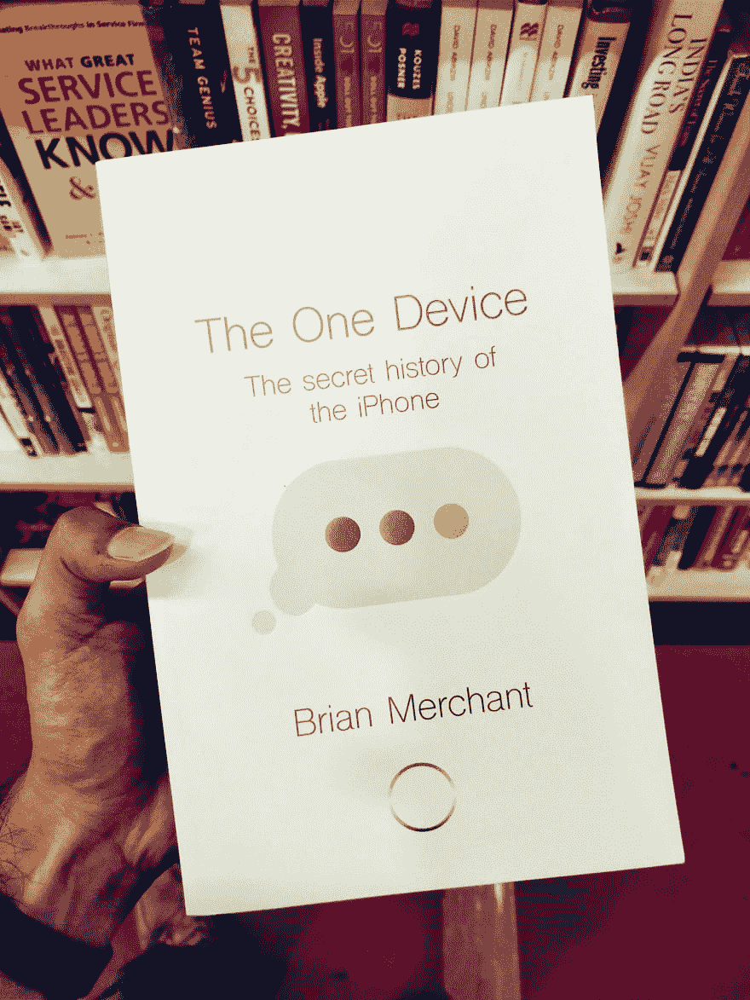
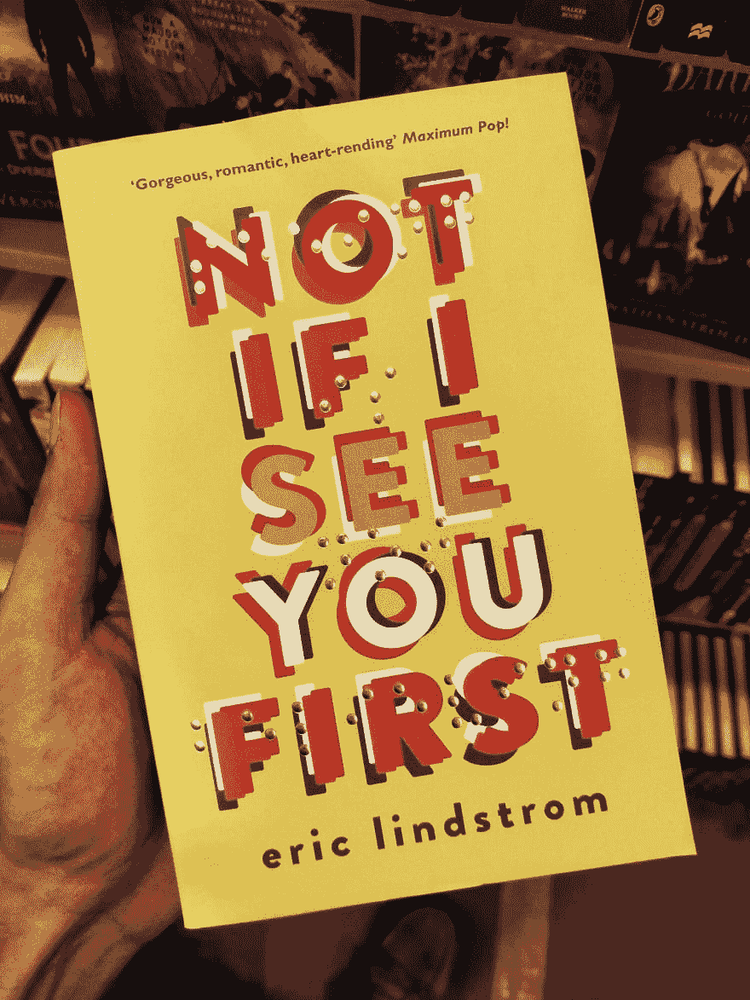
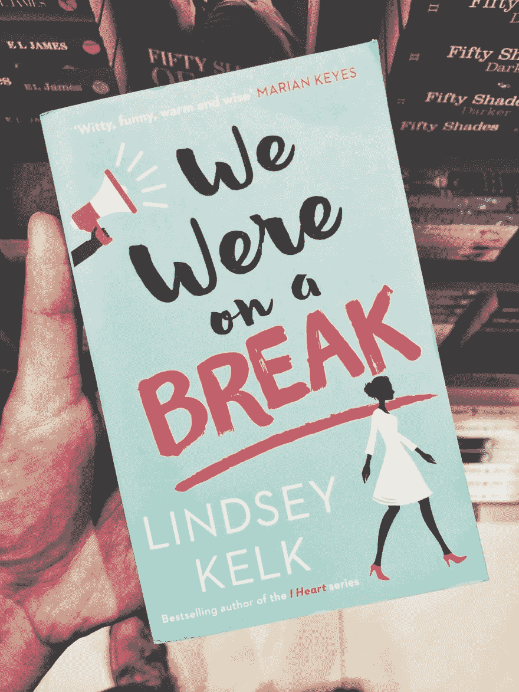
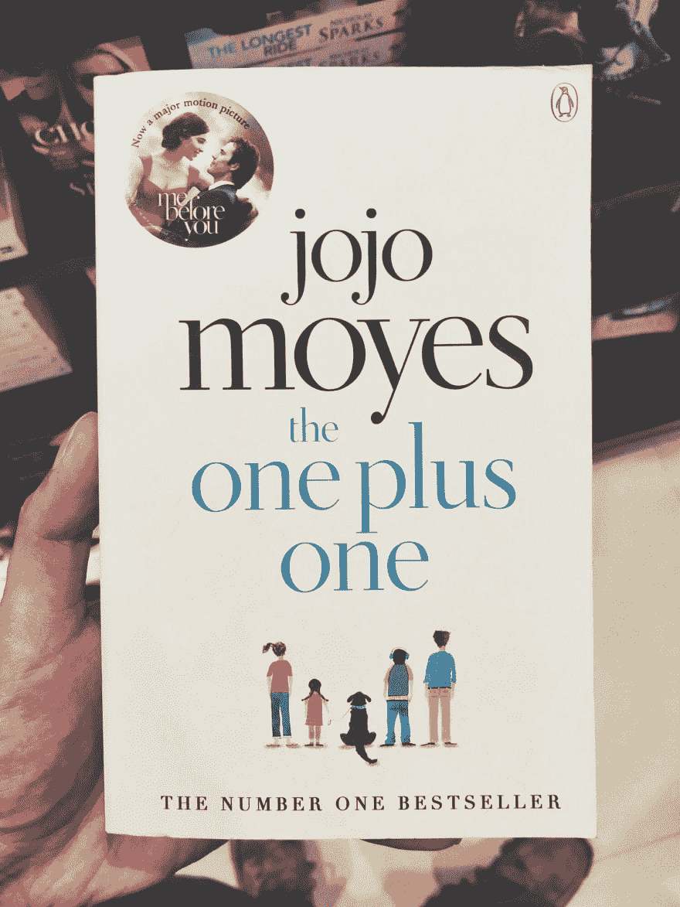
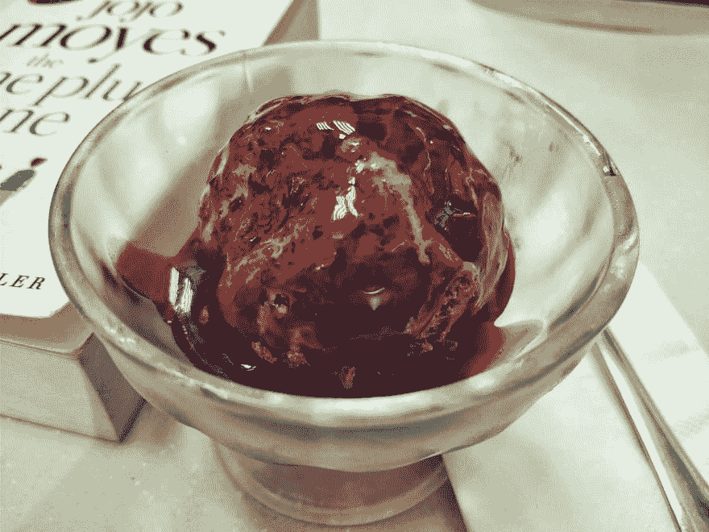

# 24 小时不在线是什么感觉

> 原文：<https://dev.to/rahulchowdhury/what-24-hours-of-not-being-online-really-feels-like-3m99>

我是那种真正生活在网上的人。如果你翻阅我的脸书股票，你会发现你可以在这些股票中藏起一具尸体，没有人会发现它。

由于我的笔记本电脑和手机一直连接着互联网，我经常会分心。

我收到一个通知，然后马上打开它。猜猜看，我有很多 FOMO。

不管怎样，我看到了很多关于人们如何体验与社交媒体聊天脱节的时间的文章，于是我决定体验一下自己的经历。

在放下这个想法几个月之后，主要是因为害怕在我没有连接的情况下错过一些重要的东西，我终于不再在乎我可能会错过什么，无论如何都要试一试。

这可能不是一个完美的一天，但我有我的乐趣和和平的份额。在这个过程中，我学到了一些东西，今天我将与大家分享。

# 设定地面规则

我知道在开始我的小冒险之前，我必须制定一些规则。

这一天外出的主要目的是将我的注意力从互联网上转移，享受我周围的其他小事和我想做的事情。

为了做到这一点，我不能与任何突然出现在我手机里诱惑我打开它的通知互动。不要看新闻。WhatsApp 上没有消息。

不要看新闻。WhatsApp 上没有消息。

我不想完全关掉互联网，因为我需要它来做一些基本的事情，比如叫出租车和导航。

这里的目标是不参与任何来自互联网的干扰。我有权把它作为一种工具来使用。

我的原则最终归结为:

1.  仅将互联网用于导航、搜索地点和呼叫优步。
2.  轻装旅行。只有一部手机和一副耳机。
3.  不参与任何社交媒体通知，也不与任何人在线聊天。
4.  玩得开心。

计划怎么样了？

坦率地说，对于如何度过这一天，我没有任何计划。

我没有时间计划任何事情。当这一天到来时，我只是决定即兴去。

# 当这一天到来的时候

那天早上 11 点左右我醒了。我知道你可能会想，到那时，这一天几乎浪费了一半。

我只是不想仓促行事，而是想慢慢来。

完全不知道接下来会发生什么，我开始在房间里走来走去，想出一些东西(*有点像夏洛克·福尔摩斯*)。

你可能会说这是运气的问题，金士曼:《黄金圈》正在我附近的剧院上演。作为一个 Kingsman 的粉丝，用一些行动(*和风格*)开始我的一天是很有意义的。

我给自己买了一张票，去最近的 IMAX 电影院看下午 1 点的电影。

我的演出票。

我有整整一个半小时的时间来准备和到达目的地，我知道我必须尽快把事情弄好。

冥想是我每天早上通常做的第一件事。我从看电影的时间里抽出 10 分钟，坐下来享受我的正念。

一开始很放松，但后来我的手机开始疯狂地嗡嗡作响。我忽略了最初的几个铃声，但它一直在嗡嗡作响。

我想要么是我的房子着火了，我太专注了，没有注意到这种分心，要么是我的父母认为我被绑架了，因为我没有收到他们的电话。

尽管如此，我还是放下了正念，睁开眼睛去看发生了什么。

结果不是那样的。我把手机调成静音模式。

已经晚了，而且中途失去了流畅感，我决定放弃冥想，开始下一个任务。

不是一个完美的开始。话说回来，这仅仅是个开始。它不必是完美的。

起初，我开始匆忙完成每一项任务，就像屁股着火了一样。然后我很快意识到事情不应该是这样的。

没有必要着急。如果我晚一点到达电影院，最糟糕的事情会是什么？

我会错过开头。

大不了。一旦电影上线，我随时都可以看。

这消除了压力和焦虑的感觉。

你看，接受最坏的情况并接受它可以让你省去很多烦恼，让你的一天变得更好。

我从戴尔·卡耐基的书、[中了解到如何停止担忧并开始生活](http://amzn.to/2k8SOVJ)。如果你还没有读过，现在就去拿一本。你会为此感谢我的。

有趣的是，我仍然设法准时到达剧院。我没有做任何事情去赶去剧院。然而，我还是按时到达了那里(*我猜我的运气没有任何问题*)。

还有呢？

我甚至有时间给这个地方拍了几张照片。发光的 IMAX 标志每次看起来都很棒。

IMAX 标志的辉煌。

> 当你心平气和时，好事就会发生。

# 一波三折

从我醒来的那一刻起，我就被一卡车无法抗拒的通知所包围。我知道很难忽视他们，事实也的确如此。

虽然我平静地欣赏了这部电影(*顺便说一句*)，但当我从牛仔裤里拿出手机准备打车时，我就被通知轰炸了。

我很想打开这些通知，尤其是当我看到:

"推特- *3 个新互动*"

"脸书- *X 评论了你的照片*"

"脸书- *你喜欢你的帖子*"

" Gmail - *10 封未读邮件*"

诸如此类。

我几乎屈服于诱惑，但我有我的规则。

我一天中的大部分时间都在努力在看通知之前刷出通知，以抵制任何进一步的诱惑。

这是最大的恐惧，让我几个月都没有做这个短暂的实验。然而，我已经设法处理这个。

成就，*解锁*。

这种成就感带来了巨大的喜悦和满足。我知道我在控制我正在做的事情，而不是一些古怪的装置让我随波逐流。

没有任何东西会爬进我的脑海，分散我的注意力，破坏我的一天。

> 你完全控制了自己的思想。据此行动。

# 神奇的遭遇

没有计划的一天最大的好处就是惊喜。

我住在美丽的城市班加罗尔。离我住的地方大约 6 公里，有一家我一直想去的哈利波特主题餐厅。

不幸的是，被很多不喜欢附近有哈利波特主题餐厅的朋友拒绝了，我再也没有去过那个地方。那是直到现在。

在找吃午饭的地方时，我想到了那家餐馆。这次我肯定不会错过这个机会。

我打车直奔班加罗尔 JP Nagar 的两个朋友的大锅。

我不会说这是一个非常棒的地方，但这个地方相当不错，主题也很朴素。

整个地方装饰着扫帚柄、摄魂怪、巫师袍、魔药等等。甚至菜单看起来都像活点地图。

被这些选项弄糊涂了，我命令道:

*   巫师汤
*   霍格沃茨热卷
*   糖浆馅饼

从左开始(顺时针):菜单，巫师汤，糖浆馅饼和霍格沃茨热面包卷

你看，一个人在没有任何计划的情况下出去玩一天是很有趣的。

我很久以前就想参观这个地方，但一直没有去，因为发生了一些事情，计划改变了。此外，我敢肯定，如果我计划了我的一天，这个地方是我最不可能想到的。

我会在一家意大利餐馆里大口吃着千层面。

惊奇的元素- *还记得吗？*

你自己试试吧。我相信你会喜欢的，这将是一次惊险之旅。

无论如何，满足了我的身体和神奇的食欲，我走出了寻找下一件事要做的地方。或者说，思考下一步去哪里。

> 有时候没有计划就是计划。

# 回归基础

还记得以前我们去真正的书店挑选一些精彩的东西来读吗？那是在互联网和 Kindle 接管之前。

我也怀念那些日子。

幸运的是，餐馆附近有一家书店，进去看看书似乎是个好主意。老派的方式。

在寻找有趣的读物时，我偶然发现了一些吸引眼球的书名。

像这样:

还有这个:

通常，我读的大多是自助、商业和个人成长方面的书，但从实体店买这些书意味着要损失很多钱，因为我可以从亚马逊以更低的价格买到同样的书。

因此，我开始寻找一本有趣的故事书来吸引我的注意力。

遗憾的是，我在那里找不到任何有趣的东西。无意冒犯填字游戏，我只是有点挑剔。

我还没准备好放弃。我想买一本书。

我拿出手机，找了另一家书店，然后直奔那里。

我直接降落在[地标](https://en.wikipedia.org/wiki/Landmark_Bookstores)上。

这个要大得多。他们有大量的收藏品。

有趣的是，我在那里也发现了一些有趣的标题。

我打赌这是罗斯最喜欢的书:

有趣的事实:

如今，每当我去书店，我通常会拿出我的手机，将有价值的书籍添加到我的亚马逊愿望清单中，然后以比书店更便宜的价格订购它们(*记住这个节省技巧*)。

我也打算在这里做同样的事。然后我想起了一件事。

我不被允许使用互联网从事这类活动。

而我没有。我不得不从商店里挑选一本书，然后在那里买。我不要亚马逊。

在这个地区转了 2 - 3 圈后，我终于拿起了乔乔·莫伊斯的这本书:

这看起来像是一本短小精悍的读物。

腋下夹着我的新书，我准备收工，回家开始读这本书。

就在那时，我看到了一些东西。

> 如果旧的记忆让你快乐，重温它们。

# 纽约的味道

在我的正前方有一家[阿根-达斯](https://en.wikipedia.org/wiki/H%C3%A4agen-Dazs)店。

作为一个健身狂，我通常不吃含糖的东西。话说回来，这是我的一天。有一天不会打破我的系统，我对自己说。

我去那里点了我最喜欢的:

比利时巧克力配覆盆子酱。

过了这么多月，享受令人垂涎的美食的感觉真好。

黑比利时巧克力的苦味与覆盆子巧克力的浓郁甜味相得益彰，点燃了我的味蕾，就像 7 月 4 日一样。

这让我觉得，虽然严格的饮食对你有好处，而且当你的目标是达到最佳健身状态时，严格的饮食是绝对必要的，但一些宽松的日子不会伤害你。

事实上，它可以帮助你更长时间地坚持你的计划，防止你厌倦常规。

如果你在严格节食，那么过几天放开它，尽情享受你喜欢的东西也没关系。

对自己宽容点。你不必一直表现得很强硬。

> 你不是机器，不要对自己太苛刻，拿出一些给自己，把事情放松一下。

# 回国

吃完冰淇淋，我收工了，拿起一杯红牛，回家了。

在经历了巨大的工作压力、被蚊子亲吻(*读登革热*)之后，在这个过程中减掉了 6 公斤的瘦肉，这正是我需要放松并回到正轨的。

一整天都是我自己的小小冒险。这是令人宽慰的。太棒了。

回到家，我躺在床上，开始读我拿起的书。

因为一切都是计划外的和未知的，我决定也为晚餐增添一些趣味。

猜猜我做了什么？

甜辣姜蒜鸡！

我知道这是一个很长的名字，但它尝起来棒极了。我的单子上又多了一个食谱。

虽然这一天可能并不完美，但我希望有更多这样的日子。至少，一个月左右一次。

我感到快乐。

> 抽出时间和自己交流真的很重要。

# 吸取教训

虽然这一整天都很愉快，但我也学到了一些东西。

### 1。你是自己生活的主人

除了你自己之外，没有人或任何东西能掌控你。无论某样东西看起来多么难以割舍，只要你愿意，你都可以把它从你的生活中切断。

就像我忍住了不时查看通知的诱惑。已经开始了。

### 2。没有计划可能很性感

遵循同样的常规，几个月来的每一天都会很无聊。度过完全没有计划的一天来增加情趣。

你会喜欢的。

### 3。小事很重要

像你想去的地方，你想吃的食物，你想结识的一些朋友或者你想买的一些东西这样的小事对你保持正轨很重要。

奖励自己，时不时休息一下，享受生活中的这些小事。

### 4。不要对自己太苛刻

遵循严格的常规，过有纪律的生活是好的，但是保持同样的常规太久会导致倦怠。

经常放松自己，确保你永远不会遇到那场灾难。享受一些没有常规或限制的时间。

想做什么就做什么。想吃什么就吃什么。

### 5。给自己留点时间

我们每个人都是相互联系和忙碌的。你不想错过任何重要的好东西。

然而，切断网上的一切，过一段短暂的不联系的生活，可以帮助你更好地了解自己，通过让你的心灵平静下来给自己充电。

# 你需要做什么

我希望我能早点这样做，而不是拖上几个月。你不必犯同样的错误。

现在开始。

你需要做的是:

1.  离开工作和社交媒体一天。
2.  利用这一天在你的城市里漫游，或者去一个宁静的地方。
3.  随身携带手机，以便在紧急情况下保持联系，但要将其设置为免打扰或静音模式。
4.  将互联网的使用限制在导航或交通等基本需求上。
5.  做那些你已经拖延了一段时间的事情。

开始永远不会太晚。

尝试一天不与互联网世界联系。你会想要更多。

我确定。

你怎么想呢?🤔