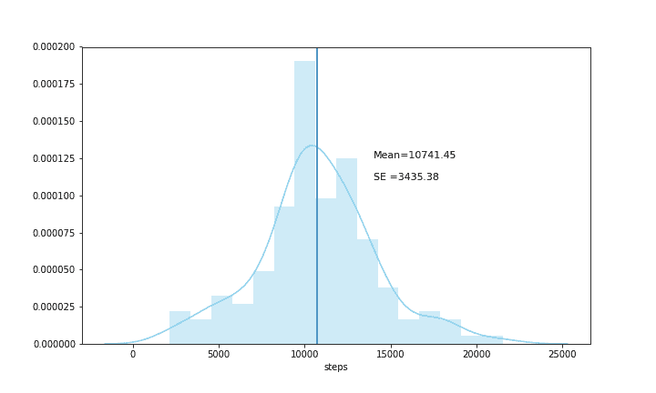
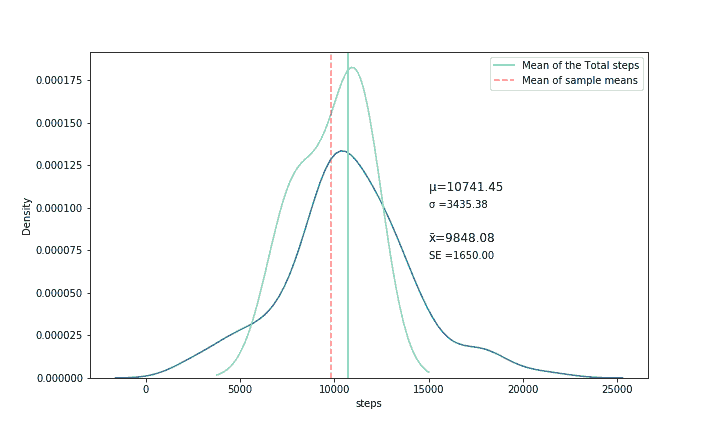
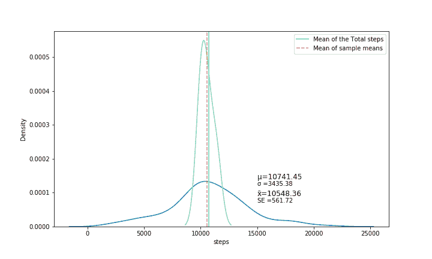
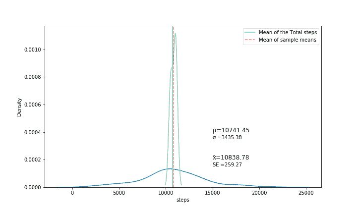

# 使用中心极限定理可视化期望步数分布

> 原文：<https://dev.to/saral/visualizing-desired-steps-distribution-using-the-central-limit-theorem-7pn>

### 可视化期望步数分布——利用中心极限定理

上周，当我查看我的步骤数据时，我注意到这些数据非常分散。

[](https://res.cloudinary.com/practicaldev/image/fetch/s--0cOueGss--/c_limit%2Cf_auto%2Cfl_progressive%2Cq_auto%2Cw_880/https://cdn-images-1.medium.com/max/720/1%2A2rs7cCgwxUaJafd79s0uAw.png) 

<figcaption>显示在步骤中传播的数据</figcaption>

虽然我对我一天跑的平均步数感到相对满意，但数据太分散了——即标准差(**【σ】**为 3435.38。这表明 68%的步数数据在 7305.65 和 14177.25 步之间。我甚至有几天的总步数远低于 5000，因此我想让我的数据模拟一个标准差较低的分布，这意味着步数数据不会像现在这样分散。

根据中心极限定理的建议，我决定从 steps 数据集中抽取 5 个(N = 5)独立的随机样本。首先，我将重复这个过程 5 次(iter = 5)，因此给我 5 个数据集，每个集中有 5 个独立的随机样本。接下来，我会找出每 5 个独立随机数据集的平均值，最后，我会找出平均值。然后，我将同样的实验再运行两次，但是这次将随机样本增加到 20 个(N = 20)，然后增加到 100 个(N = 100)

**定义功能**

```
def random_steps_array(name_of_array, n , iterations):
    for i in range(iterations): 
        name_of_array.append(df.steps.sample(n, random_state = i,   
                              replace = True))

def sample_means(name_of_array, sample_mean):
    for i in range(len(name_of_array)):     
        sample_mean.append(name_of_array[i].mean()) 
```

***random _ steps _ array***函数将处理随机采样和迭代， ***sample_means*** 数组将取随机样本的平均值。

#### **试验 5 次迭代，其中 N = 5，20，100**

i. **在 N = 5 时**

```
array_5 = []
mean_array\_5 = []
random_steps_array(array_5, 5, 5)
sample_means(array_5, mean_array_5 ) 
```

5 个独立随机变量的随机样本存储在 **array_5** 中，随机变量的平均值存储在 **mean_array_5** 中

[](https://res.cloudinary.com/practicaldev/image/fetch/s--3R0OCUZ7--/c_limit%2Cf_auto%2Cfl_progressive%2Cq_auto%2Cw_880/https://cdn-images-1.medium.com/max/720/1%2A6G3960FUY7dFPXB861IcIg.png) 

<figcaption>样本分布的样本是指在 N=5 时的</figcaption>

只有 5 个独立随机样本的 5 次迭代，样本平均值与实际平均值 10741.45 相差甚远。然而，这个分布现在不那么分散了，平均值的标准误差是 1650。

二。**在 N = 20 时**

当我对 5 个元素的随机样本大小运行 20 次迭代时，样本平均值更接近实际平均值。

[](https://res.cloudinary.com/practicaldev/image/fetch/s--IsKBLe_n--/c_limit%2Cf_auto%2Cfl_progressive%2Cq_auto%2Cw_880/https://cdn-images-1.medium.com/max/720/1%2AZK_7_E7RtmrDG5WMpAIB6g.png) 

<figcaption>样本分布的样本是指在 N=20 时的</figcaption>

当迭代次数增加时，我已经有了一个更大的随机样本集。因此，我的平均值越来越接近我的实际平均值，平均值的标准误差(SE)下降到 561.72。理想情况下，这是我想要的数据集的可视化，其中数据不是非常分散。

**三世。在 N = 100 时**

最后，在 N = 100 时，该图甚至更不分散，平均值的标准误差(SE)为 259.27。

[](https://res.cloudinary.com/practicaldev/image/fetch/s--vHhWenKZ--/c_limit%2Cf_auto%2Cfl_progressive%2Cq_auto%2Cw_880/https://cdn-images-1.medium.com/max/720/1%2AdxU7dRsEBpB9X2o4HfB80w.png) 

<figcaption>样本分布样本是指在 N=100 时的</figcaption>

该分布几乎类似于数据集在 20 次迭代时的分布，但样本平均值(10838.78)更接近实际平均值 10741.45。

通过下面的实验，我能够看到我想要的图形，也获得了一些关于中心极限定理的知识。