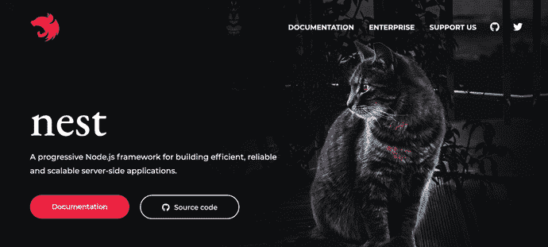

# NestJS——轻松开发全栈类型脚本 web 应用程序的缺失部分

> 原文：<https://dev.to/mokkapps/nestjs-the-missing-piece-to-easily-develop-full-stack-typescript-web-applications-34ga>

我想我们都知道这个问题:你需要开发一个新的 web 应用程序，因此你需要在后端和前端实现应用程序的核心。这两者都很耗时，而且如果在开始时选择了错误的架构决策，随着时间的推移很难维护。

此外，项目通常由一个小的核心团队开始。因此，团队提供一个可靠的架构并能够在时间和预算范围内提供一个好的第一个原型是很重要的。因此，我认为从全栈类型脚本方法开始是有意义的，在前端使用 [Angular](https://angular.io) ，在后端使用 [NestJS](https://nestjs.com/) 。

在本文中，我将向您介绍 NestJS(在本文中从现在开始称为 Nest ),以及为什么我认为这样一个全栈 TypeScript web 应用程序可能是 web 应用程序的一个很好的技术栈选择。

## 为什么要在后端使用 TypeScript？

在我看来，这只有在以下情况下才有意义:

1.  你有一个小的核心团队，他们有很好的类型脚本知识，这个技术栈可以满足你的项目现在和未来的需求。
2.  在一个有多个微服务的项目中，您有一个特定的微服务，专门作为前端的后端，由前端团队维护。

如果你有一个现有的高效的后端团队，并且对他们的技术栈感到满意，至少在我看来，没有必要在后端使用 web 技术。但是至少要公开讨论，也许这也适合你的项目。

## 什么是窝？

[](///static/1e839f74190096e66864d4b274410b5c/20598/nest-js-website.png)

网站上的官方描述是:

> Nest 是一个用于构建高效、可伸缩的 Node.js 服务器端应用程序的框架。它使用渐进式 JavaScript，由 TypeScript 构建并完全支持 TypeScript(仍然允许开发人员用纯 JavaScript 编写代码)，并结合了 OOP(面向对象编程)、FP(函数式编程)和 FRP(函数式反应编程)的元素。
> 
> 在幕后，Nest 使用了健壮的 HTTP 服务器框架，如 Express(默认)和 Fastify。Nest 在这些框架之上提供了一个抽象层次，但也可以直接向开发人员公开它们的 API。这使得可以方便地使用各种平台上的第三方模块。

因此，基本上它使用众所周知的现有框架，如 Node.js 和 Express，并作为上面的一层。但是为什么现在这变得如此特别呢？

在我看来，它如此辉煌是由于这些事实:

*   它完全是用 TypeScript 编写的，您也可以用 TypeScript 实现开箱即用的应用程序
*   提供开箱即用的应用程序架构深受 Angular 的启发

但即使它的灵感来自 Angular，Nest 也是一个独立的项目，完全独立于 Angular 项目本身。您可以构建一个与前端无关的 API，它可以与 React、Vue.js 等其他框架和库一起使用。

### 打字稿

[](///static/8f883064d4036fd993bfb1253b20d2c0/8b984/typescript.png)

嵌套应用程序用 [TypeScript](%5Bhttps://www.typescriptlang.org/%5D(https://www.typescriptlang.org/)) 编写，但是你也可以选择用 JavaScript 编写(我不推荐)。TypeScript 是 JavaScript 的超集，提供了 JavaScript 的灵活性和类型化语言的安全性和健壮性。

TypeScript 被编译成 JavaScript，因此编译器已经可以在编译期间捕获可能的运行时错误。这种语言自称为“可伸缩的 JavaScript that 也想提供一个可伸缩的后端架构，所以我认为这是一个不错的选择。

此外，我强烈建议您在当前使用的前端框架中使用 TypeScript。Angular 提供了现成的 TypeScript，但是您当然也可以在其他流行的框架中使用它，比如 React 或 Vue。

这样你的前端和后端代码就有了一个共同的语言，你甚至可以共享你的类型定义。这种方法极大地减少了由从一种语言到另一种语言的上下文切换所造成的效率损失，并且它可以总体上提高您的团队绩效。

### 巢穴架构

[](///static/bf0eee149b86a3bf1d385b65b32f361e/9435c/nest-modules.png)

如前所述，Nest 的建筑深受 Angular 的启发。

通常，服务器端 JavaScript 框架更注重灵活性，而不是为代码提供可伸缩的架构。通常情况下，您需要自己投入时间，以一种清晰的方式安排代码，并为其定义准则。

Nest 提供了一个很好的开箱即用架构，我们现在将对其进行更详细的分析。基本上，它由模块、控制器和服务组成。

#### 文件结构

嵌套项目与角度项目具有相似的文件结构:

```
.
|-- app.controller.spec.ts
|-- app.controller.ts
|-- app.module.ts
|-- app.service.ts
|-- main.ts
|-- news
    |-- news.controller.spec.ts
    |-- news.controller.ts
    |-- news.module.ts
    |-- news.service.spec.ts
    |-- news.service.ts 
```

Enter fullscreen mode Exit fullscreen mode

#### 依赖注入

嵌套是围绕设计模式依赖注入有角度地构建的。你可以在官方角度文档中找到一篇关于这种模式的很好的文章。

让我们看一个简单的例子:

如果我们需要另一个类的实例，我们只需要在构造函数中定义它:

```
constructor(private readonly newsService: NewsService) {} 
```

Enter fullscreen mode Exit fullscreen mode

Nest 将创建并解析一个`NewsService`的实例。在单例的正常情况下，如果已经被请求，它将返回现有的实例。每个可以注入的类都需要声明`@Injectable`注释，这一点您可以在后面的服务部分看到。

#### 模块

模块是每个嵌套应用程序的基本构建块，它将服务和控制器等相关功能组合在一起。如果您创建了一个新的嵌套应用程序，那么`AppModule`将自动可用。

理论上，您可以在一个模块中编写整个应用程序，但在大多数情况下，这不是正确的方法。建议将您的每个特征分组到一个模块中，例如一个`NewsModule`和一个`UserModule`。

一个简单的模块例子:

```
@Module({
  controllers: [NewsController],
  providers: [NewsService],
})
export class NewsModule {} 
```

Enter fullscreen mode Exit fullscreen mode

Angular 使用相同的模块概念，你甚至可以在代码中用相同的方式定义它们。

#### 控制器

在 Nest 中，你可以使用注释来定义你的控制器，就像在像 [Spring Boot](%5Bhttps://spring.io/%5D(https://spring.io/)) 这样的框架中一样。控制器负责处理传入的请求并将响应返回给客户端。

您用所需的`@Controller`装饰器来装饰您的控制器类，您可以传递一个路径作为这个控制器的主要路径。控制器类中的每个方法都可以用常见的装饰器来注释，比如`@Get`、`@Post`、`@Put`和`@Delete`。

```
@Controller('news')
export class NewsController {
  @Get()
  findAll(): string {
    return 'This action returns all news';
  }
} 
```

Enter fullscreen mode Exit fullscreen mode

由于我们没有向`findAll`方法的`@Get`装饰器添加路径信息，Nest 将把`GET /cats`请求映射到这个处理程序。

#### 服务

在 Nest 中使用服务来保持您的控制器精简并封装逻辑。

```
@Injectable()
export class NewsService {
  private readonly news: News[] = [{ title: 'My first news' }];

  create(news: News) {
    this.news.push(news);
  }

  findAll(): News[] {
    return this.news;
  }
} 
```

Enter fullscreen mode Exit fullscreen mode

现在我们可以在我们的控制器中使用这个服务:

```
@Controller('news')
export class NewsController {
  constructor(private readonly newsService: NewsService) {}

  @Get()
  async findAll(): Promise<News[]> {
    return this.newsService.findAll();
  }
} 
```

Enter fullscreen mode Exit fullscreen mode

### 测试

[](https://res.cloudinary.com/practicaldev/image/fetch/s--7V-b8Axm--/c_limit%2Cf_auto%2Cfl_progressive%2Cq_auto%2Cw_880/https://turnoff.us/image/en/test.png)

Nest 为我们提供了单元、集成和端到端测试的设置。

#### 单元测试

Jest 在 Nest 中被用作单元测试框架。如果你也在前端使用相同的测试框架，这将会非常有益，并提高你的团队绩效。

我们的新闻服务的简单单元测试:

```
describe('NewsService', () => {
  let service: NewsService;

  beforeEach(async () => {
    const module: TestingModule = await Test.createTestingModule({
      providers: [NewsService],
    }).compile();

    service = module.get<NewsService>(NewsService);
  });

  it('should be defined', () => {
    expect(service).toBeDefined();
  });

  it('should return first news article', () => {
    expect(service.findAll()).toEqual([{ title: 'My first news' }]);
  });
}); 
```

Enter fullscreen mode Exit fullscreen mode

由于依赖注入，模仿服务也很容易，例如在你的控制器测试中:

```
describe('News Controller', () => {
  let controller: NewsController;

  const testNews = {
    title: 'Test News',
  };

  class NewsServiceMock {
    public findAll() {
      return [testNews];
    }
  }

  beforeEach(async () => {
    const module: TestingModule = await Test.createTestingModule({
      controllers: [NewsController],
      providers: [{ provide: NewsService, useClass: NewsServiceMock }],
    }).compile();

    controller = module.get<NewsController>(NewsController);
  });

  it('should be defined', () => {
    expect(controller).toBeDefined();
  });

  it('should get news', () => {
    expect(controller.findAll()).toEqual([testNews]);
  });
}); 
```

Enter fullscreen mode Exit fullscreen mode

#### 端到端测试

使用端到端测试，您可以测试 API 的整个功能，而不仅仅是一个特定的功能。

Nest 使用 [Supertest](%5Bhttps://www.npmjs.com/package/supertest%5D(https://www.npmjs.com/package/supertest)) 来模拟 HTTP 请求:

```
describe('News Controller (e2e)', () => {
  let app;

  beforeEach(async () => {
    const module: TestingModule = await Test.createTestingModule({
      imports: [NewsModule],
    }).compile();

    app = module.createNestApplication();
    await app.init();
  });

  it('/ (GET)', () => {
    return request(app.getHttpServer())
      .get('/news')
      .expect(200)
      .expect([{ title: 'My first news' }]);
  });
}); 
```

Enter fullscreen mode Exit fullscreen mode

## 昂首阔步

如果你开发一个公共 API，你可能需要使用 [OpenAPI](%5Bhttps://swagger.io/specification/%5D(https://swagger.io/specification/)) (Swagger)规范来描述 RESTful APIs。Nest 提供了一个模块来集成它。

我们只需要安装 swagger 包(`@nestjs/swagger`)并添加几行到我们的 main.ts.

```
async function bootstrap() {
  const app = await NestFactory.create(AppModule);

  const options = new DocumentBuilder()
    .setTitle('News example')
    .setDescription('The news API description')
    .setVersion('1.0')
    .addTag('news')
    .build();
  const document = SwaggerModule.createDocument(app, options);
  SwaggerModule.setup('api', app, document);

  await app.listen(3000);
}
bootstrap(); 
```

Enter fullscreen mode Exit fullscreen mode

在我们的 main.ts 中，我们指定 API 文档在`/api`下可用。因此，如果我们打开一个浏览器并导航到[http://localhost:3000/api](http://localhost:3000/api)，我们会得到下面的 API 文档。

[](///static/5eb49c875dc3e50d2df37a303216ebca/8b984/swagger.png)

## 入门

我可以强烈推荐[官方 Nest 文档](%5Bhttps://docs.nestjs.com/%5D(https://docs.nestjs.com/r))作为起点。

Nest 提供了 Nest CLI，这是一个非常好的命令行界面工具，可以帮助您初始化和开发应用程序。通过 [Angular CLI](%5Bhttps://github.com/angular/angular-cli%5D(https://github.com/angular/angular-cli)) ，您可以搭建新项目或添加新服务、组件等。

基本上，您只需要这三个命令就可以让基本项目在本地运行于[http://localhost:3000/](http://localhost:3000/):

```
$ npm i -g @nestjs/cli
$ nest new project-name
$ npm run start 
```

Enter fullscreen mode Exit fullscreen mode

## 未来之巢

Nest 目前在 GitHub 上有超过 14k 的明星，在 T2 NPM 上有超过 100k 的周下载量。它已经被[许多公司用于生产](%5Bhttps://docs.nestjs.com/discover/companies%5D(https://docs.nestjs.com/discover/companies))，阿迪达斯是最大的用户。

由于使用了 TypeScript 以及与 Angular 的关系，Nest 作为服务器端 JavaScript 框架是独一无二的，但是它缺少大型企业的支持。这只是一个小问题，但是如果你为你的技术堆栈选择一个框架的话，就应该考虑到这一点。

## 结论

在我看来，Nest 非常适合全栈 Typescript web 应用技术栈，尤其是如果你在前端选择 Angular 的话。

Nest 中的文件夹结构和设计模式在很大程度上基于 Angular。由于这种简单和相似的结构，我们作为开发人员可以更专注于端点的设计，而不是浪费时间构建应用程序。Nest 在注释、结构和模式后面隐藏了许多讨厌的 Node.js 和丑陋的 JavaScript。多亏了 TypeScript 作为后端语言，从前端到后端代码变得不那么痛苦，也没有更少的上下文切换。