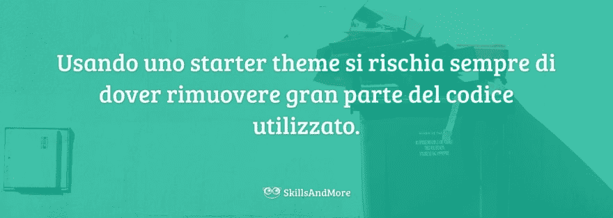
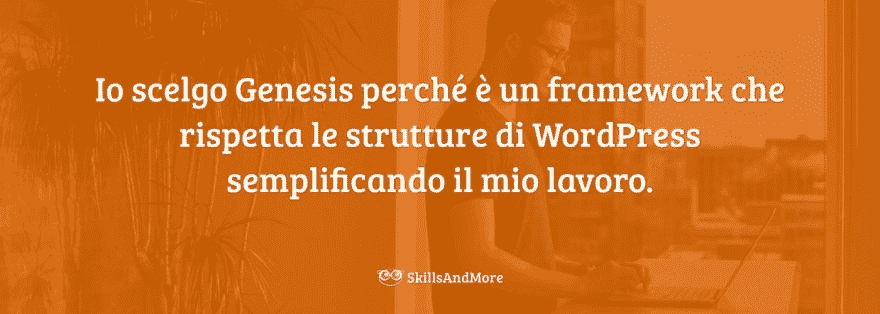
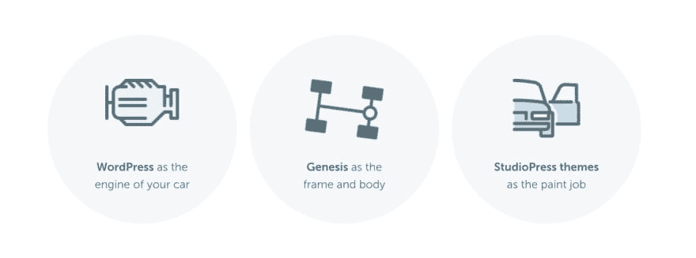
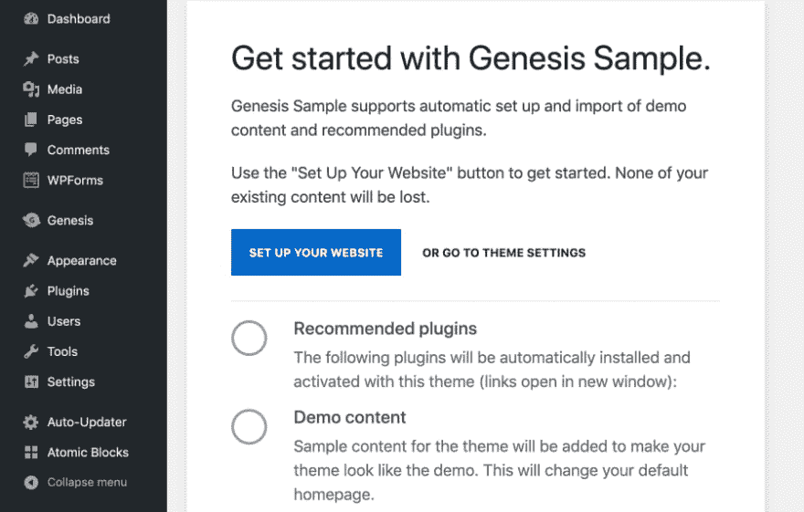
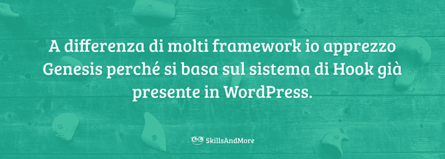

# 你为什么要考虑创世纪

> [https://dev . to/andreabarghogiani/为什么-你应该考虑-genesis-2dmh](https://dev.to/andreabarghigiani/perche-dovresti-prendere-in-considerazione-genesis-2dmh)

你用 WordPress 开发了好几年，在主题创作中你一直选择`_s`作为主题启动器吗？也许这不是最好的选择…

以入门级的主题开始自己的[专题开发工作，肯定是明智的举措，尤其是在我们正朝着不完全掌握的平台迈出第一步的时候。](https://skillsandmore.org/starter-theme-wordpress/)

最后，您可以使用 starter theme(入门主题)深入了解 WordPress 主题是如何创建的。

我们花了很多时间研究所有代码、功能和逻辑

去掉一半，因为我们的项目很简单！

就我个人而言，我发现自己多次(也许太多次)处于这种状态。

多年来，我也有过“T0”用不同的起首主题的坏主意，尽管每次都找到了刚才描述的好处，结局总是一样的。

我不得不删除我不使用的代码！

这是因为，像 themeforest 上的多用途主题一样，一个入门主题**必须帮助开发者快速创建一个新主题**。

问题是，由于不知道开发人员应该做些什么，主题启动器处于一个不方便的位置，尽可能多地将最有见解的东西放在一边:比如 CSS！

[WordPress 的启动主题对于加快我们的工作非常有用，可惜在 90%的情况下我们不得不删除所有未使用的代码，CSS 实际上是不存在的。点击 Twitter](https://twitter.com/share?text=Gli+%23startertheme+di+%23WordPress+sono+incredibilmente+utili+per+velocizzare+il+nostro+lavoro%2C+peccato+che+nel+90%25+dei+casi+dobbiamo+rimuovere+tutto+il+codice+che+non+viene+utilizzato+e+i+%23CSS+sono+praticamente+inesistenti.&via=skillandmore&url=https://skillsandmore.org/genesis-scelta-framework/?utm_source=twitter&utm_medium=Social&utm_campaign=SocialWarfare)

可惜 CSS，至少在我看来，**是开发者可能有的最重要的帮助之一**！

但是，让我们来总结一下我的这个小小的因为我一点也不抱怨，迄今为止你读的所有东西都用来描述我是如何得出结论的*。*

 *注意，存在附属链接。

我想我应该告诉你指向 StudioPress 或 Genesis 框架的链接是附属链接。你什么都不会改变，而我会做一些欧元如果你决定买。

如果你不喜欢，你可以随时复制/粘贴以下链接:`https://www.studiopress.com/`。

## 为什么需要框架

上一节我想我已经让你明白了，虽然你喜欢主题启动器，但今天我不再使用它们了。

我宁愿不使用它们，因为**我找到了一个能满足我的需求**的解决方案，这个解决方案给了我一个坚实的*基本码*同时又不妨碍我节省时间。

我找到了一个框架！

如果您还不知道 WordPress 主题开发专用框架是什么，以下是我的非正式定义:

> 一个框架无非是一套旨在使**开发者的生活更加简单**的*。*
> 
>  *<cite>安德里亚巴吉亚尼</cite>*

 *当然，我的选择，[创世记](https://dev.to/genesis)，不是为此目的而创建的框架，而是我出于多种原因决定使用的，那些致力于发展的只是其中的一部分。

有涵盖一切的框架。

框架不仅注重主题开发，而且在后端和前端都引入了高级功能，我认为这些功能应该是插件的一部分…

处理这样的框架一直让我担心

但是，framwork 应该是位于 WordPress 和主题前端之间的简单工作。

一个框架必须提供它所依赖的功能，不应该使它发生革命性的变化。

<figure> 

<figcaption>来学习定义伊尔索框架创世纪。</figcaption>

</figure>

我选择创世纪是因为它反映了这一基本方面。

多年来，我们看到许多框架诞生(和死亡)，因为它们不尊重这一基本概念。

与存在数十个框架的编程语言一样，这些解决方案**为**语言添加了新功能，但始终使用最初提供的框架。

如果框架更改了语言的基本逻辑，则会失去以这种方式调用的能力。

这只是一种新的语言。

## 为什么我建议你选择创世纪作为框架？

我们到了本文真正的关键点:为什么我要推荐创世纪？

我建议你这样做，因为如果你通过我的一个链接购买它，我可以得到一些与□？

绝对不行！

我使用我的会员链接是因为我在谈论一个商业项目，如果我从你的购买中赚到一些欧元，我并不觉得有什么不好。

我推荐创世记是因为**我真的相信**是最好的流通框架。

但我不希望你相信我的话仅仅因为你在这个网站上读到过。

我想要的是**你能和你的头**作出选择，为此，我会和你分享我购买 [Pro Plus](https://skillsandmore.org/genesis-pro) 计划的动机。

下面是我与其他开发者比较时听到的一些最热门话题的答案，但在讨论之前，我想与大家分享一下我认为对我的选择有利的观点。

如果您还想与订阅者和此博客的读者分享您的意见，评论部分随时为您服务。

### 创世纪在这里停留！

如果你在一年多前问我对 [StudioPress](https://dev.to/genesis-themes) 及其 Genesis 框架的感受，我会告诉你:

我喜欢框架，但不知道他想去哪里

我工作了三年多，听说他超过六年。

我看到了它的不同转变，在 2017 年和 2018 年间，我注意到**框架的发布放缓了**，正在寻找其他货币化的方法。

StudioPress 是最早(如果不是第一家)出现在网络上的主题商店之一，也许今天出售 WordPress 主题的公司很多，其功劳也在于 Brian Gardner(创始人)。

做第一个有时意味着做出错误的选择。

作出的错误选择之一是**不设置订阅**。

你说得对。

如果你去了 studio press e[买了它的一个子主题](https://dev.to/genesis-themes)(也就足够了[仅框架](https://skillsandmore.org/genesis)，除了得到今天版本的主题**之外，你还将有机会获得今后的更新**。

我见证了这一成就，因为多年来，我看到了一些解决方案的诞生，其中 *Copyblogger Media* (位于 StudioPress 等服务的背后)试图将这些销售额转化为**经常性收入**。

第一次尝试是通过创建 Rainmaker 平台，然后推广 StudioPress Sites，该解决方案将 genesis 集成到由同一家公司管理的强大主机上。

一段时间以来 StudioPress 还在考虑插入一个**年度更新**！

幸运的是，这一切都没有发生。事实上，对于 StudioPress 来说，事情变得更好了！

StudioPress 已被 WP Engine 收购

如果您不了解它，WP Engine 将为 WordPress 提供出色的专用托管计划，并且为了扩大您的产品并缩小您的市场范围，它选择收购 StudioPress 及其所有员工。

说到主持[我更喜欢场地](https://dev.to/siteground)，但这是另一篇文章的故事。

我希望我已经让你明白 StudioPress，因此 Genesis 现在在这里停留，**是 WordPress** 的重要参考点，吹嘘拥有超过 50 万个活跃网站的 20 多万客户。

### 基因在不断发展

继续谈我对[基因的使用](https://dev.to/genesis)不断深信不疑的原因，不得不说，尤其是在之后，这个框架又重新活跃起来了。

Genesis 即将推出 2.10 版，而且我们在最新版本中推出了一些非常有趣的功能，特别是对我们开发人员来说！

其中最有趣的功能之一是专有的板载系统。

实施 onboarding 系统肯定比通过市场销售的基因主题开发者有用得多，但仍然是一个疯狂酷的！

支持此功能的 child theme genesis(子主题创世记)将面向您，让您安装必要的插件并导入示例内容。

很久以前，我们的确和[【tgm 激活库】](https://skillsandmore.org/richiedi-plugin-per-tema-tgm-plugin-activation/)谈过类似的功能，但看到我们正在使用的框架中的这些功能却显得格外美丽。

Genesis 的最新消息还没到此为止，我将在后面再谈一些最有趣的消息，因为我想和大家分享的下一点更重要。

### SEO 优化触手可及

我很清楚地知道，没有一天没有主题不申报之类的东西。

主要的问题是，我们无法理解主题为 SEO 优化了多少，更重要的是，为我们提供了什么工具来使这种优化适应我们的需要。

作为 *SEO optimized* 出售的许多话题的问题在于，它们只是把这些术语当作一种功能。

他们的主题有一个独特的方面。

[现实是，今天任何话题都应该针对 SEO 进行优化。点击推特](https://twitter.com/share?text=Qualsiasi+tema+%23WordPress+dovrebbe+essere+ottimizzato+per+la+%23SEO%21+E+invece+si+nota+che+non+%C3%A8+cos%C3%AC.+Per+questo+io+preferisco+usare+%23genesiswp+%F0%9F%92%AA&via=skillandmore&url=https://skillsandmore.org/genesis-scelta-framework/?utm_source=twitter&utm_medium=Social&utm_campaign=SocialWarfare)

只是一个‘t0’的旁路产物□□□t1□的主题开发者。

Genesis 的不同之处在于，**提供了一些工具，可以根据我们的需求定制 SEO**优化。

如果您不知道这一点，Genesis 框架提供了 hook 过滤器来自定义我们页面上的 Schema.org，我将在本文中详细介绍这一点。

此外，如果安装了更具体的插件(如 Yoast SEO)，专用于 SEO 的集成工具**将自动禁用**。这使我们只运行所需的代码。

### 基于平台的框架

这篇文章向你坦白了我看到一个试图改造车轮的框架时的沮丧。

试图在 WordPress 开发中获取初始的& quot；的框架，因为他们认为他们找到了完美的解决方案。

每当我看到这样一个框架，我就想:“T0”为什么不启动自己的 CMS 呢？

我的意思是，如果你不喜欢你所依据的结构，为什么要使用它？

也许是因为今天 [WordPress 涵盖了超过三分之一的网络](https://w3techs.com/technologies/overview/content_management/all)？

我在创世纪开发者所做的工作中所欣赏的是，**是以他们所依据的框架为基础的**。

Genesis 与 WordPress way 100%匹配，并充分利用此 CMS 提供的挂接。

我在创世纪开发者所做的工作中所欣赏的是，**是以他们所依据的框架为基础的**。Genesis 与 WordPress way 100%匹配，并充分利用此 CMS 提供的挂接。

我已经告诉过你和 Genesis 一起发展有多好以及如何依靠他的设施来创造自己的孩子主题。

我还在考虑开设专门课程，所以如果你有兴趣，别忘了评论这篇文章！

### 一个愿意帮助你的业馀社团

我还没告诉你的是**创世纪周围的社团真是太棒了！**

即使只购买框架，您也可以访问私人论坛，在那里您可以找到您想要的答案。

在许多情况下，您甚至不需要公布您的问题，因为您只需简单搜索即可找到几十个已经遇到并解决您的问题的用户。

发表了五万多篇讨论，你一定会找到你要找的东西。

但创世的资料还没完！

WP Engine 的开发团队开通了一个 GitHub 页，其中，[仅共享开发人员专用的材料](https://studiopress.github.io/genesis/)，StudioPress 网站有一个非常慷慨的[文档栏目](https://my.studiopress.com/category/customization/snippets/)，最后还有数十个 Facebook 群组专门讨论框架，其中包括 Pio

如果你选择创世纪，你永远不会孤独

### 一个孩子的主题适合每种需要

在创世纪的选择中我想和你讨论的优势正是孩子主题的伟大选择

就像我之前在我的《T1》批评初学者主题中所说的，如果我们使用这些解决方案，99%的情况下我们有一个没有任何风格的主题。我们在它们里面找到的所有代码都是 PHP 代码。

CSS 组件最多只限于一个网格系统。今天也没有用，多亏了 [CSS 网格](https://skillsandmore.org/css-grid-layout/)。

幸运的是，和创世计划不同！

Genesis 让我有一些很棒的主题可以用来快速启动我的项目。

框架和 starter theme 之间的区别就在此组件中。

starter theme 是一种解决方案，它使我们能够**快速启动主题**的开发，但当我们需要对项目应用图形样式时，它会使我们完全孤立无援。

StudioPress 有[【数十个子主题】](https://dev.to/genesis-themes)可以与基因搭配使用，其中许多**也呈现出针对特定活动类型的独有特征**(通过插件严格添加)。

就像我之前说过的，最美好的事情就是有了 [Pro Plus](https://dev.to/genesis-pro) 套餐，您就可以免费访问 StudioPress 提供的所有主题。

特别建议您是要开始自己的自由职业者业务，还是在您的 web 代理中使用 Genesis。

## 开发者的批评

老实说，我在寻找不使用创世纪作为 WordPress 主题开发框架的建议时遇到了一些困难。

不是因为我想把创世纪画成 WordPress 之后网络上发生的最好的事情，只是因为我的联系人中只有两个不利点，其中之一是

我也试着上网搜索*【为什么不使用创世纪框架】*，但我[这次搜索的结果](https://www.google.com/search?q=why+not+use+genesis+framework)只是进一步证实了我的想法。

除了以下几点之外，我找不到不利的地方。

### 创世纪 non è un 框架开源

对于开源软件爱好者来说，这可能看起来是一个不利点，但事实却截然不同。

Genesis 是 GPL 授权的开放原始码架构！

很多人可能不明白的是，**这个框架的分布与**不同。

StudioPress 的选择非常商业化，事实上很难自由下载，但它不仅可以获得源代码，而且还可以获得所有支持和社区！

再考虑到[成本效益很高](https://dev.to/genesis)，而且是**贯穿一生**的一次性投资，我相信你很容易明白投资回报是很有利的。

### 很难操作`wp_content`

开发人员对 genesis 的另一项批评是 daniele scasciafratte 在开发专用于“t1”的插件时提出的。

如果我们想把它看作一个问题，Genesis 使用不同于经典 WordPress 的挂接来显示内容。

你大概不会有这个问题！

只能说，只有在我们要对内容进行大规模的操作时，才会遇到这种情况。参考插件分析文章文本中的所有单词，因此遇到了这些困难。

古腾堡**【音乐正在改变】**，看到家庭作业的速度，StudioPress 预测不久我们在这种情况下也会有所改善。

## 结论

我们到了这篇文章的结尾，你将选择的句号。

你会在工作中使用创世纪吗？

我写这篇文章所希望做的是，我已经向你提供了你所需要的全部信息，以便**作出选择**。

虽然我的观点显然是站在一边的，正如我之前告诉过你的那样，我在任何 WordPress 会议上使用 Genesis，但我认为我已经用相当批判的观点列出了所有的利弊。

我的意图不是要通过我在本文中插入的附属链接赚取利润，我的意图(一个类似于‘t0’在此网站上发表的每篇文章〖t1〗就是‘T2’帮助你〖T3’。

就是和你分享我已经做过的经验和我作出的选择。

然后，如果由于我没有列举的原因而不使用创世纪的话，我请你在评论中加入你的经验。因此，您将帮助此博客的订阅者和读者更好地了解此框架的功能和局限性。

最后，如果你喜欢，为什么不与朋友和同事分享呢？你不仅会帮助这个博客帮助更多的人，而且你的同事也会发现你随时更新

文章[为什么要考虑创世记](https://skillsandmore.org/genesis-scelta-framework/)来源于[skill andmore](https://skillsandmore.org)。**