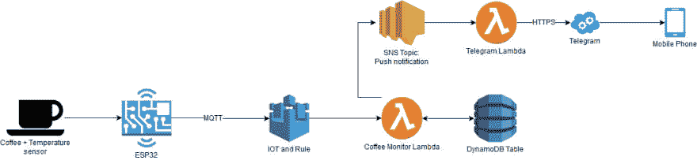
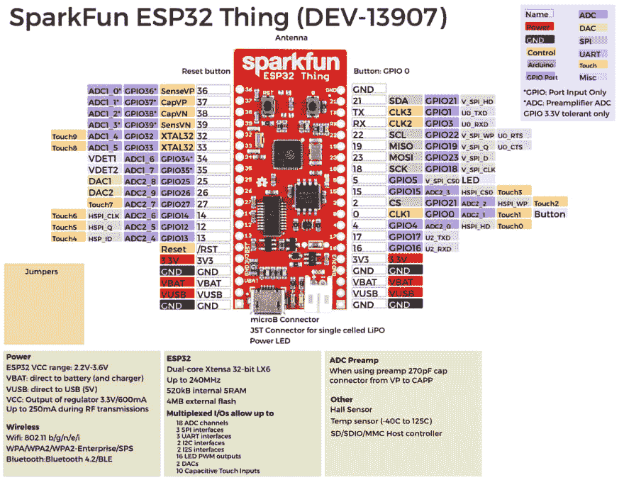
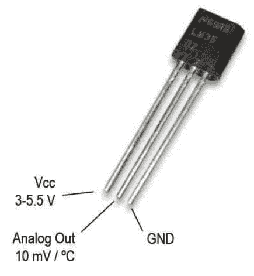
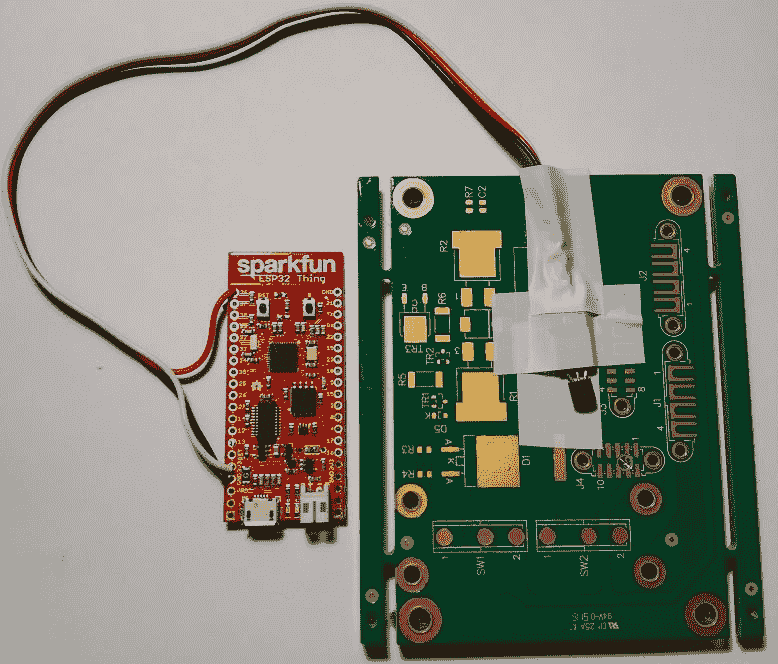
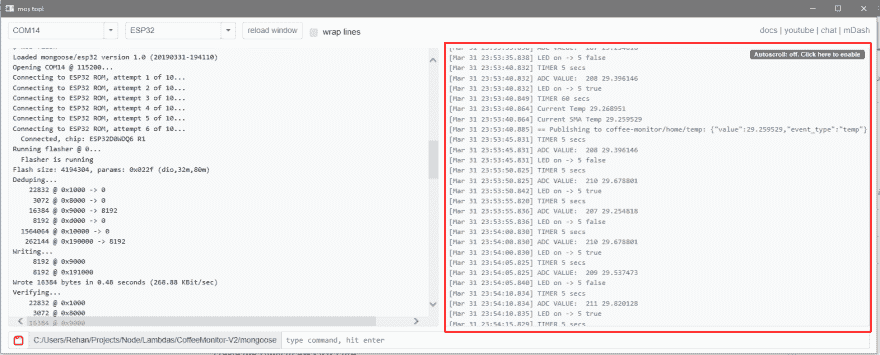
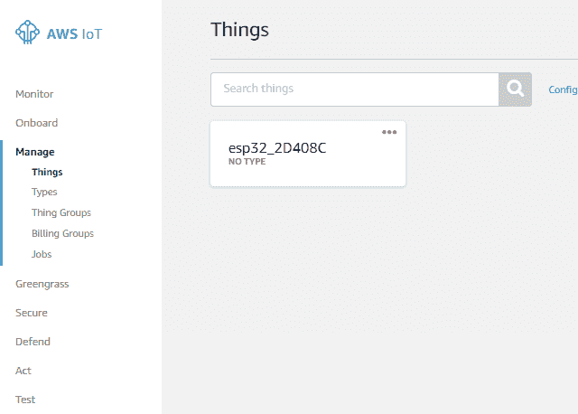
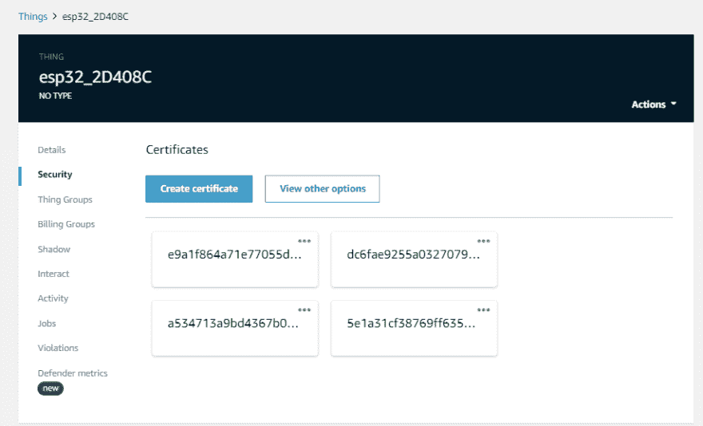
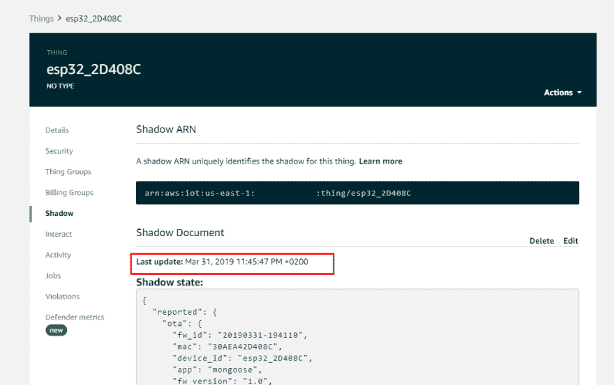
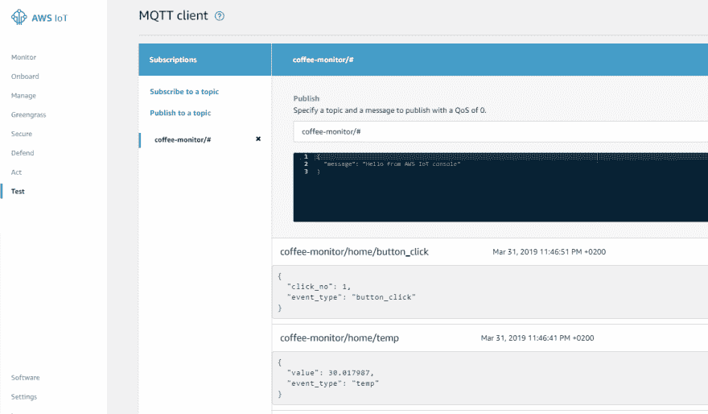
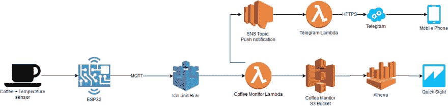

# AWS 物联网咖啡监控器–第 1 部分

> 原文：<https://dev.to/rehanvdm/aws-iot-coffee-monitor-part-1-33ic>

这篇文章最初发表在我的个人博客上。

这是构建 AWS 物联网咖啡监控器的第 1 部分，共 2 部分。第二部分可以在[这里](https://dev.to/rehanvdm/aws-iot-coffee-monitor-part-2-279d)找到

如果你像我一样是一个连续喝咖啡的人，一天喝 5 到 10 杯咖啡是正常的，如果你也像我一样，你会有忙碌/进入状态/分心的时候，在你知道它之前，最后一口是冰冷的，恶。

> 一年浪费+-10 小时在重新加热报价上是不可接受的。

起床用微波炉重新加热你的咖啡是超级烦人的，比如说我一天喝 10 杯(对某些人来说是最坏的情况),而这 50%在我工作的时候变冷了。那么让我们说，我至少已经开始啜饮咖啡，一半是喝。加热半杯大约需要 30 秒，所以一天 5 杯大约需要 2.5 分钟。也就是说，一周 12.5 分钟，一个月 50 分钟，一年 10 小时。这还不包括往返微波炉的旅程(+-20 秒)或者一路上所有的干扰和同事。

我心中的工程师必须解决这个问题。我想在手机上收到一个推送通知，指示我的咖啡所处的不同状态，例如:咖啡凉了。

**要求:**

*   不想在创建解决方案上花费太多时间
*   便宜，初始成本和持续成本
*   部署后几乎不需要维护
*   用户友好的通知
*   无服务器

**解决方案:**

[](https://res.cloudinary.com/practicaldev/image/fetch/s--BxPaDynz--/c_limit%2Cf_auto%2Cfl_progressive%2Cq_auto%2Cw_880/https://www.rehanvdm.com/contents/data/2019/04/post5_CoffeeMonitor-Original.jpg)

*   必须使用 IaC(作为代码的基础设施),我更喜欢 SAM 而不是 Serverless，因为它是 AWS 原生的，比云的形成更乏味。
*   使用 AWS IOT，因为将要使用的资源非常少，它们将属于空闲层。
*   使用硬件来监控咖啡的温度。我选择了 ESP32，因为它是连接到 AWS IOT 的最便宜的设备，而且它足够强大，可以处理 TLS 加密需求。
*   我基本上是在我的旧/废弃的电子项目箱中挖掘，并设法找到了一个便宜且相当精确的 LM35 温度传感器。这将被添加到我的咖啡杯垫底部来测量温度。
*   然后在服务器端，或者说是无服务器端，我们使用 AWS Lambda 函数。订阅了一个 Lambda 函数来侦听 MQTT 主题，ESP32 发布了该主题的事件，如温度。
*   Lambda 函数将当前数据存储在 DynamoDB 中，它使用历史数据对一杯咖啡的当前状态做出明智的决定。像这样的陈述:咖啡已经凉了。
*   为了可视化数据，我们需要手动从 DynamoDB 下载数据，然后在 Excel 中打开它。这有点麻烦，但是只在最初为状态变化温度点和模式建立事件时使用。
*   一个独立的 Lambda 函数，监听来自 IOT Lambda 的事件，其唯一目的是向我发送电报通知，通知我我的咖啡处于什么状态。

**先决条件:**

*   熟悉 AWS
*   安装并配置 AWS SDK
*   安装了 AWS SAM(进一步提供简要说明)
*   安装了 Mongoose 操作系统(进一步提供简要说明)

# 硬件

[](https://res.cloudinary.com/practicaldev/image/fetch/s--taUyVmfL--/c_limit%2Cf_auto%2Cfl_progressive%2Cq_auto%2Cw_880/https://www.rehanvdm.com/contents/data/2019/04/post5_hardware_1.png)

如前所述，我们将使用一个 ESP32，特别是 [SparkFun ESP32 东西](https://www.sparkfun.com/products/13907)，它的工作电压为 3,3V，有许多很酷的功能。最值得注意的是内置的 LiPo 电池充电器，以及它可以处理 TLS 加密(相当容易)的事实，不像它的前辈 ESP8266。

[](https://res.cloudinary.com/practicaldev/image/fetch/s---xeNoYDE--/c_limit%2Cf_auto%2Cfl_progressive%2Cq_auto%2Cw_880/https://www.rehanvdm.com/contents/data/2019/04/post5_hardware_2.png)

对于温度传感器，我们将使用常见的 LM35，它可以从 3.3V 供电，然后输出与温度成比例的线性电压。因此，每 10mV 就是 1°C，然后我们可以使用 ESP32 的 ADC(模数转换)来测量温度。只需读取 LM35 模拟输出引脚上的电压，我们就可以得到一个范围从 0–4095 的数字代码，然后我们可以将它映射到温度值。

我连接传感器如下:
**ESP32**_ _ _ _ _ _ _**LM35**
PIN 36<= = = =>(ad C1 _ 0)模拟输出
3.3V<= = = = =>Vcc
GND<= = = = = =>GND

如果你愿意，你可以将 VCC 和 GND 引脚连接到任何可用的引脚上，只是要小心你用什么引脚来做 ADC。

[](https://res.cloudinary.com/practicaldev/image/fetch/s--3ml6yXmd--/c_limit%2Cf_auto%2Cfl_progressive%2Cq_auto%2Cw_880/https://www.rehanvdm.com/contents/data/2019/04/post5_con_3_s.jpg)

> 不是最好的质量，我没有提到这是一个周末项目，对不对？

# ESP32 配置和 AWS 物联网

我们已经确定 ESP32 是我们将使用的硬件，我们可以在 ESP32 上使用相当多的软件选项，我已经使用过，只是更喜欢 mongose OS(MOS)。你可以在这里找到更多[。Mongoose OS 可以用 C/C++或 JavaScript 语言/环境编程，我们将使用 JavaScript。下载可执行文件，然后按照](https://mongoose-os.com/mos.html)[这个指南](https://mongoose-os.com/docs/mongoose-os/quickstart/setup.md):到第 3 步(不包括第 4 步)，从这里开始我们将使用自己的代码。

你可以在这里得到这个项目的代码。下载完代码后，在 MOS 控制台中切换到该目录:

```
# cd C:/Users/Rehan/Projects/Node/Lambdas/CoffeeMonitor-V2/mongoose 
```

然后我们首先需要构建代码，将它转换成 ESP32 能够理解的东西(汇编)

```
# mos build 
```

现在我们可以用
将代码上传到板上

```
# mos flash 
```

根据串行总线是否繁忙，该命令可能会(立即)失败几次，如果失败，只需运行几次，直到成功。接下来，我们需要将我们的 ESP32 连接到互联网，准备好您的 Wi-Fi 接入点凭据，并在运行以下命令之前替换您的值:

```
# mos wifi YOUR_WIFI_ACCESS_POINT_NAME YOUR_WIFI_PASSWORD 
```

最后，我们需要将我们的设备连接到 AWS，因为已经安装了 SDK，我们可以使用方便的 MongooseOS 命令来提供证书，并在 AWS IOT 核心中创建这个东西(替换您的地区，我使用的是 us-east-1)。

```
# mos aws-iot-setup --aws-region us-east-1 --aws-iot-policy mos-default 
```

设备应该重新启动，LED 将每 5 秒切换一次，您将开始看到如下控制台输出，验证设备正在向 AWS IoT 发布数据。

[](https://res.cloudinary.com/practicaldev/image/fetch/s--EYIZitfT--/c_limit%2Cf_auto%2Cfl_progressive%2Cq_auto%2Cw_880/https://www.rehanvdm.com/contents/data/2019/04/post5_mos_1.png)

这将在目录/mongose(. CRT . PEM 和. key.pem)中创建证书，如果我们导航到我们的 AWS IOT 核心控制台，我们将看到这个东西和证书。

[](https://res.cloudinary.com/practicaldev/image/fetch/s--zOZbX_pM--/c_limit%2Cf_auto%2Cfl_progressive%2Cq_auto%2Cw_880/https://www.rehanvdm.com/contents/data/2019/04/post5_aws_iot_1.png)

[](https://res.cloudinary.com/practicaldev/image/fetch/s--kv9onY4q--/c_limit%2Cf_auto%2Cfl_progressive%2Cq_auto%2Cw_880/https://www.rehanvdm.com/contents/data/2019/04/post5_aws_iot_2.png)

现在，你的设备应该每 1 分钟发送一次温度，我们将通过主题:coffee-monitor/home/temp 发送此消息。在我们的 SAM 模板中，我们将通过创建一个规则来完成剩下的工作，该规则指定来自 MQTT 主题的所有数据都应该转到我们的 CoffeMonitor Lambda。然后，我们可以验证我们的设备已经连接到我们的阴影，图片如下。

[](https://res.cloudinary.com/practicaldev/image/fetch/s--W8Cf3TUP--/c_limit%2Cf_auto%2Cfl_progressive%2Cq_auto%2Cw_880/https://www.rehanvdm.com/contents/data/2019/04/post5_aws_iot_4_redacted.png)

要查看即将到来的事件，请转到测试页面并订阅主题 coffee-monitor/#，这将侦听从 Coffee Monitor ESP32s 发送的所有消息。您可以通过按下 PIN 0 按钮来手动测试/生成事件。

[](https://res.cloudinary.com/practicaldev/image/fetch/s--uwkqtCzQ--/c_limit%2Cf_auto%2Cfl_progressive%2Cq_auto%2Cw_880/https://www.rehanvdm.com/contents/data/2019/04/post5_aws_iot_3-1.png)

# ESP32 代码

## MQTT 和设备阴影

首先说说 MQTT 和 AWS 物联网的影子。

MQTT 是一个 pub sub 协议，与 https 不同，它是专门为限制带宽和占用空间而设计的，非常适合物联网。MQTT 主题只是我们向服务器发送数据的端点。任何连接到 MQTT 服务器的客户机都可以指定它们想要收听的主题。在 SQL 的上下文中，假设 FROM 子句是我们所有的传感器，然后主题在 WHERE 子句中使用，用于仅选择我们想要的某些数据。在第 2 部分中，当我们使用类似 SQL 的表达式将 Lambda 连接到主题时，会有更多的介绍。

我们这个项目的主题结构如下:*应用程序/位置/事件类型*。这给了我们大量的组合来听。例如，要收听与位置无关的所有咖啡监控器温度消息，我们将收听 *coffee-monitor/#/temp* 。

我们的 ESP32 发布的主题有:

*   *咖啡监控/家庭/温度*
*   *咖啡-监视器/主页/按钮 _ 点击*

在我们的代码中，我也展示了如何更新我们的设备阴影。设备影子只是一个代表设备状态的 JSON 文档。如果设备更新了影子，那么它将更新的 JSON 文档发送到服务器，如果服务器更新了影子，那么它将它发送到设备。因此，我们可以通过在服务器和设备上始终保持影子同步的方式进行通信。然后，设备可以对此进行操作并改变其状态。在这个项目中，我们将向服务器发送阴影(但不利用它)和主题消息。

## 代码

ESP32 的完整源代码可以在[这里](https://github.com/rehanvdm/CoffeeMonitor/blob/master/mongoose/fs/init.js)查看。

重要的部分如下:

为了获得温度，我们读取温度引脚的 ADC 值，并用公式将其转换为温度值:

```
let adcVal = ADC.read(tempPin);
let tempVal = ((adcVal / 4095.0) * 3300)/10; 
```

其中 4095 是 ADC 的分辨率，3300 是 3.3V 的最大值，我们除以 10，因为每个 mv 为 1 度。因此，我们得到温度引脚电压的百分比，然后乘以最大电压得到当前电压，再除以 10 得到温度。代码中的计算略有不同，因为我使用不同的分辨率值来测量偏移并进行补偿。

由于这个温度传感器不是非常准确或精确，我们在代码中使用一个简单的移动平均(SMA more info [here](https://en.wikipedia.org/wiki/Moving_average#Simple_moving_average) )过滤器来平滑从传感器返回的值。使用 10 点 SMA，每 5 秒记录一次温度。然后，另一个大小为 3 的 SMA 每 1 分钟运行一次，并在我们将其发送到服务器之前计算温度。

温度被发送到主题*咖啡监控/家庭/温度* :

```
let currentSMATemp =  SmaArrayValue(lastThreeMinutesTemps);
PublishEvent("temp", { "event_type": "temp", "value": currentSMATemp }); 
```

另一段有趣的代码是按钮的按压。按钮按下被计数，然后在一个按钮按下后，我们用一些代码反弹，然后最后发送事件，记录到目前为止的按下次数:

```
shadowState.btnCount++;
PublishEvent("button_click", { "event_type": "button_click", "click_no": shadowState.btnCount }); 
```

我们也只是用:
向服务器报告(在这个项目中不使用它)影子

```
let shadowState = {led: false, btnCount: 0, uptime: 0}; 
Shadow.update(0, shadowState); 
```

这将我们定义为影子的 JSON 对象发送回服务器，然后我们在这里接收对影子的任何更改:

```
Shadow.addHandler(function(event, obj)
{
    if (event === 'UPDATE_DELTA')
    {
        print('GOT DELTA:', JSON.stringify(obj));
        Shadow.update(0, shadowState); // Report our new state, hopefully clearing delta
    }
}); 
```

第 1 部分到此为止。第 2 部分将包括我们用来做 IaC 的 SAM 模板，然后还有 Lambdas、DynamoDB、SNS 和 Telegram bot 的代码。

仅供参考，您可以使用 S3 作为存储，而不是 DynamoDB，访问模式可以很容易地更改为从 Athena 读取。它主要是写，读可以很容易地缓存在内存中的 lambda。这将使报告更加容易，因为您可以直接将 Quicksights 连接到 Athena，如果您已经订阅了 quick sight(9 美元基本版)，这将非常有用。对于我们将要存储的数据量来说，这种方法似乎有点过分，但不管怎样，这里是设计图:

[](https://res.cloudinary.com/practicaldev/image/fetch/s--oEQ_TZFY--/c_limit%2Cf_auto%2Cfl_progressive%2Cq_auto%2Cw_880/https://www.rehanvdm.com/contents/data/2019/04/post5_CoffeeMonitor.jpg)

*这是构建 AWS 物联网咖啡监控器的第 1 部分，共 2 部分。第二部分可以在这里找到*