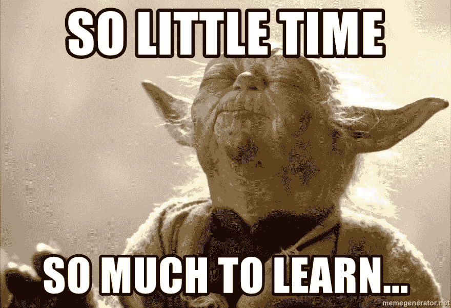
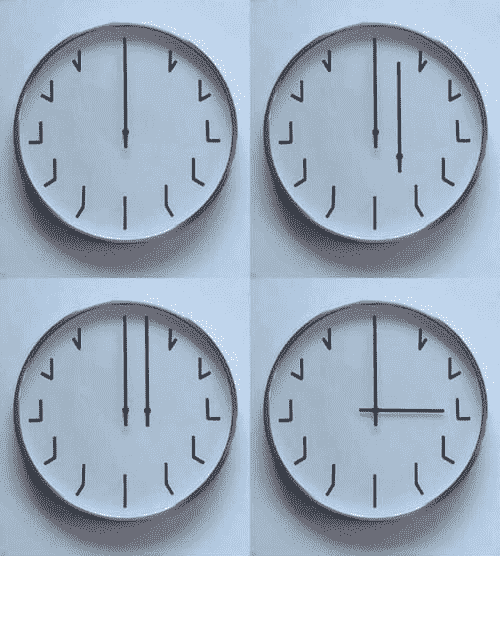
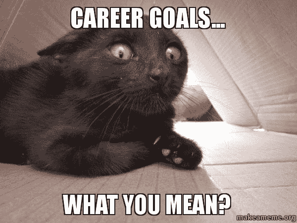

# 拿自己和自己比较

> 原文：<https://dev.to/levimoreira/compare-yourself-with-yourself-2g44>

你正在浏览 Linkedin，突然弹出一条关于你以前学校同事的更新。他们刚刚被四大之一录取，你希望那个人是你。这种情况曾经让我质疑我职业生涯中的一切。为什么我如此落后于同龄人？为什么我不能在社区里更“出名”？为什么我没有那么成功？这些问题突然出现在我的脑海中，模糊了我的判断，最明显的原因是:每个人都是不同的，我不应该将自己和我的职业道路与他人进行比较。

我们每个人的目标和动机都是完全不同的，所以结果肯定是不同的，意识到这一点让我不再拿自己和别人比较。这并不容易，在我们的行业中，同行之间存在某种内在竞争，你总是在比较自己，看看自己在他们中间的位置，但如果你研究自己，并与自己比较，凭借一点点良好的判断力，应该足以看出你在职业生涯方面是否在进步，或者你是否在同一个地方呆了太久。

以下是一些帮助我停止拿自己和别人比较的事情:

### 1 -接受你学不到/做不到的一切。

我认为这是害怕错过，但更多的是职业驱动。有许多新的东西正在发生，你担心你对它们了解不够。我知道这很难。每次 Android 世界出现新的东西，我都想在现场测试它。但我通常没有时间这样做，在工作、学习和照顾家人之后，几乎没有时间做这些测试和编写更多的代码。过去这常常让我大吃一惊。我感到压力很大，因为我不能掌握所有正在发生的事情，但是一旦我接受了人类不可能做到这一点，事情就会变得更好。

首先，我承认我知道一些事情，我的知识一定有一些价值，否则我不会有工作，我知道一些事情，当然不是所有的事情，那是不可能的，但是一些事情。

我试着对我想学的新东西进行结构化和时间框化，我会列出一个清单，给每个新主题一些要点，它们会根据重要性在清单上上升或下降。另一件对我有帮助的事情是把它应用到我现在的工作中。有时这很困难，因为向项目中添加新技术必须是团队的决定，但我会提出这个想法，并希望有最好的结果。有时它会工作，我不需要花额外的时间去学习。如果它不起作用，它就会回到列表中，在某个时候，我会抽出几个小时来研究它。耐心在这个阶段是非常重要的，因为你不可能在一天之内学会所有的东西。

### 2——每个人都有自己的时钟。

时间对每个人都有不同的作用，我指的是微观时间，比如你起床开始工作的时间，和宏观时间，比如你预计在几岁开始组建家庭。事实就是这样，每个人都是以不同的方式被抚养长大的，即使是在同一个家庭里，这就是为什么拿自己和别人比较是如此奇怪。其他人有不同的机会，学习不同的东西，有不同的职业重点，所以为什么不通过与一年前的自己进行比较来决定你是否落后呢？我可以说，对我来说，一个很好的锻炼就是及时回顾自己。一年前我在做什么？两年？一样吗，不一样吗？我觉得我学到了新的东西还是只是继续同样的东西？

我不喜欢停滞不前的感觉，我想没有人喜欢。知道自己是否陷入困境的唯一方法是定期检查自己做了什么才不会陷入困境。以下是我在评估自己的进步时喜欢考虑的一些事情:

*   自从上次检查以来，我学到了什么？
*   我在工作中找到满足感了吗？我学到新东西了吗？
*   我最近尝试过什么新东西吗？

通过评估我现在的状态，并与之前的状态进行比较，我可以清楚地判断我是否进步了，是否是时候把更多的精力放在我的教育上了，或者可能改变工作项目，甚至找到一份更具挑战性的新工作。这都是关于从你所处的位置来评估你自己和你自己的幸福水平。

在这一点上，你可能会问自己，你应该如何评估你在哪里，你怎么知道你在同一份工作或做同一件事情上花了太长时间。下一步是了解这一点的关键。

### 3 -给自己一个职业规划。

为了知道你是否在前进，你需要知道你前进的方向。这就是职业规划能帮上忙的地方。我说的不是一条结构化的道路，在这条道路上，你要列出退休前的每一步，这不好，因为这就像预测未来，除非你能准确地做到这一点，否则我不建议走那么远。我相信“x 年后你在哪里看到自己”这个问题是开始规划职业生涯的好方法。可以采取的一些好的步骤是:

*   你可以选择几年后你想去的大公司，但要明白选择职位会容易得多。如果你愿意在任何一家不错的公司工作，那个职位会给你很多机会。
*   如果你和我一样，你已经选择了一个大名字，制定一个计划，定义你认为增加你达到目标的机会所必需的步骤。
*   给未知留些空间。你不知道将来会发生什么，所以要提前计划，但是要留一些空间来适应可能发生的问题。这样，如果你没有在预期的时间内达到目标，你就不会感到沮丧。
*   定义里程碑。例如，在我的职业规划中，到今年年底，我希望被家乡的一个硕士项目录取。明年，我想在一家不错的公司尝试暑期实习，诸如此类。这样你就可以评估你是朝着那个目标前进还是远离它。
*   如果事情超出了你的计划，不要紧张，总有机会追回失去的时间，或者彻底改变你的计划。

定义你在 x 年、2x 年、3x 年等时间里想要达到的目标是一个很好的方法，让你有一个比较自己的基准。这样你就会知道你是否在事业上取得了进步，你也不必担心其他人是否比你取得了更多或更少的进步，因为唯一重要的进步是你自己的。毕竟你的职业生涯是由你塑造的。

我希望这能帮助其他人不要对他们的职业发展感到如此焦虑(就像我过去感觉的那样，老实说，有时仍然感觉如此)。