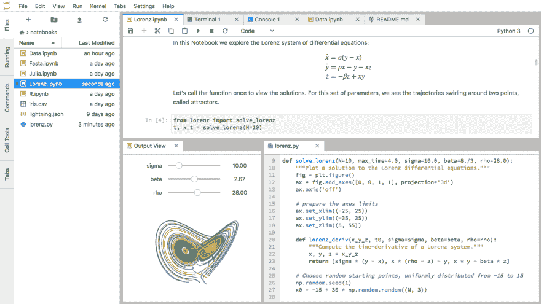
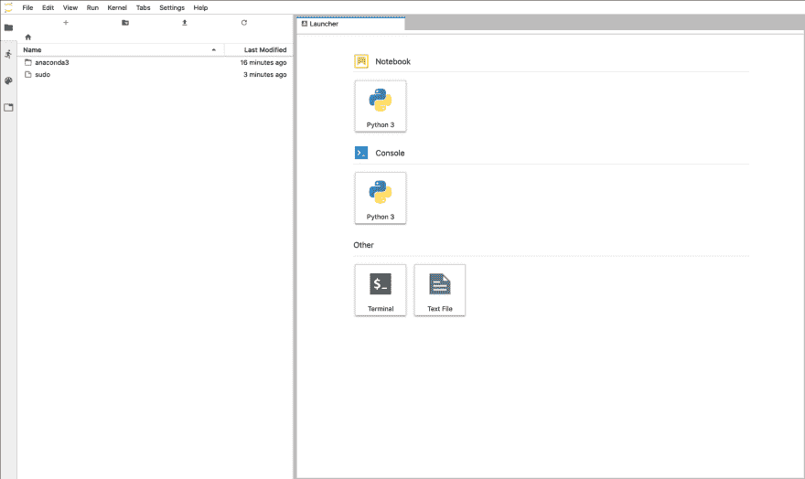
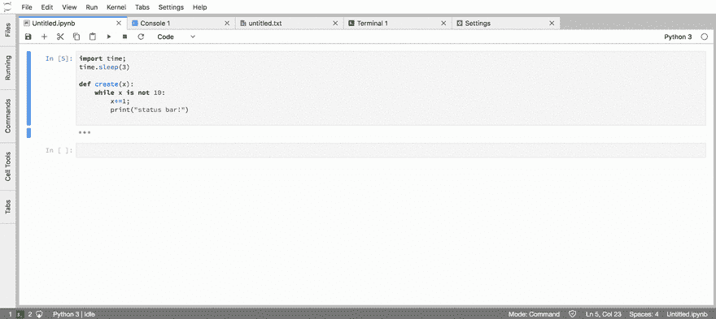
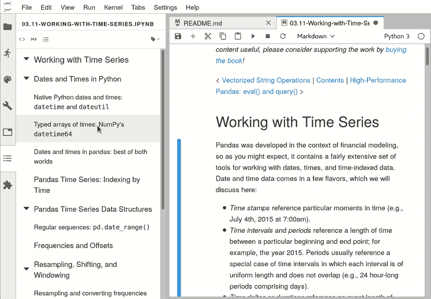
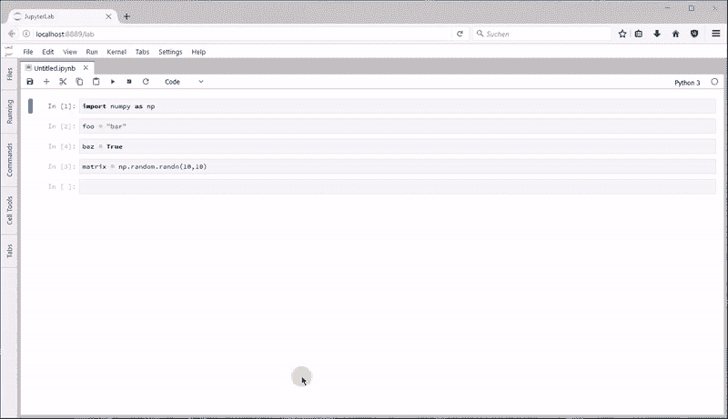
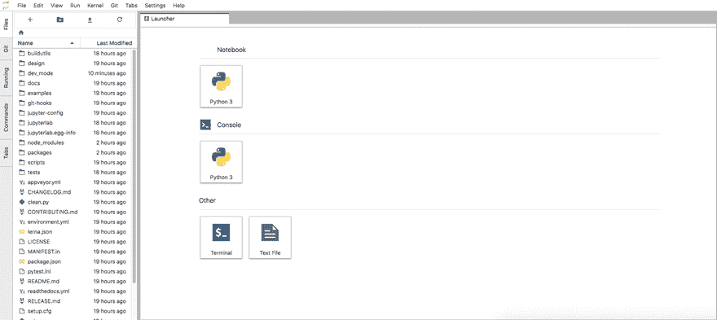
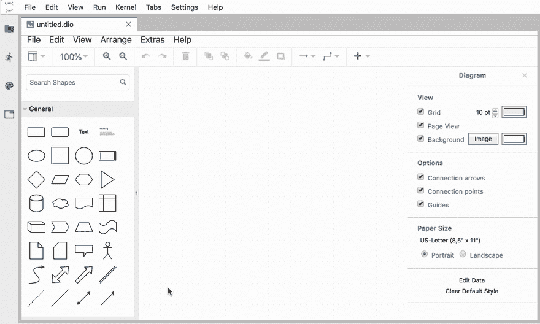

# 升级到 Ubuntu 上的 JupyterLab

> 原文：<https://dev.to/hackersandslackers/upgrading-to-jupyterlab-on-ubuntu-5a02>

[](https://res.cloudinary.com/practicaldev/image/fetch/s--37XtNRWl--/c_limit%2Cf_auto%2Cfl_progressive%2Cq_auto%2Cw_880/https://hackersandslackers.com/conteimg/2019/04/jupyterlab-1-1.jpg)

上次我们聊天时，我们经历了在 Ubuntu 服务器上开始使用 [Jupyter 笔记本的过程。经典的 Jupyter 笔记本界面当然非常适合这项工作。也就是说，只需要花一些时间迷失在界面中，就可以开始思考我们可以做得更好。这就是 Jupyter 实验室的用武之地。](https://dev.to/hackersandslackers/running-jupyter-notebooks-on-a-ubuntu-server-3340)

## Why JupyterLab?

JupyterLab 有时被称为“下一代 Jupyter 笔记本”，这是我可以证明的说法。JupyterLab 为 Jupyter 笔记本电脑提供了一个改进的界面，既可以开箱即用，又可以根据您的工作流程进行高度定制。

开箱即用，传统的 Jupyter 接口被扩展为包括一个树文件管理器:类似于您可能期望的 IDE。这使您可以轻松浏览服务器上所有可用的笔记本电脑。此外，笔记本电脑的界面已经过简化，以减少工具栏(大多是无用的)和过多的按钮带来的噪音。在进行任何定制之前，先看一下界面:

[](https://res.cloudinary.com/practicaldev/image/fetch/s--xfsQug9k--/c_limit%2Cf_auto%2Cfl_progressive%2Cq_auto%2Cw_880/https://hackersandslackers.com/conteimg/2019/04/jupyterlab-no-customization.png)

比更新的界面更吸引人的是 JupyterLab 对定制的开放性。JupyterLab 有一个强大的扩展开发生态系统:我们马上就会尝到其中的甜头。

## 入门

如果您是从零开始，请继续按照 [Jupyter 笔记本设置教程](https://dev.to/hackersandslackers/running-jupyter-notebooks-on-a-ubuntu-server-3340)中的相同步骤操作，直到 Conda 设置并激活。

准备好 Ubuntu 服务器后，使用以下命令安装 Jupyter Lab:

```
$ conda install -c conda-forge jupyterlab 
```

在我们继续下一步之前，请确保您已经连接到您的服务器——为了启动笔记本，我们需要这样做，记得吗？：

```
$ ssh -L 8888:localhost:8888 myuser@your_server_ip 
```

像这样启动 Jupyter 实验室环境:

```
$ conda activate your_env
$ jupyter lab 
```

如果一切顺利，你应该会看到一个花哨的 Jupyter 实验室加载屏幕，然后被扔进 Jupyer 实验室环境。

[](https://res.cloudinary.com/practicaldev/image/fetch/s--JW7dl20k--/c_limit%2Cf_auto%2Cfl_progressive%2Cq_auto%2Cw_880/https://hackersandslackers.com/conteimg/2019/04/jupyter-lab-home.png) 

<figcaption>温馨家园。</figcaption>

事情看起来很顺利。在没有添加任何库的情况下，我们已经增强了 Jupyter 笔记本的工作空间。树视图是可用的，我们可以启动终端，不要忘记:我们可以通过拖动捕捉窗口在我们认为合适的地方分割屏幕。

## 定制您的工作空间

JupyterLab 使用 NodeJS 来实现一些更酷的功能和扩展。继续安装节点:

```
$ cd /tmp
$ curl -sL https://deb.nodesource.com/setup_10.x | sudo -E bash -
$ sudo apt-get install -y nodejs 
```

不错！现在我们已经有了扩展所需要的一切。以下是我推荐的几款:

### 状态栏

* * *

[](https://res.cloudinary.com/practicaldev/image/fetch/s--whRwZc4E--/c_limit%2Cf_auto%2Cfl_progressive%2Cq_66%2Cw_880/https://hackersandslackers.com/conteimg/2019/04/jupyterlab-statusbar.gif) 

<figcaption>留意你周围的生命体征。</figcaption>

存储库在这里找到了。安装步骤:

```
$ pip install nbresuse
$ jupyter serverextension enable --py nbresuse
$ jupyter labextension install @jupyterlab/statusbar 
```

### 目录

[](https://res.cloudinary.com/practicaldev/image/fetch/s--99Gp4CPW--/c_limit%2Cf_auto%2Cfl_progressive%2Cq_66%2Cw_880/https://hackersandslackers.com/conteimg/2019/04/jupyterlab-toc.gif) 

<figcaption>自动生成目录，帮助导航和组织您的笔记本。</figcaption>

存储库在这里找到了。安装步骤:

```
$ jupyter labextension install @jupyterlab/toc 
```

### 可变检查员

* * *

[](https://res.cloudinary.com/practicaldev/image/fetch/s--C90SE3IK--/c_limit%2Cf_auto%2Cfl_progressive%2Cq_66%2Cw_880/https://hackersandslackers.com/conteimg/2019/04/jupyterlab-vars.gif) 

<figcaption>记下你笔记本中使用的每个变量及其各自的值。</figcaption>

存储库在这里找到了。安装步骤:

```
$ jupyter labextension install @lckr/jupyterlab_variableinspector 
```

### Git 集成

* * *

[](https://res.cloudinary.com/practicaldev/image/fetch/s--a3ByWH7x--/c_limit%2Cf_auto%2Cfl_progressive%2Cq_66%2Cw_880/https://hackersandslackers.com/conteimg/2019/04/jupyter-git.gif) 

<figcaption>一种可视化的版本控制方法。</figcaption>

存储库在这里找到了。安装步骤:

```
$ jupyter labextension install @jupyterlab/git
$ pip install jupyterlab-git
$ jupyter serverextension enable --py jupyterlab_git 
```

### Draw.io

* * *

[](https://res.cloudinary.com/practicaldev/image/fetch/s--5FBRdrSi--/c_limit%2Cf_auto%2Cfl_progressive%2Cq_66%2Cw_880/https://hackersandslackers.com/conteimg/2019/04/drawio.gif) 

<figcaption>直接从你的笔记本上创建 Draw.io 图。</figcaption>

存储库在这里找到了。安装步骤:

```
$ jupyter labextension install jupyterlab-drawio 
```

## 附加资源

从现在开始，你拥有一切让你疯狂的东西。安装所有扩展！

如果你正在寻找更多的扩展好处，我会从 Github 上的[牛逼的 Jupyter](https://github.com/markusschanta/awesome-jupyter#jupyterlab-extensions) repo 开始——有一个专门针对 JupyterLab 的部分。

如果你现在完全迷上了 JupyterLab，并且想加入一个帮派，可以在这里找到社区页面。

最后，如果你已经完全脱离了困境，并且已经想要开始创建你自己的扩展，请查看[扩展文档](https://jupyterlab.readthedocs.io/en/stable/user/extensions.html)。那都是乡亲们！