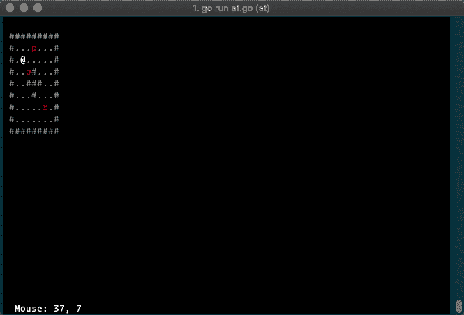
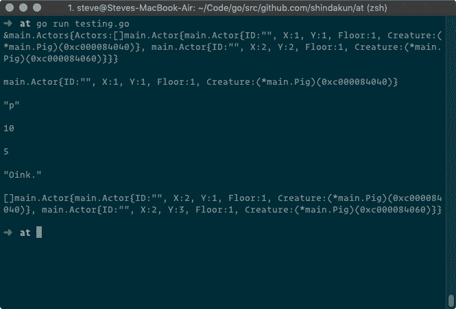

# 流氓围棋的尝试第 3 部分

> 原文：<https://dev.to/shindakun/a-stab-at-roguish-go-part-03-4f4i>

# ATLG Rogue

## 决策

[](https://res.cloudinary.com/practicaldev/image/fetch/s--V49T6S1S--/c_limit%2Cf_auto%2Cfl_progressive%2Cq_auto%2Cw_880/https://thepracticaldev.s3.amazonaws.com/i/w95qwvm4mrvgxymlul2a.png)

欢迎回到我的流氓 Golang 系列的另一篇文章。本周将会有一个很短的帖子，并没有涉及太多的“游戏”本身。这更像是一场头脑风暴，因为我正试图决定如何在游戏中加入生物。

有很多方法可以做到这一点。我试图找出最适合这种情况的方法，并且不使代码复杂化。我们不需要任何真正的显示代码，因为我们只是将测试写到控制台上。我们需要在接下来的几周内不断重复，直到我们得到我们想要的。如今，现在...

* * *

## 代码演练

我们为这段代码保留了所有非常基本的东西，我们不打算包括`tcell`或者除了[骰子滚动器](//github.com/shindakun/die)之外的任何东西。

```
package main

import (
  "fmt"
  "math/rand"
  "time"

  "github.com/shindakun/die"
) 
```

Enter fullscreen mode Exit fullscreen mode

我们希望能够做的事情之一是通过我们的整个演员集进行循环。因此，我们有一个`Actors`结构，它是`Actor`结构的一部分。`Actor`将要保存我们的基本“生物”信息。那就是位置(x，y)，他们在几楼，`Creature`界面。

```
type Actors struct {
  Actors []Actor
}

type Actor struct {
  X        int
  Y        int
  Floor    int
  Creature Creature
} 
```

Enter fullscreen mode Exit fullscreen mode

现在我们可以创建一个简单的方法来“创建”参与者。我们调用`newActor()`并传递我们希望演员在舞台上开始的位置和楼层。我们的生物也在这一步被创造并赋予“生命”。我们稍后会看到这一点...

```
func newActor(x, y, f int, c Creature) Actor {
  return Actor{
    X:        x,
    Y:        y,
    Floor:    f,
    Creature: c,
  }
} 
```

Enter fullscreen mode Exit fullscreen mode

生物接口声明了一个生物包含的所有方法。我们这样做是为了让每个生物都有自己的功能。如果这不起作用，我们可以将方法转移到`Actor`上。也许不会。这种方式导致了一点代码重复，因为我们为每个生物类型重写了相同的方法。

```
type Creature interface {
  GetRune() rune
  GetHealth() int
  GetDescription() string
  TakeDamage(int)
} 
```

Enter fullscreen mode Exit fullscreen mode

这里我们有雄伟的`pig`结构！我已经添加了 JSON 标签，因为我可以想象我们从磁盘加载基本的生物数据。目前，我们有符文(`p`)、生命(`10`)和描述(`I'm a pig!`)。不太令人兴奋，但它现在应该工作。

```
type Pig struct {
  R           rune   `json:"r,omitempty"`
  Health      int    `json:"health,omitempty"`
  Description string `json:"description,omitempty"`
} 
```

Enter fullscreen mode Exit fullscreen mode

为了完成我们的猪“生物”,我们需要实现我们的`Creature`接口的部分。这段代码非常具有描述性，所以我们不会过多地涉及它。

```
func (p *Pig) GetRune() rune {
  return p.R
}

func (p *Pig) GetHealth() int {
  return p.Health
}

func (p *Pig) GetDescription() string {
  return p.Description
}
func (p *Pig) TakeDamage(i int) {
  p.Health = p.Health - i
} 
```

Enter fullscreen mode Exit fullscreen mode

我们需要考虑我们的演员在世界各地的活动。因此，我创建了一个基本的`Move()`方法，它将允许我们的“猪”四处走动。为此，我们滚动一个四面骰子，并根据滚动移动我们的猪。1 代表北，2 代表东，3 代表南，4 代表西。我们可以在某个时候更新它，以允许八路移动，但为了简单起见，我们现在将它保持为四路。

同样，代码是不言自明的，所以我们尽量简短。我们为我们的方向滚动，并根据结果更新演员的位置。

```
func (a *Actor) Move(floor int) {
  if floor == a.Floor {
    /*
        1
       4+2
        3
    */
    rand.Seed(time.Now().UTC().UnixNano())
    var xx, yy int
    d, err := die.Roll("1d4")
    if err != nil {
      panic("die roll")
    }
    switch d {
    case 1:
      xx = -1
    case 2:
      yy = 1
    case 3:
      xx = 1
    case 4:
      yy = -1
    }
    a.X = a.X + xx
    a.Y = a.Y + yy
  }
} 
```

Enter fullscreen mode Exit fullscreen mode

我们现在进入测试的`main()`。我们将创造我们的`a`“演员”。

```
func main() {
  a := &Actors{} 
```

Enter fullscreen mode Exit fullscreen mode

然后拿`a.Actors`开始追加“新演员”给它。我们一口气创建了新的演员和生物。然后我们只是打印一些东西到屏幕上来测试。

```
 a.Actors = append(a.Actors, newActor(1, 1, 1, &Pig{'p', 10, "From the realm of Paradox... the Pig."}))
  a.Actors = append(a.Actors, newActor(2, 2, 1, &Pig{'p', 10, "Oink."}))

  fmt.Printf("%#v\n\n", a)

  fmt.Printf("%#v\n\n", a.Actors[0])

  fmt.Printf("%#v\n\n", string(a.Actors[0].Creature.GetRune()))

  fmt.Printf("%#v\n\n", a.Actors[0].Creature.GetHealth())

  a.Actors[0].Creature.TakeDamage(5)

  fmt.Printf("%#v\n\n", a.Actors[0].Creature.GetHealth())

  fmt.Printf("%#v\n\n", a.Actors[1].Creature.GetDescription())

  for i := range a.Actors {
    a.Actors[i].Move(1)
  }

  fmt.Printf("%#v\n\n", a.Actors)
} 
```

Enter fullscreen mode Exit fullscreen mode

[](https://res.cloudinary.com/practicaldev/image/fetch/s--QX3N8WG3--/c_limit%2Cf_auto%2Cfl_progressive%2Cq_auto%2Cw_880/https://thepracticaldev.s3.amazonaws.com/i/ryg5ychdmvgjqdcox10x.png)

## 包装完毕

似乎工作正常，这很好。如果我在接下来的几天里有时间，我会试着把这个写进上周的代码里，看看效果如何。

* * *

你可以在 GitHub 上的 repo 中找到这个和大多数其他试图学习围棋的帖子的代码。

##  [【新达昆】](https://github.com/shindakun) / [ atlg](https://github.com/shindakun/atlg)

### 我在 dev.to 上发布的“尝试学习围棋”帖子的来源报告

<article class="markdown-body entry-content container-lg" itemprop="text">

# 尝试学习围棋

在这里你可以找到我为尝试学习围棋而写的代码，这些代码是我在 [Dev.to](https://dev.to/shindakun) 上写的。

## 帖子索引

| 邮政 | 密码 |
| --- | --- |
| [制作下载器第 01 部分](https://dev.to/shindakun/attempting-to-learn-go---building-a-downloader-part-01-44gl) | - |
| [制作下载器第 02 部分](https://dev.to/shindakun/attempting-to-learn-go---building-a-downloader-part-02-2k7i) | - |
| [制作下载器第 03 部分](https://dev.to/shindakun/attempting-to-learn-go---building-a-downloader-part-03-2214) | - |
| [制作下载器第 4 部分](https://dev.to/shindakun/attempting-to-learn-go---building-a-downloader-part-04-3ln9) | - |
| [建造下载器第 05 部分](https://dev.to/shindakun/attempting-to-learn-go---building-a-downloader-part-05-44o) | - |
| [使用 REST API](https://dev.to/shindakun/attempting-to-learn-go---consuming-a-rest-api-5c7g) | [src](https://raw.githubusercontent.com/shindakun/atlg/master//go-api-01/main.go) |
| [继续休息冒险](https://dev.to/shindakun/attempting-to-learn-go---continuing-rest-adventures-2l4l) | [src](https://raw.githubusercontent.com/shindakun/atlg/master//go-api-02/main.go) |
| [现在发送休息请求](https://dev.to/shindakun/attempting-to-learn-go---now-sending-rest-requests-akp) | [src](https://raw.githubusercontent.com/shindakun/atlg/master//go-api-03/main.go) |
| [REST API 和模板上的位](https://dev.to/shindakun/attempting-to-learn-go---rest-api-and-a-bit-on-templates-4kca) | [src](https://raw.githubusercontent.com/shindakun/atlg/master//go-api-04/main.go) |
| [再次通过 API 发送电子邮件](https://dev.to/shindakun/attempting-to-learn-go---sending-email-via-api-again-2e4e) | [src](https://raw.githubusercontent.com/shindakun/atlg/master//go-api-05/main.go) |
| [让我们模块化吧！](https://dev.to/shindakun/attempting-to-learn-go---lets-get-modular-390i) | [src](https://github.com/shindakun/mailgunner) |
| [让我们再一次模块化！](https://dev.to/shindakun/attempting-to-learn-go---lets-get-modular---again-10cd) | [src](https://github.com/shindakun/mailgunner) |
| [构建开发日志第 1 部分](https://dev.to/shindakun/attempting-to-learn-go---building-dev-log-part-01-1c3m) | [src](https://raw.githubusercontent.com/shindakun/atlg/master//go-devsite-01/main.go) |
| [构建开发日志第 2 部分](https://dev.to/shindakun/attempting-to-learn-go---building-dev-log-part-02-179c) | [src](https://raw.githubusercontent.com/shindakun/atlg/master//go-devsite-02/main.go) |
| [构建开发日志第 3 部分](https://dev.to/shindakun/attempting-to-learn-go---building-dev-log-part-03-7lk) | [src](https://raw.githubusercontent.com/shindakun/atlg/master//go-devsite-03/main.go) |
| [构建开发日志第 4 部分](https://dev.to/shindakun/attempting-to-learn-go---building-dev-log-part-04-2bok) | [src](https://raw.githubusercontent.com/shindakun/atlg/master//go-devsite-04/main.go) |
| [构建开发日志第 5 部分](https://dev.to/shindakun/attempting-to-learn-go---building-dev-log-part-05-4mo1) | [src](https://raw.githubusercontent.com/shindakun/atlg/master//go-devsite-05/main.go) |
| [按扩展名 01 列出文件](https://dev.to/shindakun/attempting-to-learn-go---listing-files-by-extension-1n10) | [src](https://raw.githubusercontent.com/shindakun/atlg/master//go-sort-01/main.go) |
| [按扩展名 02 列出文件](https://dev.to/shindakun/attempting-to-learn-go---sorting-and-moving-files-by-extension-227j) | [src](https://raw.githubusercontent.com/shindakun/atlg/master//go-sort-01/main.go) |
| [开发至 API 01](https://dev.to/shindakun/interacting-with-the-devto-article-api-4g34) | [src](https://raw.githubusercontent.com/shindakun/atlg/master//go-devtoapi-01/main.go) |
| [开发至 API 02](https://dev.to/shindakun/interacting-with-the-devto-article-api---again-sort-of-2o8g) | 参见上面的代码 |
| [发行人](https://dev.to/shindakun/attempting-to-learn-go-issuer-01-5f0k) |

…</article>

[View on GitHub](https://github.com/shindakun/atlg)

* * *

| 喜欢这篇文章吗？ |
| --- |
| 给我买杯咖啡怎么样？ |

* * *